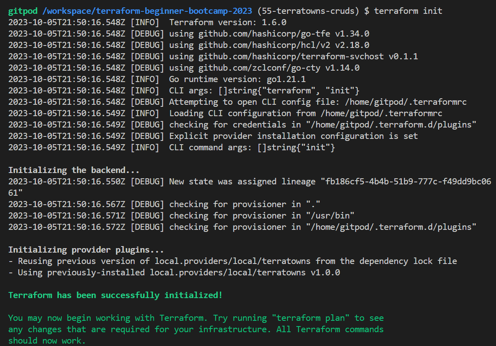
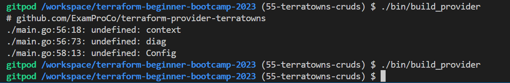

# TerraTowns Resource Skeleton

In the previous setup `2.2.0`, we did not define any resources for our provider but layed the required to do so!

Now, let's begin with the creation of a `2.3.0` Resource Skeleton. <br>
We'll create a basic structure for a new resource and introduce some Go programming concepts along the way.

The next `2.4.0` is where we will actually go and fill those cruds as per our requirements in go.

### Preparing and Energizing
Take note of the extensions you'll need, such as Go and Golang tools.
1. Before all, uncomment the validator in your `main.go` code if you didn't remove it.

I did cause I want my code neat. [Take a look.](terraform-provider-terratowns/main.go). I will code it again.

2. Add 	`ValidateFunc: validateUUID`, to your schema uuid block.

3. Also re-enable logging.
```
import ("log")
```
4. Also, ensure that you are working within the Terraform tab,

We have set up debugging for this context.

5. build our provider to see, you may encounter errors. 
6.  Replace single quotes (`''`) with double quotes (`""`) for the func validator.
7.  Build again; if you encounter errors, include 'google' in the import statement for 'uuid' lib.
```
	github.com/google/uuid v1.3.0
```
8. Use `go get` to fetch dependencies from the specified GitHub URL

```
/terraform-provider-terratowns (55-terratowns-cruds) 
$ go get github.com/google/uuid

go: upgraded github.com/google/uuid v1.3.0 => v1.3.1
```
> Make sure you are inside the correct directory.
9. Return to the our directory and build again or stay..
You may encounter more errors;
- If related to `append`, adjust the error handling to `errors`
- If related to missing returns, make sure to add them as needed.

In some cases, returning `true` may be necessary, but `return` alone can work effectively.

Keep in mind that building providers in Go can be complex, and it's okay if you're just starting to get the hang of it.

10. Go build again, and should work fine now.


11. Proceed with `terterraform init`. 

You should see logs indicating a successful initialization.



12. run tf plan and observe
- No errors found!
- No infrastructure changes!
```
2023-10-05T21:52:23.756Z [INFO]  backend/local: plan operation completed

No changes. Your infrastructure matches the configuration.

Terraform has compared your real infrastructure against your configuration and found no
differences, so no changes are needed.
```
This is expected at this stage aka **back to black!**


## Writing Provider Configuration

Create a `providerConfigure` function.<br> We will start by writing some initial code.


```go
func providerConfigure(p *schema.Provider) schema.ConfigureContextFunc {
}
```

1. Add the return func nested within;
```go
	return func(ctx context.Context, d *schema.ResourceData) (interface{}, diag.Diagnostics ) {
	}
```

2. Add the Config for `endpoint`, `token` and `uuid`;
```go
		config := Config{
			Endpoint: d.Get("endpoint").(string),
			Token: d.Get("token").(string),
			UserUuid: d.Get("user_uuid").(string),
		}
		return &config, nil
```

3. Fix two prints to help in the debug;

```go
    // Before Config
		log.Print("providerConfigure:start")
    // Before Return
		log.Print("providerConfigure:end")
```
4. Add or uncomment if the following line before returnig `p` in provider schema func;
```go
	p.ConfigureContextFunc = providerConfigure(p)
```
5. **Rebuild** the provider after adding the `providerConfigure` function.
 
you may encounter errors related to undefined elements.

6. To fix that, **Import More Dependencies**
    - Import `diag`, `context` packages.
    ```go
    	import (
        "context"
        "github.com/hashicorp/terraform-plugin-sdk/v2/diag")
    ```

7. For config, Define your own structure for the configuration after the `import`
```go
type Config struct {
  Endpoint string
  Token string
  UserUuid string
}
```



We are all set, lets setup our resource.

### Setting Up a Resource
Next, we'll set up a resource for the provider. We will define our Cruds and code these actions as separate functions.

While we could create separate files for this, we'll keep everything together for readability your ease of learn.

1. **Modify Provider Schema**
    - In the provider schema (provider.pro), add the resource name `terrtowns_home`.
```go
		ResourcesMap:  map[string]*schema.Resource{
      // added the following:
			"terratowns_home": Resource(),
		},
```

2. **Resource Functions**

Define the four basic CRUD actions for your resource block;
```go
func Resource() *schema.Resource {
	log.Print("Resource:start")
	resource := &schema.Resource{
		CreateContext: resourceHouseCreate,
		ReadContext: resourceHouseRead,
		UpdateContext: resourceHouseUpdate,
		DeleteContext: resourceHouseDelete,
	}
	log.Print("Resource:start")
	return resource
}
```
These actions are standard for every resource in a Terraform provider. 
We have to code a func  skeleton for each.

**Starting with the create;**

```go
func resourceHouseCreate(ctx context.Context, d *schema.ResourceData, m interface{}) diag.Diagnostics {
	var diags diag.Diagnostics
	return diags
}
```

**Proceed to the read;**
```go
func resourceHouseRead(ctx context.Context, d *schema.ResourceData, m interface{}) diag.Diagnostics {
	var diags diag.Diagnostics
	return diags
}
```

**Advance to the update;**
```go
func resourceHouseUpdate(ctx context.Context, d *schema.ResourceData, m interface{}) diag.Diagnostics {
	var diags diag.Diagnostics
	return diags
}
```

**Wrap the skeleton with delete;**
```go
func resourceHouseDelete(ctx context.Context, d *schema.ResourceData, m interface{}) diag.Diagnostics {
	var diags diag.Diagnostics
	return diags
}
```

3. **Build Again**
    - Rebuild the provider after defining these functions.
```
./bin/build_provider
```
7. **Fix Errors**

Address any issue encountered during this build process;
   
- Ensure that interface definitions are in `{}` and not `()`. and 
- Ensure there is no missing as missing commas.
- Ensure you return the resource in the main function for all actions.

6. **Build Again**
    - Rebuild the provider one more time to ensure everything is working as expected.
```sh
$ ./bin/build_provider  

$ 
```
After these steps, you should have empty functions in place. This marks the completion of the skeleton setup.

> These are now coded, built again and pushed to the branch.

Everything later will come into a place in week-2-perfecting.

#### Production Considerations
In a real project, you wouldn't commit and create pull requests for these changes; they would typically remain in a feature branch until the entire job is finished. 

In the next phase and last, we'll start filling in the resource and making the API calls.

|OpenAI plugins are great stuff|
|:---:|


