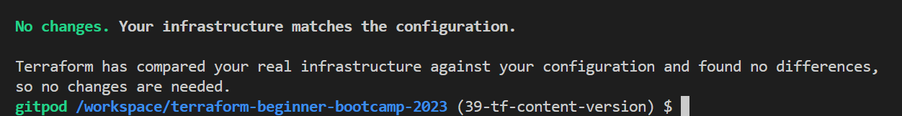
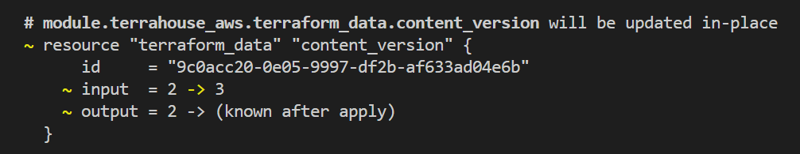
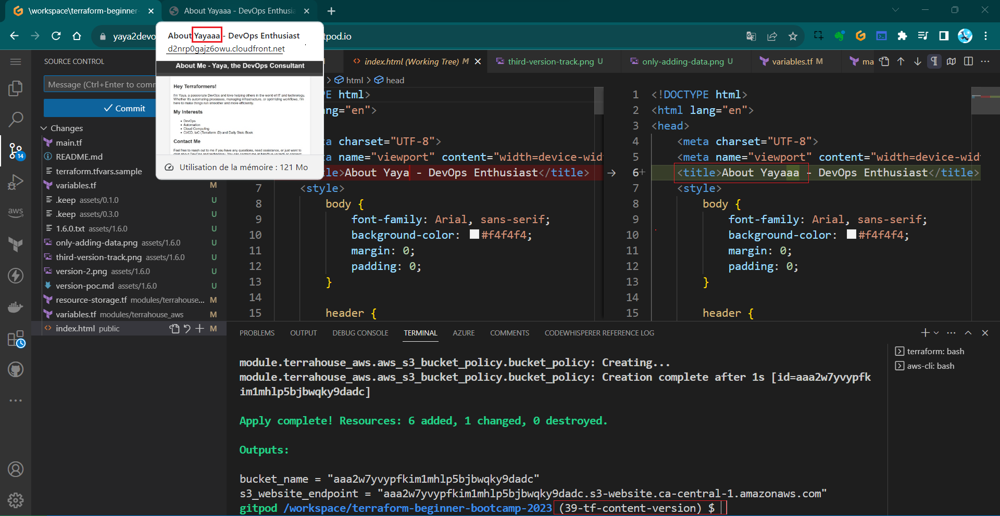

# Terraform Content Versioning 

Hey Terraformer, I'll outline the process of implementing content versioning for our S3 bucket serving a website via CloudFront in this  1.6.0.

**Note:** This step should be done prior to cloudfront distribution caching.

### Bootcamper Context
Content versioning is essential for efficiently managing your files content and ensuring that changes to your site files only when necessary.

- We want to validate the cache when the file changes.
- We want to be more explicit about which version of the website we are serving.
- We don't want cache is cleared entirely when any file changes

The last is very expensive call rather only what specified.

Instead, implement content versioning to cache only when desired.
- This is version one of the site;
- This is version two of the site;

We want it to be that explicit.


## Versioning Your Website

We will clearly define different versions of the website (e.g., V1, V2..etc).


Starting with **defining Content Version in Terraform Variables**

1. Open the `terraform.tfvars` file and add `content_version=1` (or the desired version).
```hcl
content_version=1
```
2. Add `content_version` to your main Terraform module call under `source`.
```hcl
  content_version = var.content_version
```
3. Implement a Terraform variable for `content_version` that only accepts positive integers starting from one in your modules `variables.tf`.
```hcl
variable "content_version" {
  description = "The content version. Should be a positive integer starting at 1."
  type        = number

  validation {
    condition     = var.content_version > 0 && floor(var.content_version) == var.content_version
    error_message = "The content_version must be a positive integer starting at 1."
  }

}
```
4. Include that in the variable call in ``variables.tf`` in the module level.
```hcl
variable "content_version" {
  type        = number
}
```

### Configure Resource Lifecycle
We want to trigger thhose in particular cases using **Lifecycle**

It enables you to respond to various actions on a resource, such as its creation, deletion, and other relevant events.

1. Navigate to the `resource-storage.tf` file.
2. Look for the S3 resource lifecycle.
```hcl
 resource "azurerm_resource_group" "example" {
  # ...

  lifecycle {
    create_before_destroy = true
  }
}
```
3. Add a lifecycle configuration to the `index.html` and `error.html` resources in s3 bucket object.
```hcl
  lifecycle {
    ignore_changes = [etag]
  }
```
4. Exclude the `etag` field within the lifecycle.
```hcl
    ignore_changes = [etag]
```

Learn more about lifecycle in terraform [from here.](https://developer.hashicorp.com/terraform/language/meta-arguments/lifecycle)

### Test 101
Observe the behavior when changes are made:
1. Comment both the lifecycle configurations.
```hcl
  #lifecycle {
  #  ignore_changes = [etag]
  #}
```
2. Make changes to the files and observe Terraform plan and apply results.
3. Uncomment the lifecycle configurations and change file
4. run `tfp`
5. observe the behavior again.


This is ignoring the etag. <br>To make it so, we have to code the trigger.

### **Triggering the Changes**
Our approach involves closely associating it with the respective resource. To trigger changes based on the content version, we'll use Terraform's `terraform_data` resource.

Traditionally, you would associate a null resource and a provider.. in the way offered by HashiCorp.

1. Configure the `terraform_data` resource to manage content versions as if they were regular resources.
```hcl
resource "terraform_data" "content_version" {
  input = var.content_version
}
```
2. Connect the content version to the resource lifecycle to trigger updates when the content version changes.
```hcl
    replace_triggered_by = [terraform_data.content_version.output]
```

3. make sure its place for ur index.html lifecycle like this:
```hcl
  lifecycle {
    replace_triggered_by = [terraform_data.content_version.output]
    ignore_changes = [etag]
  }
```

When we modify our version, it will be treated and managed in a manner similar to a resource.

### Test 202

1. Run `terraform plan` and see if it actually decide to change it;

It does work because tf data never existed.<br>
But. It doesn't appear to be triggering the content as expected..."

2. run `tfaa` and do `tfp` to see no change.
3. Change some of the content and do `tfp`.

It also didn't incorporate the changes...


### Test 303
Because we hadn't altered the version.

1. let's update it to '2' in the tfvars file.
2. run tfp and observe now.


> It's still not producing any changes.
3. Do a `tpa` maybe tfp is lying to us.

Still...Terraformers...

### Test 404 
The issue arises because we changed the variable in the tfvars file but didn't reference it in the module block in the our `main.tf` at the root level.

1. Change content_version = 2 to e.g. var.content_version=3.
2. Run `tfp` again.
3. Observe that the change will now take effect.



Notice that the updated version is correctly influencing the process.

[Check it out!](https://d2nrp0gajz6owu.cloudfront.net/)


#### Conclusion
We can now manage and trigger changes to our website more efficiently. <br>Each content version will be handled like a resource,

This implementation won't trigger cache clearing in CloudFront. <br>This aspect will be addressed in version 1.7.0 of our project.

FYI again, Terraform is not be the optimal tool for this specific task but for the learning.