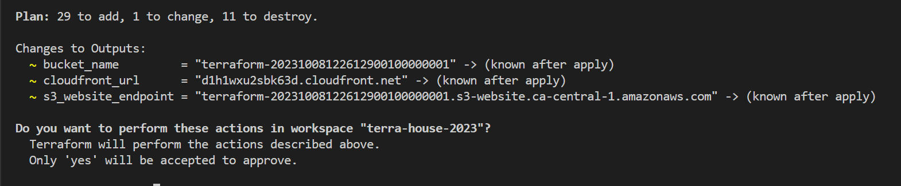
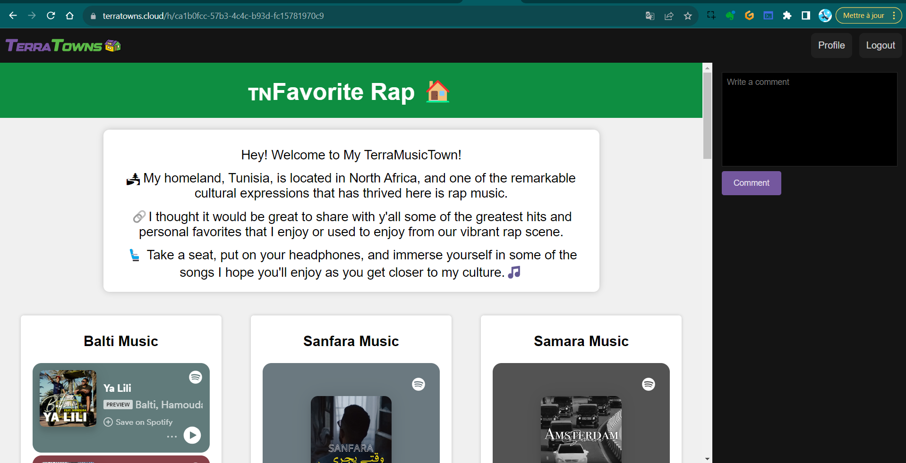
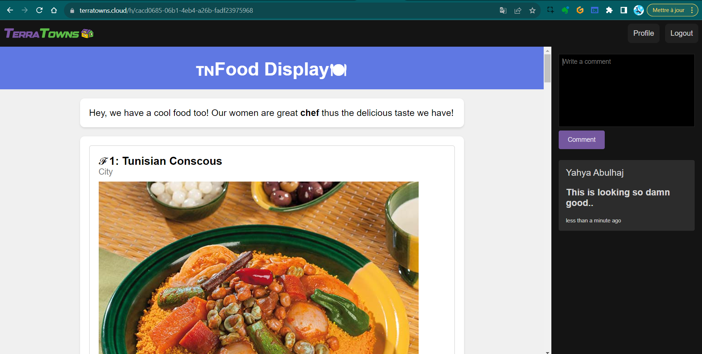

# 🏠 TerraHomes to TerraTowns
This is setup in `2.7.0` will lay the foundation to enable you with the creation of multiple homes or houses within the platform as it now supports up to twelve homes or houses.

To enable the deployment of multiple homes simultaneously on the Terratowns platform, follow these steps:

**Step 1: Create TerraHomes Folders**

Create separate folders within the "public" directory for each home and migrate all project files to them. 

1. Create a folder named "home1" and move your project files into it.
2. Create a second folder named "home2" and duplicate the files in the same format.
3. Make sure the structure is something like this;
```sh
📁 public
  |─ 🏠 home1
  |   └─ 📂 assets
  |       └─ 🖼️ great-stuff.png
  |   └─ 📄 index.html
  |   └─ 📄 error.html
  └─ 🏠 home2
      └─ 📂 assets
          └─ 🖼️ great-stuff.png
      └─ 📄 index.html
      └─ 📄 error.html
```


**Step 2: Rename Module**

Since we are loving it on homes rather than houses..

- Rename the module from "terrahouse_aws" to `terrahome_aws.`


**Step 3: Update Configuration**

Make the following updates to accommodate the changes related to `terrahome_aws` variables and modules:
- Update the source to point to `./modules/terrahome_aws` instead of the old source to the `terrahouse`.
```hcl
  source = "./modules/terrahome_aws"
```
- Change the module name to match the theme, e.g.,
```hcl
module "home_tnrap_hosting" {}
```

- Modify `output.tf` to reference `home_yourhousename_hosting` instead of `terrahouse_aws.` for `bucket_name`
```hcl
  value = module.terrahouse_aws.bucket_name

  value = module.home_tnrap_hosting.bucket_name
  value = module.home_tnfood_hosting.bucket_name

```
- Do the same in for the output of `s3_website_endpoint`
```
  value = module.terrahouse_aws.website_endpoint

  value = module.home_tnrap_hosting.website_endpoint
  value = module.home_tnfood_hosting.website_endpoint
```
- Do the same for the `cloudfront_url` and change output to reference `domain_name`. instead
```hcl
  value = module.terrahouse_aws.cloudfront_url
  value = module.home_tnrap_hosting.domain_name
```


**Step 4: Review and Update Variables in `terraform.tfvars`**

Review and update variables in the module configurations. If you need to set nested Terraform variables in the tfvars file, refer to Terraform documentation for guidance.

1. We asked GPT to help in this:
```
How do u set nested tf variables in tf vars file.
```

This is to make stuff look more damn neat.

- Remove previous `bucket_name`, `index_html_filepath`, `error_html_filepath` and `content_version` absolute path.
```sh
index_html_filepath="/workspace/terraform-beginner-bootcamp-2023/public/index.html"
error_html_filepath="/workspace/terraform-beginner-bootcamp-2023/public/error.html"
assets_path="/workspace/terraform-beginner-bootcamp-2023/public/assets/"
content_version=1
```
- Update your `terraform.tfvars` and `terraform.tfvars.sample` input for the public path and the content version in union like this;

```hcl
       house-name-1 = {
       public_path = "/workspace/terraform-beginner-bootcamp-2023/public/tnrap"
       content_version = 1
       }

       house-name-2 = {
       public_path = "/workspace/terraform-beginner-bootcamp-2023/public/tnfood"
       content_version = 1 
       }
```

**Step 5: Modify Index Variables**

- Remove previous `bucket_name`, `index_html_filepath`, `error_html_filepath` and `content_version` variables definition.

Those in tfvars will be red inlined unless you perform the following task.

- Modify the variables to include references to public paths for your homes in your `variables.tf` file instead as nested.


```
variable "home-1" {
  type = object({
    public_path = string
    content_version = number
  })
}
.
.
.
variable "home-n" {
  type = object({
    public_path = string
    content_version = number
  })
}
```


**Step 6: `main.tf` root Remove Index and Error HTML References**

Remove the "index_html_filepath" and "error_html_filepath" from your module block, and replace them with references to the "public_path" and "content_version" variables.

```hcl
module "home_tnrap_hosting" {
  source = "./modules/terrahome_aws"
  user_uuid = var.teacherseat_user_uuid

  public_path = var.arcanum.public_path
  content_version = var.arcanum.content_version
}
```


**Step 7: `main.tf` root Update Resource Configuration**

In the resource section, update the call with the new variables assigned to "cloudfront" and "content_version."

```
resource "terratowns_home" "home" {
  name = "How to play Arcanum in 2023!"
  description = <<DESCRIPTION


DESCRIPTION
  domain_name = module.home_arcanum_hosting.domain_name
  town = ""
  content_version = var.arcanum.content_version
}
```
**Step 8: Storage Module Vars Update**

1. Start with output.tf change the output `"cloudfront_url"` to `"domain_name"`

2. In `resource-storage.tf` change the `source` and `etag` path for `index_html`, `error_html` for `aws_s3_object` to map to our new vars.

```hcl
  source = var.index_html_filepath
  source = "${var.public_path}/index.html"

  etag = filemd5(var.index_html_filepath)
  etag = filemd5("${var.public_path}/index.html")


  source = var.error_html_filepath
  source = "${var.public_path}/error.html"

  etag = filemd5(var.error_html_filepath)
  etag = filemd5("${var.public_path}/error.html")
```

3. In the same file update source, etag but also the `for_each` for `upload_assets`.
```hcl
  for_each = fileset(var.assets_path,"*.{jpg,png,gif}")
  for_each = fileset("${var.public_path}/assets","*.{jpg,png,gif}")

  source = "${var.assets_path}/${each.key}"
  etag = filemd5("${var.assets_path}${each.key}")

  source = "${var.public_path}/assets/${each.key}"
  etag = filemd5("${var.public_path}/assets/${each.key}")
```

**Step 9: Module `variables.tf` Updates**
1. change our `index_html_filepath` variable to `public_path` instead.
```hcl
variable "public_path" {}
```
2. Remove its validation and rename its description.
```hcl
  description = "The file path for the public directory"
```

3. Leave it type string as it is.
```hcl
  type    = string
```

4. in the same file, terminate both `assets_path` and `error_html_filepath` and its validation.

**Step 8: Duplicate Step 5-6-7 for Another Home**

Duplicate the entire process for the module/resource to create a new home just below it.
```hcl
module "home_tnfood_hosting" {
  source = "./modules/terrahome_aws"
  user_uuid = var.teacherseat_user_uuid
  public_path = var.tnfood.public_path
  content_version = var.tnfood.content_version
}

resource "terratowns_home" "home_tnfood" {
  name = "Showing you our Tunisian Food"
  description = <<DESCRIPTION

Add yours here!

DESCRIPTION
  domain_name = module.home_tnfood_hosting.domain_name
  town = "missingo"
  content_version = var.tnfood.content_version
}
```

**Step 9: Build and Deploy**

To deploy your changes, follow these steps:

1. Ensure you are in the project directory, go to .gitpod.yml
2. add the following command with source below the copy command:
  
  ```bash
  cp $PROJECT_ROOT/terraform.tfvars.example $PROJECT_ROOT/terraform.tfvars
  source ./bin/build_provider
  ```
3.Run tf init to initialize your infra and new resources.
4. Run `tf plan`, observe and run `tf apply`. 




With these changes, you should be able to see both pages listed in your Terraform Cloud dashboard.


## The First Music Post 


### Check out The Music Home

→ [TerraTowns Independent Link](https://d2y3y5anu2c2ur.cloudfront.net/)




## Check Out The Tunisian Food Post


### Check Out The list in TerraHome

→ [TerraTowns Independent Link](https://d3opm9jrs6v4zx.cloudfront.net/)




### Terraform State Management

1. Execute `tf state list` to view the resources in Terraform Cloud within Gitpod.
2. Perform `tf state pull` to get the latest from tfcloud.

### Troubleshooting and Finalization

1. Address any errors encountered during the plan and apply phases.
2. Resolve undefined index, etag path, or other issues. 
2. Update outputs to match changes made in the configuration.
3. Ensure the plan and apply phases complete successfully.
4. Confirm changes in the Terraform Cloud interface.
5. Delete the Terraform Cloud resources if necessary.


### Joyful conclusion

Version 2.6.0 of the project focuses on integrating Terraform Cloud, enabling the creation of multiple homes or houses, and ensuring efficient configuration management.

**Show your creativity.**<br>
Make more homes! 
