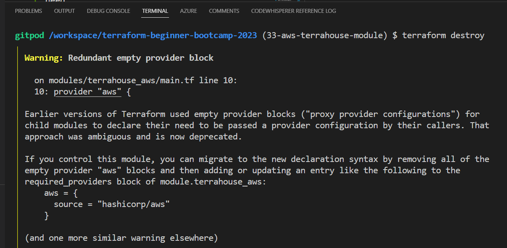
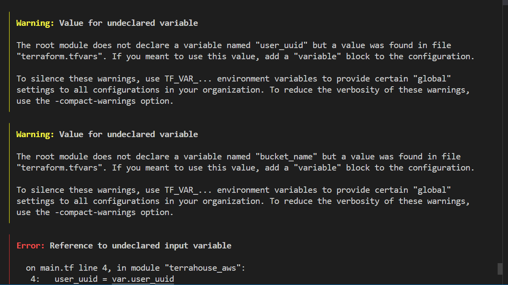
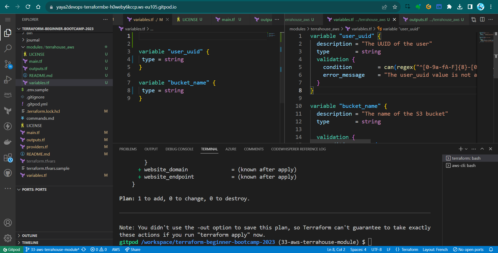
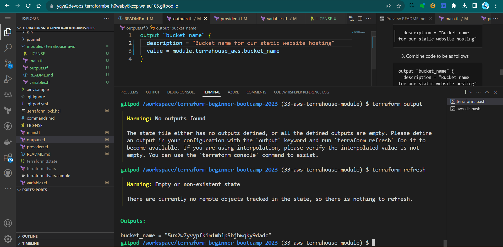
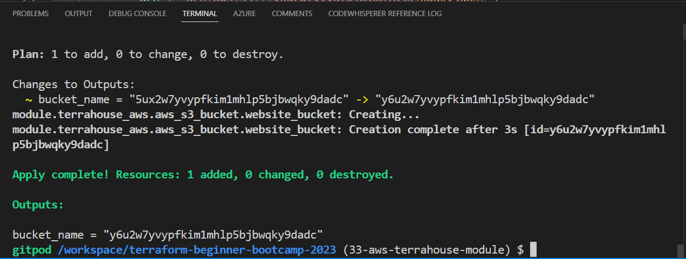
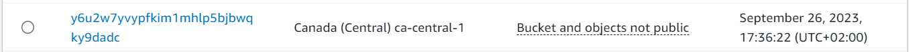

# The Terrahouse Module 

We will walk through the process of creating a Terrafohouse Nested Module and migrate our S3 bucket. This includes experiencing output/vars calls.

To Recap Just For You we'll be;
- Creating our initial nested module 
- Transferring our S3 bucket from the root module to the module.
- Experiencing with output and variable calls working with nested modules.

We started by triple checking The terraform modules Structure [again](https://github.com/yaya2devops/terraform-beginner-bootcamp-2023/tree/29-design-tf-root-module#design-your-terraform-modules).

When you're ready, I'm sure you're excited to go. <br>
Let's take on this together!

### Modules Architecture

Let me explain to you how our infrastructure will be broken down further on the road.

```
🏡 terrahouse_aws
├── 🗄️ resource-storage.tf
└── 🌐 resource-cdn.tf
```
- We'll keep everything related to storage Incl. S3 configurations, in a separate folder file called `resource-storage.tf`.
- Components related to delivery, Incl. CloudFron,t will reside in another file called `resource-cdn.tf`.
- Both are withing our 🏡 `terrahouse_aws` module.

Our architectural approach involves isolating components to enhance modularity and maintainability.

## Nested Module Init

To begin, let's establish the directory structure for our Terrafohouse Module:

1. Create a new `modules` directory, following Terraform best practices.
2. Inside that, create `/terrahouse_aws` directory that will host the magic.
In this directory, we will have the following essential files and folders.
3. In `/terrahouse_aws` create `main.tf` that will contain the main configuration for the module.
4. In `/terrahouse_aws` create `outputs.tf`to define our module outputs.
5. In `/terrahouse_aws` create `variables.tf`for mod specific var definition.
6. In `/terrahouse_aws` create `README.md` to provide the `what` for the module.
7. In `/terrahouse_aws` never miss to create `LICENSE` to follow best practices in design.

|📜|We'll adopt the Apache License. |
|---:|:---|
|👨‍💻|Anton Babenko is known for creating many Terraform modules.|
|✔️| We can use an Apache License from his work.|

He also [likes to travel](https://twitter.com/antonbabenko/status/1208503560733896706). I mean yeah. Me too!

To continue remmember;
- Each module requires a specified provider. 
- If not, Terraform will raise an error.

###  Refactoring the Root Module
To keep our configuration clean and organized, we'll make some changes;
1. Move the provider configuration from the root directory to `main.tf` within the module.
2. Transfer the definition of the bucket resource to `main.tf` within the module.
3. Eliminate the root `providers.tf` configuration because we've incorporated it into the module and it got nothing in it we need.
4. Relocate variables and outputs to their respective places from root to the module.
5. Yes make sure to perform a cut operations. [I'll tell you why later](#11-handling-variables-validators-in-nested-modules).

##  Modules Are Sources

Now that we've moved our configuration to the module level.

The question you are asking is;
|❓|How to actually reference them in the root |
|---:|:---|
|💡|Modules can be imported within another module block|

Here is how;
```hcl
module "terrahouse_aws" {
  source = "./modules/terrahouse_aws"
}
```
- Input variables can be passed to the module block e.g. UUIDs and BuN
```hcl
module "terrahouse_aws" {
  user_uuid = var.user_uuid
  bucket_name = var.bucket_name
  }
```

> A powerful point to explore the [different sources](https://developer.hashicorp.com/terraform/language/modules/sources) from which we can reference modules. 

These can be local paths-our case, GitHub repos, or the Terraform Registry.. 

> Check it up. The link; I provided you.

## Start Testing Your Module
We linked our module and we can go ahead and give it a try.

To ensure everything is set up correctly

1. Use the `terraform init` command to It will validate our configuration.

It is telling that our AWS bloc is empty new stuff. <br>Not that deal-Just get rid of it if you want.



2. Run the `tf plan`, sometimes I miss out we have alias, to test your module configuration is correct.



The plan is an error as expetcted. And the truth will follow;

#### 1.1. Handling Variables, Validators In Nested Modules

When working with variables and validators, keep in mind:
- Variables need to be defined in both the module and the root.
- Validators, which are already integrated into the module, don't need to be included in the root. 
- Terraform will detect validators automatically.

#### 1.2. Resolve Vars Root/Mod

1. To resolve that, simply define the variables in the root and give it description.
```hcl
variable "user_uuid" 
{
 type = string
}
```
|Thats it💡| If the naming is accurate, it will gather more about the module|
|---:|:---|

2. Now that you know, do the same for the bucket.
```hcl
variable "bucket_name" 
{
 type = string
}
```
3. Let's run `terraform plan` to observe the plan without errors 

Now everything works smoothly.<br> But I see no outputs. 

I am sure I configured my module...



#### 2.1. Outputs In nested Modules

After applying the configuration, you might notice that outputs aren't visible. 

- Run `terraform output` to verify.
Nothing to see..Because we have it only in the module as well.

#### 2.2. Resolve Outputs
Outputs defined within a nested module allow us to access them at that level. 

To see outputs, they must also be added to the root output. The difference is now we will get it from the module.

1. You can access the nested module's output like this: `module.name-dir.bucket_name`.

2. Give it a great description;
```hcl
  description = "Bucket name for our static website hosting"
```

3. Combine code to be as follows;

```hcl
output "bucket_name" {
  description = "Bucket name for our static website hosting"

  value = module.terrahouse_aws.bucket_name
}
```
> Random; nested for a good reason, because its literally nested wihtin this project.

## 10. Terraform Refresh and Wrap

A good time to employ this command after updating our output code to refresh it baby. 

1. To dp so, run `terraform refresh` after the output has been updated.
```
tf refresh
```

2. Run tf output you'll be seeing the output;



This will synchronize the local state with the actual AWS resources.

3. run the tf `apply`



Here you'll have ur bucket again with the output!

You can also combine refresh with apply;

```sh
terraform apply -refresh-only -auto-approve
```



Great and cool! we've successfully did the following;
- created a Terrafohouse Module,
- organized our AWS infrastructure configurations,
- demonstrated effective module referencing and output management.

Future enhancements and additional modules can now be seamlessly integrated into your infrastructure.
