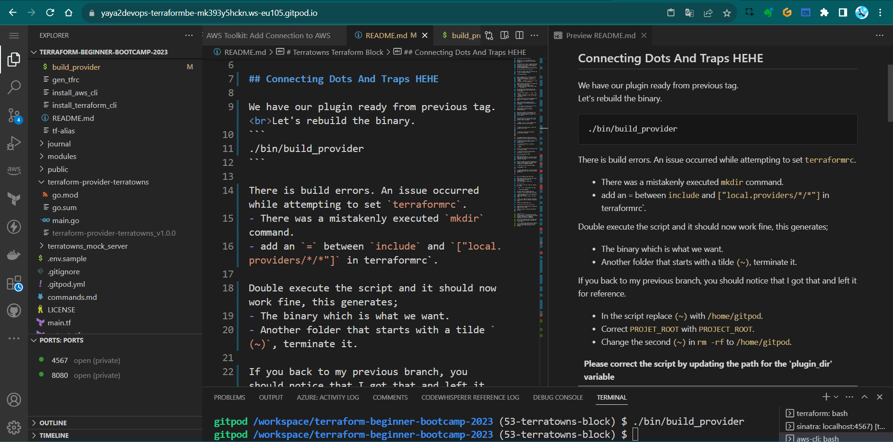
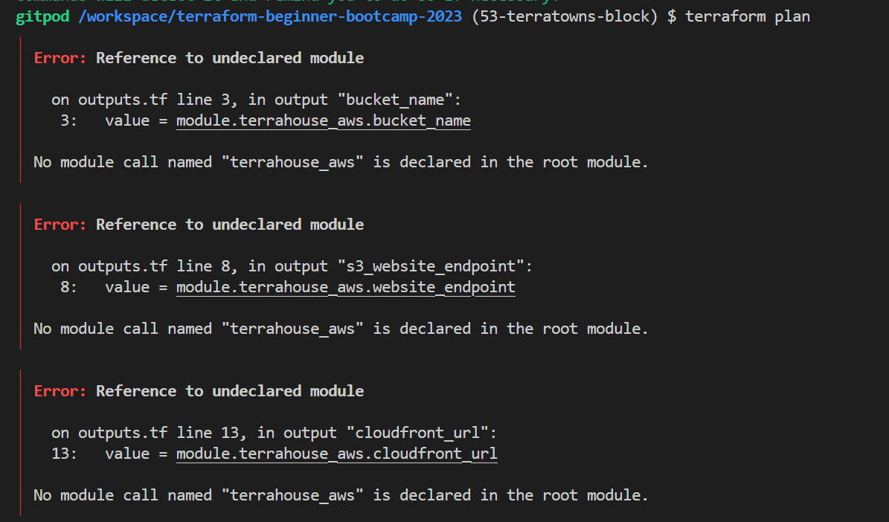
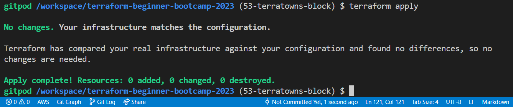

# Terratowns Terraform Block

Welcome to `2.2.0` our second part for working with the creation of our custom provider.

To get the most of this, I highly encourage you refer to the issues we dealt with for Terratowns [starting with this.](https://github.com/yaya2devops/terraform-beginner-bootcamp-2023/issues/51)

## Connecting Dots And Traps

We have our plugin ready from previous tag. <br>Let's rebuild the binary.
```
./bin/build_provider
```

There is build errors. An issue occurred while attempting to set `terraformrc`.
- There was a mistakenly executed `mkdir` command.
- add an `=` between `include` and `["local.providers/*/*"]` in terraformrc`.

Double execute the script and it should now work fine, this generates;
- The binary which is what we want.
- Another folder that starts with a tilde `(~)`, terminate it.

If you back to my previous branch, you should notice that I got that and left it for reference.

- In the script replace `(~)` with `/home/gitpod`.
- Correct `PROJET_ROOT` with `PROJECT_ROOT`.
- Change the second `(~)` in `rm -rf` to  `/home/gitpod`.

|Please correct the script by updating the path for the 'plugin_dir' variable|
|---|

These corrections eliminated errors, resulting in the successful generation of the binary.

- **To confirm the binary was generated**<br>
**Check it in `terraform-provider-terratowns`.**



Now that our library is configured, it's time to integrate it with our Terraform setup. This corresponds to version `2.2.0` of our project.


## Configuring the Custom Provider Block
The next step is to configure the custom provider within Terraform:


1. Update  `main.tf` file to specify the Terraform block with our provider.
```hcl
  required_providers {
    terratowns = {
      source = "local.providers/local/terratowns"
      version = "1.0.0"
    }
  }
```
2. Below the Terraform block, create the provider block itself.
```hcl
provider "terratowns" {
 <what is next goes here>
}
```
3. Specify the required the endpoint, service UUID, and token.
```hcl
  endpoint = "http://localhost:4567"
  user_uuid="get-it-from-teacherseat-profile"
  token="get-it-from-teacherseat-settings"
```

The required UUID and token values were obtained from a mock created by the script.

Later this will both come from the ExamPro Platform. (It is already there)

### Rebuilding the Provider After Your Code
1. Build our provider again to get an updated binary.

2. Initialize Terraform, and execute `terraform init`.

|❌ ERROR|
|---|
An error occurred during initialization due to a missing include.

3. The build script was executed again, followed by `terraform init`.

This now resolves our issue.

### Idea On The Way
When you perform actions like that, having different log levels in place can greatly simplify the process.


Effective logging can make troubleshooting easier. In this release, log levels were configured for debugging purposes:

1. Add the log level using the command 
```
TF_LOG=DEBUG tf init
```

2. Enable Debug mode was in the environment configuration within the Terraform block in GitPod file.
```
tasks:
  - name: terraform
    env:
      TF_LOG: DEBUG
```

We can now debug and get good stuff.

When things go awry in our Go code, these logs will prove invaluable for troubleshooting.
This verbose mode is great idea.

## Back To Plan

We stopped at the init, where we resolved our issue.

1. Run `tf plan` to quickstart our code.



To ensure that the changes made were effective, the following steps were taken:

- Make sure module blocks were commented to avoid interference.
- Make sure all output lines in the root also.

|tf plan will [now work](assets/2.2.0/planned-as-required.png) with No changes. Your infrastructure matches the configuration.|
|---|
2. Run `terraform apply` or just `tfaa` again to push our code with auto approve using our [previous configured alias](https://github.com/yaya2devops/terraform-beginner-bootcamp-2023/tree/35-s3-static-website-host#bonus-three-captured).

Things are working great now!



|Applying the configuration will produce an empty Terraform state|
|---|
|This is actually a positive and desired outcome|


#### Good Stuff!
Version `2.2.0` of the TerraTown Provider saw improvements in the build script, custom provider configuration, debugging capabilities, and error resolution. 

We're also introducing the Terraform block for our new custom provider, ensuring its functionality. 

`2.3.0` is our final step and will involve a more in-depth exploration of Go and the coding of the actual resources for our provider.


