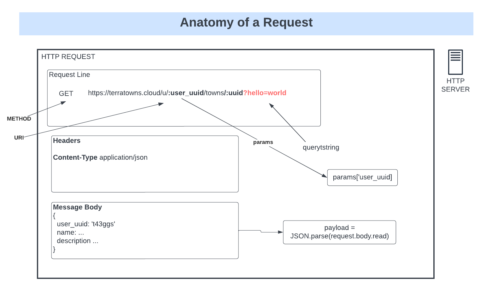
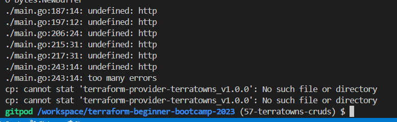
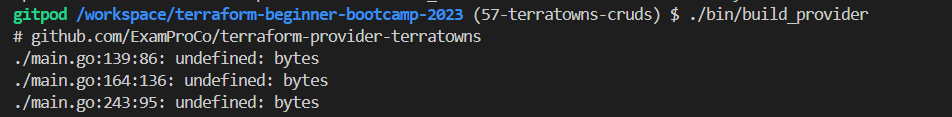
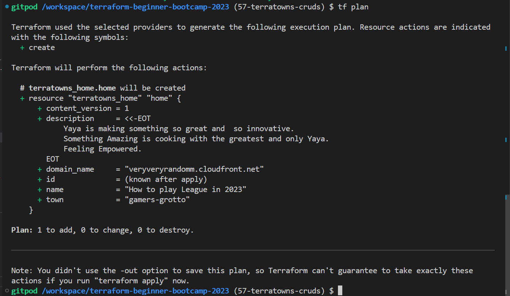
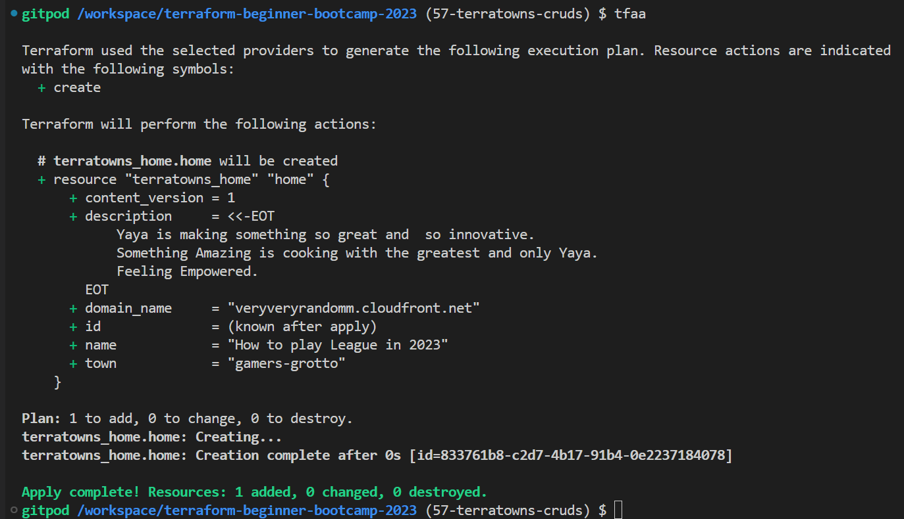
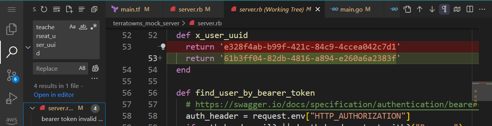
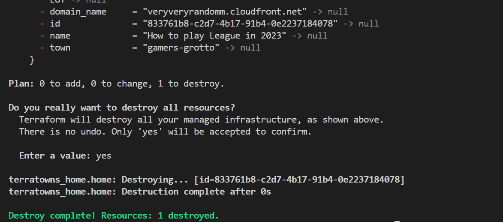

# TerraTowns `Home` Resource
We welcome you in this last and intense `4/4` part of our custom terraform provider creation.

  * [Code the Terraform Resource](#code-the-terraform-resource)
  * [Building and Initializing](#building-and-initializing)
  * [Code Implementation](#code-implementation)
  * [Payload Processing in API Requests](#payload-processing-and-error-handling-in-api-requests)
* [Testing and State](#testing)


We will start by defining the schema for our resource.

I want to call it home resource. <br>But since its the only resource.. <br>We call it just resource.

Remember it is still our home 😊


### Compiling the Code
To check if everything compiles correctly first, run the following command:

```
bin/build_provider
```
## Code the Terraform Resource

1. Go to the `main.tf` file at the root level.
2. Add a new Terraform resource named `terrtown_home` and name it `home`. 
```hcl
resource "terratown_home" "home" {}
```
3. Start with Including the `name`  attributes.
```hcl
name = "Secrets are at the core of successful businesses"
```

> Where [I read that quote?](https://www.amazon.com/Zero-One-Notes-Startups-Future/dp/0804139296)

4. choose where you want to put your page e.g.; `gamers-groto` for `town`.
```hcl
town = "gamers-grotto"
```
5. Use the `<< >>` syntax to configure the description, similar to EOF.
```hcl
description = <<DESCRIPTION
Something so great and innovative.
Something Amazing.
As great as you.
DESCRIPTION
```
6. Retrieve the domain name from your other project (CloudFront URL) 
7. set the domain_name as an output.

```
domain_name = "very-random.cloudfront.net"
```
8. Specify the content_version starting with one;
```
content_version = 1
```
## Building and Initializing
Run the following commands to prepare your Terraform environment:

1. Run `terraform init`


**ERROR:** `failed to query available provider packages` 

2. review your Terraform configuration files include terraformrc.

Everything looks fine..<br>We didnt finish anything with the code.. <br>We still have empty resources in `main.go` it may be why..

Lets keep coding and see.

## Code Implementation
Next, we need to code the CRUD (Create, Read, Update, Delete) operations for our resource.

### Create Action
- Implement the HTTP request and endpoint for creating a resource.
```go
	req, err := http.NewRequest("POST", config.Endpoint+"/u/"+config.UserUuid+"/homes", bytes.NewBuffer(payloadBytes))
	if err != nil {
		return diag.FromErr(err)
	}
```
- Add authorization and your bearer token to the create request.
```go
	req.Header.Set("Authorization", "Bearer "+config.Token)
```
- Set headers for content type and accept.
```go
	req.Header.Set("Content-Type", "application/json")
	req.Header.Set("Accept", "application/json")
```
- Ensure that you handle any errors and parse the response.
```go
if err != nil {
   return diag.FromErr(err)
}
defer resp.Body.Close()

// parse response JSON
var responseData map[string]interface{}
if err := json.NewDecoder(resp.Body).Decode(&responseData);  err != nil {
   return diag.FromErr(err)
}

// StatusOK = 200 HTTP Response Code
if resp.StatusCode != http.StatusOK {
   return diag.FromErr(fmt.Errorf("failed to create home resource, status_code: %d, status: %s, body %s", resp.StatusCode, resp.Status, bytes.NewBuffer(responseData)))
}
```
- Return the `homeUUID` from the response and set it using `d.Set`.
```go
homeUUID := responseData["uuid"].(string)
d.SetId(homeUUID)
```

- Add print at the start for debugging purposes
```go
log.Print("resourceHouseCreate:start")
```
### Read Action
- Implement the HTTP GET request for reading a resource.
```go
req, err := http.NewRequest("GET", config.Endpoint+"/u/"+config.UserUuid+"/homes/"+homeUUID, nil)
if err != nil {
   return diag.FromErr(err)
}
```
- Pass the `homeUUID` in the URL.
- Set the headers for the read func
```go
req.Header.Set("Authorization", "Bearer "+config.Token)
req.Header.Set("Content-Type", "application/json")
req.Header.Set("Accept", "application/json")
```
- Parse the response data and return it.
```go
	client := http.Client{}
	resp, err := client.Do(req)
	if err != nil {
		return diag.FromErr(err)
	}
```
Consider the code to handle errors gracefully. <br>(Coming below)
### Update Action
- Implement the HTTP request for updating a resource.
```go
	req, err := http.NewRequest("PUT", config.Endpoint+"/u/"+config.UserUuid+"/homes/"+homeUUID, bytes.NewBuffer(payloadBytes))
	if err != nil {
		return diag.FromErr(error)
	}
```
- Set the header for the update
```go
	req.Header.Set("Authorization", "Bearer "+config.Token)
	req.Header.Set("Content-Type", "application/json")
	req.Header.Set("Accept", "application/json")
```
- Use the payload from the create action but exclude domain and town.
- Set the payload data in `d.Set` for name, description, and content version.

```go
	d.Set("name",payload["name"])
	d.Set("name",payload["description"])
	d.Set("content_version",payload["content_version"])
```

### Delete Action
- Implement the HTTP request for deleting a resource.
```GO
	req, err := http.NewRequest("DELETE", config.Endpoint+"/u/"+config.UserUuid+"/homes/"+homeUUID, nil)
	if err != nil {
		return diag.FromErr(err)
	}
```
- Set the ID if the operation is successful and a print.
```GO
	d.SetId("")
	log.Print("resourceHouseDelete:end")
```


|This repetition could potentially be refactored; try?|
|:---|


Next, we need to conduct the client call following the header, both for the delete operation and similarly for the update, read, and create operations.


## Payload Processing and Error Handling in API Requests

The message body should contain all the details, here is a design for your reference.



1. **Pay Payload for a Post**
   - To begin, we need to pay a payload for a post in createfunc.
```go
	payloadBytes, err := json.Marshal(payload)
	if err != nil {
		return diag.FromErr(err)
	}
```

2. **Create Configuration**
   - Now, let's return to the creation process.
   - After configuring, we need to pass a payload block.
```go
	payload := map[string]interface{}
    { }
   ```
3. **Payload Formatting**
   - It's important to format the payload properly.
   - Consider using a JSON function to convert it into bytes and add it as an argument to the next step.
```yaml
		"name": d.Get("name").(string),
		"description": d.Get("description").(string),
		"domain_name": d.Get("domain_namae").(string),
		"town": d.Get("town").(string),
		"content_version": d.Get("content_version").(int64),
```
4. **Handling the Response**
   - After completing the payload and putting it in the body, we should receive a response.
   - We'll need to perform actions based on this response.
   - Parse the response data.
```go
var responseData map[string]interface{}
if err := json.NewDecoder(resp.Body).Decode(&responseData);  err != nil {
   return diag.FromErr(err)
}
```

5. **Closing the Response Body**
   - Don't forget to close the response body after you're done with it.
   - Use `resp.Body.Close()` to accomplish this.
```go
	defer resp.Body.Close()
```
6. **Error Handling in Create**
   - Obtain the code that will detect and handle errors from the server during the create process.
   - Check if `resp.StatusCode` is not equal to `http.StatusOK` to determine if an error occurred.
```go
	if resp.StatusCode != http.StatusOK {
		return diag.FromErr(fmt.Errorf("failed to create home resource, status_code: %d, status: %s, body %s", resp.StatusCode, resp.Status, bytes.NewBuffer(responseData)))
	}
```
7. **Handling Errors in Delete**
   - Similarly, for the delete operation, you'll need to implement error handling.
   - Check the response status code for errors.
```go
	if resp.StatusCode != http.StatusOK {
		return diag.FromErr(fmt.Errorf("failed to delete home resource, status_code: %d, status: %s, body %s", resp.StatusCode, resp.Status, responseData))
	}
```
8. **Setting the ID Value**
   - In Terraform, when working with resources, it's essential to return an ID.
   - In the create step, add the following:
     - `homeUUID := response uuid string`
     - Set `d` to this value and print for debug.
```go
	d.SetId("")

	log.Print("resourceHouseDelete:end")
```

###  Setting the ID Value
In Terraform, it's important to return an ID whenever you have a resource.
   - In the create step, add the following:
     - `homeUUID := response uuid string`
     - Set `d` to this value, e.g., `d.set(homeUUID)`.

### Reading Resource Data
Now, let's focus on the read operation.
   - We need the home ID for this.
```go
   config := m.(*Config)
	homeUUID := d.Id()
```
   - Revise the response status code to use an "if-else" structure.
     - If it's OK, return the data.

```go

	if resp.StatusCode == http.StatusOK {
		// parse response JSON
		if err := json.NewDecoder(resp.Body).Decode(&responseData);  err != nil {
			return diag.FromErr(err)
		}
       // d.set
	} else if resp.StatusCode != http.StatusNotFound {
		d.SetId("")
	} 
```
   - Use `d.Set` for all the content to be read, such as `name`, `content`, `desc`, `domain`, etc.
```GO
		d.Set("name",responseData["name"].(string))
		d.Set("description",responseData["description"].(string))
		d.Set("domain_name",responseData["domain_name"].(string))
		d.Set("content_version",responseData["content_version"].(int64))
```
   - Consider handling cases where the status is not available to avoid config drift.
```go
else if resp.StatusCode != http.StatusOK {
		return diag.FromErr(fmt.Errorf("failed to read home resource, status_code: %d, status: %s, body %s", resp.StatusCode, resp.Status, responseData))
	}
```

Good work!
### Updating Resources
For the update operation, you'll need to use the payload from the create operation.
   - Exclude the `domain` and `town` since these should not change.
   - Return the payload values for `name`, `desc`, `description`, and `content_ver`.
   - Use `d.Set` to update these values.

# Testing
After implementing these actions, you should test your provider.

1. Build and initialize Terraform.
```
./bin/build_provider
```

We have some issues and **syntax error.**

2. Replace `err != {` with `err != nil {` in your code to resolve the issue.
```go
// Before
if err != {
		return diag.FromErr(err)
	}

// After
if err != nil {
		return diag.FromErr(err)
	}
```

3. Build again baby.
```
./bin/build_provider
```
Error. **HTTP error**



4. import the necessary package, you can add the statement as follows:
```go
import ("net/http")
```

5. Build again one more.
```
./bin/build_provider
```
Error. **We have an `undefined.FrontErr`.**

6. Change this with correct the usage of the identifier with this;

```
FromErr
```

7. Building building!

```
./bin/build_provider
```

Another cute error,  **the "bytes" library is required.**



8. You can add the import statement like this to resolve the issue in your main.go:
```go
import ( "bytes")
```


We have gone through multiple builds, and to avoid spamming you with more build errors, I will now list the errors we encountered and how we resolved them.

**The Next ERROR;**
- The variable `payloadBytes` is declared but not utilized on line 255 because we need to pass it instead of `nil`.
-  We should use `bytes.NewBuffer` to create the buffer since it's not reading. The same adjustment should be made for the `createAction` and `readOnly` functions.

**The Next ERROR +1;**
- We don't need `responseData` for the update operation. We are not interested in it. 
- Please remove `responseData` and only capture the response body.
- Take the `responseData` from the delete function as well.

8. Building the great build!

```
./bin/build_provider
```

We've successfully built it now!

|🤯|It's okay if it seems confusing at the moment;|
|---:|:---|
|💯|Things will get easier|
|🧐|When we start examining the tfstate file|
|💪|Don't give up King or Queen. |


### Test The Magic

Does this actually now provision anything? 
Is it working as expected? 

This is communicating with our Sinatra server.

1. do `tf init` and let's see.

We encountered a failure while querying available provider packages.

- Please ensure consistency in naming.
- Use the resource name `terratowns_home` instead of `terratown_home`.

2. check your terraform providers locally.

```sh
$ terraform providers

Providers required by configuration:
.
├── provider[local.providers/local/terratowns] 1.0.0
└── provider[registry.terraform.io/hashicorp/terratown]
```

3. do it again after the update! Perfect.

```sh
Providers required by configuration:
.
└── provider[local.providers/local/terratowns] 1.0.0
```
This change is necessary because in the provider schema function of `main.go`, it is defined as `teratown_home`.


3. Double check `tf init` now. Works!
4. `terraform plan` and let's see.

We've got the resource! `A custom resource has been planned`!



- The mock server is not a real server, 
- This won't behave exactly the same way as the actual server.

We can play a little bit around before targetting the terratown.

4. Apply your changes with `terraform apply` for too much errors to come ofc.

| Step | Error Description                                     | Resolution                                               |
| ---- | ----------------------------------------------------- | -------------------------------------------------------- |
| 1    | Spelling mistake: `domain_namae` -> `name`           | Update the variable name to "name"                       |
| 2    | Build provider to delete files                        | Execute `./bin/build_provider`                            |
| 3    | Initialize and apply Terraform                        | Run `terraform init` and `terraform apply`                |
| 4    | Code block issue with `<`, related to JSON parsing   | Ensure the response is valid JSON and not HTML or other   |
| 5    | Invalid character `<`, looking for value start       | Validate the data from the API is valid JSON             |
| 6    | URL adjustment needed: hit "/api/home" instead       | Change the URL to "/api/home"                            |
| 7    | Issue with endpoint in create script (only "home")   | Modify the endpoint to include "/api" in `main.tf`       |
| 8    | Reattempt after endpoint correction                  | Rebuild, initialize, and apply                           |


I've found a better way to present the errors I encountered in these eight steps, allowing you to tackle and resolve each one systematically.

The last apply will get your custom resource to be provisioned. 

Great and cool!



**NOTE:** I had to [deal with a 401](assets/2.4.0/401-issue.png) before my last succefull apply. <br>I fixed with a simple replace of the current uuid with mine for the sinatra server.




## State File Effects
It's retaining this state, so we should be able to continue mocking it.

The state file in Terraform keeps track of the resource's status, including the `homeUUID`. It's crucial for Terraform to maintain resource mapping.
```json
{
  "version": 4,
  "terraform_version": "1.6.0",
  "serial": 3,
  "lineage": "861def3e-f028-0a8f-c9bd-de51c87602fb",
  "outputs": {},
  "resources": [
    {
      "mode": "managed",
      "type": "terratowns_home",
      "name": "home",
      "provider": "provider[\"local.providers/local/terratowns\"]",
      "instances": [
        {
          "schema_version": 0,
          "attributes": {
            "content_version": 1,
            "description": "Yaya is making something so great and  so innovative.\nSomething Amazing is cooking with the greatest and only Yaya.\nFeeling Empowered.\n",
            "domain_name": "veryveryrandomm.cloudfront.net",
            "id": "833761b8-c2d7-4b17-91b4-0e2237184078",
            "name": "How to play League in 2023",
            "town": "gamers-grotto"
          },
          "sensitive_attributes": [],
          "private": "bnVsbA=="
        }
      ]
    }
  ],
  "check_results": null
}
```

Examine the state file to check for sensitive data (a valuable lesson to be learned).
- It does not store sensitive data here.
- We can view our schema for the resource and the provider we created.

The most important aspect is the ID, as the Terraform provider relies on it to maintain the mapping accurately.

## Correct and Make Changes
You can make changes to your resource properties and apply them. 

Terraform will detect and update the state accordingly.


#### Let's Make Changes

1. Change `name` to `resource name` in `main.tf` and we encounter an error.
   - We wanted "home," but it's "House," e.g., "HouseCreate."
2. Change `init` to `float64`.
   - Another error occurs because of the state file.
   - Error occurs because in one place it's `init`, and in another, it's `float64`.
3. Data type mapping:
   - Create: `int`
   - Read: `float64`
   - Update: `int`
   - This mapping is based on how the response is received.
4. Resolution Steps:
   - Build.
   - Delete state.
   - Stop Sinatra.
   - `tf init`.
   - `tf apply --auto-approve`.
   - These steps are taken to resolve the error.
5. It was created.
   - Go to Sinatra and verify.
   - Confirm that it's created.
6. Make a change, and then reapply.
   - It detects that the description has changed and prompts for confirmation.
   - Observe that the state now contains the updated information.
7. There's a double name in the update; change it to "description" and double-check.
   - Ensure that there is no duplication.
8. Make an update to the description or name.
   - Run `tf apply`.
   - Ensure Sinatra is running.
> Also, the apply do both update and show.
9. It updates our state, and the names align as desired.
   - Confirm that the state reflects the changes.

#### Cleanup

10. Destroy the state. All is perfect!



Destroying the state will remove it completely. I used to play [league of legends](https://en.wikipedia.org/wiki/League_of_Legends) from the age 16 to 20.

Up from that point, I live in the cloud.

### Considerations

- Are there any edge cases? (unknown)
- Are there any overlooked factors? (unknown)

Writing a robust Terraform provider can be a challenging task. <br>It's impressive to achieve this, and it's undeniably cool!


- The next step involves utilizing the provider with the actual Terratown endpoint.
- This will require setting up Terratown accounts and obtaining the necessary access.

We've reached a significant milestone with our progress. <br> 

|🛑|This is a hard good Stop! |
|--:|:--|
