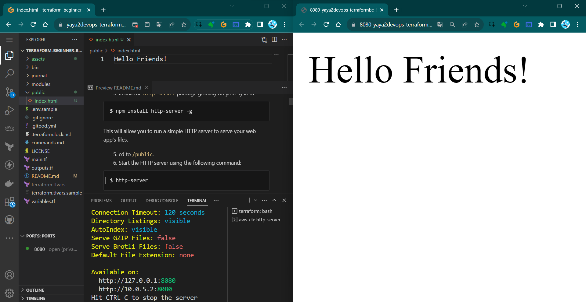
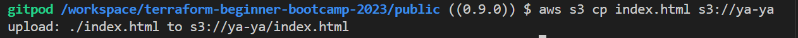
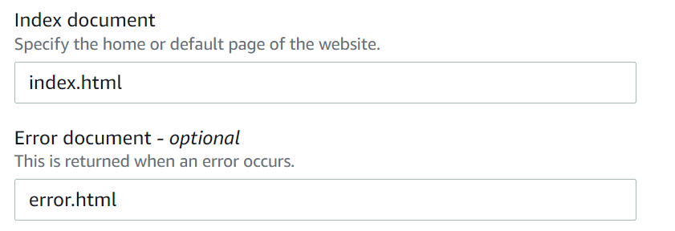
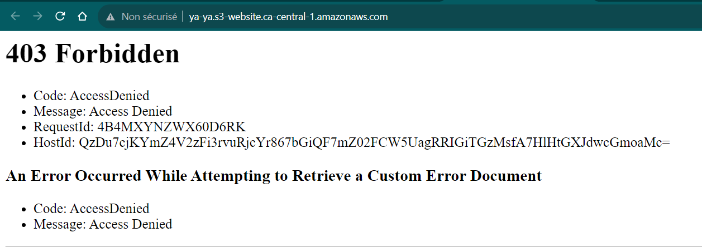
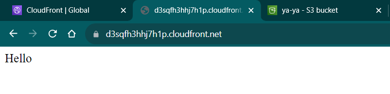
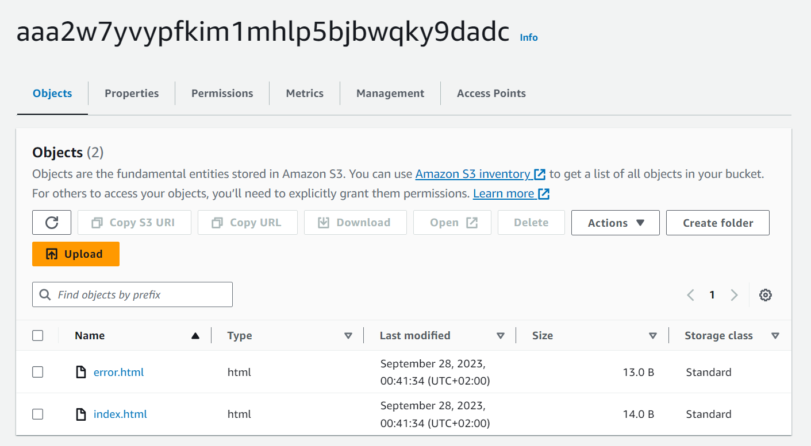
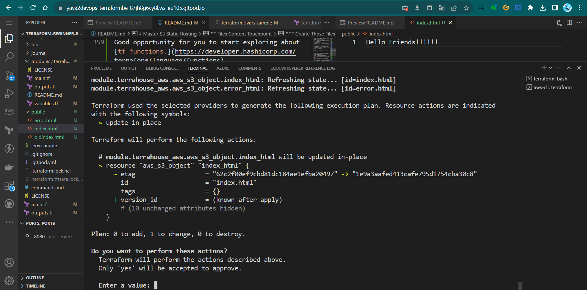
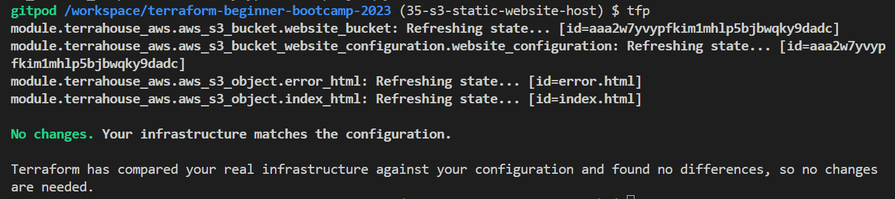
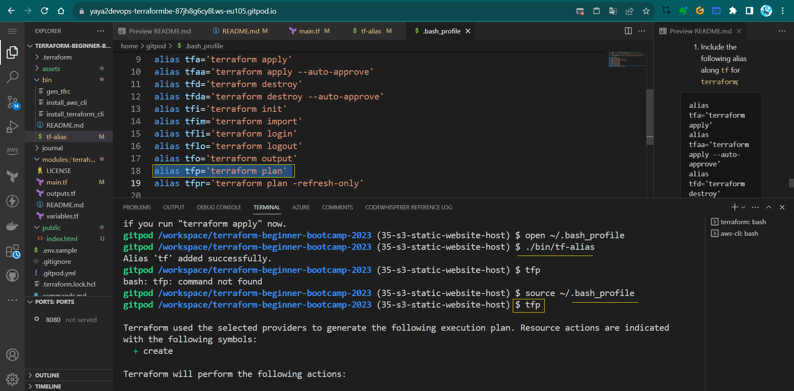

# Master S3 Static Hosting

Welcome to this `1.4.0` where I'll elighten you on how to host a static website on S3 using your fingers and Terraform.

## Background
We previously performed the setup using the AWS Console.


### Host Your First HTTP Server
Let me get you going from your dev env.
1. Create `public` directory.
2. Add an `index.html`
3. add some content of your wish.
4. Install the `http-server` package globally on your system. 
```sh
$ npm install http-server -g
```
This will allow you to run a simple HTTP server to serve your web app's files.

5. cd to `/public`.
6. Start the HTTP server using the following command:
```
$ http-server
```



Now, we aim to take this to s3.

### Use S3 For That Instead

#### STEP 1 : Create an S3 Bucket for Static Website Hosting

1. Log in to your AWS Console.
2. Navigate to the S3 service.
3. Click on "Create bucket."
4. Choose a unique name for your bucket (e.g., "ya-ya") and select a region.
5. Leave the default settings for the rest of the options and click "Create bucket."

#### Step 2: Upload Your Static Website Files

1. In the S3 bucket you just created, navigate to the "Upload" button.
2. Select the "index.html" file from your local system and upload it to the S3 bucket.

I did it via the CLI.



I suggest you go do it too.

#### Step 3: Configure Your S3 Bucket for Static Website Hosting

1. In your S3 bucket, click on the "Properties" tab.
2. Scroll down to the "Static website hosting" card and click "Edit."
3. Select the option for "Use this bucket to host a website."
4. Specify "index.html" as the Index document.
5. Optionally, you can specify an error document (e.g., "error.html").

6. Click "Save changes."
7. Check your app on the web;



#### Step 4: Create an AWS CloudFront Distribution

We want to use AWS CloudFront as a Content CDN to distribute our website

1. Go to the AWS CloudFront service.
2. Click on `Create Distribution.`
3. Choose `Web` as the distribution type.
4. In the `Origin Settings,` select your S3 bucket as the origin.
5. Create the distribution.

**Note: To restrict access to your S3 bucket through CloudFront, you can must use an origin access identity and an S3 bucket policy like the one below:**

```json
{
    "Version": "2012-10-17",
    "Id": "PolicyForCloudFrontPrivateContent",
    "Statement": [
        {
            "Sid": "AllowCloudFrontServicePrincipal",
            "Effect": "Allow",
            "Principal": {
                "Service": "cloudfront.amazonaws.com"
            },
            "Action": "s3:GetObject",
            "Resource": "arn:aws:s3:::<bucket-name>/*",
            "Condition": {
                "StringEquals": {
                    "AWS:SourceArn": "arn:aws:cloudfront::<aws-id>:distribution/your-distribution-id"
                }
            }
        }
    ]
}
```

We needed to reconfigure the distribution process due to our failure to define a clear policy. 

6. Check your new distrubution url and see the site.




Some takeaways from this;
- Distru takes too long to create
- Distru takes too long to delete

We also noticed that we could configure that without taking too long<br>(Delete not required)..

I mean, guys, we all know that was planned. I just like it.


## Code That in Terraform

The configuration provided above will be completely transformed into Terraform code.
1. Ask GPT to write u a tf for static website hosting for an s3 bucket. <br>
I mean this looks like something.
2. In your `main.tf` module, grap something from that and add it as a resource.

See if it actally works. 
No it won't.
I'll tel you why.

3. Run `tf init`. Error.
4. Change the bucket from `bucket = "my-static-website-bucket"` to `aws_s3_bucket.website_bucket.bucket`.

5. Run `tf init` to initialize the Terraform configuration again which should work.
6. Execute `tf plan` to review and see if it can do it.

|⚠️|Argument is deprecated|
|---:|:---|
|❓ |why gpt gave is the wrong thing?|
|✅ |The aws provider for 5.0 doesnt exist in gpt.|

GPT is not doing it to nowdays. 

I personally don't find terraform changes a lot. <br>
But the provider change year in a year.

### Back to Home

**We can't rely on GPT** 
1. Go to TF Registry
2. AWS Provider
3. Click on AWS and see the list.
4. AWS_S3_Bucket_Website_Configuration
5. [Get it from there](https://registry.terraform.io/providers/hashicorp/aws/latest/docs/resources/s3_bucket_website_configuration) instead.

```hcl
resource "aws_s3_bucket_website_configuration" "example" {
  bucket = aws_s3_bucket.example.id

  index_document {
    suffix = "index.html"
  }

  error_document {
    key = "error.html"
  }

  routing_rule {
    condition {
      key_prefix_equals = "docs/"
    }
    redirect {
      replace_key_prefix_with = "documents/"
    }
  }
}
```
6. Change the example name to `website_configuration`
7. Reference to our bucket from the module;
```hcl
resource "aws_s3_bucket_website_configuration" "website_configuration" 

{
  bucket = aws_s3_bucket.website_bucket.bucket
}
```

8. Try planning and it should now work;
9. tf apply to have the website hosting.

> Many people mention GPT, but it's not the solution for everything, my friend.


### Verify From AWS

1. Go to S3.
2. Verify the bucket.
3. Navigate to the properties section.
4. Scroll down down down.
5. You'll find the url.

This is good. <br>But it wont work.


#### Website Endpoint
So the site is stuck because we have to provide the endpoint to terraform in advance.

1. Retrieve the website endpoint URL from AWS S3 properties.
2. Add output in Terraform using `website_endpoint`, you are pro now.
```hcl
output "website_endpoint" 
{
  value = aws_s3_bucket_website_configuration.website_configuration.website_endpoint
}
```

3. Add a description, it is nice.
```hcl
  description = "The endpoint URL for the AWS S3 bucket website"
```

We also learned that we have to call the output in top level as well.

4. Do the same for top level and reference our output.
```hcl
output "s3_website_endpoint" {
  description = "S3 Static Website hosting endpoint"
  value = module.terrahouse_aws.website_endpoint
}
```
5. in `terraform.tfvars` assign the actual url.
```
s3_website_endpoint="<here>"
```

Configuration doing good. 

But we have to upload the files.<br>
Because still it didnt work.


## Files Content Touchpoint

Our goal is to configure terraform so we can upload files as code.

We will create the index and error files and push them with a terraform function. 

But.

|✋|This is an action you should avoid with Terraform|
|---:|:---|
| ✔|Terraform is primarily designed for managing the state of infrastructure|
|❌|Not individual files|

Even though Terraform has the capability..

- Terraform discourages such actions. 
- If you have files, it's advisable to handle data management separately. 

We will use tf for all three but isnt the best case in production.

We will also discover the existence of provisioners, which allow you to execute commands either remotely or locally.


### Using `aws_s3_object`
1. Go to the AWS registry and take `aws_s3_object` (not `aws_s3_bucket_object`).
2. Specify the bucket, key, and source for your `index.html`.
```hcl
resource "aws_s3_object" "index_html" {
  bucket = aws_s3_bucket.website_bucket.bucket
  key    = "index.html"
  source = var.index_html_filepath

  # Ignore this for now
  #etag = filemd5(var.index_html_filepath)
}
```
3. Repeat for `error.html` configuration.
```hcl
resource "aws_s3_object" "error_html" {
  bucket = aws_s3_bucket.website_bucket.bucket
  key    = "error.html"
  source = var.error_html_filepath

  # Ignore this for now
  #etag = filemd5(var.index_html_filepath)}
```
### Create Those Files and Manage with `path`

Let's explore whether Terraform console can be utilized interactively for troubleshooting purposes.

1. Lets pre test path.root and see;
> In the best-case scenario, path.module should always make sense..
2. Create a directory and call it `public`.
3. Create `index.html` and add it to `public`
4. Create `error.html` and add it to `public`
5. Remove `etag` from the section for now (data management magic)
```
  #etag = filemd5(var.index_html_filepath)
```
6. You have to add these to your root main module block alone the source.
```
  index_html_filepath = var.index_html_filepath
  error_html_filepath = var.error_html_filepath
```
It will never work otherwise.

7. Plan and apply your content.
8. Double check files in S3. 

Yes!



Two considerations come up.
- A: You dont want to hardcode your path values.
- B: If I make changes to the file does it work.
#### A: Avoid Your Real Path
You should avoid hardcoding values like this to ensure the module's portability.

|💡|One approach we can employ involves the use of interpolation|
|---:|:---|


1. Instead of the actual path assign th path.root we spoke about.
```
"${path.root}public/index.html"
```

2. do the same for our erroring file.

```
"${path.root}public/error.html"
```

> Make sure you dont do it for main.tf (our mistake)

3. Plan it and apply it, it should now give a file!

#### B: Detect File Changes

So this is cool. With what we reached we can take files to the s3 but does it capture the data inside?

- Be aware that Terraform checks file paths but not their content.
- Use an Etag to track content changes.
- Add an Etag with `filemd5` for accurate content tracking.

1. Change the index.html file from what it was to something else.
2. Double change the error.html
3. Run tf plan and tf apply and go to the console.

|👀|No File Changes!|
|---:|:---|
|🤔|BUT WE CHANGED our files!!|
|🪄|The way this works is that it has a source but doesn't validate the data|


Meaning Terraform state examines the path's value but not the content of the file within that path.

You can identify file changes by referring to the mentioned 'e tag' we removed.
If the content changes, the etag will also change.

4. Add the required etag block with the 'filemd5' function. 

The function creates a hash based on the content. 

Good opportunity for you to start exploring about [tf functions.](https://developer.hashicorp.com/terraform/language/functions)

E.g. here is a built in terraform function to [check the existance](https://developer.hashicorp.com/terraform/language/functions/fileexists) of a file.
```tf
condition = fileexists(var.error_html_filepath)
```

5. Now, simply specify the path to the etag in the same way you did with the source
6. tf plan and tf apply and see.



The file will be correctly recognized.


### Terraform Vars Instead of `path.root`

We have the `path.root` approach, but it's better to use a Terraform variable. 

This allows us to provide flexibility to the module, enabling anyone to change the address. e.g. if you want the `index.html` file to be stored elsewhere, you can do this effortlessly.

Let's set up a variable for that purpose.

1. Add the variables for index file at the module level within the `variables` block;
```hcl
variable "index_html_filepath" {
  description = "The file path for index.html"
  type        = string

  validation {
    condition     = fileexists(var.index_html_filepath)
    error_message = "The provided path for index.html does not exist."
  }
}
```
2. Add the `index_html_path="/Workspace/etc/public/index"` and the error source to `TFVARS` and `TFVARS SAMPLE`, along with the new UUID.<br>
(include the entire path; it's perfectly fine).
```sh
index_html_filepath="/workspace/terraform-beginner-bootcamp-2023/public/index.html"
```

3. Add the vars for the files to the root level 
```hcl
variable "index_html_filepath" {
  type = string
}
```

**Duplicate the resource block to accommodate the error source as well.**


1. Add the error var in the module level
```hcl
variable "error_html_filepath" {
  description = "The file path for error.html"
  type        = string

  validation {
    condition     = fileexists(var.error_html_filepath)
    error_message = "The provided path for error.html does not exist."
  }
}
```

2. Add the var defined in the root level;
```hcl
variable "error_html_filepath" {
  type = string
}
```

3. Add the error file path in `terraform.tfvars` and `terraform.tfvars.sample`;
```
error_html_filepath="/workspace/terraform-beginner-bootcamp-2023/public/error.html"
```


4. Run tf plan and  see.

We're encountering an error because we need to pass the variables to the root main.tf for both index and error.

5. Do nothing but Run tf plan and see again.

Now it works..after just reapplying. 



You should remain confident.<br>
It may give false signals due to potential latency issues or other factors very much unknown.


#### Bonus One Captured
We played more with tags briefly; I'll write that down for you.

1. To tag old stuff run; learn [where to get the sha](https://github.com/yaya2devops/aws-cloud-project-bootcamp/blob/main/journal/resources/tagging.md).
```
git tag <tag_name> <commit_sha>
```

2. To delete Local and Remote Tags e.g. 1.1.0

```
git push --delete origin 1.1.0
```

3. Correct your tag
```
git tag 1.1.0 <correct_commit_sha>
```
4. Push ur corrected tag
```
git push origin 1.1.0
```
#### Bonus Two Captured

Also we did this again so I must remember you;<br>
You can hold on your work go somewhere else (diff branch, tag) and get back.

1. To temporarily save changes that you're working on and return to a clean state, you can use Git stash.
```
git stash save "Your stash message"
```

2. When you back just apply your saved changes back
```
git stash apply
```

#### Bonus Three Captured

For more alias and fun stuff to write your CLI;

1. Include the following alias along `tf` for `terraform`;

```
alias tfa='terraform apply'
alias tfaa='terraform apply --auto-approve'
alias tfd='terraform destroy'
alias tfda='terraform destroy --auto-approve'
alias tfi='terraform init'
alias tfim='terraform import'
alias tfli='terraform login'
alias tflo='terraform logout'
alias tfo='terraform output'
alias tfp='terraform plan'
alias tfpr='terraform plan -refresh-only'
```

2. Take [my updated script](bin/tf-alias) and update yours🫵.

3. Test it, do a `tfp` instead of `terraform plan`




Some campers assets for the `1.4.0` period;
- [Visual on Common tf files](https://cdn.discordapp.com/attachments/1138488134003335199/1156340652829835284/Main.tf_2.png?ex=6515ef27&is=65149da7&hm=ccc1bbea386d9c88bf438dba5960147f5110f209e40052698465bf0ccf9cb4c0&)
- [tf cloud, workspace, project?](https://cdn.discordapp.com/attachments/1138488134003335199/1156451578010685530/terraform_cloud.png?ex=6515adb6&is=65145c36&hm=c04b78eacccec15d85349061f51db12e7fe3af1edca24fed78fa96eef8662c1e&)

#### Concluding
A brief conclusion and what to expect next;
We can see the content, it changes on apply we still cant access it;
- Discuss the need for a bucket policy.
- Explain the importance of unblocking from the internet.
The only way we want to access this is using CloudFront for safer S3 access.
