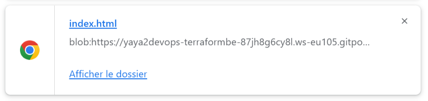
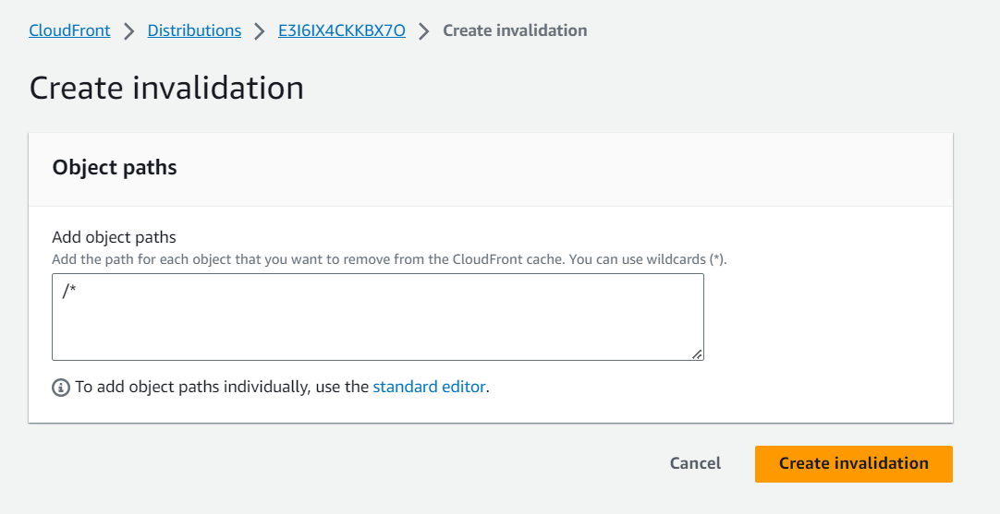
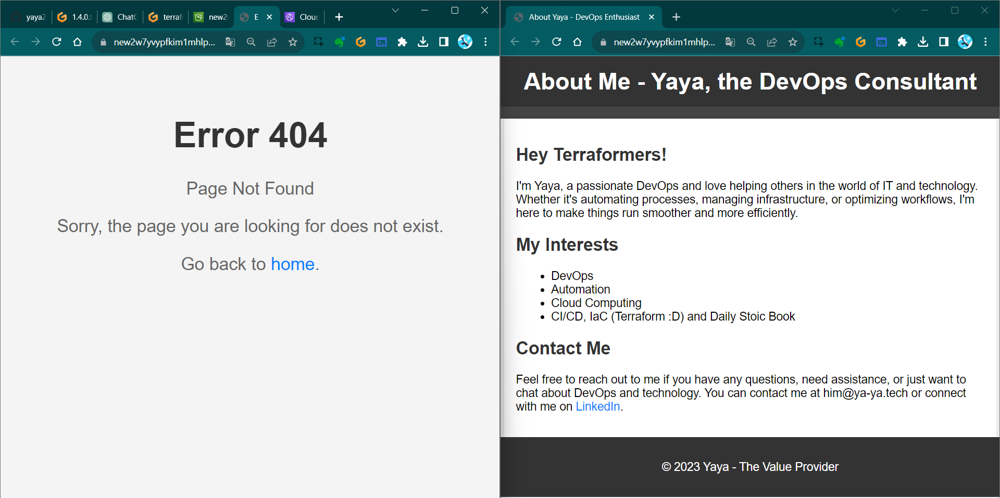
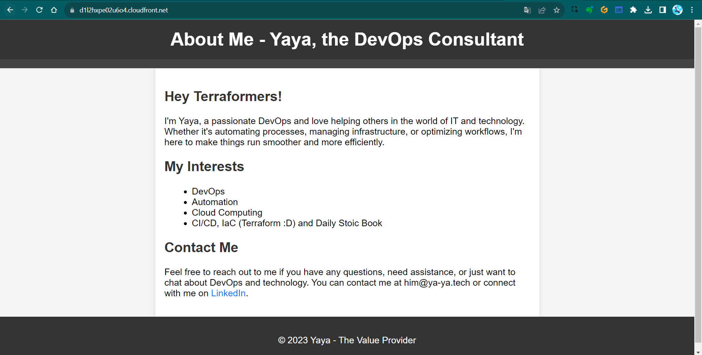

# Implementing CDN Via Code

Hello Terraformers, Here we'll be implementing a CDN to our s3 bucket website hosting using CloudFront to enhance website performance, speed and security via Terraform.

This will be next hooked up to our Terratowns.

### CloudFront As Code

1. [Ask GPT](https://chat.openai.com/share/9aff3158-acfc-49a2-b880-4a9642ac58ca); 
```
Give me aws cloudfront serving static website hosting for an s3 bucket using terraform.
```
So it is giving us something with the bucket (we did that), <br>And the policy yep good stuff.

#### Origin Configuration
- For the origin config, it is giving us origin access identity.
- New way of doing it which is origin acces control.

GPT is not aware of this, as it was introduced only last year.
- it can  indeed write much terraform.
- But it may not be accurate but junk.


### Find CloudFront In Registry

1. Go to the Terraform Registry 
2. Go to providers and click AWS
3. top right click documentation
4. In search find the AWS CloudFront Distribution 
5. search the resource: `aws_cloudfront_distribution`.

We also see data block, we may [proceed to that]() later.

6. From the resource take [the block from there](https://registry.terraform.io/providers/hashicorp/aws/latest/docs/resources/cloudfront_distribution#example-usage) instead of GPT.

We have an example of an S3 origin configuration for CloudFront. <br>It looks to be well-structured. 


## Resource Structuring
We thought to start with the resources to ensure they are grouped together alphabetically for your cute eyes.

1. Create `resource-cdn.tf`.
2. Create `resource-storage.tf`.
3. Bring all storage components and paste them into `resources-storage.tf`.
```hcl
resource "aws_s3_bucket" "website_bucket" {
  # etc
}

resource "aws_s3_bucket_website_configuration" "website_configuration" {
    # etc
}

resource "aws_s3_object" "index_html" {
    # etc
}

resource "aws_s3_object" "error_html" {
    # etc
}

```
4. Grab the relevant code [from the registry](#find-cloudfront-in-registry) for `res-cdn.tf`, but not all of it.
5. Remove the alias for custom domain.
```hcl
  aliases = ["mysite.example.com", "yoursite.example.com"]
```
6. Exclude query string passing is ok
```
      query_string = false
```
7. Eliminate cookie passing.
```hcl
      cookies {
        forward = "none"
      }
    }
```
8. Retain the "allow all" policy.
```hcl
    viewer_protocol_policy = "allow-all"
    min_ttl                = 0
    default_ttl            = 3600
    max_ttl                = 86400
  }
```
9. Modify caching behavior to keep only the default settings.
```
  default_cache_behavior {
    allowed_methods  = ["DELETE", "GET", "HEAD", "OPTIONS", "PATCH", "POST", "PUT"]
    cached_methods   = ["GET", "HEAD"]
    target_origin_id = local.s3_origin_id }
```
Meaning, remove both `ordered_cache_behavior`.

10. Specify optional geographical restrictions - Change the type to "none" and remove.
```hcl
  restrictions {
    geo_restriction {
      restriction_type = "none"
      locations        = []
    }
  }
```
> We could specify for specific countries.
11. Tag resources with a UUID, as done previously.
```hcl
  tags = {
    UserUuid = var.user_uuid
  }
```
12. Specify HTTPS certification for free. 
```hcl
  viewer_certificate {
    cloudfront_default_certificate = true
  }
```
Note that this won't work alone because it expects configuration within the `origin{}` block.
```hcl
  origin {
    domain_name              = aws_s3_bucket.website_bucket.bucket_regional_domain_name
    origin_access_control_id = aws_cloudfront_origin_access_control.default.id
    origin_id                = local.s3_origin_id
  }
```

Lets do it.

### Specifying Required Variables `resource-cdn.tf`
We will now apply a use case for **locals.** The block serves as a method for passing local variables.

Note that these in the block from registry require definitions.  
```
access control id=origin_access_control 


origin id= local.
```
While we can pass variables as environment variables, this situation presents a good example of when to use locals.


- Define `origin_id` as "local" to pass local variables, add local block;
```hcl
local { }
```
- It is locals. just for your awarness.
```hcl
locals {
  s3_origin_id = "MyS3Origin"
}
```

### Origin Access Control Config `resource-cdn.tf`


1. Utilize the `aws_cloudfront_origin_access_control` block [from the registry](https://registry.terraform.io/providers/hashicorp/aws/latest/docs/resources/cloudfront_origin_access_control#example-usage).
```hcl
resource "aws_cloudfront_origin_access_control" "example" {
  name                              = "example"
  description                       = "Example Policy"
  origin_access_control_origin_type = "s3"
  signing_behavior                  = "always"
  signing_protocol                  = "sigv4"
}
```
2. Customize the resource name and use interpolation for the bucket name.
```hcl
  name   = "OAC ${var.bucket_name}"
```
3. Add a description.
```hcl
  description  = "Origin Access Controls for Static Website Hosting ${var.bucket_name}"
```
4. Leave network configurations they are correctly set.
```
  signing_behavior  = "always"
  signing_protocol  = "sigv4"
```
That should be set, whats left is bucket policy ony..

5. change the name of the block to `default`.

### Adding the Bucket Policy Block `resource-storage.tf`
I spent a considerable amount of time obtaining that policy.<br> Should I give it to you? 

Let's help you create it yourself.

1. Use the `aws_s3_bucket_policy` resource [from the registry](https://registry.terraform.io/providers/hashicorp/aws/latest/docs/resources/s3_bucket_policy#example-usage).

```hcl
resource "aws_s3_bucket_policy" "allow_access_from_another_account" {
  bucket = aws_s3_bucket.example.id
  policy = data.aws_iam_policy_document.allow_access_from_another_account.json
}
```
2. Customize the name to "bucket_policy".
```hcl
resource "aws_s3_bucket_policy" "bucket_policy"
```
3. Reference the S3 bucket using `website_bucket.bucket`.
```
  bucket = aws_s3_bucket.website_bucket.bucket
```
||If we have only one of something, we can just name it default. |
|---:|:---|
||We can [always revisit—step5](#origin-access-control-config-resource-cdntf) and make them all 'default' later|

Instead of this we will code our policy into it.
```
data.aws_iam_policy_document.allow_access_from_another_account.json
```
4. Define the policy as a JSON-encoded string.
```hcl
policy =jsonencode()
```
5. Go to the [cloudfront origin access control](https://aws.amazon.com/fr/blogs/networking-and-content-delivery/amazon-cloudfront-introduces-origin-access-control-oac/) and bring the policy to here:
```json
{
    "Version": "2012-10-17",
    "Statement": [
        {
            "Sid": "AllowCloudFrontServicePrincipalReadOnly",
            "Effect": "Allow",
            "Principal": {
                "Service": "cloudfront.amazonaws.com"
            },
            "Action": "s3:GetObject",
            "Resource": "arn:aws:s3:::DOC-EXAMPLE-BUCKET/*",
            "Condition": {
                "StringEquals": {
                    "AWS:SourceArn": "arn:aws:cloudfront::ACCOUNT_ID:distribution/DISTRIBUTION_ID"
                }
            }
        },
        {
            "Sid": "AllowLegacyOAIReadOnly",
            "Effect": "Allow",
            "Principal": {
                "AWS": "arn:aws:iam::cloudfront:user/CloudFront Origin Access Identity EH1HDMB1FH2TC"
            },
            "Action": "s3:GetObject",
            "Resource": "arn:aws:s3:::DOC-EXAMPLE-BUCKET/*"
        }
    ]
}
```

In order to include this we have to make some changes..
 
6. Change `:` to `=` for the lines of policy


Thats more of HCL; it serves as the foundational syntax underpinning Terraform, shaping Terraform into what it is.

7. We only require one statement; specifically, take the second block starting with 'sid'."
```hcl
        {
            "Sid" = "AllowLegacyOAIReadOnly",
            "Effect" = "Allow",
            "Principal" = {
                "AWS" = "arn:aws:iam::cloudfront:user/CloudFront Origin Access Identity EH1HDMB1FH2TC"
            },
            "Action" = "s3:GetObject",
            "Resource" = "arn:aws:s3:::DOC-EXAMPLE-BUCKET/*"
        }
    
```

In the initial statement, we are indeed interested in 'sid,' 'effect,' 'version,' 'principal,' and 'action'..

However, our target for modification is the bucket.
```
"Resource": "arn:aws:s3:::DOC-EXAMPLE-BUCKET/*"
```
8. Incorporate interpolations using `${aws_s3_bucket.website_bucket.id}`.

We have conditions that require us to narrow it down to either 'distru' or 'acc.' It's requesting an account ID.

This is an effective way to use data.

#### Data Block


1. When navigating to the AWS provider and exploring the registry, you will find a comprehensive list of data sources available.
2. In our case, we aim to utilize something for `aws_id` within the policy.
3. For this purpose, we can employ `aws_caller_identity.` 

We've previously used it to validate our account in the CLI. [Check it out](https://registry.terraform.io/providers/hashicorp/aws/latest/docs/data-sources/caller_identity#example-usage).
```hcl
data "aws_caller_identity" "current" {}

output "account_id" {
  value = data.aws_caller_identity.current.account_id
}

output "caller_arn" {
  value = data.aws_caller_identity.current.arn
}

output "caller_user" {
  value = data.aws_caller_identity.current.user_id
}
```
Consequently, we can easily retrieve the account ID.

4. Add the following to the main.tf in ur module.
```
data "aws_caller_identity" "current" {} 
```
Now, you can reference this data wherever you need it; that's all it takes.

5. We can access the value, which is `data.aws_caller_identity.account_id`.
6. In our data policy, incorporate `data.aws_caller_identity.account_id` into the interpolation.
```
"arn:aws:cloudfront::${data.aws_caller_identity.current.account_id}
```

7. Add the interpolation using ${}.
8. avigate to the CloudFront distribution registry link, find the reference, and identify the ID. 
9. Include the variable for the 'distrubution' in the interpolation as well.

```
:distribution/${aws_cloudfront_distribution.s3_distribution.id}"
```
We could have opted for using an ARN..This will do the exact job with less code..
```hcl
"AWS:SourceArn": data.aws_caller_identity.current.arn
```

But. Our preference was to utilize the data source! And learn.

10. Test `tf init` and `tfp`


**Error 1:** We mistakenly used `local` instead of `locals.`

**Error 2:** The 'id' in the bucket policy resource was placed outside the curly braces, it should be inside like this: `{.id}`.


11. Both were corrected in the instruction. I am just saying. If so, remake step 10.



It worked, but when it comes to downloading the file, it's not launching.


#### URL equals Download

The mystery lies in the fact that while we referenced the file, we didn't specify its file type to Terraform.


1. Navigate to the registry: `aws => s3_object` 
2. find the "content_type" argument reference on the right table of contents (TOC).
3. In the resource block for `"aws_s3_object" "index.html"`, include `content_type="text/html"`.
```hcl
resource "aws_s3_object" "index_html" {

  content_type = "text/html"
  }
```
4. Similarly, for `"aws_s3_object" "error.html"`, add `content_type="text/html"` as well.
```hcl
resource "aws_s3_object" "error_html" {

  content_type = "text/html"
}
```
5. tfp and tfa and check the link again.

||Still downloading the file..Why?|
|---:|:---|
||It's a CDN, and It caches values|
||To ensure it functions properly|
||You need to clear the cache|

### Clear CloudFront Cache
We will clear the CDN cache in AWS CloudFront by creating an invalidation.
1. Go to CloudFront.
2. Click on your distribution.
3. In the Invalidations pane, select "Create Invalidation."
4. Add the following:
```
/*
```



This will clear the cache of all items. <br>Alternatively, you can specify individual items one by one.


After it's done, double-check the URL. Still dowloading.... 


#### Troubleshooting

I have reservations about the bucket's reliability.
1. Let's remove it, as it might lead to configuration drift – that's perfectly acceptable.
2. Create a new index file and request an HTML file with a well-structured header and an appealing design from GPT.
3. Ensure that the HTML is improved and any errors are corrected.
4. Simply map out a plan and execute it to upload the files once more.
5. Now, we need to head over to CloudFront and perform another round of validation...

||It's time to streamline these processes and automate them|
|---:|:---|
||Any modifications should trigger automatic updates |
||This is something we should explore soon|

**Quick update:** We tried it from bucket—It is working;




Check the CloudFront URL => It's working perfectly now! 



We've explored various effective strategies to overcome numerous challenges. 

If you've been following along, I must commend your excellent efforts!


#### `1.5.0` Considerations

CloudFront can be quite a headache and It truly demands significant time to spin up. 
- Consider using the `retain_on_delete` flag.
- We can reference a created policy in IAM instead.

We've addressed data sources, locals and now the next step is to explore further cache invalidation streamline.


