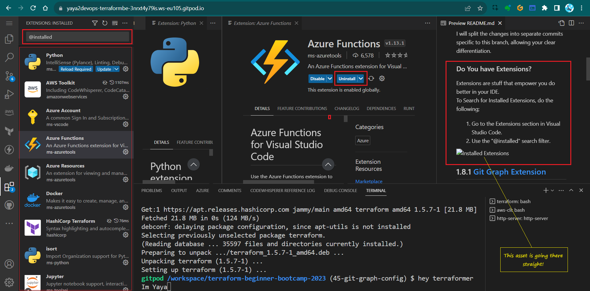
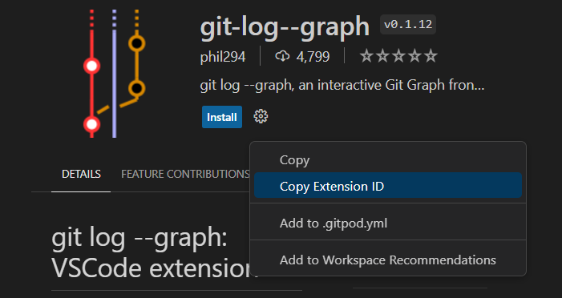
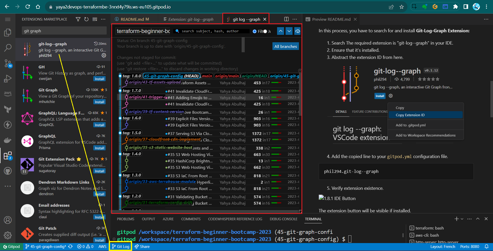
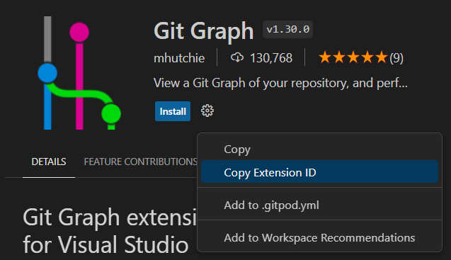
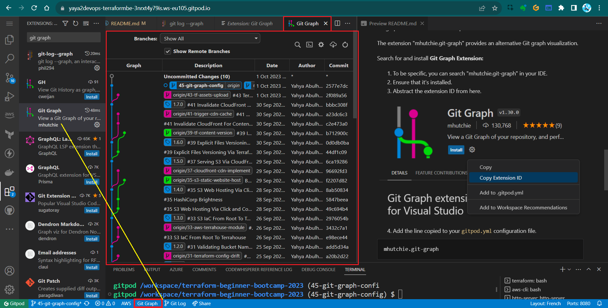

# Visuals with Git Graph
Terraformer! This is a great bonus for you to make sure you have git graph setup so you can observe everything you do with git, visualize history and address issues better.

**NOTICE:** This is primary deliverd as a two tags;
- `1.8.1` : Installing and Adding **git-log--graph** Extension to Gitpod
- `1.8.2` : Installing and Adding **mhutchie.git-graph** Extension to Gitpod

|I am merging that in `1.8.3` to maintain consistency in my project across tags, branches, and commits.|
|:---:|

I will split the changes into separate commits specific to this branch, allowing your clear differentiation.

### Do You have Extensions?
Extensions are stuff that empower you do better in your IDE.<br>
To Search for Installed Extensions, do the following;
1. Go to the Extensions section in Visual Studio Code.
2. Use the `@installed` search filter.



## `1.8.1` Git Graph [Extension¹](https://marketplace.visualstudio.com/items?itemName=phil294.git-log--graph)
The objective is to address the Git graph issue by adding the Git Graph extension.

In this process, you have to search for and install **Git-Log-Graph Extension:**
1. Search The required extension is "git-log--graph" in your IDE.
2. Ensure that it's installed.
3. Abstract the extension ID from here.



4. Add the copied line to your `gitpod.yml` configuration file.
```
phil294.git-log--graph
```
5. Verify extension existence.



The extension button will be visible if installed.

**`1.8.1`:**<br>
The tag is converted as a branch commit as explained above.<br>
**Related Commit:** Install and Add git-log--graph to Gitpod task file.

## `1.8.2` Git Graph [Extension²](https://marketplace.visualstudio.com/items?itemName=mhutchie.git-graph)

We will Add the Git Graph (mhutchie.git-graph) extension to Gitpod to address the Git graph issue to enhance our experience.

The extension "mhutchie.git-graph" provides an alternative Git graph visualization.

Search for and install **Git Graph Extension:**
1. To be specific, you can search "mhutchie.git-graph" in your IDE.
2. Ensure that it's installed.
3. Abstract the extension ID from here.



4. Add the line copied to your `gitpod.yml` configuration file.
```
mhutchie.git-graph
```
5. Verify extension existence.



The extension button will be visible if installed.


This workflow differs from the usual stuff I do with Git X for local development, things change man.

`1.8.2` Commit: Install and Add mhutchie.git-graph to Gitpod task file.

**`1.8.1` and `1.8.2` Relationship:**<br>
- Both are part of the same branch **git-graph-config**.
- Both are merged to single tag `1.8.3`

I used [small numbers](https://www.piliapp.com/symbol/subscript-superscript/)..Also, I made this from notes using;
- [The notes itself]()
- [A language prediction model](https://chat.openai.com/share/0f24f5d8-fa45-438a-95c1-99e6b733c03d)

You can use [my issue template](assets/1.8.3/issue-enabler.md) for your own.

> PS: GitLens is another good extension..
