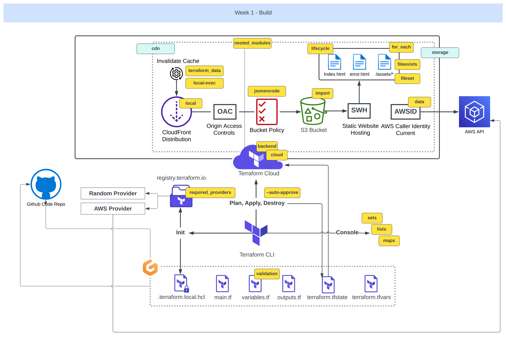
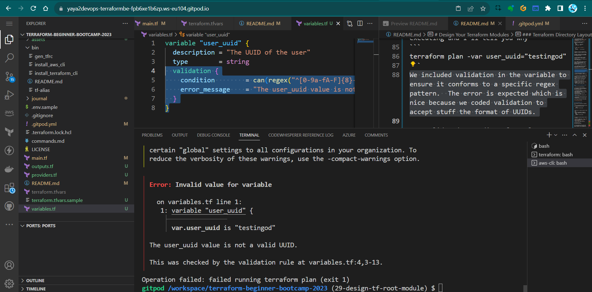
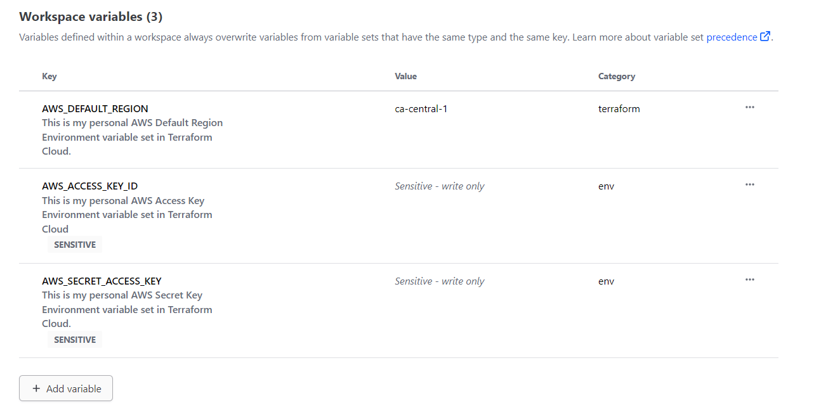
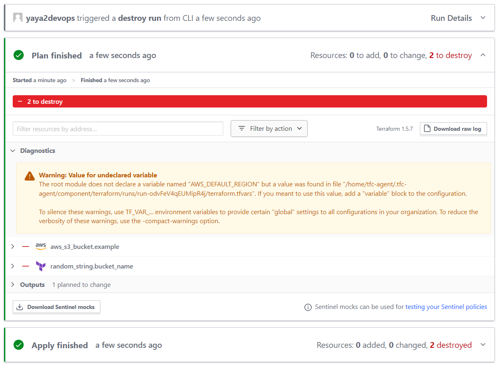
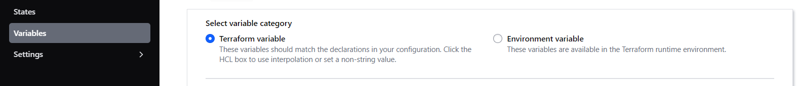

# Design Your Terraform Modules

Welcome to 1.0.0 of our week one of the bootcamp where we delve into structuring our Terraform root modules.

We've already begun with `main.tf`. we can accomplish everything within that single file. We can also call that a module.

We will go over making our own module to gain a deeper understanding of Terraform capabilities e.g;

- Organizing your Terraform configurations,
- Working with remote/local state,
- Managing Terraform variables in different ways.

Before starting, consider [learning more about the tf structure.](https://developer.hashicorp.com/terraform/language/modules/develop/structure)


The key is that when we adopt the correct approach to module design, our code will be understood at glance and we'll also promote its portability. 

Others can take that and adapt it to suit their specific requirements. <br>And this is beautiful!

### Terraform Directory Layout

1. Create the following strucutre in your project root.
```sh
🌳 Module Components:
├── 📄main.t: The Core Configuration
│   └── 📝 Contains the main configuration for your Terraform resources.
├── 📄variables.t: Input Variables
│   └── 📝 Stores definitions for input variables.
├── 📄terraform.tfvar: Variable Data
│   └── 📝 Holds data or variable values to load into your Terraform project.
├── 📄outputs.t: Storing Outputs
│   └── 📝 Defines the outputs of your Terraform module.
├── 📄 providers.tf: Provider Configuration
│   └── 📝 Contains provider configurations and settings.
└── 📄 README.md: Module Documentation
    └── 📝 Provides essential documentation and information about the module.
```

**Module Component Guidelines;**
- Recommended structure for organizing your Terraform root modules,
- Suggests moving provider blocks and outputs to dedicated files,
- Highlights the importance of README.md for clear documentation.

|💭|Differing opinions may arise regarding the placement of the `tf` block for providers|
|---|---|
|💡|Some advocating for its exclusive presence in the `main.tf` file.|
|💡💡|The choice depends on your team's preferences and conventions.|

2. Please proceed with migrating the `tf` block for providers to the `providers.tf` file.
3. Let's relocate the output configurations to the `output.tf` file.
4. Bring back the tags we [took out previously.]() 

We will use it back to create an additional custom variable.
```hcl
  tags = {
    Name        = "My bucket"
    Environment = "Dev"
  }
```

5. change `Name` to `UserUuid` ;
```
  tags = {
    UserUuid     = var.user_uuid
  }
```

Although we initially considered GPT's suggestion, we prefer to have it inline.


We added a variable block for the UUID, and within this block, we incorporated the validation process.


|❌| Using Terraform Cloud, we coudnt receive a prompt for the variable.|
|---|---|
|✅|To address this, let's transition to remote configuration.|


First, comment out the cloud block and initialize the configuration. <br>
However, it appears we need to revert this migration. <br>
Nevermind, please uncomment the block.


6. Let's manually provide the variable, which should trigger an error when executing and I'll tell you why
```
terraform plan -var user_uuid="testingod"
```
We included validation in the variable to ensure it conforms to a specific regex pattern.  




The error is expected which is nice because we coded validation to accept stuff the format of UUIDs.

> A solid understanding of regular expressions is essential in this context.


|🐌 |Terraform Cloud is noticeably slower compared to local state operations!|
|---|---|
|🏃🏻|When executing a plan on a local state, the process is significantly faster.|
|💡|Let's go back to local state.|

Potential reasons of this Incl;
- We can test what happen when we lose our state 
- Opening to imports (next ver `1.1.0`)
- Dig into ways to recover state


### From Terraform Cloud Back to Local State

1. try to run a terrform destroy.

Failed because we have to configure our aws credentials in terraform cloud. We didnt said that before.

2. Go Terraform Cloud, go To variables and then add New variable
> When asked choose Environment variable and not terraform
3. Add one by one your access key, private key and region.


> Mark the first two as sensitive, the **region** is ok.

4. You can now go ahead and destroy your infrastructure.
5. Observe the runs in Terraform Cloud. 

You can check the process in real time.




### Local Migration Test

We considered the migration is possible now.

1. Try re experimenting with tags and see what happens when you use them.
```
    tags = {
    UserUuid = var.user_uuid
  }
```

2. Add this to ur bucket resource to look like;
```hcl
resource "aws_s3_bucket" "example" {
  bucket = random_string.bucket_name.result
    tags = {
    UserUuid = var.user_uuid
  }
}
```
> We came here without passing a value to it locally.

3. Be sure to remove your `lockfile` and `dotfile` to terminate any tf cloud related processes.
4. run `tf init` then `tf plan`
5. give an actual uuid to the var;
```
terraform plan -var user_uuid="uuid-format" 
```

e.g.

```
terraform plan -var user_uuid="f6d4a521-8a07-4b3f-9d73-2e817a8dcb3d" 
```

If it still doesn't work, ensure that your validation block, along with its parent variable, are not commented out.
```hcl
variable "user_uuid" {
  description = "The UUID of the user"
  type        = string
  validation {
    condition        = can(regex("^[0-9a-fA-F]{8}-[0-9a-fA-F]{4}-[1-5][0-9a-fA-F]{3}-[89abAB][0-9a-fA-F]{3}-[0-9a-fA-F]{12}$", var.user_uuid))
    error_message    = "The user_uuid value is not a valid UUID."
  }
}
```

6. It should work perfectly.

Great and cool! Lets proceed more with our var manipulation skills.

7. Go to our terraform.tfvars file and include the variable there.
user_uuid="uuid-format" (looks like toml baby)
```sh
user_uuid="f6d4a521-8a07-4b3f-9d73-2e817a8dcb3d"
```
> Looks like TOML Baby! whats that? Eeeeh [long story.]()

8. Run `tf plan` only and [it will pick](assets/1.1.0/varplan.md) it up.

When doing TF Cloud, You must configure this manually as Terraform variables . ( And not the environment variable we previously used for AWS)



9. Create an fork file of the terraform.tfvars with `.sample`extension and add the content.
```
user_uuid="f6d4a521-8a07-4b3f-9d73-2e817a8dcb3d"
```

> terraform.tfvars is ignored. Good alternative to not waste this.

10. Delete your  and try this command to see if it does the job.
```yaml
cp $PROJECT_ROOT/terraform.tfvars.example $PROJECT_ROOT/terraform.tfvars
```

11. It does, now in `gitpod.yml` add the above to the terraform block to look like:
```yaml
  - name: terraform
    before: |
     source ./bin/install_terraform_cli
     source ./bin/generate_tfrc_credentials
     source ./bin/tf_alias
     cp $PROJECT_ROOT/terraform.tfvars.example $PROJECT_ROOT/terraform.tfvars
```

This automate the process of getting that example file to a real file on gitpod launch and we are well set!

## Terraform Variables 101

I considered adding this part to showcase the different ways you can deal with vars in `tf`. 

We have already showcased some of them.

### **Variable Input via CLI and Files Flag:**

1. Create a normal variable block wherever required;

```
variable "region" 
{
  type    = string
  default = "us-west-1"
}
```

2. You can override it using this command;

```
terraform apply -var="region=new_value"
```

3. Or you can create the following json (or HCL) file call it `variables.json` e.g;

```json
{
  "region": "us-east-2",
  "instance_type": "m5.large"
}
```

4. Overide it using that command but with passing the file flag.
```sh
tf apply -var-file=variables.json
```

Terraform will use the values specified in the variables.json file to override the defaults defined in your example.tf configuration. 

### **Variable Files** (.auto.tfvars and .auto.tfvars.json)

This is cool because it helps terraform knows where to go find vars first.
- If you have a configuration named yaya.tf
- Terraform will automatically look for a file named yaya.auto.tfvars or yaya.auto.tfvars.json and load variable values from there. 


- `*.auto.tfvars`  is a plain text file where you can set variables like key-value pairs e.g.
```
example_var = "new_value"
```

- `*.auto.tfvars.json` is a JSON file where you can define variables and their values. For example:
```json
{
  "example_var": "new_value"
}
```

Also `*.auto.tfvars.json` and `terraform.tfvars.json` are almost the same. Just think about it as a way to design you infrastructure with namings.


#### Great and cool! My takeaways are;
- You can create as many TF files as needed; they will all be combined.
- To pass an environment variable, use tf var.
- For overrides or new variable settings, employ the var flag.
- In TF Cloud, you can configure both environment variables and TF variables.
- Demonstrates how to define and use custom variables.
- Promotes inline variable usage for improved readability.
- Shows how to include variable validation within var blocks and regex is cool to know.

Also since our plan worked, `tf apply` changes locally and lose your state to see if we are able to recover it next.

See you in  `1.2.0` the config drift.