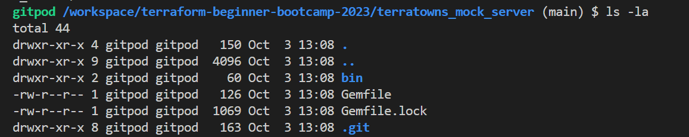
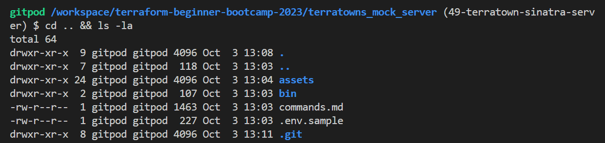
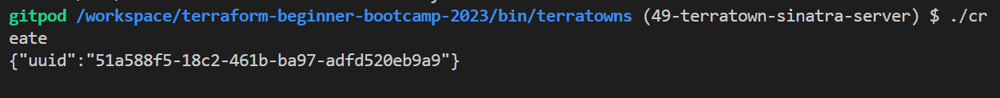
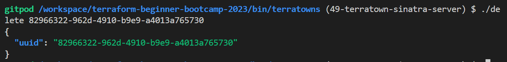

# Create A `2.0.0` Ruby Server
In version `2.0.0` of our project, the primary focus is on integrating the Terratown mock server into our repository. 

- [Sinatra In Gitpod](#adjust-gitpod-yaml-configuration)
- [Code Sinatra Server](#🎩-understanding-sinatra)
- [Bash Script for CRUDs](#bash-script-for-cruds)
- [Final Server Testing](#relaunch-the-server)

There are many ways for embedding the mock server:

**A way can be;**
|🤔|We can include it as a submodule|
|---:|:---|
|🐛|Challenging to manage when issues arise|

**Another way may be;**
|🤔|Git checkout and refrain from committing |
|---:|:---|
|🐛|limiting when it comes to making on-the-fly changes|

We are going with **the first.**

### Bringing Terratown Mock Server into Our Repository

1. git clone the `terratowns_mock_server` repository to our project.
```sh
git clone https://github.com/ExamProCo/terratowns_mock_server.git
```
2. cd to `terratowns_mock_server` and verify the `.git` existence.



3. Remove the `.git` directory from the cloned repository.
```
rm -rf .git
```
4. Verify the contents is gone using `ls -la`.
5. Go a level back and verify your very critical .git folder for the entire project.
```
cd .. && ls -la
```



Good. Take care..

###  Adjust Gitpod YAML Configuration
The Gitpod in that cloned project won't work because Gitpod operates only on the root level.
1. Move the Gitpod configuration from the cloned repository to the root level of our project.
```yaml
  - name: sinatra
    init: | 
      bundle install
      bundle exec ruby server.rb 
```
Include it in the `terraform` section.

2. Add `cd $PROJECT_ROOT` before your terraform, `aws-cli` and `http-server` section.
3. Terminate the previous Gitpod workspace because It is usless.
### Adjust the Repository Structure
1. Change the `bin` folder to `terratowns`.
2. Move scripts to our `bin` directory.
3. Perform necessary chmod operations on these files.
4. delete the older bin directory.

## 🎩 Understanding Sinatra
Sinatra is a web application framework. Visit [sinatrarb.com](http://sinatrarb.com) for more..

The `server.rb` file works with the gems listed in the `Gemfile` to make the server work.

#### Sinatra Server Master
- Learn about Active Model in Rails as an ORM.
- Explore getter and setter methods.
- Study Rails validations and their formats.


Lets start coding the server in a single file to make it easier for you.

1. **Import Required Libraries**:
   - Import the necessary libraries `pry` and `active_model`.
```rb
require 'pry'
require 'active_model'
```
2. **Create a Mock Database**:
   - Set a global variable `$home` to an empty hash. (Note: Avoid using global variables in production environments.)
```rb
$home = {}
```
3. **Define the `Home` Class**:
   - Create a Ruby class named `Home` representing a resource.
   - Include validations from `ActiveModel`, which provides validation functionality.
```rb
class Home
  include ActiveModel::Validations
end
```
4. **Define Attributes for the `Home` Class**:
   - Define virtual attributes using `attr_accessor` for `town`, `name`, `description`, `domain_name`, and `content_version`.
```rb
  attr_accessor :town, :name, :description, :domain_name, :content_version
```
5. **Apply Validations to `Home` Class Attributes**:
   - Use `validates` to specify validations for attributes:
     - `town` must be present and belong to a predefined list.
     - `name` must be present.
     - `description` must be present.
     - `domain_name` must have a specific format.
     - `content_version` must be an integer.
```rb
  validates :name, presence: true
  validates :description, presence: true
  validates :domain_name, 
    format: { with: /\.cloudfront\.net\z/, message: "domain must be from .cloudfront.net" }
  validates :content_version, numericality: { only_integer: true }
```
> Visit [terratowns.cloud](https://terratowns.cloud) and explore `cooker-coke,` the permalink for validation.

6. **Define the `TerraTownsMockServer` Class**:
   - Extend a class from Sinatra (`Sinatra::Base`) to create a web server.
```rb
class TerraTownsMockServer < Sinatra::Base
```
7. **Define Error Handling Function**:
   - Create a method `error` to handle errors by providing an error code and message.
```rb
  def error code, message
    halt code, {'Content-Type' => 'application/json'}, {err: message}.to_json
  end
  def error_json json
    halt code, {'Content-Type' => 'application/json'}, json
  end
  def ensure_correct_headings
    unless request.env["CONTENT_TYPE"] == "application/json"
      error 415, "expected Content_type header to be application/json"
    end
    unless request.env["HTTP_ACCEPT"] == "application/json"
      error 406, "expected Accept header to be application/json"
    end
  end
```
8. **Define Helper Methods**:
   - Create helper methods `x_access_code` and `x_user_uuid` to return hardcoded values.
   - Implement `find_user_by_bearer_token` to authenticate requests using bearer tokens.
```rb
  def x_access_code
    return '9b49b3fb-b8e9-483c-b703-97ba88eef8e0'
  end

  def x_user_uuid
    return 'e328f4ab-b99f-421c-84c9-4ccea042c7d1'
  end
```
Add the return otherwise it wont work. and I created for you `find_user_by_bearer_token` method responsible for authenticating requests that use Bearer token-based authentication. 

9. **Create a POST Endpoint for Creating Homes**:
   - Define a POST route `/api/u/:user_uuid/homes`.
   - Ensure correct headers and user authentication.
   - Parse the JSON request body.
   - Validate and extract attributes from the payload.
   - Create a new `Home` instance and set its attributes.
   - Check if validations pass; if not, return validation errors.
   - Generate a UUID, mock data, and return the UUID as JSON.
```rb
  # CREATE
  post '/api/u/:user_uuid/homes' do
    ensure_correct_headings()
    find_user_by_bearer_token()
    # puts will print to the terminal similar to a print or console.log
    puts "# create - POST /api/homes"

    # a begin/resurce is a try/catch, if an error occurs, result it.
    begin
      # Sinatra does not automatically part json bodys as params
      # like rails so we need to manuall parse it.
      payload = JSON.parse(request.body.read)
    rescue JSON::ParserError
      halt 422, "Malformed JSON"
    end

    # assign the payload to variables
    # to make easier to work with the code
    name = payload["name"]
    description = payload["description"]
    domain_name = payload["domain_name"]
    content_version = payload["content_version"]
    town = payload["town"]

    # printing the variables out to console to make it eaiser
    # to see or debug what we have inputed into this endpoint
    puts "name #{name}"
    puts "description #{description}"
    puts "domain_name #{domain_name}"
    puts "content_version #{content_version}"
    puts "town #{town}"

    # Create a new Home model and set to attributes
    home = Home.new
    home.town = town
    home.name = name
    home.description = description
    home.domain_name = domain_name
    home.content_version = content_version
    
    # ensure our validation checks pass otherwise
    # return the errors
    unless home.valid?
      # return the errors message back json
      error 422, home.errors.messages.to_json
    end

    # generating a uuid at random.
    uuid = SecureRandom.uuid
    puts "uuid #{uuid}"
    # will mock our data to our mock databse
    # which just a global variable
    $home = {
      uuid: uuid,
      name: name,
      town: town,
      description: description,
      domain_name: domain_name,
      content_version: content_version
    }

    # will jsut return uuid
    return { uuid: uuid }.to_json
  end
```
10. **Create a GET Endpoint for Retrieving Homes**:
    - Define a GET route `/api/u/:user_uuid/homes/:uuid`.
    - Ensure correct headers and user authentication.
    - Check if the requested UUID matches the one in the mock database.
    - Return the corresponding home data as JSON, or an error if not found.
```rb
  get '/api/u/:user_uuid/homes/:uuid' do
    ensure_correct_headings
    find_user_by_bearer_token
    puts "# read - GET /api/homes/:uuid"

    # checks for house limit

    content_type :json
    # does the uuid for the home match the one in our mock database
    if params[:uuid] == $home[:uuid]
      return $home.to_json
    else
      error 404, "failed to find home with provided uuid and bearer token"
    end
  end
```
11. **Create a PUT Endpoint for Updating Homes**:
    - Define a PUT route `/api/u/:user_uuid/homes/:uuid`.
    - Ensure correct headers and user authentication.
    - Parse the JSON request body, validate and extract attributes.
    - Find the home by UUID in the mock database and update its attributes.
    - Return a success message as JSON.
```rb
  # UPDATE
  # very similar to create action
  put '/api/u/:user_uuid/homes/:uuid' do
    ensure_correct_headings
    find_user_by_bearer_token
    puts "# update - PUT /api/homes/:uuid"
    begin
      # Parse JSON payload from the request body
      payload = JSON.parse(request.body.read)
    rescue JSON::ParserError
      halt 422, "Malformed JSON"
    end

    # Validate payload data
    name = payload["name"]
    description = payload["description"]
    content_version = payload["content_version"]

    unless params[:uuid] == $home[:uuid]
      error 404, "failed to find home with provided uuid and bearer token"
    end

    home = Home.new
    home.town = $home[:town]
    home.domain_name = $home[:domain_name]
    home.name = name
    home.description = description
    home.content_version = content_version

    unless home.valid?
      error 422, home.errors.messages.to_json
    end

    return { uuid: params[:uuid] }.to_json
  end
```
12. **Create a DELETE Endpoint for Deleting Homes**:
    - Define a DELETE route `/api/u/:user_uuid/homes/:uuid`.
    - Ensure correct headers and user authentication.
    - Find the home by UUID in the mock database and delete it.
    - Return a success message as JSON.
```rb
 # DELETE
  delete '/api/u/:user_uuid/homes/:uuid' do
    ensure_correct_headings
    find_user_by_bearer_token
    puts "# delete - DELETE /api/homes/:uuid"
    content_type :json

    if params[:uuid] != $home[:uuid]
      error 404, "failed to find home with provided uuid and bearer token"
    end

    # delete from mock database
    uuid = $home[:uuid]
    $home = {}
    { uuid: uuid }.to_json
  end
end
```
13. **Run the Server**:
    - Start the Sinatra server by calling `TerraTownsMockServer.run!`


## Bash Script for CRUDs

This originates from the LLM, which serves as the foundational source...


```
The How:
------
Write me a bash script that will send me a post request and an endpoint 
------
localhost:4567/api/u/:user_uuid/homes/ with a POST it should have a headers of content type and accept application json.
------
It should expect a bearer authorization token
------
The payload json should have the follownig fileds, name description, content_version, town, domain name.
```

### Create The Create Script
Now let's do it.
1. Before proceeding, ensure the server is stopped, as changes require a full restart.
Note: Consider adding a script for automatic server restart in the future.
2. Use 'Ctrl + C' to stop the server.
3 Write a Bash script that sends a POST request to an endpoint:
   - Endpoint: `localhost:4567/api/u/:user_uuid/homes/`
   - Headers: Content-Type and Accept should be set to "application/json."
   - Expect a Bearer Authorization Token.
   - Payload JSON fields: name, description, content_version, town, domain name.
4. Run 'bundle exec' command to get the server back
5. Run the 'terratowns/create' script to obtain the UUID for the house.
```
$ ./create
{"uuid":"51a588f5-18c2-461b-ba97-adfd520eb9a9"}
```


### Perform The Read Script

It is the exact same. To run the script.
1. Perform a read script using the UUID obtained from the create step.
2. Run the command as follows `./read <uuid>`
```json
{
  "uuid": "51a588f5-18c2-461b-ba97-adfd520eb9a9",
  "name": "New House",
  "town": "cooker-cove",
  "description": "A new house description",
  "domain_name": "3xf332sdfs.cloudfront.net",
  "content_version": 1
}
```
### Perform The Update Script

**To run the script;**
1. Perform a update script using the UUID obtained from the create step.
2. Run the command as follows `./update <uuid>`

When attempting an update. <br>
It will complain. This is our code trap.<br>
Expect an error related to domain names; this is intentional.

3. Investigate and correct the issue within the update action (line 216).
4. Add the domain name to the update action like town

The domain names and the town should only be init once.<br>

5. Run udpate again.. give same error because we have to rerun the server.
6. Do new create get new uuid, read and then update.

**Error. again?**

The issue involves a duplicated line in the domain name, but instead of rectifying it, let's consider appending the following information at the end.


We can employ `binding.pry` to pause the program's execution in ruby.

7. Create a new record to generate a fresh `UUID`, read the data, and subsequently update it.

It is currently hanging, and this is expected behavior. 

8. Now, let's switch to Sinatra where it has paused.<br>Allowing us to interact directly with the code.

> Should we refactor it?(maybe later) Lets just get the update.

### Speak to Sinatra

1. Type `home` => It is now displaying.
2. Execute `home.domain_name`.
3. Inspect the payload and observe that there is no domain present. It should not be set there.
4. Execute `$home[:domain_name]`—this seems to be the issue.
5. Realize that there is no need for `home.domain_name = domain_name`, and it's better to keep the one with `[]`.
6. Exit the current operation.

### Relaunch the server

**Server Reset and Interaction Steps**

1. Begin by restarting the server.
2. Perform the sequence of actions: create, read, and update. 
> Great, everything's in order now! Proceed to Sinatra and carefully observe all the steps.

| In sinatra review the 'read' operation|
|---|
|Focus on the new house description|
|You can delete it now|

3. Append the UUID at the end, around line 240. (Note: This is not a code trap but a necessary fix.)
4. Execute the 'delete' operation, and you'll see it tell you about the UUID.
```json
{
  "err": "failed to find home with provided uuid and bearer token"
}
```

6. Do new create to get new uuid, 
```json
{"uuid":"82966322-962d-4910-b9e9-a4013a765730"}
```

7. Do the read script
```json
{
  "uuid": "82966322-962d-4910-b9e9-a4013a765730",
  "name": "New House",
  "town": "cooker-cove",
  "description": "A new house description",
  "domain_name": "3xf332sdfs.cloudfront.net",
  "content_version": 1
}
```
8. Do the Update;
```json
{"uuid":"82966322-962d-4910-b9e9-a4013a765730"}
```

9. And end it with Delete;



Our CRUDs are well set.

**Note:** These are all similar scripts, with slight variations such as one for POST, one for GET, and so on.

#### Code Considerations
- Create, read, update, and delete scripts have been provided.
- Ensure that they return the expected results.
- Has noticed another code trap that has gone unnoticed? (there is) 
- Are there any thoughts on refactoring the code?

At this point our server is well set!<br>
Once all previous steps are completed successfully, We are ready to build the custom provider.