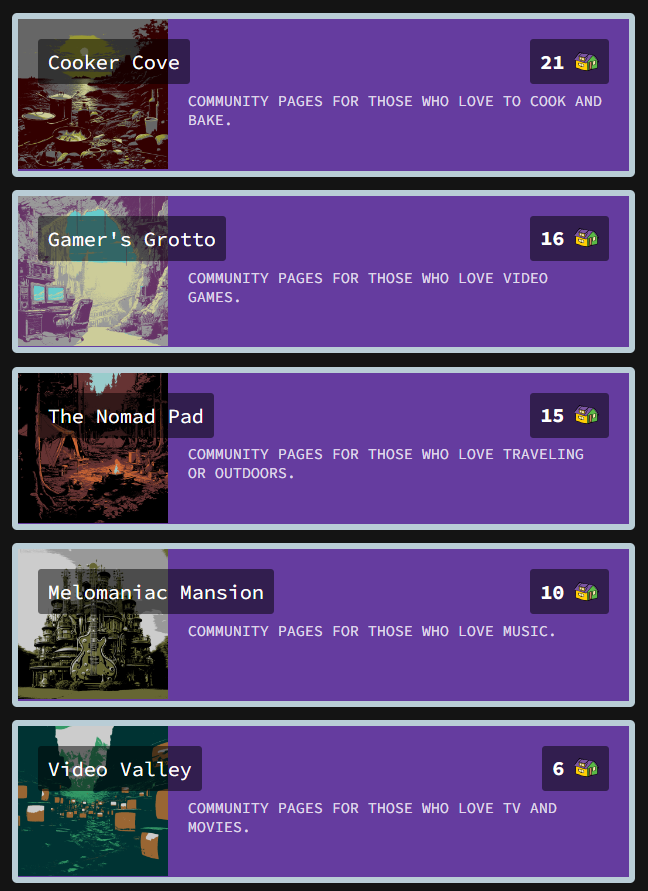
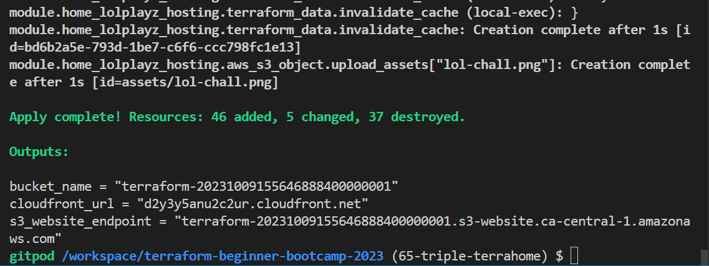
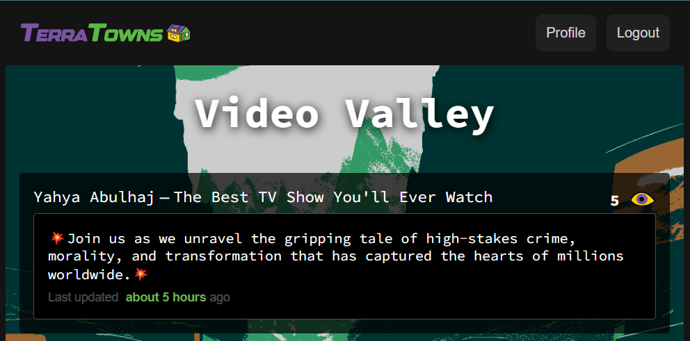
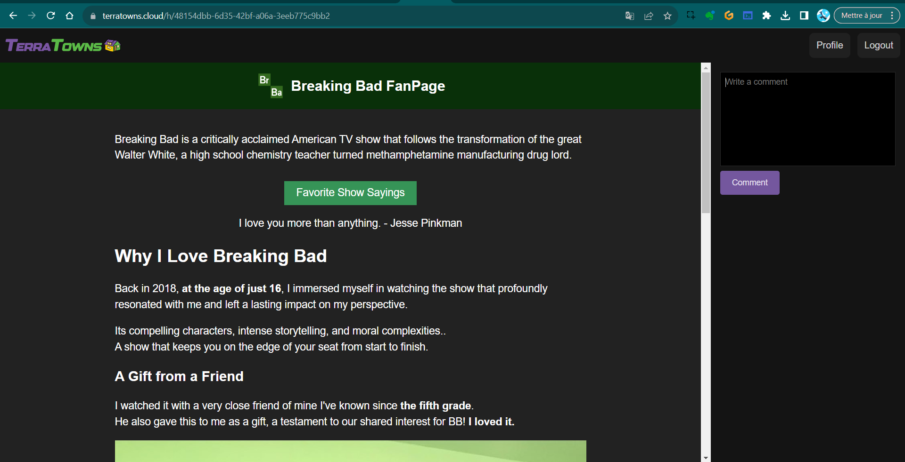
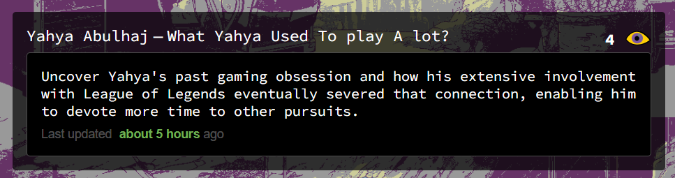
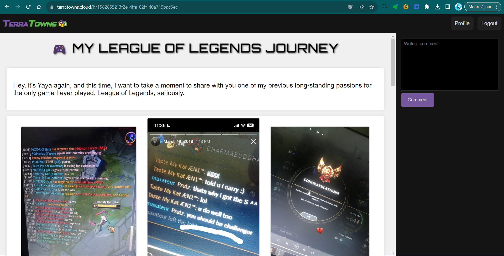
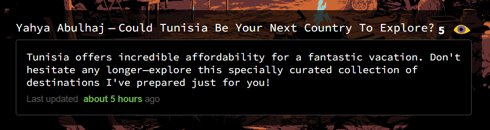
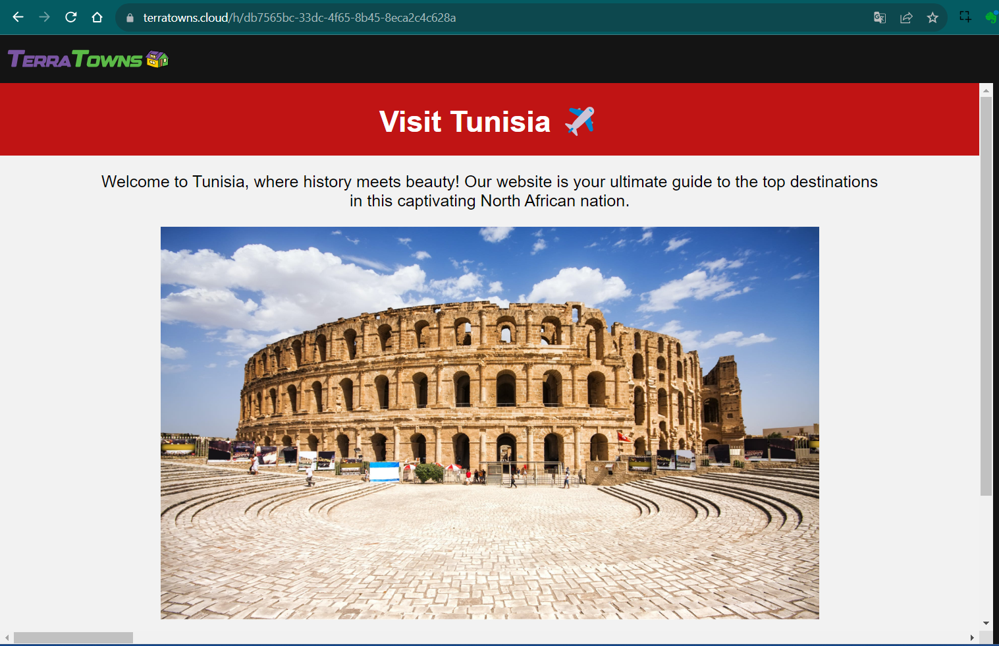

# 🏙️ TerraTowns Potential Unlocked

In the earlier release tagged as `2.7.0`, originally conceived as `2.6.0`, I decided to refine the curriculum for your benefit and your understanding.


- `2.6.0` — [Work with terraform cloud and local execution.](https://github.com/yaya2devops/terraform-beginner-bootcamp-2023/tree/2.6.0)
- `2.7.0` — [Create Two TerraHomes and adhrere to the House Theme.](https://github.com/yaya2devops/terraform-beginner-bootcamp-2023/tree/2.7.0)
- `2.7.1` — [Create Three More Homes and Target All TerraTowns.](#terrahome-coding-a-new-home)



Today, our aim is to address the remaining three endpoints, unlocking the full potential of Terratown.

We end up with a total of six projects nested within our `/public` repository.

- [TerraHomes Delivery](#terrahomes-delivery)
    
This Incl. 1 **Mixer** town for testing in Missingo.

```
📁./Terraformer
  |─ 🏠 favshow
  |   └─ 📂 assets
  |   |   └─ 🖼️ 26-july-2018-bb-ban.png
  |   |   └─ 🖼️ august-18-2018.jpeg
  |   |   └─ 🖼️ bb-26-july-2018.png
  |   |   └─ 🖼️ br-ba-logo.png
  |   └─ 📄 error.html
  |   └─ 📄 index.html
  |─ 🏠 lolplayz
  |   └─ 📂 assets
  |   |   └─ 🖼️ 2019-got-serious-to-college.jpeg
  |   |   └─ 🖼️ favi.png
  |   |   └─ 🖼️ gamer-ERR.png
  |   |   └─ 🖼️ gamer-proof.jpeg
  |   |   └─ 🖼️ gamer-webpage-somejs.png
  |   |   └─ 🖼️ gold-lol-18-aug-2018.jpeg
  |   |   └─ 🖼️ lol-chall.jpeg
  |   |   └─ 🖼️ old-time.jpeg
  |   └─ 📄 error.html
  |   └─ 📄 index.html
  |─ 🏠 mixer
  |   └─ 📂 assets
  |   |   └─ 🖼️ elizabeth-7-deadly-sins.png
  |   |   └─ 🖼️ goku.jpg
  |   └─ 📄 error.html
  |   └─ 📄 index.html
  |   └─ 📄 oldindex.html
  |─ 🏠 tnfood
  |   └─ 📂 assets
  |   |   └─ 🖼️ bambalouni.jpg
  |   |   └─ 🖼️ couscous.jpg
  |   |   └─ 🖼️ food-error-page.png
  |   |   └─ 🖼️ food-terrahome.png
  |   |   └─ 🖼️ lablebi.jpg
  |   |   └─ 🖼️ LA-MLOUKHIA.png
  |   |   └─ 🖼️ makroud.jpg
  |   |   └─ 🖼️ slata-mechouia.jpg
  |   |   └─ 🖼️ tunisian-food-masfouf.jpg
  |   └─ 📄 error.html
  |   └─ 📄 index.html
  |─ 🏠 tnrap
  |   └─ 📂 assets
  |   |   └─ 🖼️ loading-lazy.png
  |   |   └─ 🖼️ music-terratown.png
  |   |   └─ 🖼️ tn-music-errored.png
  |   └─ 📄 error.html
  |   └─ 📄 index.html
  └─ 🏠 travlz
      └─ 📂 assets
      |   └─ 🖼️ el-jem.jpg
      |   └─ 🖼️ medina.jpg
      |   └─ 🖼️ moss.jpg
      |   └─ 🖼️ musee-bardo.JPG
      |   └─ 🖼️ sidi.jpg
      |   └─ 🖼️ sousse-ribat.JPG
      |   └─ 🖼️ tn.png
      |   └─ 🖼️ travel-err.png
      |   └─ 🖼️ travel-page.png
      |   └─ 🖼️ tunis.jpg
      |   └─ 🖼️ zitounaaa.jpg
      └─ 📄 error.html
      └─ 📄 index.html
```

I ensured that these homes reflect my personality, allowing me to reveal more about who I am as a great person.

### TerraHome: Coding a New Home
In the following section, we will cover the steps necessary for you to add a new home.

Although we've already covered this process in the previous version 2.7.0, we will do it again to assure we know what we are doing.

| Instructions assume that you have configured your variables at the module level| [Here](https://github.com/yaya2devops/terraform-beginner-bootcamp-2023/tree/2.7.0) |
|---:|:---:|

1. Create a new **TerraHome** in the `public` directory.

I can't instruct you further what you are allowed to create inside. <br>I end up following the rules creating html files and assets. <br> Feel free to break them please.<br>Do more.


When your projects are in place. Follow this configuration as code.

2. Create a module in your main.tf with the home name e.g.

```hcl
module "home_change-this_hosting" {}
```

3. Go define your Home variables in `variables.tf` for the new home.
```hcl
variable "change-this"

{
      type = object

      (
        {
            public_path = string

            content_version = number
        }          
      )
}
```
4. Set the actual content of your new home variables in your `terraform.tfvars`
```hcl
change-this = {

  public_path = "/workspace/terraform-beginner-bootcamp-2023/public/change-this"

  content_version = 1 
}
```
5. Go back to your module in `main.tf` and configure your `public_path` and `content_version` with these variables.

```hcl
module "home_change-this_hosting" {
  source = "./modules/terrahome_aws"
  user_uuid = var.teacherseat_user_uuid
  public_path = var.change-this.public_path
  content_version = var.change-this.content_version
}
```

5. To make sure your new home variables are safe, copy the content from your `terraform.tfvars` to `terraform.tfvars.sample`

> Remmber we have a [cp command](https://github.com/yaya2devops/terraform-beginner-bootcamp-2023/blob/2.7.0/.gitpod.yml#L10C1-L10C1) to get that content.


That it with the configuration. 

More homes? [Read this](#terrahome-coding-a-new-home) again.


### TerraHomes Delivery

Terraform configured? Project Files correctly tested? Ready to launch.

1. Run the `build_provider` script to get the binairy.
2. Make sure you sinatra server is running, if not run
```
bundle install
bundle exec ruby server.rb 
```
3. Terraform init and make sure you are authenticated to terraform cloud, if not run and get that token.
```
terraform login
```

4. `terraform plan` to see the great stuff coming in.
5. `terraform apply -lock=false` in cases your state is locked in tf cloud.



- The existing homes will be updated if any updates are available. 
- The new homes can be added with that single command.
- The hard part is always building the infra like a symphony.


## TerraTowns Deliverables

As I mentioned before, I designed TerraHomes for every town. This section serves as a showcase of the most recent three additions.


→ To [learn more about the methodology.](https://github.com/yaya2devops/terraform-beginner-bootcamp-2023/issues/65)


### Breaking Bad FanPage

This page is my way of expressing my admiration for the TV show. I've incorporated a quote generator and included assets that hold sentimental value from a dear friend.


The post Title and description specified;
```hcl
name = "The Best TV Show You'll Ever Watch"

description = <<DESCRIPTION
💥Join us as we unravel the gripping tale of high-stakes crime, morality, and transformation that has captured the hearts of millions worldwide.💥
DESCRIPTION
```


### TerraTown Post Show Up



### The Project TerraHome
|[Internal URL](https://terratowns.cloud/h/48154dbb-6d35-42bf-a06a-3eeb775c9bb2)|[CloudFront URL](https://ds3mmnyp4l57k.cloudfront.net/)|
|--|--|




### Past Gaming Passion
This project is a highlight to what I used to play a lot in the past. It gives some insights to why I am good in english? And why I find mysef a master in the cloud?

The post Title and description specified;
```hcl
name = "What Yahya Used To play A lot?"

description = <<DESCRIPTION
Uncover Yahya's past gaming obsession and how his extensive involvement with League of Legends eventually severed that connection, enabling him to devote more time to other pursuits.
DESCRIPTION
```


### TerraTown Post Show Up




### The Project TerraHome

|[Internal URL](https://terratowns.cloud/h/15828552-3f2e-4ffa-82ff-40a719bac5ec)|[CloudFront URL](https://d3fozmkbn0u7h4.cloudfront.net/)|
|--|--|




### Visit Tunisia
Our economy is a bit messed up but we have great places.

I think a smart person can visit have lots of fun with dead cheap money and go back happy.


The post Title and description specified;
```hcl
name = "The Best TV Show You'll Ever Watch"

description = <<DESCRIPTION
💥Join us as we unravel the gripping tale of high-stakes crime, morality, and transformation that has captured the hearts of millions worldwide.💥
DESCRIPTION
}
```


### TerraTown Post Show Up




### The Project TerraHome
|[Internal URL](https://terratowns.cloud/h/db7565bc-33dc-4f65-8b45-8eca2c4c628a)|[CloudFront URL](https://d1z96397cxwgol.cloudfront.net/)|
|--|--|




### Considerations

**Unsupported Image Format (JPEG):** <br>
Corrected the issue where JPEG images were not supported.<br>
**Image Format Conversion (JPEG to PNG):** <br>
Converted the existing JPEG images to PNG format to ensure compatibility with the project.<br>
**File Extension Renaming (JPG to jpg):** <br>
Modified file extensions from "JPG" to "jpg" for consistent and standardized naming.<br>
**User Interface and Slider Enhancements:** <br>
Made necessary fixes and improvements to the user interface and slider functionality to enhance the project's overall usability and appearance.


---

In case you weren't aware, all the strategies I used have been revealed.<br> 
My relentless pursuit is your advantage.

- [Chats Got TerraHomes Done](assets/2.7.1/connect.md)
- [Tree and Beautify](public/yayauptree.md)

There is no personal draft notes this time. Because there was none. <br>I freestyled my mind in this.

> Creativity knows no bounds, and in the absence of drafts, the untamed mind finds its truest expression.
