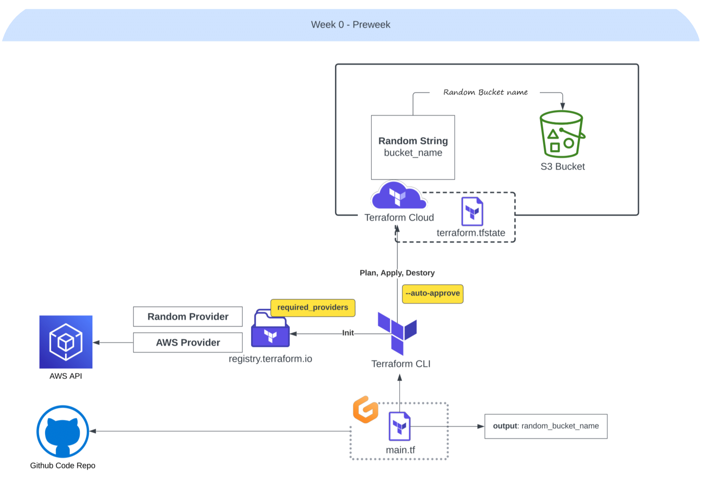

# The Terraform Beginner Bootcamp

Welcome to space, and I genuinely hope you discover something of value here—no doubt.

To make the most of the following architecture, I strongly encourage you to follow the designated numerical branching in [the given order](w0-branches.png). 



> Starting with this one!

### Week Minus One and Paving the Way

It's essential to note that the bootcamp did not start at this stage. <br>
```
📂 terraform-beginner-bootcamp-2023
  ├─ 📂 introduction
  ├─ 📂 week0-bprep
  ├─ 📂 week0-pprew
  ├─ 📂 week1-building
  ├─ 📂 week2-connecting
  ├─ 📂 week3-catchup
  └─ 📂 week4-the-end
```
We had a preceding phase known as the "Bootcamp Prep Week" prior to Week 0. 

Tasks like signing in or up for multiple platforms and becoming familiar with basic capabilities;

1. **Understanding the Role**: Clarified the expectations and responsibilities of a Cloud Engineer for the upcoming project.
2. **Template Adoption**: Implemented the ExamPro initial template for project.
3. **Access to Discord**: Successfully gained access to the Discord communication platform.
4. **Effective Questioning Skills**: Learned and aAcquired the skill of asking pertinent questions.
5. **Markdown Mastery**: Demonstrated more proficiency in Markdown for creating well-structured developer content.
6. **Git and GitHub Proficiency**: Strengthened knowledge and skills in Git and GitHub, essential for version control and collaborative coding.
7. **Git Graph Use**: Used Git Graph for visualizing and managing the project when branching, and tagging.
8. **Terraform Cloud Familiarity**: Initiated the journey with Terraform Cloud for our IaC.
9. **Jumpad Registration**: Signed up for Jumpad, the local alternative for Gitpod, codespaces or any.


## Week Zero Is The Way — [SemVer](https://semver.org/)

Week zero kicked off with a focus on more on branching, ticket management, and tagging, all in alignment with semantic versioning.


Semantic Versioning is a scheme for software that helps developers convey meaningful information about the changes in their code lets say e.g.

| Version      | Meaning                                           |
|--------------|---------------------------------------------------|
| 1.0.0        | Initial release                                  |
| 1.1.0        | Added new features, backward-compatible         |
| 1.1.1        | Bug fix, backward-compatible                    |
| 2.0.0        | Incompatible changes, significant upgrade       |
| 2.0.1        | Bug fix, backward-compatible                    |
| 2.1.0        | Added new features, backward-compatible         |
| 3.0.0-alpha.1 | Pre-release version, not stable for production  |
| 3.0.0-beta.1  | Pre-release version, for testing and feedback  |
| 3.0.0        | Stable release, backward-compatible             |

To implement SemVer properly in Git, you should follow these guidelines:

0. Set Up a Repository: If you don't already have a Git repository for your project, create one by initing the .git dir
```sh
git init
```

1. **Define Your Version Number**: Start by defining your initial version number. SemVer follows the format `MAJOR.MINOR.PATCH`, where:

   - `MAJOR` is incremented for significant, backward-incompatible changes.
   - `MINOR` is incremented for backward-compatible new features or improvements.
   - `PATCH` is incremented for backward-compatible bug fixes.

For example, if your project is at version 1.0.0, you might start with:
```sh
git tag 1.0.0
```
2. **Commit Your Changes**: Commit your changes as usual. Make sure that each commit message is descriptive and follows a conventional format, which includes a summary and, if needed, a detailed description.
```sh
git commit -m "feat: Add new feature X"
git commit -m "fix: Fix issue Y"
git commit -m "chore: Update dependencies"
```
3. **Bump Version Numbers**: When you're ready to release a new version, update the version number accordingly in your project. For example, if you're releasing a minor version, update the `MINOR` number:
```sh
git tag 1.1.0
```
4. **Write a Changelog**: Create a changelog that details the changes in this release, including new features, bug fixes, and any other noteworthy items. This helps users understand what has changed between versions.

5. **Push to Git**: Push your changes and tags to your Git repository:
```sh
git push origin master --tags
```
6. **Release Workflow**: You can implement a release workflow that automates the process of updating the version number and creating a changelog. Various tools and scripts are available to help with this, such as standard-version, semantic-release, or your custom scripts.

**standard-version:** A popular tool for automating versioning and changelog generation. You can install it via npm:
```sh
npm install -g standard-version
```
Then, you can run it after your changes are ready for release:

```sh
standard-version
```

**semantic-release:** A more comprehensive tool that automates the entire release process, including versioning, changelog generation, and publishing to package registries.

7. **Publish Your Release**: If your project is a library or package, you may want to publish it to a package registry like npm, PyPI, or others. 

If your code is already on GitHub, simply push it to your remote.
```
git push --tags
```

This was 0.1.0 where I show you how to adhere to the SemVer principles.

**Conluding SemVer;**
- Ensures that your version numbers convey meaningful information about your software's changes and compatibility.
- Facilitates collaboration among team by providing a standardized versioning approach.

Also great bootcampers have devised the following to exhibit our project's workflow.

- [A visual content](https://cdn.discordapp.com/attachments/1138488134003335199/1154906046184292373/Black_and_Neon_Blue_Gradient_Futuristic_Cyber_Monday_Sale_Poster_1920_645_px_Desktop_Wallpaper.png) 
- [An instructional Content](https://cdn.discordapp.com/attachments/1138488134003335199/1155139598498939001/Screenshot_2023-09-22_205956.png) 


Semantic Versioning helps you and your friends understand the impact of updates at a glance. 

| DEVELOPERS!| You  are encouraged to follow SemVer to provide a consistent and reliable experience! |
|---|---|
