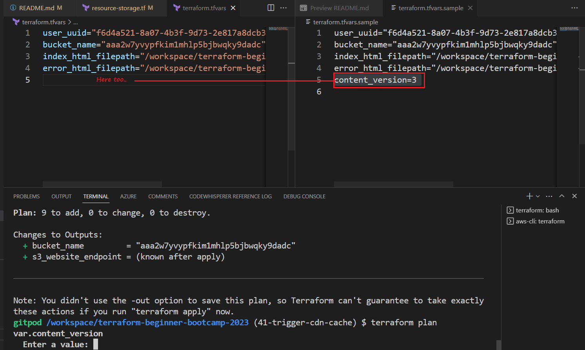
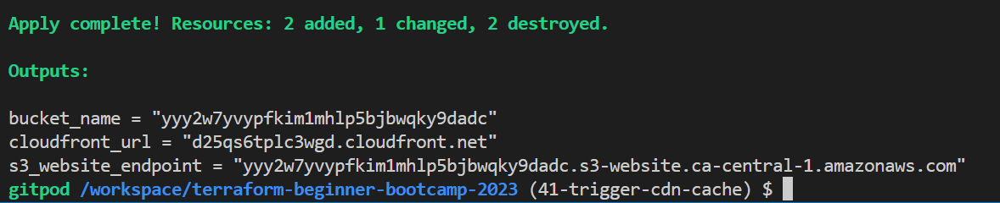
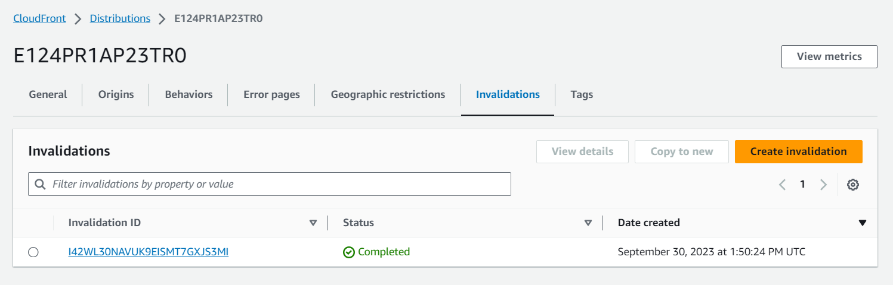

# Invalidate CloudFront Distribution

Welcome to the  process of invalidating cache using Terraform, with a focus on local execution. 

But wait, with the latest Terraform version, cache invalidation seems elusive, right? Fear not, for we're about to unveil the solution.

We will use Terraform data blocks and null resources to achieve this task.

#### GPT  Mhh

Lets get something out of GPT.
```
Hey invalidate cloudfront distrubution using Terraform 
```

This is using the null resource which is pretty good. <br>This is actually the way we do it.


|💫|Null resource served its purpose in the past|
|---:|:---|
|💡|But now,|
|🆕|The torch has been passed to data |


### Background and Context
Invalidate cache is a critical operation in managing our CDN. 

We aim to automate cache invalidation whenever our content changes, using a background CLI command if that make sense.

|🙃|Provisioners such as remote exec and local exec are discouraged |
|---:|:---|
|✅ |Other tools like Ansible are better suited for these tasks.|

Some companies are still engaged in this practice...


Terraform is primarily used for managing the state of code rather than configuration management.

We will be doing it anyway because we get to do more advanced concepts in terraform.

#### Terraform Data
Terraform data blocks are the preferred method for managing data resources in Terraform configurations. They don't require the installation of additional providers and are recommended over null resources for this purpose.


#### Local Execution with Null Resources
Local execution using null resources can be useful when you need to run commands on your local machine. In this case, we will use local execution to trigger cache invalidation.


## Implement Invalidation

We also want to activate a provisioner.<br>
The local exec command runs on the **local machine** where ur running tf.

If we use **Terraform Cloud**, the local machine should align with the computing resources provided by Terraform Cloud.

You can also use **remote exec**, which enables you to connect to a remote computer and perform **SSH** etc..

We will make it simple here with **local compute**..

1. go to `resource-cd.tf` and add the reosurce terraform_data and name it `invalidate_cache`.
```hcl
resource "terraform_data" "invalidate_cache" {}
```
2. Trigger the content versions replace:
```hcl
triggers_replace = terraform_data.content_version.output
```
3. Create provisioner block for our local exec inside the `terraform_data`.
```hcl
  provisioner "local-exec" {  }
```

4. Use a heredoc block like this to pass the command:
```hcl
provisioner "local-exec" {
command = <<EOF
# Your commands here
# E.g. our invalidate cache
EOF
}
```

You can also add whatever, the point is to end it with the same, let me clarify.

```hcl
provisioner "local-exec" {
command = <<command
# Your commands
command
}
```
5. Add inside it the required invalidation api command from aws sdk:
```sh
    command = <<COMMAND
aws cloudfront create-invalidation \
--distribution-id ${aws_cloudfront_distribution.s3_distribution.id} \
--paths '/*'
    COMMAND
```

6. Verify your provisioner block for `local_exec`;
```hcl
  provisioner "local-exec" {
    command = <<COMMAND
aws cloudfront create-invalidation \
--distribution-id ${aws_cloudfront_distribution.s3_distribution.id} \
--paths '/*'
    COMMAND  }
```
> Be aware that Provisioners are a pragmatic approach. They have the capability..


7. After coding `resrouce-cdn.tf`, run tfp

Now it's asking for the current version..? <br>Because the content_version=x wasn't configured.



To trigger cache invalidation, you must increment the content version. 

5. reset the value in your `terraform.tfvars` to `content_version=2`
6. run tfpaa this time.

Good and cool.


### Output Configuration
One thing I'm looking for here is the CloudFront distribution output.


To monitor the status of your cache invalidation.

1. add the CloudFront distribution output to your Terraform module.
```
output "cloudfront_url" {
  value = aws_cloudfront_distribution.s3_distribution.domain_name
}
```

2.  And add the definition in your root `variables.tf` root outputs.
```hcl
output "cloudfront_url" {
  description = "The CloudFront Distribution Domain Name"
  value = module.terrahouse_aws.cloudfront_url
}
```

### 7. Performing Cache Invalidation

Lets try to change something and see.

Perform the following steps to invalidate the cache:
1. Run `terraform plan` to verify your changes.
2. Run `terraform apply` to apply the changes and trigger the cache invalidation.
3. Check the output to verify the new version and CloudFront distribution information.



4. Start visiting your cloudfront distribution.


5. Visit your CloudFront invalidation and observe that you have one set as directed in the command.

[Verify The Accuracy](assets/1.7.0/invalidation-evidence.png)


The cache is applied as required.

### Reverting Changes And More..

To back clean for our next version, revert the changes by running `terraform destroy` and setting the content version back to the previous value 1.

If you followed, your process is now automating the cache invalidation process using Terraform.. Making your content delivery more efficient and reliable!

Consult some good stuff [we've done here.](https://raw.githubusercontent.com/yaya2devops/terraform-beginner-bootcamp-2023/41-trigger-cdn-cache/assets/1.7.0/good-stuff.png) <br>Also a [funny error I had.](https://raw.githubusercontent.com/yaya2devops/terraform-beginner-bootcamp-2023/41-trigger-cdn-cache/assets/1.7.0/oops-command.png)


And that's what `1.7.0` is for. The bootcamp is indeed a beginner level.
