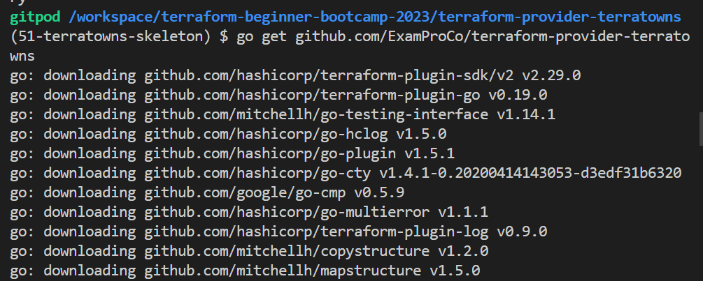
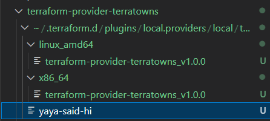

# TerraTowns Provider Skeleton 
Welcome to the quickstart of our completely custom terraform provider. <br>Typically, it's recommended to develop a custom provider in a separate repository as an independent project. 

**We'll nest it, empowered, within our project for this instance.**

+ [Create Your Custom Provider](#create-your-custom-provider)
+ [Provider Functionality](#provider-functionality)
+ [Imports In Go Lanugage](#importing-in-go)
+ [Setup Terrtowns Plugins](#plugin-setup)
+ [Complie Your Custom Provider](#complie-your-custom-provider)
+ [`mod.go` Requirement File](#-modgo--is-a-must)
+ [Build Custom Provider Skeleton](#real-build-check)

When you visit any provider on the Terraform Registry, you'll notice a consistent naming pattern.

|terraform-provider-name|
|---|

[Browse and see for yourself](https://registry.terraform.io/browse/providers?tier=community). <br>I filtered it for you on communtiy tier already. Also..
- Consult back the custom providers stuctures and code blocks.
- Hasicups is a very good project for learning Terraform.
- Community often includes individuals who start and complete their providers.

Over the past weeks, we've been actively experimenting with a variety of exciting technologies and the fun just started.

### Create Your Custom Provider
We've successfully developed our Ruby server with the assistance of Sinatra, and now, we're diving into Go to enhance our skills as we work on creating the custom provider.

1. Create a new folder and name it `terraform-provider-terratowns` at root level.
2. Inside this folder, create a file named `main.go`. (Single file for simplicity)
3. Consolidate the code into a single file for improved readability.
4. In the `main.go` file, structure the code as follows:
    ```go
    package main
    
    func main() {
        // Your code here
    }
    ```
> We always have the package main.

Use (done) GPT to generate a "Hello World" program using the Go package and print the result.

5. Now, let's create a simple "Hello World" program in Go.

```go
package main

import "fmt"

func main() {
    fmt.Println("Hello, World!")
}

```

- Unlike languages like Ruby, Go files are compiled into binaries 
- Unlike languages like Ruby Go files are not dynamically executed. 
- You compile the script, and it runs as a binary.

Go is built-in on Gitpod. 

|[Locally I installed it previously](https://blog.yahya-abulhaj.dev/the-technology-titan-go-language) and it took time for vars.|
|---|

6. Run your first Go program.
```sh
(51-terratowns-skeleton)
$ go run main.go 

$ go run main.go 
Hello, World!
```

### Provider Functionality
Our custom Terraform provider will provide CRUD operations for a resource. 

Make a Request to LLM in the meanwhile.
```
Generate code for a custom Terraform provider that includes API actions designed to interact with Terraform resources. Can you confirm, so I provide you with requirements.
---
Requirements:

We aim to perform the following actions;
1. GET /api/u/:user_uuid/home
2. POST /api/u/:user_uuid/home
3. PUT /api/u/:user_uuid/home
4. DELETE /api/u/:user_uuid/home
```

#### Importing in Go
To import multiple packages in Go, you can use the following syntax:
```go
import (
    "package1"
    "package2"
    // Add more packages here
)
```

### Plugin Setup

We'll need to set up a plugin server for our provider exactly why we coded the ruby server.
 
1. In the `main` function add our custom provider.
```go

	plugin.Serve(&plugin.ServeOpts{
		ProviderFunc: Provider,
	})
```
2. Below the `main` function, specify the provider as a function.
```go
func Provider() *schema.Provider {}
```

- A function in go is just func
- Go doesn't use classes; instead, it relies on interfaces.

We used the `developer.hashicorp.com` Terraform provider setup tutorial for this.

3. Retrieve the link from the `main.go` file and incorporate it into our schema.
4. Code the function and add the following;
```go
	var p *schema.Provider
	p = &schema.Provider{
```

4. Create the provider schema 
```go
p = &schema.Provider{}
```
5. Define the resource and data sources map inside p;
```go
		ResourcesMap:  map[string]*schema.Resource{

		},
		DataSourcesMap:  map[string]*schema.Resource{

		},
``` 
5. Include the necessary elements for the schema incl `endpoint`, `user_uuid` and `token`.
```go
		Schema: map[string]*schema.Schema{
			"endpoint": {
				Type: schema.TypeString,
				Required: true,
				Description: "The endpoint for hte external service",
			},
			"token": {
				Type: schema.TypeString,
				Sensitive: true, // make the token as sensitive to hide it the logs
				Required: true,
				Description: "Bearer token for authorization",
			},
			"user_uuid": {
				Type: schema.TypeString,
				Required: true,
				Description: "UUID for configuration",
				//ValidateFunc: validateUUID,
			},
		},
	}
```
6. Code validateFunc like a pro by adding it like this;
```go
validateFunc:= validateUUID
```
7. Request GPT to generate the code for it.
```
Can you fill the validate UUID function for me?
---
Nah.
---

Okay np.
```
8. Google provides its own library at github.com/google/uuid, which offer a solution for validation.

9. Use this [stackoverflow refernce](https://stackoverflow.com/questions/25051675/how-to-validate-uuid-v4-in-go) for more about validation.
10. Get the prompt from GPT and lets tweak it baby.
```go
func validateUUID(v interface{}, k string) (ws []string, errors []error) {
	log.Print('validateUUID:start')
	value := v.(string)
	if _,err = uuid.Parse(value); err != nil {
		errors = append(error, fmt.Errorf("invalid UUID format"))
	}
	log.Print('validateUUID:end')
}
```

Great and cool. Now we have to look how to make this run.


### Complie Your Custom Provider

To compile a custom provider, you need a `terraformrc` file.

Terraform maintains a hidden directory called `.terraform.d` with a `plugins` folder to store plugin binaries. 

Ensure that you have a local provider directory where you place the binary files generated.

1. Run the following command to build the custom provider binary:

```
go build -o terraform-provider-terratowns-v1.0.0
```

2. Test the custom provider using the `.terraformrc` file.
3. Create a `terraformrc` file at the root of your project. 

Ensure that the file name does not contain a period as it should be placed within your custom provider code. (We will use cp command.)

Inside the `terraformrc` file, add the following configuration for provider installation:
```hcl
provider_installation {
  filesystem_mirror {
    path = "/home/gitpod/.terraform.d/plugins"
    include ["local.providers/*/*"]
  } 
  direct {
   exclude = ["local.providers/*/*"] 
  }
}
```

Also..building the binary can be challenging (was really hard..)

> Thanks to Jason for [this article.](https://servian.dev/terraform-local-providers-and-registry-mirror-configuration-b963117dfffa?gi=06e845629b10)

A script-based approach is recommended:

4. Navigate to the `bin` directory.
5. Create a file named `build_provider` and add the necessary content to build the binary.
```
rm -rf ~/.terraform.d/plugins
rm -rf $PROJECT_ROOT/.terraform
rm -rf $PROJECT_ROOT/.terraform.lock.hcl
```
We started by removing previous dependencies in case.

6. Create both compute env, once for each chipset on the target compute
```sh
mkrdir -p ~/.terraform.d/plugins/local.providers/local/terratowns/1.0.0//x86_64/
mkrdir -p ~/.terraform.d/plugins/local.providers/local/terratowns/1.0.0//linux_amd64/
```

> This ensures compatibility with what yours may be using.

Now make use of environment variables in your script to simplify the build process.

7. Apply the environment variables for your plugin path.
```sh
PLUGIN_DIR="~/.terraform.d/plugins/local.providers/local/terratowns/1.0.0/"

mkrdir -p $PLUGIN_DIR/x86_64/
mkrdir -p $PLUGIN_DIR/linux_amd64/
```

8. Apply the environment variables for your plugin name and copy it.
```sh
PLUGIN_NAME="terraform-provider-terratowns_v1.0.0"

cp $PLUGIN_NAME $PLUGIN_DIR/x86_64
cp $PLUGIN_NAME $PLUGIN_DIR/linux_amd64
```

First, [Verify the script from here right away.](bin/build_provider)

Second. We can't build this yet<br>To really build the provider **we need something else.**

### `mod.go` Is A Must

You need to ensure you have a `go.mod` file. 

1. Create a file named go.mod and add the necessary content. 
2. Add  repo URL as The module and the version.
```mod
module github.com/ExamProCo/terraform-provider-terratowns

go 1.20
```
3. Important to Map the repo URL to the path of your workspace.
```sh
replace github.com/ExamProCo/terraform-provider-terratowns => /workspace/terraform-beginner-bootcamp-2023/terraform-provider-terratowns
```
4. Add an open require  for what we will need.
```
require ()
```

Now we are ready for the build and further troubleshoot.

### Real Build Check

1. Run the build script.

|You will get an error about a missing import path. |
|---|
|Correct it by ensuring proper use of parentheses in your import statements.|

> It is `()` and not `{}`

2. Build again

You are now being asked to get the github repos required.

3. Run go get to fetch any required GitHub repositories as indicated by the error message.
```
go get github-url-lib
```



This installs the latest version of the module.

4. Building again result in a new `go.sum` file. 

The go.mod file now includes more URL paths, which you didn't have to manually write.

5. Building again.. also know that the first time may be slow due to dependency downloads.

You might encounter errors during this build process number too much.. <br>
The provider schema declaration is to replace `.Resources{` with `.Schema{.`<br>
Also add the comma.. 

**This is not ruby.**

Continue building and address any unused log errors.

6. Remove or uncomment the log from the import in your `main.go`
```go
	// "log"
```

Finally, after a successful build.<br>
You will find the `terraform-provider-terratowns-v1.0.0` binary.
> This is so wrong. [You'll find out](https://github.com/yaya2devops/terraform-beginner-bootcamp-2023/tree/53-terratowns-block#connecting-dots-and-traps) next release. We had traps.



It can be quite large, so consider the following;

7. Observe the `go.sum` file and [all the dependencies here](terraform-provider-terratowns/go.sum).
8. Add your binairy to your `.gitignore`.
```sh
# Ignore Terratowns Custom Provider Binairies All versions
terraform-provider-terratowns/terraform-provider-terratowns_v*
```
This file now won't be comitted and  will be avoided by your version control!

#### Considerations
- The subsequent builds but the first should be faster.
- The binary file for your provider can be large (e.g., 20MB).
- Use `.gitignore` file to exclude it from version control.

Creating a custom Terraform provider can be a complex process<br>This starts the process of generating the actual binary which is also the Skeleton For our Terratowns!

If it is building for you, You are in a good shape for `2.2.0` !


