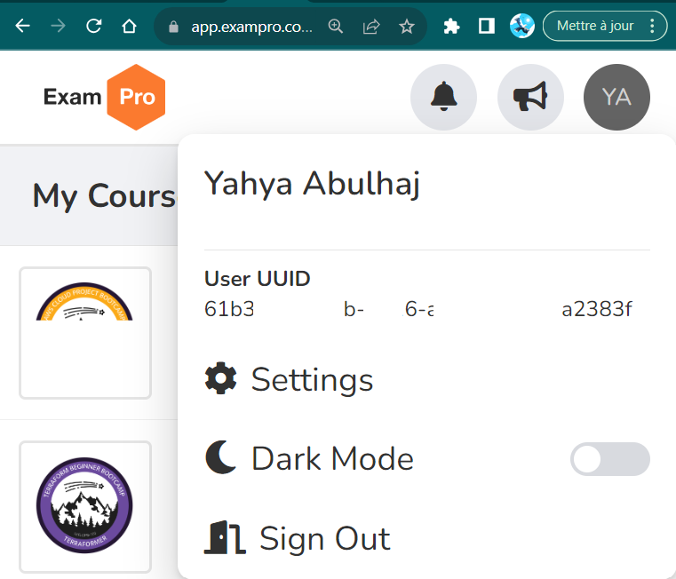
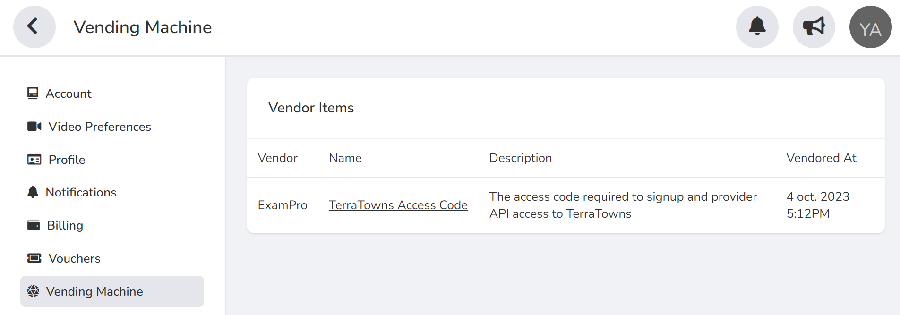
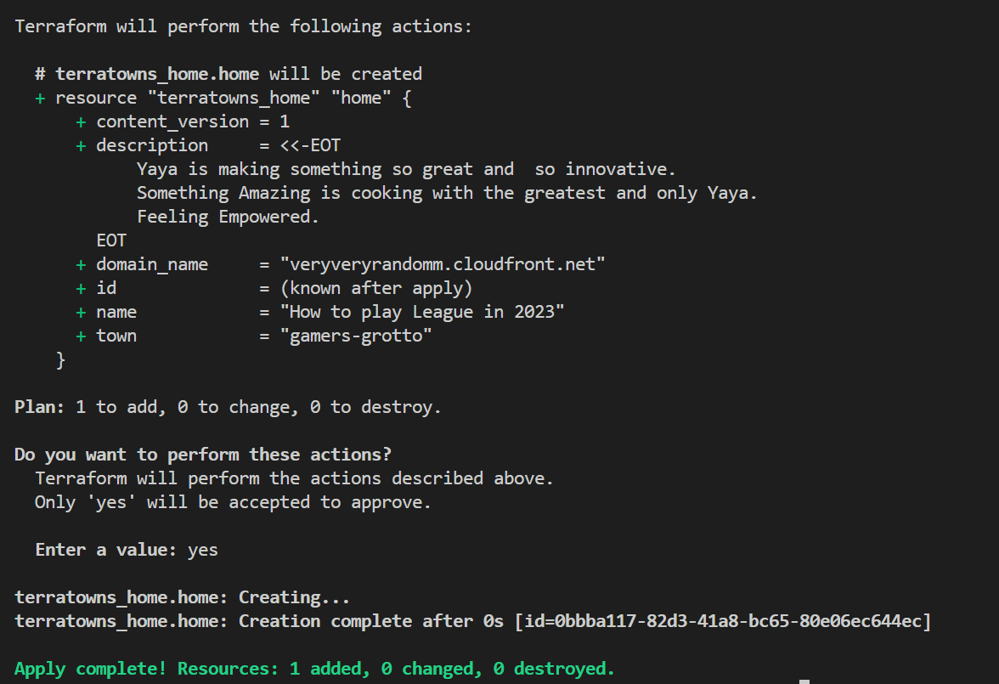
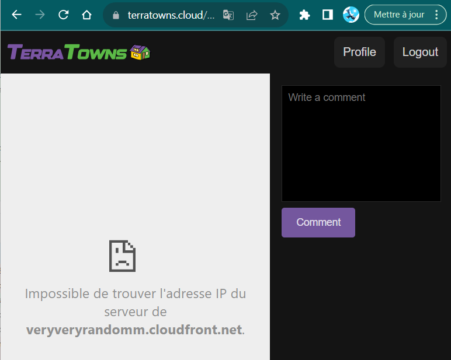
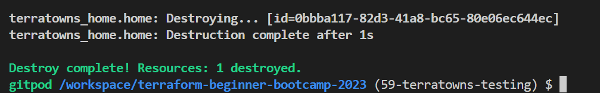
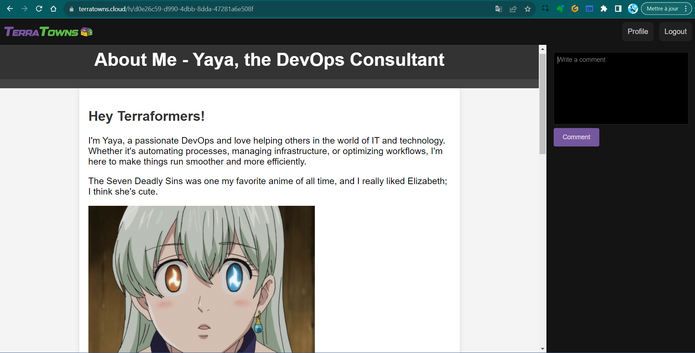
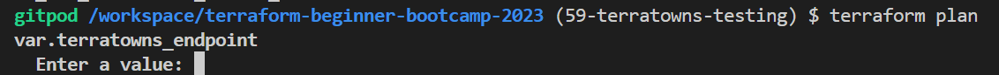
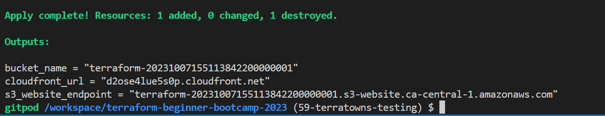
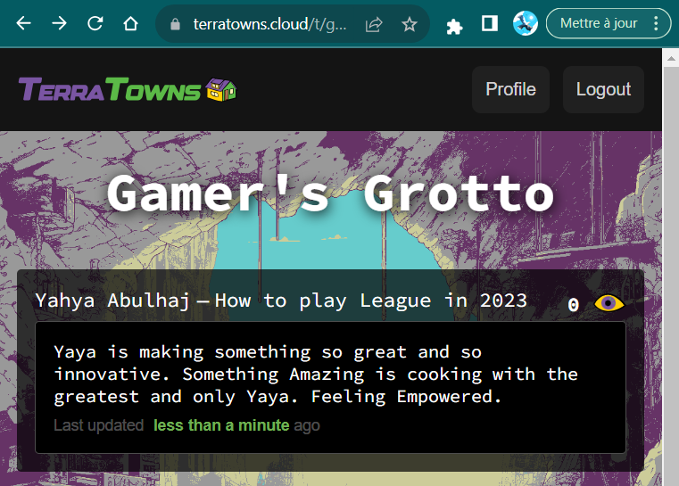

# Target TerraTowns API

Welcome to `2.5.0` where we'll be testing our custom provider against real TerraTowns infrastructure. 

+ [Configuration Steps](#configuration-steps)
+ [Initial Terratowns Testing](#initial-terratowns-testing)
+ [Token Handling](#token-handling)
  + [Example for access token](#example-for-access-token)
  + [Bucket Name Randomization](#bucket-name-randomization)
+ [Testing Your First TerraTown](#testing-your-first-terratown)


We will be configuring access tokens, endpoints, and other necessary settings to ensure our custom provider works seamlessly with TerraTowns.

### Configuration Steps

We will get Terraformcloud back.


#### 1. Access Token Setup

To use TerraTown, follow these steps:

1. In your provider block, set the endpoint to `terratowns.cloud/api`.
2. Obtain your user UUID from your ExamPro account.

 

3. Just there, click setting and
4. Click Vending machine from left pane.
5. Click on TerraTowns Access Code
6. Get the access token below in the page.

 


### Initial Terratowns Testing
1. Go to your `main.tf` custom provider and fill in the uuid values.
```sh
  endpoint = "http://localhost:4567/api"
  user_uuid="" 
  token=""
```

**To**;

```sh
  endpoint = "http://terratowns.cloud/api"
  user_uuid="" 
  token=""
```
> ⚠️Don't commit your values. We will var them later.
2. Fill with missingo as our first town of choice in our one and only `terratowns_home` resource.
```tf
  town = "gamers-grotto"
```
This how we target where our page will be part of.

3. Try a random domain url for now.

The domain doesn't lead to any destination, but that's fine. Let it be, for now. For You

4. Execute the following command:
```
./bin/build_provider
```
2. Initialize and apply Terraform:
```
tf init
tf apply
```

After execution, you will receive valuable debugging information.

3. Confirm by clicking `Yes.`

You may have another 401 error, like we had earlier.

- Map the UUID again in server.rb with the one from ExamPro.
- Make sure you target terraform.cloud in your endpoint.



5. Make sure you apply your changes.

6. Navigate to terratowns.cloud/t/ur-town.

You will find your profile displayed as a rectangle. <br>
Clicking it will redirect you to the seemingly useless CloudFront.



Now, the question is whether the CloudFront real URL will take you to this location, or if we need to pass custom headers or headers through CloudFront to make it work. This will be determined.


|Update not allowed If you change your domain name|
|:---|
|By design, You will need to perform a total teardown|

5. To proceed, execute the following command:
```
tf destroy
```


6. Update the url to map to your own cloudfront url.
7. Click on your post in [terratowns.cloud](https://terratowns.cloud/).



It is now directing to my page. It has anime in it with 

### Token Handling

To securely handle tokens, do the following:

- Avoid storing them directly in the `main.tf` file. 
- Use the `TF_VARS` environment variables for token management. 
#### Example for access token
```
export TF_VARS_terratowns_access_token="your_access_token_here"
gp env TF_VARS_terratowns_access_token="your_access_token_here"
```


This will allow you to reference the access token in your `main.tf` file using `var.terratowns_access_token`.


#### Endpoint and UUID Configuration
1. Set the TerraTowns endpoint in your `terraform.tfvars` file:
```
terratowns_endpoint = "https://terratowns.cloud/api"
```

If set wrong; verify `TF_VAR` and not `TF_VARS`.



You can access the endpoint in your code using `var.terratowns_endpoint`.

```sh
export TF_VAR_terratowns_endpoint="terratowns.cloud/api"
```

`user_uuid` already there we can call it just var.user_uuid. Let employ this..

2. Run the following commands in your gitpod and incldue your uuid;
```sh
export TF_VAR_teacherseat_user_uuid="pastehere"
gp env TF_VAR_teacherseat_user_uuid="pastehere"
```
3. Define those variables in your variables.tf, otherwise it wont work.
```hcl
variable "terratowns_endpoint" {
 type = string
}

variable "terratowns_access_token" {
 type = string
}

variable "teacherseat_user_uuid" {
 type = string
}
```
4. remove the previous `uuid` assignement.
5. Add it to the commented terrahouse module (for last tag)
6. Employ the same for our access token.

```sh
export TF_VAR_terratowns_access_token=""
gp env TF_VAR_terratowns_access_token=""
```
7. Set your real Cloudfront URL and let's give trry
```sh
  domain_name = module.terrahouse_aws.cloudfront_url
```
8. uncomment your terrahouse module.
9. Update your `terraform.tfvars` from `terraform.tfvars.sample` just in case you have code inline.
8. Run `tf init` is success follow it by `tf apply`;

> [Error on the way.](https://chat.openai.com/share/78308298-de74-4021-a294-7c715c768707)

Is there another error in the code? <br>Haha, remember that trap from Week Zero?

I fixed this already. But allow me please to fix yours in the next section.

This can help `env | grep TF_VAR`

#### Master Resolve For You

After initializing and applying Terraform configurations, you may encounter errors. 

Ensure that the asset URL in `tfvars.sample` ends with a `/`. Also, add the `asset_path` parameter to the TerraHouse AWS module.

1. Append a `/` to the end of the asset URL in `tfvars.sample`.
2. Within the `terrrhouse_aws` module, specifically in the main Terraform root file main.tf, pass the value of `var.assets._path` as `asset_path`.
3. Feel free to run terraform apply which will end up a great success.

The sole distinctive aspect in this situation is related to the unique bucket name.

#### Bucket Name Randomization

I believe we've successfully handled validation and using a random provider, now it's time to standardize the process for generating bucket names.

Let's generate a random bucket name just for the sake of it.


To make the bucket name random:
1. Obtain the bucket name from `tfvars` and the TerraHouse AWS module.
```hcl
module "terrahouse_aws" {
  source = "./modules/terrahouse_aws"
  user_uuid = var.teacherseat_user_uuid
  index_html_filepath = var.index_html_filepath
  error_html_filepath = var.error_html_filepath
  content_version = var.content_version
  assets_path = var.assets_path
}
```
2. Add comment for the bucket name setting in the CDN module and change as required;
```
  comment             = "Static website hosting for: ${var.bucket_name}"

  comment             = "Static website hosting for: ${aws_s3_bucket.website_bucket.bucket}"
```
3. Update variables and remove bucket validation in the CDN module. (I did in previous instruction)
4. Modify the CDN module to reference the update bucket output.
```hcl
  name   = "OAC ${aws_s3_bucket.website_bucket.bucket}"
  description  = "Origin Access Controls for Static Website Hosting ${aws_s3_bucket.website_bucket.bucket}"
```

5. The terraform plan touchpoint will tell that the bucket name it provides afterward (know after apply)



After applying Terraform configurations, the bucket name should be randomized.

The reason you observe the creation of **only a single resource** is because the apply becomes hang and it needed the AWS CLI to execute the invalidation process.

This was a preivously running workspace. I ran the aws cli  again using our script briefly and get the apply going.

### Testing Your First TerraTown

Now if you go you can find ur page there.
terraform.cloud/



|[Check it out!](https://terratowns.cloud/t/gamers-grotto)|
|---|

It is a mix of gaming and anime. Hope you like the creativity.

Once you have configured TerraTown, we can:

- Access your TerraTown page.
- Configure multiple pages if needed.
- Test updates to ensure everything works as expected.
- Pushing our custom provider to the community.

|For further, consider integrating TerraTown with Terraform Cloud|
|:---|


We are currently in the final stages of completing version `2.5.0` and soon.. <br>Everything😔 

This specific provides a clear overview and step-by-step instructions for testing your custom provider against TerraTowns and pushing your post and your site to the town.