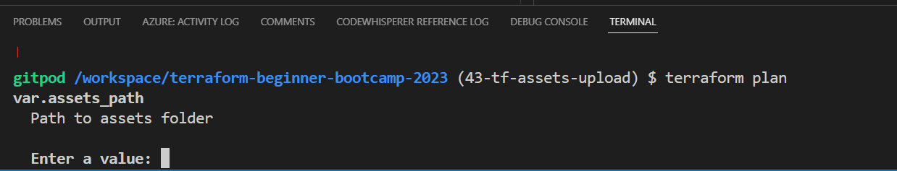
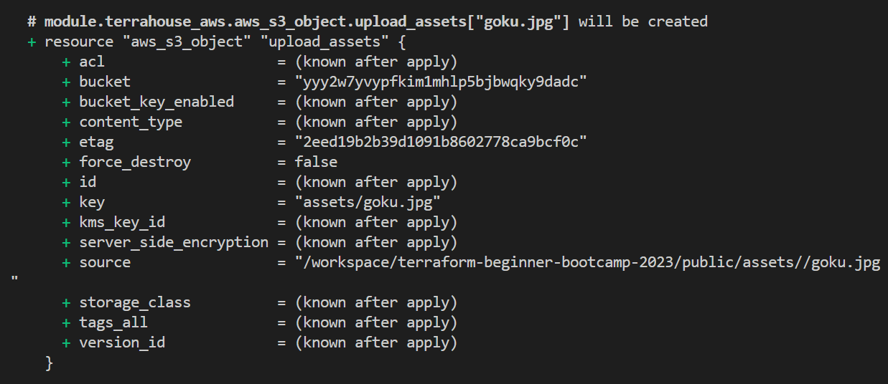
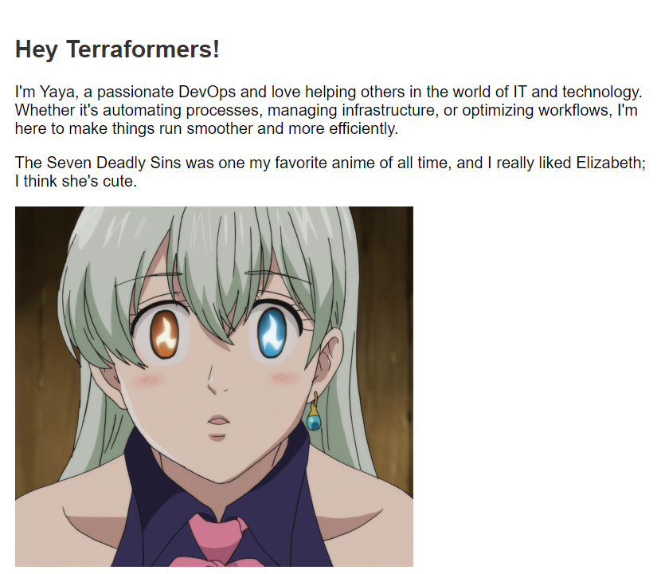

## Terrahouse Asset Management

Hey Terraformer, wrapping up our first week (technically second because we started from zero), we'll work on asset management process for our website to include images, JavaScript, and stylesheets and moree to make Terrahouse look impressive in TerraTown!

We also aim to create a page that connects W1 and W2, possibly as a hub!

### Improvisation
Let me freestyle for you my experience and what I think about this.<br>
An asset is something that has the potential to add value to you, that is why it is called that.

Computer files especially those with more visual are considered assets because once throwed to the system, they'll get consumed and you can get a benefit out of it.

Videos are the highest form of asset over there.

### Getting started with assets
1. Create an `assets` folder in your "public" directory.
2. Drag images to the `public/assets` folder and integrate them into your HTML files.
3. Preview the site by utilizing an HTTP server.
> Learn more how [from here.](https://github.com/yaya2devops/terraform-beginner-bootcamp-2023/tree/35-s3-static-website-host#host-your-first-http-server)
4. Enhance your development experience by adding the command to your `gitpod.yml` for `before`.
```
      npm install --global http-server
```
5. add the the `http-server` in the command.

#### Resolved Thought
While Terraform is primarily used for infrastructure provisioning, it can also be used for managing assets, offering opportunities to explore more functionality for beginners like You.

The question you may ask are;
- We added resources for specific single files like 'index' and 'error' pages.
- What if we want to add many files in a given directory e.g. `/assets` ?

The answer is, to handle multiple files, use a `for_each` loop in terraform.

#### Terrafoorm Console

- Learn about Terraform functions and complex types.
- Explore collection types in Terraform.

In the Terraform Console, obtain a list of all files in the public/assets directory.
1. Run `terraform init` first.
2. Run `terraform console`.
3. Run the following to know where you stand exact;
```
path.root
```
> A dot means you are in the root itself.
4. Use the fileset function and explore more about it in the registry e.g. Lists all files
```
fileset("${path.root}/public/assets","*")  
```
5. Filter in the console specific file types
```
fileset("${path.root}/public/assets","*.{jpg,png,gif}")
```

6. Filter in the console only jpg files.
```
fileset("${path.root}/public/assets","*.{jpg}")  
```

7.  Filter in the console only png files.
```
fileset("${path.root}/public/assets","*.{png}")  

// returning..
toset([
  "elizabeth-7-deadly-sins.png",
])
```
8. You can use Terraform's output for further exploration in the Terraform Console.

In Terraform, you may find the need to cast things to other thing. <br>Calm, it's a common  Terraform development, you are not crazy.

Let's get started with our `for_each`.

### `for_each` Configuration

- if we are using a list => will use a key
- if its more complex e.g map => we need key and value

The asset paths should not be hardcoded. Avoid it to perform a best practice.

1. Navigate to `resource-storage.tf` in your terrahouse module.
2. Define a resource for uploading assets.
```hcl
resource "aws_s3_object" "upload_assets" {}
```
3. Add the `for_each` loop.
```hcl
  for_each = fileset(<the-call>)
```
4. Consider making it more flexible by using TF variables.
```hcl
var.assets_path,"*.{jpg,png,gif}"
```
Grab the usual for the resource: `bucket`, `key`, `source`, `content type`, `etag`.

5. assign the bucket the same way;
```hcl
  bucket = aws_s3_bucket.website_bucket.bucket
```
6. **Change** the `key` to go to the assets and do **interpolation** and **each.key**.
```hcl
  key    = "assets/${each.key}"
```
7. For `source` path **root** each dot **key**.
```hcl
  source = "${var.assets_path}/${each.key}"
```
8. `etag` is **same** as `source`.
```hcl
  etag = filemd5("${var.assets_path}${each.key}")
```
9. Add the lifecycle as we previously did;
```hcl
  lifecycle {
    replace_triggered_by = [terraform_data.content_version.output]
    ignore_changes = [etag]
  }
}
```

Also..exit out of console after **done** with the required configurations.

### 10. Testing and Verification
1. Plan and verify the Terraform configuration.
2. Ensure it properly handles assets. We can see it is doing the assets!
3. Execute the apply to observe the asset management process.

Perfect! But.. read CamperBonus.

### CamperBonus
We have to ensure that the asset paths are set as variables. <br>
We may not want them to be hardcoded..

1. Start by adding `vars.assets_path` in the asset configuration instead.
2. Define this variable in `module/variables.tf`.
```hcl
variable "assets_path" {
  description = "Path to assets folder"
  type = string
}
```
3. Add the variable to your module block in the root `main.tf`.
```hcl
  assets_path = var.assets_path  # Add this line
```
4. Define it at the root level in `variables.tf`.
```hcl
variable "assets_path" {
  description = "Path to assets folder"
  type = string
}
```

5. Try terraform plan here; 



6. Add the actual variable to `terraform.tfvars`.
```hcl
assets_path="/workspace/terraform-beginner-bootcamp-2023/public/assets"
```
7. Include it in `terraform.tfvars.sample` for use in your workspace.
```hcl
assets_path="/workspace/terraform-beginner-bootcamp-2023/public/assets"
```
8. Run tfp and observe the output.



9. Check out your website with the assets;

[Demo Two Here!](assets/1.8.0/terrahouse-demo-2.png)


Great and cool!

#### Concluding;
Some assets from our great classmates;
- [Terraform Beginner Bootcamp Visual](https://cdn.discordapp.com/attachments/1138488134003335199/1157355946679468145/Terratown_Architecture_empty_lot.png?ex=6519a0b8&is=65184f38&hm=a648bc05a07e90c99a534bafceb6bad711289d271a7f66e3b16240e0da8619c3&)
- [Terraform Workflow Visual](https://cdn.discordapp.com/attachments/1138488134003335199/1157649422398791730/37667b3c-712a-4a15-a86e-6354fc57ac6c.png?ex=6519608a&is=65180f0a&hm=ac74f18110c979a381c33fc85baadf229c5a4c0eb8f804fbbac514e709b5afa9&)

TerraTown is the challenge for week 2, along with our custom provider!

But before we will have to present how you can work with git graphs.

> See you soon!