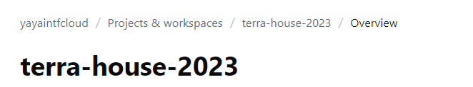
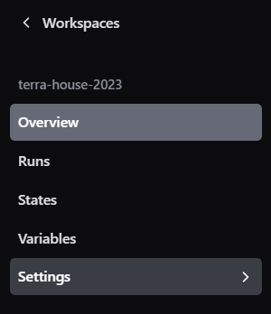
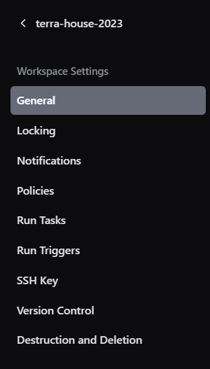
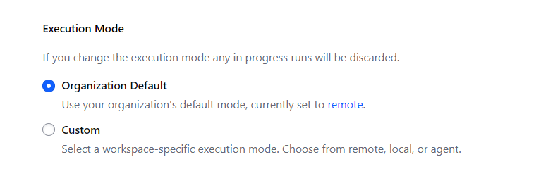
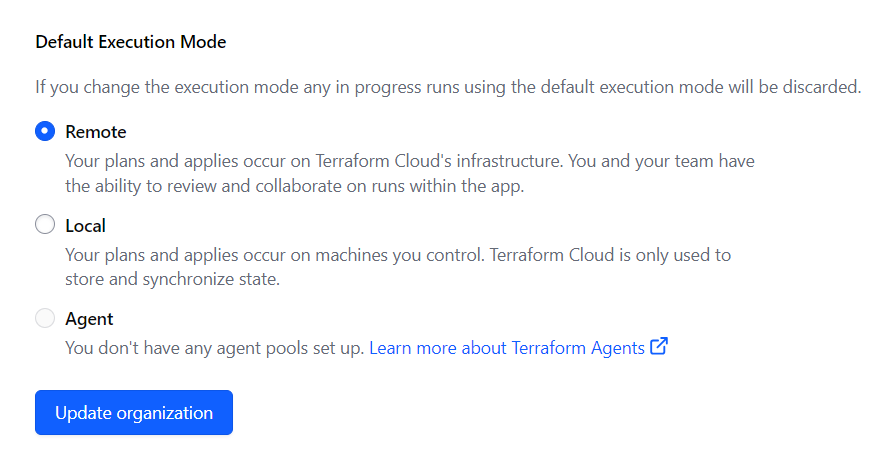
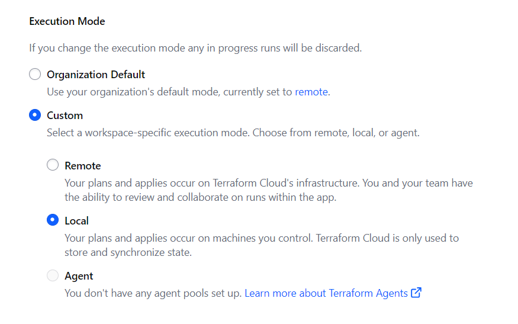

# Terraform Turbocharge Workflow

Welcome to the Terraform  `2.6.0` last official release with primary objective to integrate Terraform Cloud with our local development environments.

The following comes after an experience with different ways to work with terraform and thus coming up with the best possible solution.

The multiple home feature was part of this and it now part of `2.7.0`.<br>
Learn more [about our methodology](https://github.com/yaya2devops/terraform-beginner-bootcamp-2023/issues/61).


## Problematic 101
We previously operated exclusively using local execution, which resulted in rapid infrastructure planning and implementation. 

|❌|We encountered a challenge where our infrastructure state was lost whenever we stopped our workspace|
|---:|:---|

## Problematic 202
We have now made a complete shift to using Terraform Cloud, and this transition has yielded positive outcomes for our state management. Our infrastructure state is secure and preserved, ensuring that it remains intact even when we pause our work.

|❌|We have observed a decrease in execution speed when utilizing Terraform Cloud's compute resources|
|---:|:---|

## Resovlver Pro Max
These experiences bring us to the following solution.

**Ensuring safety and persistence and never lose your state;**

|⛑️|Preserve and manage our infrastructure state within Terraform Cloud |
|---:|:---|

**Optimize for the speed of our operations;**

|🏎️| Conduct our computations and executions against a local CDE infrastructure |
|---:|:---|

Welcome to this self-dedicated space for version `2.6.0`.


## Head over Terraform Cloud

I thought you may forget what is that. [Get the knowledge back.](https://developer.hashicorp.com/terraform/cloud-docs)

1. Access Terraform Cloud by following these steps:
   - Click "Try Terraform Cloud."
   - Select your "terra-house-1" project.



2. Configure Execution Mode:
   - Change the execution mode to "local" in Terraform Cloud. 
   - After you picked your project, click **settings** from the left pane


**The general pane will now popup.**
  - In the same page, swipe below and look for exec mode.


You will find that there is no option for local execution.



Also you see that your organization is set on the remote as shown in this asset.

  - Click set to **remote** direction.

This will take you to organization  general settings.
  - Look at your org setting and leave it as it is.



 - Go back to your project level.
 - Click on custom, pick a the local option and click update below.



This is done to improve command execution speed as running commands directly in Terraform Cloud might be slower. 

Remmember again that it's essential to keep your state safe in the cloud.

**Note:** Make sure to update the project level settings, not the organization level.

3. Return to GitPod:
   - In your GitPod environment, add the "cloud" section in your main.tf file e.g.
    ```hcl
    cloud {
    organization = "yayaintfcloud"

    workspaces {
      name = "terra-house-2023"
    }
   }
   ```
   - Build the plugin provider and set it to auto in the Terraform section.

4. Initialize and apply the Terraform configuration:
   - Run `terraform init` followed by `terraform apply` to deploy your configuration to Terraform Cloud.

5. Monitor the Terraform Cloud dashboard:
   - Terraform Cloud will not prompt for approvals but will display the current status of your operations. Consider pushing the provider to the registry for future use.

All resources are now managed by Terraform Cloud! 

You can stop your environment and return to it later, knowing that your state is securely stored in the cloud.


