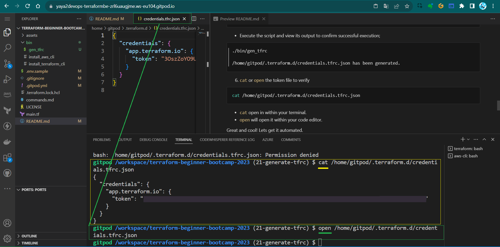

# Gitpod Terraform Cloud Authentication

As we [previously encountered](https://github.com/yaya2devops/terraform-beginner-bootcamp-2023/tree/18-migrate-terraform-cloud#resolved-configure-tf-cloud-with-gitpod-token), `terraform login` is stuck.<br>

We found a workaround to just;
- Make the file,
- Generate the token from terraform cloud,
- Add the content ourself.

In this, we will make a script that do just that for us. <br>
We will then go ahead and automate it in <br>our `.gitpod` so it does it itself. <br>Every given time.

- [Design the Bash Script](#design-the-bash-script)
- [Get The Token From Terraform Cloud](#get-the-token-from-terraform-cloud)
- [Automating Terraform Cloud Authentication](#automating-terraform-cloud-authentication)


We will also extend the token's validity to 30 days for added convenience.<br>
Welcome to `0.8.0` in our week 1 of the Terraform Beginner Bootcamp.


### Design the Bash Script

1. **Create a file** in the `/bin` directory, call it `gen_tfrc` and add the shebang:
```sh
#!/usr/bin/env bash
```
This line indicates that the script should be interpreted by the Bash shell, located at `/usr/bin/env bash`.

2. **Define Target Directory and File**
```sh
TARGET_DIR="/home/gitpod/.terraform.d"
TARGET_FILE="${TARGET_DIR}/credentials.tfrc.json"
```
- Define the target directory (`/home/gitpod/.terraform.d`) 
- The target file (`credentials.tfrc.json`) where the generated token will be stored.


3. **Check If TERRAFORM_CLOUD_TOKEN is Set**
```sh
if [ -z "$TERRAFORM_CLOUD_TOKEN" ]; then
    echo "Error: TERRAFORM_CLOUD_TOKEN environment variable is not set."
    exit 1
fi
```
   This code checks if the environment variable `TERRAFORM_CLOUD_TOKEN` is set. If it's not set (empty), the script will print an error message and exit with an error code (`1`).

4. **Check If Directory Exists, If Not, Create It**
```sh
if [ ! -d "$TARGET_DIR" ]; then
    mkdir -p "$TARGET_DIR"
fi
```
   The script checks if the target directory exists and creates it if it doesn't.

5. **Generate `credentials.tfrc.json` with the Token**
```sh
cat > "$TARGET_FILE" << EOF
{
"credentials": {
    "app.terraform.io": {
    "token": "$TERRAFORM_CLOUD_TOKEN"
    }
}
}
EOF
```

This code uses the `cat` command with a "here document" (<< EOF) to create the `credentials.tfrc.json` file with the Terraform Cloud token provided by the `TERRAFORM_CLOUD_TOKEN` environment variable.

6. **Print Success Message**
```sh
echo "${TARGET_FILE} has been generated."
```
After successfully generating the `credentials.tfrc.json` file, a message confirming its generation is displayed.

7. **Setting Executable Permissions**
   - Ensure proper permissions by using the `chmod` command on the Bash script.
```
chmod u+x ./bin/gen_tfrc
```

Great progress! Let's pause for a moment. 

Before proceeding, there are a few more things we need to set up.

### Get The Token From Terraform Cloud


1. Nav to the provided link to obtain a new token. If you can't locate it there, you can always retrieve it from here.
```
https://app.terraform.io/app/settings/tokens?source=terraform-login
```

2. **Extending Token Validity for our 4 weeks bootcamp**
   - Increase the token's lifespan to 30 days, ensuring longer usability.


3. **Assigning Environment Variable for Gitpod**
   - Define the variable in environment variables
```
export TERRAFORM_CLOUD_TOKEN='YOURS-WITH-30-DAYS-HERE'
```
4. Persist the environment variable to ensure it remains accessible within Gitpod.
```
gp env TERRAFORM_CLOUD_TOKEN='YOURS-WITH-30-DAYS-HERE'
```


> I updated the `.env.example` file with that ([without revealing sensitive data](link here)) to teach you.

- We've extended the token's duration.
- Our variables have been persistently stored.

✅ Eliminating the need for frequent adjustments.


5. **Launch your gitpod and Run the Script**

> Double check if the file exist or its content to triple verify.

```
cat: /home/gitpod/.terraform.d/credentials.tfrc.json: No such file or directory
```
- Execute the script and view its output to confirm successful execution;
```
./bin/gen_tfrc

/home/gitpod/.terraform.d/credentials.tfrc.json has been generated.
```


6. `cat` or `open` the token file to verify
```sh
cat /home/gitpod/.terraform.d/credentials.tfrc.json
```

- `cat` open in within your terminal.
- `open` will open it within your code editor.

Great and cool! Lets get it automated.


## Automating Terraform Cloud Authentication

**Objective: To automate the authentication of Terraform Cloud on Gitpod workspace launch.**

1. **Integrating the bash source to your `.gitpod`**

Navigate to your Gitpod configuration file and include the script source within the 'terraform' label aka section.
```yaml
  - name: terraform
    before: |
     source ./bin/install_terraform_cli
     source ./bin/generate_tfrc
```

We thought it was necessary to include the script in both sections to ensure it functions correctly in both terminals. Including it in the 'terraform' section is sufficient.


| Resources          | Description                                                |
|---------------|------------------------------------------------------------|
| [Secrets 100](assets/0.8.0/0.8.0.txt)   | This is my personal draft.                                 |
| [Secrets 101](https://chat.openai.com/share/816459f7-8838-41ad-9de7-b67fcc532cda)   |  Make something out of my draft. |
| [Secrets 102](https://chat.openai.com/share/2fcf57c0-7e90-4e32-82e3-167f7469890b)  | Amplify Issues, Code, Instructions. |



**Verify by restarting your workspace to ensure that the file contains your token.**


