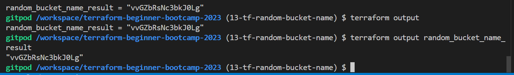

# Terraform Basics

We explored the fundamentals of Terraform, a powerful infrastructure as code (IaC) tool. 

We began by navigating to the Terraform Registry at [https://registry.terraform.io](https://registry.terraform.io) to access essential resources and modules.

**Provider vs. Module**: We discussed the distinction between a provider and a module in Terraform. 
- Providers are responsible for managing resources
- While modules serve as reusable building blocks for your infrastructure.

### Goals
Our primary objectives for this bootcamp include:
- Creating a custom provider(which is something very hard but cool to do)
- Developing a module, a fundamental Terraform construct.  (normal) 

## Calling a Provider From Registry
We initiated our journey by employing the `random` provider, which enables us to generate random values. 

You can find this provider at [hashicorp/random](https://registry.terraform.io/providers/hashicorp/random/latest).

### Provider and Resource Configuration
1. We declared the `random` provider in our main Terraform configuration file as follows:
```tf
terraform {
  required_providers {
    random = {
      source = "hashicorp/random"
      version = "3.5.1"
    }
  }
}

provider "random" {
  # Configuration options
}
```

Note: The `main.tf` configuration file is considered the top root module in Terraform, and we are continually building modules within it. 

|:lamp:|We are technically making modules all the time|
|---   |---|

2. Resource Creation: We created a random resource named "bucket_id" put it below the provider code:
```tf
resource "random_id" "bucket_id" {
  keepers = {
    # Generate a new id each time we switch to a new AMI id
    ami_id = var.ami_id
  }
}
```

3. Naming Conventions: Rename the resource to "bucket_id" for clarity.
4. Navigate to the Terraform Registry and click on the "Documentation" tab located in the left-hand side second navbar, adjacent to the "Use Provider" button.
5. Proceed to the "Resources" section and select the desired resource. Place this chosen resource immediately below the previously mentioned one.
```
resource "random_id" "name" {
  keepers = {
    # Generate a new id each time we switch to a new AMI id
    ami_id = var.ami_id
  }
```

6. Assign the name `bucket_id` to the resource to align it with our specific use case.

7. Navigate to the resource section and select the specified simple resource. Place it directly underneath the previous resource.
```
resource "random_id" "bucket_name" {
  keepers = {
    # Generate a new id each time we switch to a new AMI id
    ami_id = var.ami_id
  }
```

Looks Mh. I think we can try this with a random string.

### Expanding Resources
To enhance our resources, we added a random string generator instead.

1. Located the "random string" resource in the Terraform Registry, then replaced the existing resource with the following code:
```tf
resource "random_string" "bucket_name" {
  length           = 16
  special          = true
  override_special = ""
```

2. from  `override_special =`  take the `"/@£$"` as we dont need.

```tf
resource "random_string" "bucket_name" {
  length           = 16
  special          = true
  override_special = ""
}
``

3. Or just go back to this and put special to false and just delete the `override_special` instead:

```tf
resource "random_string" "bucket_name" {
  length           = 16
  special          = false
}
```

### Add outputs

1. Add an output block to return the random string value and name it with our bucket_name
```tf
output "" {}
```
2. For the value assign it the `id` of `bucket_name` of that `random_string`

```tf
output "random_bucket_name" {
 value = random_string.bucket_name.id
}
```

3. Additionally, let's verify whether it returns a different value or remains consistent.

```tf
output "random_bucket_name" {
 value = random_string.bucket_name.result
}
```


### Pre-Verify 


Make sure the file looks like this before actually testing terraform

```tf

terraform {
  required_providers {
    random = {
      source = "hashicorp/random"
      version = "3.5.1"
    }
  }
}

provider "random" {
  # Configuration options
}

  
resource "random_string" "bucket_name" {
  length           = 16
  special          = false
}


output "random_bucket_name" {
 value = random_string.bucket_name.id
}

output "random_bucket_name" {
 value = random_string.bucket_name.result
}
```

If so, nice lets go ahead.


## Terraform Workflow
We reviewed essential Terraform commands and workflow steps.

### Initialization
We executed `terraform init`, which:
- Created a `.terraform` directory for Terraform configuration. (Downloaded the required provider binary)
- Generated a `terraform.lock.hcl` file to lock the provider version.


> If you are going for the certification, I already did [a year or something ago](https://www.credly.com/badges/81d4dcaf-2e4c-4d8e-9ef1-58ef47fe77ee). Try to remmember the path registry.terraform.io comes a lot.

### Planning
We ran `terraform plan` to preview the infrastructure changes.
```sh
Terraform will perform the following actions:

  # random_string.bucket_name will be created
  + resource "random_string" "bucket_name" {
      + id          = (known after apply)
      + length      = 16
      + lower       = true
      + min_lower   = 0
      + min_numeric = 0
      + min_special = 0
      + min_upper   = 0
      + number      = true
      + numeric     = true
      + result      = (known after apply)
      + special     = false
      + upper       = true
    }

Plan: 1 to add, 0 to change, 0 to destroy.

Changes to Outputs:
  + random_bucket_name_id     = (known after apply)
  + random_bucket_name_result = (known after apply)
```

### Apply
Using `terraform apply`, we applied the configuration, which returned the specified outputs.
```sh
Outputs:
random_bucket_name_id = "vvGZbRsNc3bkJ0Lg"
random_bucket_name_result = "vvGZbRsNc3bkJ0Lg"
```

- Go ahead and delete the id line, I prefer the result. Make sure output looks like that;
```tf
output "random_bucket_name_result" {
 value = random_string.bucket_name.result
}
```

- Try terraform plan

this step will referesh the state 
```sh
random_string.bucket_name: Refreshing state... [id=vvGZbRsNc3bkJ0Lg]

Changes to Outputs:
  - random_bucket_name_id     = "vvGZbRsNc3bkJ0Lg" -> null

You can apply this plan to save these new output values to the Terraform state, without changing any real
infrastructure.
```

- Run terraform apply as follow to not have to confirm with Yes.

```sh
terraform apply --auto-approve
```


When you run a the apply you get the `terraform.tfstate`. 

Its ignored in our `.gitignore` but you can see it here, tell u about ur config. 

Dont touch it pls. Only if required.
```sh
{
  "version": 4,
  "terraform_version": "1.5.7",
  "serial": 3,
  "lineage": "f275b0ef-379f-f74c-95d5-b8feac774f8c",
  "outputs": {
    "random_bucket_name_result": {
      "value": "vvGZbRsNc3bkJ0Lg",
      "type": "string"
    }
  },
  "resources": [
    {
      "mode": "managed",
      "type": "random_string",
      "name": "bucket_name",
      "provider": "provider[\"registry.terraform.io/hashicorp/random\"]",
      "instances": [
        {
          "schema_version": 2,
          "attributes": {
            "id": "vvGZbRsNc3bkJ0Lg",
            "keepers": null,
            "length": 16,
            "lower": true,
            "min_lower": 0,
            "min_numeric": 0,
            "min_special": 0,
            "min_upper": 0,
            "number": true,
            "numeric": true,
            "override_special": null,
            "result": "vvGZbRsNc3bkJ0Lg",
            "special": false,
            "upper": true
          },
          "sensitive_attributes": []
        }
      ]
    }
  ],
  "check_results": null
}
```

You should get a single random number assigned to ur variable and you are not asked to say yes.


### Output Check
1. Verify outputs using `terraform output` and specific output names.

Example:
```sh
$ terraform output random_bucket_name_result
"vvGZbRsNc3bkJ0Lg"
```


2. Try output with the name of the output e.g.



```sh
terraform output random_bucket_name_result

"vvGZbRsNc3bkJ0Lg"
```


### Important Links To Empower You
- [Noting Stuff realtime, Draft](assets/0.5.0/draft-0.5.0-real-time.txt)
- [Remake Draft with GPT](https://chat.openai.com/share/8526b242-9920-43f2-b199-0df1700ffc3a)
- [Write Issues and more](https://chat.openai.com/share/91b1c7e4-adfd-493b-b19e-b09854a6e3bc)

This page is a direct outcome of the links I've just shared. See you soon! (this was done in one of the chats)


