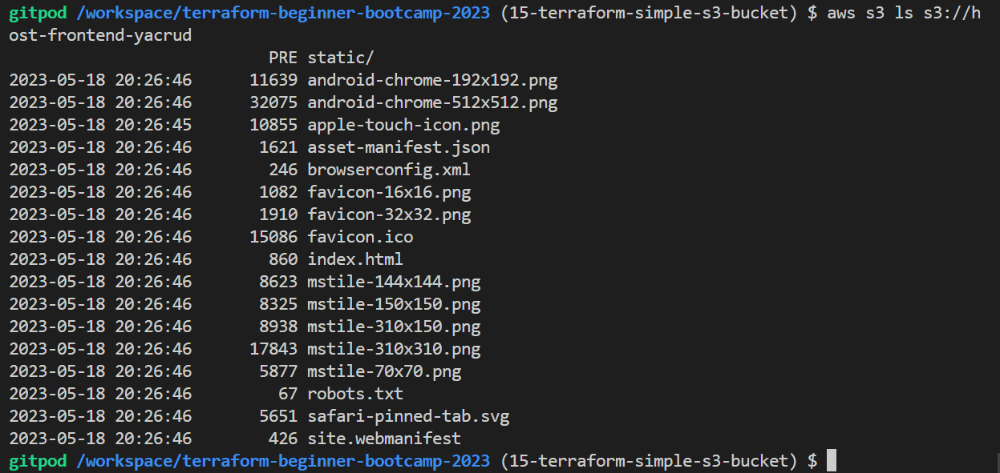
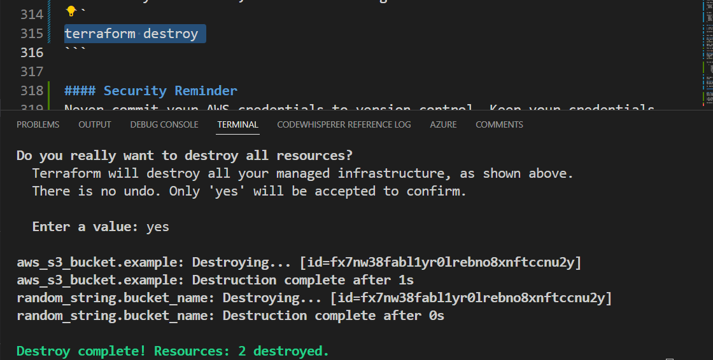

# Provision S3 Using Terraform

Amazon S3 is an object storage service like Dropbox.

You to create a bucket and throw things in and access them in the cloud that's all the idea of it.

### Try BucketOps

1. List all your S3 buckets, use the following command:

```sh
aws s3 ls
```


2. Create a new S3 bucket, you can use the `mb` which make bucket.
```sh
aws s3 mb s3://your-bucket-name
```
> We will code the above command in terraform.

3.Upload a File to an S3 Bucket,  you can use the `cp` (copy) command:
```sh
aws s3 cp /path/to/local/file s3://your-bucket-name/
```
- Replace `/path/to/local/file` with the path to the file on your local machine 
- Replace `your-bucket-name` with the name of your S3 bucket.

4. List all objects within a specific S3 bucket, use the following command
```
aws s3 ls s3://your-bucket-name/
```


5. Download an Object from an S3 Bucket with the `cp` command with reverse copying

```sh
aws s3 cp s3://your-bucket-name/object-key /path/to/local/directory/
```
- Replace `your-bucket-name` with the name of your S3 bucket
- Replace `object-key` with the key of the object you want to download
- Replace `/path/to/local/directory/` with the directory where you want to save the downloaded file.


6. Delete an Object from an S3 Bucket use the `rm`(remove) command

```sh
aws s3 rm s3://your-bucket-name/object-key
```
- Replace `your-bucket-name` with the name of your S3 bucket 
- Replace `object-key` with the key of the object you want to delete.

Great and cool. 
These are some basic AWS S3 commands to get you started with managing buckets and objects using the AWS CLI.

Let's now get back to terraform.

## Prerequisites

Before we begin, ensure you have the following prerequisites:

- [Terraform](https://www.terraform.io/) installed on your local machine.
- AWS credentials properly configured, either through environment variables or AWS configuration files (`~/.aws/credentials` and `~/.aws/config`).

We made both of these in previous branches. Double check.

## Create an S3 Bucket with Terraform
First of all, the naming conventions between CloudFormation  and Terraform  resources may occasionally align, but this alignment is not always guaranteed. Double-check.


### Searching for S3 in Terraform Registry

To start, you need to find the AWS S3 on the Terraform Registry. You can do this by searching for 'S3' in the Terraform Registry.

You can find it [here](https://registry.terraform.io/providers/hashicorp/aws/latest/docs/resources/s3_bucket). If it is that hard for you to search.

### Define the Terraform Resource

Now, let's define the Terraform resource for the S3 bucket.

You can refer to this: [The reference you've been told](https://registry.terraform.io/providers/hashicorp/aws/latest/docs/resources/s3_bucket).

1. So place this right under the random resource we did earlier;

```hcl
resource "aws_s3_bucket" "example" {
  bucket = "my-tf-test-bucket"

  tags = {
    Name        = "My bucket"
    Environment = "Dev"
  }
}
```

2. Let's temporarily remove the tags since we don't require them at the moment.

```hcl
resource "aws_s3_bucket" "example" {
  bucket = "my-tf-test-bucket"
}
```

3. Comment it because we need to setup our AWS provider first.

4. Verify by running a terraform init.

- The failure is expected because our random bucket naming process is generating uppercase letters, which are not supported as bucket names in S3.

5. Verify further plan and apply?

> Should fail too. We lack our AWS Provider.


### Configure AWS Provider

You need to configure the AWS provider in your Terraform configuration to provide the necessary AWS credentials. 


1. Go to the registry and search for aws.
https://registry.terraform.io/providers/hashicorp/aws/latest

2. Click  USE PROVIDER on the second navbar on the right besides Documenation;
```hcl
terraform {
  required_providers {
    aws = {
      source = "hashicorp/aws"
      version = "5.17.0"
    }
  }
}

provider "aws" {
  # Configuration options
}
```

3. Reflect on our previous provider.
```tf
terraform {
  required_providers {
    random = {
      source = "hashicorp/random"
      version = "3.5.1"
    }
  }
}

provider "random" {
  # Configuration options
}
```

How are we going to add that?

This looks stupid. We must have a single block for each. So?
```tf
terraform {
  required_providers {
    random = {
      source = "hashicorp/random"
      version = "3.5.1"
    }
  }
}

provider "random" {
  # Configuration options
}

terraform {
  required_providers {
    aws = {
      source = "hashicorp/aws"
      version = "5.17.0"
    }
  }
}

provider "aws" {
  # Configuration options
}

```
4. Apply critical thinking and get the following results;

```tf
terraform {
  required_providers {
    random = {
      source = "hashicorp/random"
      version = "3.5.1" }

    aws = {
      source = "hashicorp/aws"
      version = "5.17.0"
    }
    
  }
}

provider "random" {
  # Configuration options
}

provider "aws" {
  # Configuration options
}
```
We had to take aws inside previous provider and put it along the random.

Go try plan the infra. It should fail. <br>
You added a new provider it must be mapped to your `.terraform` dotfile.

 Init is required.

### Initialize and Plan
1. Now, you can initialize Terraform by running the following command and should work.

```hcl
terraform init
```


2. Try running plan. Should gives ok while we both know it is not.

The random is generating the name with capital while bucket only supports low letter.

3. Run `terrafom apply` and observe the failure.
The plan is not smart enough. Be careful. You could get a green pass and then get rejected in apply.

We will address this issue next.

### Fixing Bucket Naming Issue

To resolve the bucket naming issue, modify the resource definition as follows.

1. Change the bucket name from that to `random_string.bucket_name.result`
```
resource "aws_s3_bucket" "example" {
  bucket = random_string.bucket_name.result
}
```

Ensure you have previously defined `random_string.bucket_name.result` like I showed you.

2. Update the resource definition for random as required and Set length to reduce the chance of conflicts.

From this;
```
resource "random_string" "bucket_name" {
  length           = 16
  special          = false
}
```

To that;
```
resource "random_string" "bucket_name" {
  lower = true
  upper = false
  length   = 32
  special  = false
}
```

### Re-run Terraform Plan

1. After fixing the issue, Run `terraform validate`
2. Or re-run Terraform plan (it does validate in the background as a bonus):
```
terraform plan
```

This time, this also should work without errors. But we must verify further.

### Terraform Apply
Once you have successfully planned, apply the changes:
```sh
terraform apply
```
Again. Please be cautious; a successful plan does not guarantee success during the apply phase.

This is works you can verify from your terminal.


You can double verify your bucket in the console.


### Double Checking Terraform State
After applying the changes, check the state of Terraform with the following commands:
```sh
terraform show
```

You can also find it in your current directory. 
```json
   {
      "mode": "managed",
      "type": "aws_s3_bucket",
      "name": "example",
      "provider": "provider[\"registry.terraform.io/hashicorp/aws\"]",
      "instances": [
        { }

```

The code is around 117 lines you got the point. It is now having the bucket state.

### Destroying the Bucket
Why you may ask. Because if we push the bucket will no longer be managed by Terraform's state file, and re-importing it may be necessary.

To  destroy the bucket, use the following command:



```
terraform destroy
```

Double check your `terraform.tfstate`

```json
{
  "version": 4,
  "terraform_version": "1.5.7",
  "serial": 6,
  "lineage": "b17f132c-59c0-f3f6-5a4a-0d2c182bf7b5",
  "outputs": {},
  "resources": [],
  "check_results": null
}
```

Yep that is all it now!

#### Security Reminder
Never commit your AWS credentials to version control. Keep your credentials secure and use proper AWS authentication methods.

- It's essential never to hard code your AWS credentials in your Terraform configuration. 
- Rely on AWS configuration through environment variables using the `export`. 

Terraform will use these credentials in the background.


