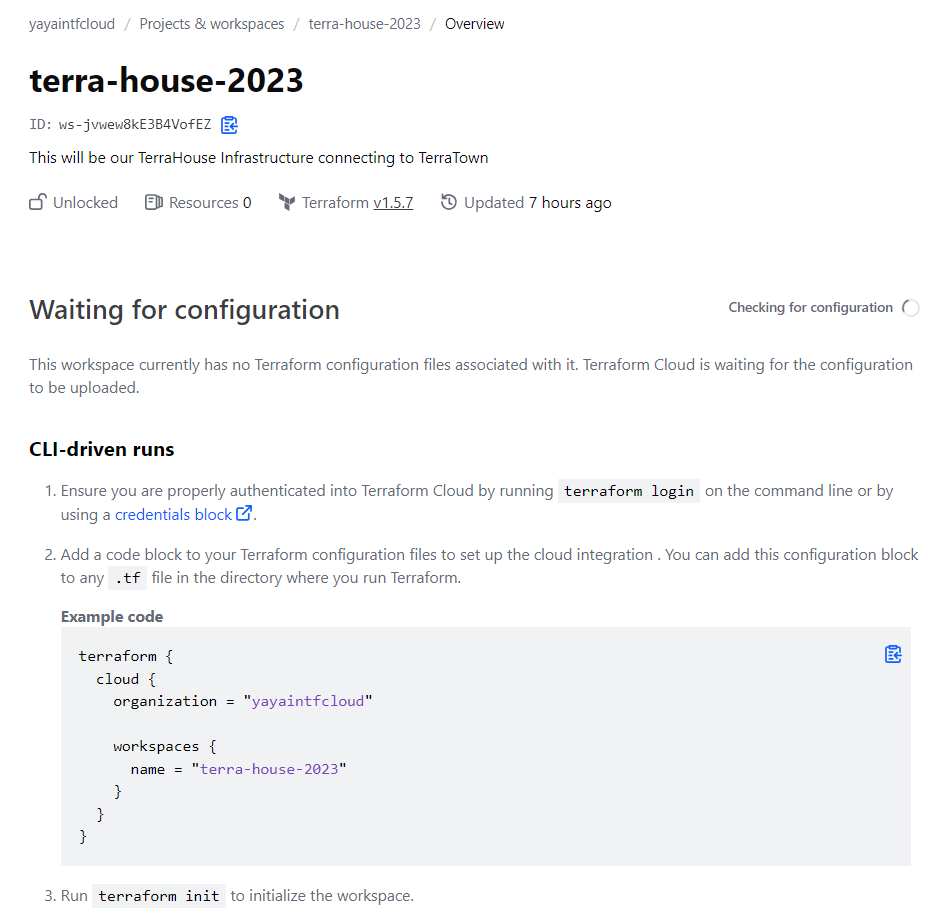

# Migrate To Terraform Cloud

Terraform Cloud is a powerful tool that enables you to manage your infrastructure as code securely.
 


We'll cover setting up Terraform Cloud.<br> You can check [the pricing is dead cheap](https://www.hashicorp.com/products/terraform/pricing), this equals to zero.

### Prerequisites

Just get the infra on again. Remember we destroyed it previously.

With simple `terraform init` and `terraform apply`.

If you are using your local. The `tfdotfile` is sitting there. <br>You can attack `terraform apply` directly.

## Why Use Remote State Storage?
The truth is we never want to responsible for that file. 

We may lose it. Also We don't want anyone to see it. 
- Eliminates the risk of losing the state file
- Ensures that only authorized team members can access it. 

Terraform is platform-agnostic you can store your state wherever.
- Terraform Cloud is a recommended solution because its a sponsor.
- You can store it in S3 or a container in an Azure blob.

## Getting Started

When you sign up for Terraform Cloud, you'll be prompted to create your first organization.

[This link will get you started](https://app.terraform.io/public/signup/account?utm_source=learn
).

If you followed this, ignore the provision resource example resources. <br>I am your example..


### Organizations, Projects, and Workspaces?

Terraform Cloud organizes your infrastructure into these three levels:


|🌐|You create the project so when u create Your workspace You can specify that project..|
|---|---|

```
🌐 Terraform Cloud Organization
├── 📁 Project 1
│   ├── 📁 Workspace 1.1
│   ├── 📁 Workspace 1.2
│   └── 📁 Workspace 1.3
└── 📁 Project 2
    ├── 📁 Workspace 2.1
    ├── 📁 Workspace 2.2
    └── 📁 Workspace 2.3
```

- **Organization:** The top-level entity in Terraform Cloud, which can contain multiple projects.
- **Project:** A collection of related Terraform configurations.
- **Workspace:** An isolated environment where Terraform configurations are applied and managed.


## Configure Workspace Settings

1. Create an organzation and call it e.g. `yayaintfcloud`.

After creating your organization, you'll be directed to create your first workspace and to Choose from:

- **Version Control Workflow (Most Common)**: Connect to a version control provider like GitHub.
- **CLI-Driven Workflow:** Trigger Terraform runs from your local command line. (most cases and ours)
- **API Driven** (more advanced)

I tried the first. But its not our case for now. <br>
We want only to see stuff.


Go to the second. <br>Trigger remote Terraform runs from your local command line.


2. You will be directed to page to create ur first workspace.

Pick a default project and create your workspace. 


> Workspace names should only contain l letters, numbers, dashes, and underscores.

Now you should have ur workspace listed.

In case you are confused.


## Create a Project

1. From the top right corner, click "New" and select "Project" to create a new project for our bootcamp. 

We dont have to but lets make things in its theme. 

2. Name our project `yaya-tf-bootcamp-2023`. This will be used next.


### Create Your Real Workspace

We created a default workspace. <br>Now we will go and create the one that will apply to our bootcamp.


1. from the left side, click create workspace and call it `terra-house-2023`


You should have your project in a good state.

2. Pick your project and create your workspace.


## Code the Cloud Block

Once your workspace is created, You will get that [cloud block](https://developer.hashicorp.com/terraform/tutorials/cloud/cloud-migrate).



Now, let's migrate your state to Terraform Cloud for centralized management:

1. Set Up Cloud Block
```
  cloud {
    organization = "ORGANIZATION-NAME"
    workspaces {
      name = "learn-terraform-cloud-migrate"
    }
  }
```

We thought we needed [the remote block](https://developer.hashicorp.com/terraform/tutorials/cloud/cloud-migrate) but its using the cloud block.

[Back in the days;](https://developer.hashicorp.com/terraform/language/settings/backends/remote)

```
  backend "remote" {
    hostname = "app.terraform.io"
    organization = "yayaintfcloud"

    workspaces {
      name = "terra-house-2023"
``` 

Now it is easier for configuration;

```
  cloud {
    organization = "yayaintfcloud"

    workspaces {
      name = "terra-house-2023"
    }
  }
```

Make sure its looks like this.

### RESOLVED: Configure TF Cloud With Gitpod (Token)

1. Go back to your CLI and run to authenticate with terraform cloud;
```
terraform login
```

2. Confirm yes to create a file

You will get a stupid screen.<br>

3. Click `p` for print and go to the url.

This takes you to Terraform Cloud. Here is the url;
```
https://app.terraform.io/app/settings/tokens?source=terraform-login
```
4. Create a token and pick one for one day. 

5. Take the token create the file yourself.
```
touch /home/gitpod/.terraform.d/credentials.tfrc.json
```

6. Check the file structure in GPT but dont trust it.
7. [Go to reddit](https://www.reddit.com/r/Terraform/comments/rtl5ey/can_anyone_please_show_me_show_me_how/) and get the structure instead.
```JSON
 {
  "credentials": {
    "app.terraform.io": {
      "token": "<add-it-here>"
    }
  }
}
```

> HashiCorp doesn't even display the structure of that file. Please consider this, HashiCorp.

8. `Open` the file that you touched it. 

```
open  /home/gitpod/.terraform.d/credentials.tfrc.json
```
9. Add the content with the token you got from tf cloud.

### Simple Test

To test its working. 

1. Run `terraform init`.
2. Check your dotfile.


3. Double check your Terraform Cloud resources;


4. Triple check your outputs in Terraform Cloud;


- `terraform.tfstate` is now included in the dotfile
- an environment file is created with ur tf cloud workspace.


### `init` is now different.

1. Run the `terraform init` command.


The command returns that its dealing with terraform cloud now.

#### Potential Actions
- Automate the process of tf login and similar steps.
- Explore the possibility of storing the token in Gitpod session storage 
- Generate the necessary JSON file for the token; evaluate feasibility.
- Consider abbreviating the Terraform <smth>


