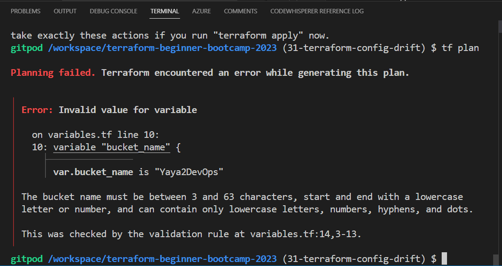
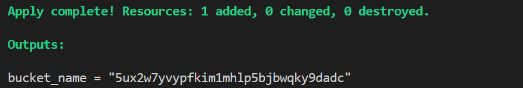

# Terraform Config Drift

`1.2.0` started with the idea to answer the following questions.


- How to fix it when you delete your state file?  
- Is there anyway you can recover it?

|🐛 |The feasibility of this depends on the available resources.|
|---|---|
|📦|Store your state in a file-like format because not all resources support direct importation.|

- [Bucket State Is Lost](#bucket-state-is-lost)
- [Get Random Back](#get-random-back)
- [Bucket The Regex Way](#bucket-the-regex-way)
- [Test Drifted Test](#test-drifted-test)

## Bucket State Is Lost
Our Terraform state no longer manages that bucket. 

To get state back, we need to search for the import within Terraform.<br>
[Learn more about the import.](https://developer.hashicorp.com/terraform/cli/import)

To get the import for the s3, follow this process.

1. Go to the Terraform Registry.
2. Navigate to `Providers` and select `AWS`.
3. In the search bar, type `s3` to find the AWS S3 related resources.
4. Look for `aws_s3_bucket` and click on it.
5. On the right-hand side of the page, you'll find a section labeled **ON THIS PAGE**.
6. Click on `import` to go directly to the import documentation.

It should provide you with the necessary import instructions.

```hcl
import {
  to = aws_s3_bucket.bucket
  id = "bucket-name"
} 
```
And the direct command;

```sh
terraform import aws_s3_bucket.bucket bucket-name
```
> The import [just in case.](https://registry.terraform.io/providers/hashicorp/aws/latest/docs/resources/s3_bucket#import)

Take the command to cli and see and change with our bucket named `example`.
```sh
terraform import aws_s3_bucket.example <random-from-ur-aws>
```

It will import a new state but;
- The import will exclude the randomly generated configuration,
- on tf plan, a prompt to delete the existing bucket and create a new one (`2+ 1-`)

Our next task is to retrieve the state in a randomized fashion.


## Get Random Back
The method I demonstrated for locating imports in S3 applies to nearly all scenarios. 

So, sharpen your direction-finding skills, and I'll emphasize it once more.

1. Go to your desired provider.
2. Expand the list of resources.
3. Locate the specific resource, such as `random_string`.
4. On the right-hand side, click on `import` and take it.
```
terraform import random_string.test test
```
We've named it "bucket_name," so it functions as follows:
```
terraform import random_string.bucket_name <paste-random-name-from-s3>
```
> The import [just in case.](https://registry.terraform.io/providers/hashicorp/random/latest/docs/resources/string#import)

Be aware that importing state may not include the random configuration. 

Terraform suggest deleting and recreating the resource along with a random component. 


|💡|Both are now in their original states.|
|---|:---|
|💡💡|But in `tf plan` it seems to think it needs to be replaced.|
|💡💡💡|It's time to terminate  random. Was nice|


## Bucket The Regex Way
We will proceed by discontinuing the random generation and instead implement a validator.

Similar to the way we did with UUIDs, but this time tailored to meet [bucket rules](https://docs.aws.amazon.com/AmazonS3/latest/userguide/bucketnamingrules.html).

1. Go to the main.tf
2. Delete the Random Provider from `providers.tf`.
```hcl
    random = {
      source = "hashicorp/random"
      version = "3.5.1"
    }
```
3. Remove the Random resource from `main.tf`.
```hcl
resource "random_string" "bucket_name" {
  lower = true
  upper = false
  length   = 32
  special  = false
}
```
4. Remove the bucket configuration `bucket = random_string.bucket_name.result`
```hcl
bucket = random_string.bucket_name.result
```
5. Add `bucket = var.bucket_name` instead.
```hcl
bucket = var.bucket_name
```
6. In  bucket resource change its name from `example` to `website_bucket`.

```hcl
resource "aws_s3_bucket" "example" 

resource "aws_s3_bucket" "website_bucket" 
```

7. Update the ouptut to not use the random provider and to call our new bucket name.
```hcl
output "bucket_name" {
  value = aws_s3_bucket.website_bucket.bucket
```

8. add the bucket name to our `terraform.tfvars` and keep a copy in `terraform.tfvars.sample`

```hcl
bucket_name="from-aws"
```

9. Define that variable within the variables.tf file.


Ask GPT to generate a Terraform variable definition for the bucket name with validation logic to ensure it conforms to the requirements for a valid AWS bucket name.


- Start with the variable definition with a great description;

```hcl
variable "bucket_name" {
  description = "The name of the S3 bucket"
  type        = string
```
- Go ahead with the validation after considering [the following rules](https://docs.aws.amazon.com/AmazonS3/latest/userguide/bucketnamingrules.html).

```hcl
  validation {
    condition     = (
      length(var.bucket_name) >= 3 && length(var.bucket_name) <= 63 && 
      can(regex("^[a-z0-9][a-z0-9-.]*[a-z0-9]$", var.bucket_name))
    )
    error_message = "The bucket name must be between 3 and 63 characters, start and end with a lowercase letter or number, and can contain only lowercase letters, numbers, hyphens, and dots."
  }
```

- Together, fogether to look like this;
```hcl
variable "bucket_name" {
  description = "The name of the S3 bucket"
  type        = string

  validation {
    condition     = (
      length(var.bucket_name) >= 3 && length(var.bucket_name) <= 63 && 
      can(regex("^[a-z0-9][a-z0-9-.]*[a-z0-9]$", var.bucket_name))
    )
    error_message = "The bucket name must be between 3 and 63 characters, start and end with a lowercase letter or number, and can contain only lowercase letters, numbers, hyphens, and dots."
  }
}
```

### Test Drifted Test
Make sure you deleted previous S3s.
1. Try giving a bucket name that violates the rule e.g. YayaToDevOps
2. Give a tf plan a try



3. Double assign it a correct naming.
4. Give a tf plan a try
5. Run tf apply




You should have your bucket in aws applied. 


That was our `1.2.0` configuration drift.


|Consider Regex for vars when validating inputs.|
|---|
