# Final Week₂ Of The Bootcamp


The past week was absolutely fantastic and filled with excitement. 

> [Give me a moment.](../README.md)

We embarked on some incredible tech adventures, such as crafting our very own Ruby server and designing a custom Terraform provider in Go.


- [Create A `2.0.0` Ruby Server](#create-a--200--ruby-server)
- [TerraTowns Provider Skeleton](#terratowns-provider-skeleton)
- [Terratowns Terraform Block](#terratowns-terraform-block)
- [TerraTowns Resource Skeleton](#terratowns-resource-skeleton)
- [TerraTowns `Home` Resource](#terratowns-home-resource)
- [Target TerraTowns API](#target-terratowns-api)
- [Terraform Turbocharge Workflow](#terraform-turbocharge-workflow)
- [🏠 TerraHomes to TerraTowns](#terrahomes-to-terratowns)
- [🏙️ TerraTowns Potential Unlocked](#terratowns-potential-unlocked)

To add to the thrill, [I personally launched six TerraHomes](https://github.com/yaya2devops/terraform-beginner-bootcamp-2023/pull/66) projects to TerraTowns.

It was a whirlwind of productivity and innovation, and we can't wait to share *the fruits of our labor with all Terraformers!*


# Create A `2.0.0` Ruby Server
In version `2.0.0` of our project, the primary focus is on integrating the Terratown mock server into our repository. 

- [Sinatra In Gitpod](#adjust-gitpod-yaml-configuration)
- [Code Sinatra Server](#🎩-understanding-sinatra)
- [Bash Script for CRUDs](#bash-script-for-cruds)
- [Speak To Your Sinatra](#speak-to-sinatra)
- [Final Server Testing](#relaunch-the-server)

There are many ways for embedding the mock server:

**A way can be;**

|🤔|We can include it as a submodule|
|:---:|:---|
|🐛|Challenging to manage when issues arise|

**Another way may be;**

|🤔|Git checkout and refrain from committing |
|:---:|:---|
|🚫|limiting when it comes to making on-the-fly changes|

<br>
We are going with **the first.**

### Bringing Terratown Mock Server into Our Repository

1. git clone the `terratowns_mock_server` repository to our project.
```sh
git clone https://github.com/ExamProCo/terratowns_mock_server.git
```
2. cd to `terratowns_mock_server` and verify the `.git` existence.
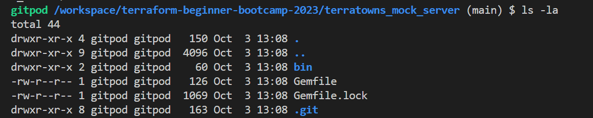
3. Remove the `.git` directory from the cloned repository.
```
rm -rf .git
```
4. Verify the contents is gone using `ls -la`.
5. Go a level back and verify your very critical `.git` folder for the entire project.
```
cd .. && ls -la
```

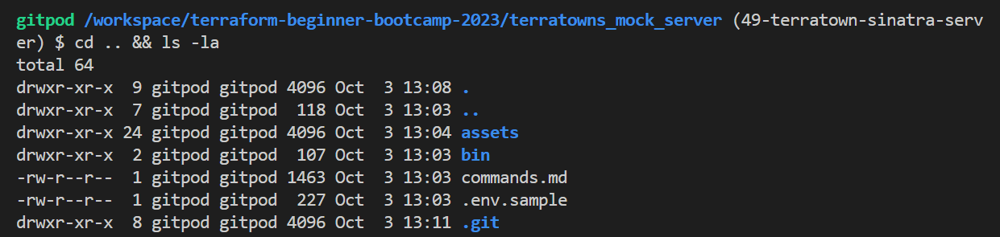

Good. Take care.. 🤲

###  Adjust Gitpod YAML Configuration
The Gitpod in that cloned project won't work because Gitpod operates only on the root level.
1. Move the Gitpod configuration from the cloned repository to the root level of our project.
```yaml
  - name: sinatra
    init: | 
      bundle install
      bundle exec ruby server.rb 
```
Include it in the `terraform` section.

2. Add `cd $PROJECT_ROOT` before your terraform, `aws-cli` and `http-server` section.
3. Terminate the previous Gitpod workspace because It is usless.

### Adjust the Repository Structure
1. Change the `bin` folder to `terratowns`.
2. Move scripts to our great `bin` directory.
3. Perform necessary chmod operations on these files.
4. delete the come with server `bin` directory.

## 🎩 Understanding Sinatra
Sinatra is a web application framework. Visit [sinatrarb.com](http://sinatrarb.com) for more..

The `server.rb` file works with the gems listed in the `Gemfile` to make the server work.

#### Sinatra Server Master
- Learn about Active Model in Rails as an ORM.
- Explore getter and setter methods.
- Study Rails validations and their formats.

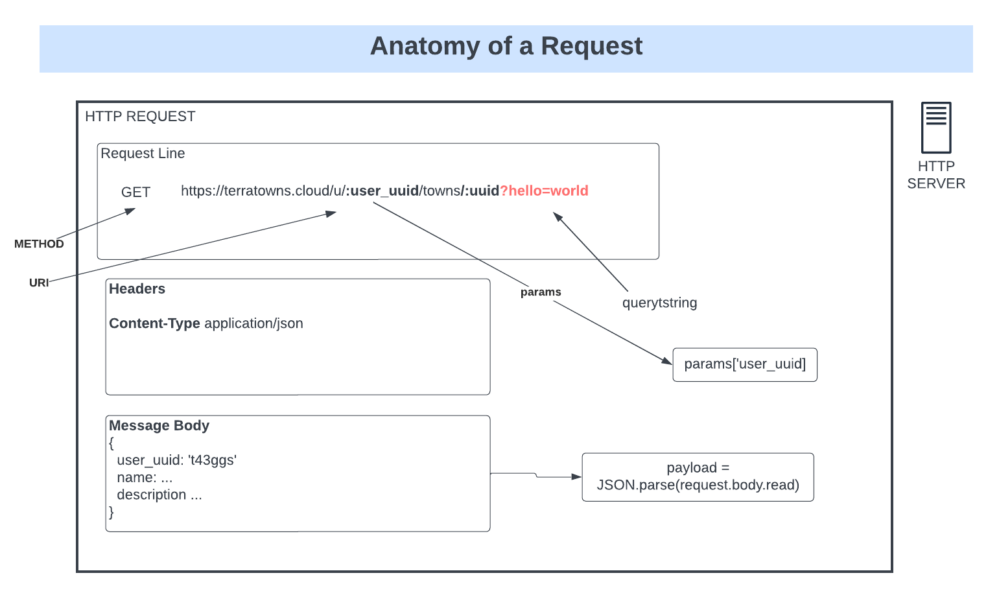

Lets start coding the server in a single file to make it easier for you.

1. **Import Required Libraries**:
   - Import the necessary libraries `pry` and `active_model`.
```rb
require 'pry'
require 'active_model'
```
2. **Create a Mock Database**:
   - Set a global variable `$home` to an empty hash. (Note: Avoid using global variables in production environments.)
```rb
$home = {}
```
3. **Define the `Home` Class**:
   - Create a Ruby class named `Home` representing a resource.
   - Include validations from `ActiveModel`, which provides validation functionality.
```rb
class Home
  include ActiveModel::Validations
end
```
4. **Define Attributes for the `Home` Class**:
   - Define virtual attributes using `attr_accessor` for `town`, `name`, `description`, `domain_name`, and `content_version`.
```rb
  attr_accessor :town, :name, :description, :domain_name, :content_version
```
5. **Apply Validations to `Home` Class Attributes**:
   - Use `validates` to specify validations for attributes:
     - `town` must be present and belong to a predefined list.
     - `name` must be present.
     - `description` must be present.
     - `domain_name` must have a specific format.
     - `content_version` must be an integer.
```rb
  validates :name, presence: true
  validates :description, presence: true
  validates :domain_name, 
    format: { with: /\.cloudfront\.net\z/, message: "domain must be from .cloudfront.net" }
  validates :content_version, numericality: { only_integer: true }
```
> Visit [terratowns.cloud](https://terratowns.cloud) and explore `cooker-coke,` the permalink for validation.

6. **Define the `TerraTownsMockServer` Class**:
   - Extend a class from Sinatra (`Sinatra::Base`) to create a web server.
```rb
class TerraTownsMockServer < Sinatra::Base
```
7. **Define Error Handling Function**:
   - Create a method `error` to handle errors by providing an error code and message.
```rb
  def error code, message
    halt code, {'Content-Type' => 'application/json'}, {err: message}.to_json
  end
  def error_json json
    halt code, {'Content-Type' => 'application/json'}, json
  end
  def ensure_correct_headings
    unless request.env["CONTENT_TYPE"] == "application/json"
      error 415, "expected Content_type header to be application/json"
    end
    unless request.env["HTTP_ACCEPT"] == "application/json"
      error 406, "expected Accept header to be application/json"
    end
  end
```
8. **Define Helper Methods**:
   - Create helper methods `x_access_code` and `x_user_uuid` to return hardcoded values.
   - Implement `find_user_by_bearer_token` to authenticate requests using bearer tokens.

```ruby
  def x_access_code
    return '9b49b3fb-b8e9-483c-b703-97ba88eef8e0'
  end

  def x_user_uuid
    return 'e328f4ab-b99f-421c-84c9-4ccea042c7d1'
  end
```
Add the return otherwise it wont work. and I created for you `find_user_by_bearer_token` method responsible for authenticating requests that use Bearer token-based authentication. 

#### Coding Endpoints
- **Create a POST Endpoint for Creating Homes**:
   - Define a POST route `/api/u/:user_uuid/homes`.
   - Ensure correct headers and user authentication.
   - Parse the JSON request body.
   - Validate and extract attributes from the payload.
   - Create a new `Home` instance and set its attributes.
   - Check if validations pass; if not, return validation errors.
   - Generate a UUID, mock data, and return the UUID as JSON.

```ruby
  post '/api/u/:user_uuid/homes' do
    ensure_correct_headings()
    find_user_by_bearer_token()
    # puts will print to the terminal similar to a print or console.log
    puts "# create - POST /api/homes"

    # a begin/resurce is a try/catch, if an error occurs, result it.
    begin
      # Sinatra does not automatically part json bodys as params
      # like rails so we need to manuall parse it.
      payload = JSON.parse(request.body.read)
    rescue JSON::ParserError
      halt 422, "Malformed JSON"
    end

    # assign the payload to variables
    # to make easier to work with the code
    name = payload["name"]
    description = payload["description"]
    domain_name = payload["domain_name"]
    content_version = payload["content_version"]
    town = payload["town"]

    # printing the variables out to console to make it eaiser
    # to see or debug what we have inputed into this endpoint
    puts "name #{name}"
    puts "description #{description}"
    puts "domain_name #{domain_name}"
    puts "content_version #{content_version}"
    puts "town #{town}"

    # Create a new Home model and set to attributes
    home = Home.new
    home.town = town
    home.name = name
    home.description = description
    home.domain_name = domain_name
    home.content_version = content_version
    
    # ensure our validation checks pass otherwise
    # return the errors
    unless home.valid?
      # return the errors message back json
      error 422, home.errors.messages.to_json
    end

    # generating a uuid at random.
    uuid = SecureRandom.uuid
    puts "uuid #{uuid}"
    # will mock our data to our mock databse
    # which just a global variable
    $home = {
      uuid: uuid,
      name: name,
      town: town,
      description: description,
      domain_name: domain_name,
      content_version: content_version
    }

    # will jsut return uuid
    return { uuid: uuid }.to_json
  end
```
- **Create a GET Endpoint for Retrieving Homes**:
    - Define a GET route `/api/u/:user_uuid/homes/:uuid`.
    - Ensure correct headers and user authentication.
    - Check if the requested UUID matches the one in the mock database.
    - Return the corresponding home data as JSON, or an error if not found.

```ruby
  get '/api/u/:user_uuid/homes/:uuid' do
    ensure_correct_headings
    find_user_by_bearer_token
    puts "# read - GET /api/homes/:uuid"

    # checks for house limit

    content_type :json
    # does the uuid for the home match the one in our mock database
    if params[:uuid] == $home[:uuid]
      return $home.to_json
    else
      error 404, "failed to find home with provided uuid and bearer token"
    end
  end
```
- **Create a PUT Endpoint for Updating Homes**:
    - Define a PUT route `/api/u/:user_uuid/homes/:uuid`.
    - Ensure correct headers and user authentication.
    - Parse the JSON request body, validate and extract attributes.
    - Find the home by UUID in the mock database and update its attributes.
    - Return a success message as JSON.

```ruby
  # UPDATE
  # very similar to create action
  put '/api/u/:user_uuid/homes/:uuid' do
    ensure_correct_headings
    find_user_by_bearer_token
    puts "# update - PUT /api/homes/:uuid"
    begin
      # Parse JSON payload from the request body
      payload = JSON.parse(request.body.read)
    rescue JSON::ParserError
      halt 422, "Malformed JSON"
    end

    # Validate payload data
    name = payload["name"]
    description = payload["description"]
    content_version = payload["content_version"]

    unless params[:uuid] == $home[:uuid]
      error 404, "failed to find home with provided uuid and bearer token"
    end

    home = Home.new
    home.town = $home[:town]
    home.domain_name = $home[:domain_name]
    home.name = name
    home.description = description
    home.content_version = content_version

    unless home.valid?
      error 422, home.errors.messages.to_json
    end

    return { uuid: params[:uuid] }.to_json
  end
```
- **Create a DELETE Endpoint for Deleting Homes**:
    - Define a DELETE route `/api/u/:user_uuid/homes/:uuid`.
    - Ensure correct headers and user authentication.
    - Find the home by UUID in the mock database and delete it.
    - Return a success message as JSON.

```ruby
 # DELETE
  delete '/api/u/:user_uuid/homes/:uuid' do
    ensure_correct_headings
    find_user_by_bearer_token
    puts "# delete - DELETE /api/homes/:uuid"
    content_type :json

    if params[:uuid] != $home[:uuid]
      error 404, "failed to find home with provided uuid and bearer token"
    end

    # delete from mock database
    uuid = $home[:uuid]
    $home = {}
    { uuid: uuid }.to_json
  end
end
```
- **Run the Server**:
    - Start the Sinatra server by calling `TerraTownsMockServer.run!`


## Bash Script for CRUDs

This originates from the LLM, which serves as the foundational source...


```
The How:
------
Write me a bash script that will send me a post request and an endpoint 
------
localhost:4567/api/u/:user_uuid/homes/ with a POST it should have a headers of content type and accept application json.
------
It should expect a bearer authorization token
------
The payload json should have the follownig fileds, name description, content_version, town, domain name.
```

### Create The Create Script
Now let's do it.
1. Before proceeding, ensure the server is stopped, as changes require a full restart.
Note: Consider adding a script for automatic server restart in the future.
2. Use 'Ctrl + C' to stop the server.
3. Write a Bash script that sends a POST request to an endpoint:
   - Endpoint: `localhost:4567/api/u/:user_uuid/homes/`
   - Headers: Content-Type and Accept should be set to "application/json."
   - Expect a Bearer Authorization Token.
   - Payload JSON fields: name, description, content_version, town, domain name.
4. Run `bundle exec` command to get the server back
5. Run the 'terratowns/create' script to obtain the UUID for the house.
```
$ ./create
{"uuid":"51a588f5-18c2-461b-ba97-adfd520eb9a9"}
```
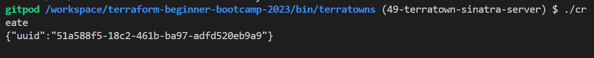

### Perform The Read Script

It is the exact same. To run the script.
1. Perform a read script using the UUID obtained from the create step.
2. Run the command as follows `./read <uuid>`
```json
{
  "uuid": "51a588f5-18c2-461b-ba97-adfd520eb9a9",
  "name": "New House",
  "town": "cooker-cove",
  "description": "A new house description",
  "domain_name": "3xf332sdfs.cloudfront.net",
  "content_version": 1
}
```
### Perform The Update Script

**To run the script;**
1. Perform a update script using the UUID obtained from the create step.
2. Run the command as follows `./update <uuid>`<br><br>
When attempting an update. <br>
It will complain. This is our code trap.<br>
Expect an error related to domain names; this is intentional.<br><br>
3. Investigate and correct the issue within the update action (line 216).
4. Add the domain name to the update action like town<br><br>
The domain names and the town should only be init once.<br>
5. Run udpate again.. give same error because we have to rerun the server.
6. Do new create get new uuid, read and then update.

**Error. again?**

The issue involves a duplicated line in the domain name, but instead of rectifying it, let's consider appending the following information at the end.


We can employ `binding.pry` to pause the program's execution in ruby.

7. Create a new record to generate a fresh `UUID`, read the data, and subsequently update it.<br>
It is currently hanging, and **this is expected behavior.** <br>
8. Now, let's switch to Sinatra where it has paused.<br>Allowing us to interact directly with the code.

> Should we refactor it?(maybe later) Lets just get the update.

### Speak to Sinatra

1. Type `home` => It is now displaying.
2. Execute `home.domain_name`.
3. Inspect the payload and observe that there is no domain present. It should not be set there.
4. Execute `$home[:domain_name]`—this seems to be the issue.
5. Realize that there is no need for `home.domain_name = domain_name`, and it's better to keep the one with `[]`.
6. Exit the current operation.

### Relaunch the server

| In sinatra review the 'read' operation|
|:---|
|Focus on the new house description|
|You can delete it now|

**Server Reset and Interaction Steps**

1. Begin by restarting the server.
2. Perform the sequence of actions: create, read, and update. 
> Great, everything's in order now! Proceed to Sinatra and carefully observe all the steps.
3. Append the UUID at the end, around line 240. (Note: This is not a code trap but a necessary fix.)
4. Execute the 'delete' operation, and you'll see it tell you about the UUID.
```json
{
  "err": "failed to find home with provided uuid and bearer token"
}
```
6. Do new create to get new uuid, 
```json
{"uuid":"82966322-962d-4910-b9e9-a4013a765730"}
```
7. Do the read script
```json
{
  "uuid": "82966322-962d-4910-b9e9-a4013a765730",
  "name": "New House",
  "town": "cooker-cove",
  "description": "A new house description",
  "domain_name": "3xf332sdfs.cloudfront.net",
  "content_version": 1
}
```
8. Do the Update;
```json
{"uuid":"82966322-962d-4910-b9e9-a4013a765730"}
```
9. And end it with Delete;

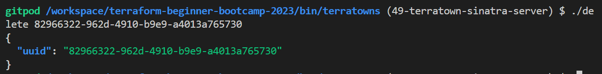

Our CRUDs are well set.

**Note:** These are all similar scripts, with slight variations such as one for POST, one for GET, and so on.

#### Code Considerations
- Create, read, update, and delete scripts have been provided.
- Ensure that they return the expected results.
- Has noticed another code trap that has gone unnoticed? (there is) 
- Are there any thoughts on refactoring the code?

At this point our server is well set!<br>
Once all previous steps are completed successfully, We are ready to build the custom provider.


# TerraTowns Provider Skeleton 
Welcome to the quickstart of our completely custom terraform provider. <br>Typically, it's recommended to develop a custom provider in a separate repository as an independent project. 

**We'll nest it, empowered, within our project for this instance.**

+ [Create Your Custom Provider](#create-your-custom-provider)
+ [Provider Functionality](#provider-functionality)
+ [Imports In Go Lanugage](#importing-in-go)
+ [Setup Terrtowns Plugins](#plugin-setup)
+ [Complie Your Custom Provider](#complie-your-custom-provider)
+ [`mod.go` Requirement File](#-modgo--is-a-must)
+ [Build Custom Provider Skeleton](#real-build-check)

When you visit any provider on the Terraform Registry, you'll notice a consistent naming pattern.

|terraform-provider-name|
|:---|
|[Browse and see for yourself](https://registry.terraform.io/browse/providers?tier=community).|

I filtered it for you on communtiy tier already. 


Also..
- Consult back the custom providers stuctures and code blocks.
- Hasicups is a very good project for learning Terraform.
- Community often includes individuals who start and complete their providers.

Over the past weeks, we've been actively experimenting with a variety of exciting technologies and the fun just started.

### Create Your Custom Provider
We've successfully developed our Ruby server with the assistance of Sinatra, and now, we're diving into Go to enhance our skills as we work on creating the custom provider.

1. Create a new folder and name it `terraform-provider-terratowns` at root level.
2. Inside this folder, create a file named `main.go`. (Single file for simplicity)
3. Consolidate the code into a single file for improved readability.
4. In the `main.go` file, structure the code as follows:
    ```go
    package main
    
    func main() {
        // Your code here
    }
    ```
> We always have the package main.
Use (done) GPT to generate a "Hello World" program using the Go package and print the result.<br>
5. Now, let's create a simple "Hello World" program in Go.

```go
package main

import "fmt"

func main() {
    fmt.Println("Hello, World!")
}
```

- Unlike languages like Ruby, Go files are compiled into binaries 
- Unlike languages like Ruby Go files are not dynamically executed. 
- You compile the script, and it runs as a binary.

Go is built-in on Gitpod. 

|[Locally I installed it previously](https://blog.yahya-abulhaj.dev/the-technology-titan-go-language) and it took time for vars.|
|---|
|Check it out, A blog I posted on hashnode on feb of this 2023|

- Run your first Go program.

```bash
(51-terratowns-skeleton)
$ go run main.go 

$ go run main.go 
Hello, World!
```

### Provider Functionality
Our custom Terraform provider will provide CRUD operations for a resource. 

Make a Request to LLM in the meanwhile.
```
Generate code for a custom Terraform provider that includes API actions designed to interact with Terraform resources. Can you confirm, so I provide you with requirements.
---
Requirements:

We aim to perform the following actions;
1. GET /api/u/:user_uuid/home
2. POST /api/u/:user_uuid/home
3. PUT /api/u/:user_uuid/home
4. DELETE /api/u/:user_uuid/home
```

#### Importing in Go
To import multiple packages in Go, you can use the following syntax:
```go
import (
    "package1"
    "package2"
    // Add more packages here
)
```

### Plugin Setup

We'll need to set up a plugin server for our provider exactly why we coded the ruby server.
 
1. In the `main` function add our custom provider.
```go

	plugin.Serve(&plugin.ServeOpts{
		ProviderFunc: Provider,
	})
```
2. Below the `main` function, specify the provider as a function.
```go
func Provider() *schema.Provider {}
```

- A function in go is just func
- Go doesn't use classes; instead, it relies on interfaces.

### Get Help From HashiCorp

We used the `developer.hashicorp.com` Terraform provider setup tutorial for this.

3. Retrieve the link from the `main.go` file and incorporate it into our schema.
4. Code the function and add the following;
```go
	var p *schema.Provider
	p = &schema.Provider{
```

4. Create the provider schema 
```go
p = &schema.Provider{}
```
5. Define the resource and data sources map inside p;
```go
		ResourcesMap:  map[string]*schema.Resource{

		},
		DataSourcesMap:  map[string]*schema.Resource{

		},
``` 
5. Include the necessary elements for the schema incl `endpoint`, `user_uuid` and `token`.
```go
		Schema: map[string]*schema.Schema{
			"endpoint": {
				Type: schema.TypeString,
				Required: true,
				Description: "The endpoint for hte external service",
			},
			"token": {
				Type: schema.TypeString,
				Sensitive: true, // make the token as sensitive to hide it the logs
				Required: true,
				Description: "Bearer token for authorization",
			},
			"user_uuid": {
				Type: schema.TypeString,
				Required: true,
				Description: "UUID for configuration",
				//ValidateFunc: validateUUID,
			},
		},
	}
```
6. Code validateFunc like a pro by adding it like this;
```go
validateFunc:= validateUUID
```
7. Request GPT to generate the code for it.

```
Can you fill the validate UUID function for me?

Nah.

Okay np.
```

#### Google UUID Lib
8. Google provides its own library at github.com/google/uuid, which offer a solution for validation.

9. Use this [stackoverflow refernce](https://stackoverflow.com/questions/25051675/how-to-validate-uuid-v4-in-go) for more about validation.
10. Get the prompt from GPT and lets tweak it baby.
```go
func validateUUID(v interface{}, k string) (ws []string, errors []error) {
	log.Print('validateUUID:start')
	value := v.(string)
	if _,err = uuid.Parse(value); err != nil {
		errors = append(error, fmt.Errorf("invalid UUID format"))
	}
	log.Print('validateUUID:end')
}
```

Great and cool. Now we have to look how to make this run.


### Complie Your Custom Provider

To compile a custom provider, you need a `terraformrc` file.

Terraform maintains a hidden directory called `.terraform.d` with a `plugins` folder to store plugin binaries. 

Ensure that you have a local provider directory where you place the binary files generated.

1. Run the following command to build the custom provider binary:

```
go build -o terraform-provider-terratowns-v1.0.0
```
2. Test the custom provider using the `.terraformrc` file.
3. Create a `terraformrc` file at the root of your project. 

Ensure that the file name does not contain a period as it should be placed within your custom provider code. (We will use cp command.)

Inside the `terraformrc` file, add the following configuration for provider installation:
```hcl
provider_installation {
  filesystem_mirror {
    path = "/home/gitpod/.terraform.d/plugins"
    include ["local.providers/*/*"]
  } 
  direct {
   exclude = ["local.providers/*/*"] 
  }
}
```

Also..building the binary can be challenging (was really hard..)

> Thanks to Jason for [this article.](https://servian.dev/terraform-local-providers-and-registry-mirror-configuration-b963117dfffa?gi=06e845629b10)


#### Scripting The Build Process

A script-based approach is recommended:

4. Navigate to the `bin` directory.
5. Create a file named `build_provider` and add the necessary content to build the binary.
```
rm -rf ~/.terraform.d/plugins
rm -rf $PROJECT_ROOT/.terraform
rm -rf $PROJECT_ROOT/.terraform.lock.hcl
```
We started by removing previous dependencies in case.

6. Create both compute env, once for each chipset on the target compute
```sh
mkrdir -p ~/.terraform.d/plugins/local.providers/local/terratowns/1.0.0//x86_64/
mkrdir -p ~/.terraform.d/plugins/local.providers/local/terratowns/1.0.0//linux_amd64/
```
> This ensures compatibility with what yours may be using.
Now make use of environment variables in your script to simplify the build process.
7. Apply the environment variables for your plugin path.
```sh
PLUGIN_DIR="~/.terraform.d/plugins/local.providers/local/terratowns/1.0.0/"

mkrdir -p $PLUGIN_DIR/x86_64/
mkrdir -p $PLUGIN_DIR/linux_amd64/
```
8. Apply the environment variables for your plugin name and copy it.
```sh
PLUGIN_NAME="terraform-provider-terratowns_v1.0.0"

cp $PLUGIN_NAME $PLUGIN_DIR/x86_64
cp $PLUGIN_NAME $PLUGIN_DIR/linux_amd64
```

First, [Verify the script from here right away.](bin/build_provider)

Second. We can't build this yet<br>To really build the provider **we need something else.**

### godotmod Is A Must

You need to ensure you have a `go.mod` file. 

1. Create a file named go.mod and add the necessary content. 
2. Add  repo URL as The module and the version.
```mod
module github.com/ExamProCo/terraform-provider-terratowns
go 1.20
```
3. Important to Map the repo URL to the path of your workspace.
```sh
replace github.com/ExamProCo/terraform-provider-terratowns => /workspace/terraform-beginner-bootcamp-2023/terraform-provider-terratowns
```
4. Add an open require  for what we will need.
```
require ()
```

Now we are ready for the build and further troubleshoot.

### Real Build Check

1. Run the build script.

|You will get an error about a missing import path. |
|---|
|Correct it by ensuring proper use of parentheses in your import statements.|

> It is `()` and not `{}`

- Build again

You are now being asked to get the github repos required.

- Run go get to fetch any required GitHub repositories as indicated by the error message.
```
go get github-url-lib
```

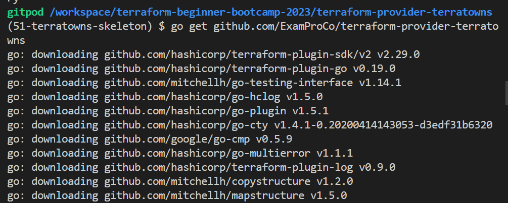

This installs the latest version of the module.

- Building again result in a new `go.sum` file. 

The go.mod file now includes more URL paths, which you didn't have to manually write.

- Building again.. also know that the first time may be slow due to dependency downloads.

You might encounter errors during this build process number too much.. <br>
The provider schema declaration is to replace `.Resources{` with `.Schema{.`<br>
Also add the comma.. 

**This is not ruby.**

Continue building and address any unused log errors.

- Remove or uncomment the log from the import in your `main.go`
```go
	// "log"
```

Finally, after a successful build.<br>
You will find the `terraform-provider-terratowns-v1.0.0` binary.
> This is so wrong. [You'll find out](https://github.com/yaya2devops/terraform-beginner-bootcamp-2023/tree/53-terratowns-block#connecting-dots-and-traps) next release. We had traps.

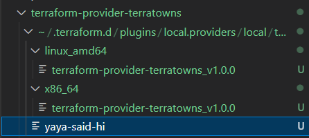

It can be quite large, so consider the following;

- Observe the `go.sum` file and [all the dependencies here](terraform-provider-terratowns/go.sum).
- Add your binairy to your `.gitignore`.
```sh
# Ignore Terratowns Custom Provider Binairies All versions
terraform-provider-terratowns/terraform-provider-terratowns_v*
```
This file now won't be comitted and  will be avoided by your version control!

#### Considerations
- The subsequent builds but the first should be faster.
- The binary file for your provider can be large (e.g., 20MB).
- Use `.gitignore` file to exclude it from version control.

Creating a custom Terraform provider can be a complex process<br>This starts the process of generating the actual binary which is also the Skeleton For our Terratowns!

If it is building for you, You are in a good shape for `2.2.0` !


# Terratowns Terraform Block

Welcome to `2.2.0` our second part for working with the creation of our custom provider.
  * [Connecting Dots And Traps](#connecting-dots-and-traps)
  * [Configuring the Custom Provider Block](#configuring-the-custom-provider-block)
  * [Rebuilding the Provider After Your Code](#rebuilding-the-provider-after-your-code)
  * [Idea On The Way](#idea-on-the-way)
  * [Back To Plan](#back-to-plan)

To get the most of this, I highly encourage you refer to the issues we dealt with for Terratowns [starting with this.](https://github.com/yaya2devops/terraform-beginner-bootcamp-2023/issues/51)

## Connecting Dots And Traps

We have our plugin ready from previous tag. <br>Let's rebuild the binary.
```
./bin/build_provider
```

There is build errors. An issue occurred while attempting to set `terraformrc`.
- There was a mistakenly executed `mkdir` command.
- add an `=` between `include` and `["local.providers/*/*"]` in terraformrc`.

Double execute the script and it should now work fine, this generates;
- The binary which is what we want.
- Another folder that starts with a tilde `(~)`, terminate it.

If you back to my previous branch, you should notice that I got that and left it for reference.

- In the script replace `(~)` with `/home/gitpod`.
- Correct `PROJET_ROOT` with `PROJECT_ROOT`.
- Change the second `(~)` in `rm -rf` to  `/home/gitpod`.

|Please correct the script by updating the path for the 'plugin_dir' variable|
|---|

These corrections eliminated errors, resulting in the successful generation of the binary.

- **To confirm the binary was generated**<br>
**Check it in `terraform-provider-terratowns`.**

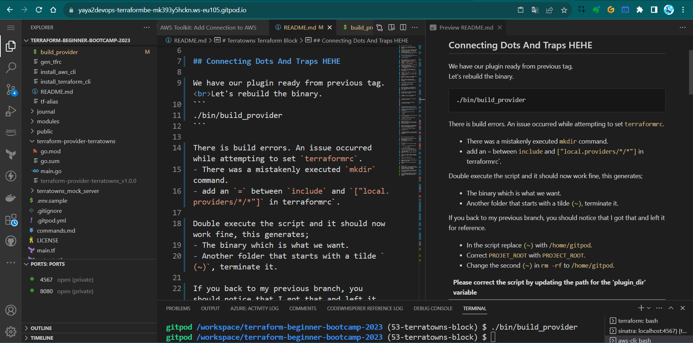

Now that our library is configured, it's time to integrate it with our Terraform setup. This corresponds to version `2.2.0` of our project.


## Configuring the Custom Provider Block
The next step is to configure the custom provider within Terraform:


1. Update  `main.tf` file to specify the Terraform block with our provider.
```hcl
  required_providers {
    terratowns = {
      source = "local.providers/local/terratowns"
      version = "1.0.0"
    }
  }
```
2. Below the Terraform block, create the provider block itself.
```tf
provider "terratowns" {
 what is next goes here
}
```
3. Specify the required the endpoint, service UUID, and token.
```tf
  endpoint = "http://localhost:4567"
  user_uuid="get-it-from-teacherseat-profile"
  token="get-it-from-teacherseat-settings"
```

The required UUID and token values were obtained from a mock created by the script.

Later this will both come from the ExamPro Platform. (It is already there)

### Rebuilding the Provider After Your Code
1. Build our provider again to get an updated binary.

2. Initialize Terraform, and execute `terraform init`.

|❌ ERROR|
|---|
|An error occurred during initialization due to a missing include.|

- The build script was executed again, followed by `terraform init`.

This now resolves our issue.

### Idea On The Way
When you perform actions like that, having different log levels in place can greatly simplify the process.


Effective logging can make troubleshooting easier. In this release, log levels were configured for debugging purposes:

1. Add the log level using the command 
```
TF_LOG=DEBUG tf init
```

2. Enable Debug mode was in the environment configuration within the Terraform block in GitPod file.
```
tasks:
  - name: terraform
    env:
      TF_LOG: DEBUG
```

We can now debug and get good stuff.

When things go awry in our Go code, these logs will prove invaluable for troubleshooting.
This verbose mode is great idea.

## Back To Plan

We stopped at the init, where we resolved our issue.

1. Run `tf plan` to quickstart our code.

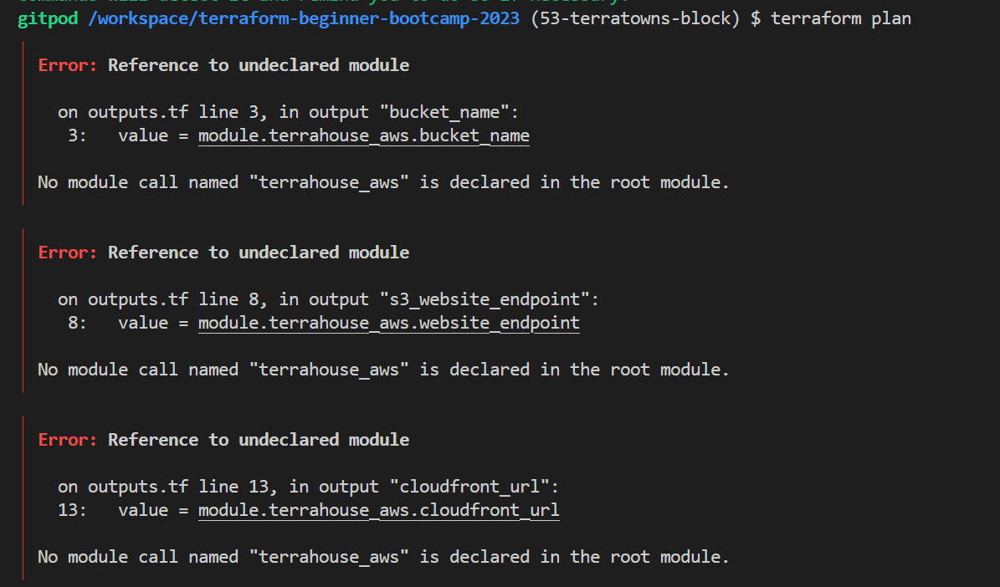

To ensure that the changes made were effective, the following steps were taken:

- Make sure module blocks were commented to avoid interference.
- Make sure all output lines in the root also.

|tf plan will [now work](../assets/2.2.0/planned-as-required.png) with No changes. .|
|:---|
|Your infrastructure matches the configuration|

- Run `terraform apply` or just `tfaa` again to push our code with auto approve using our [previous configured alias](https://github.com/yaya2devops/terraform-beginner-bootcamp-2023/tree/35-s3-static-website-host#bonus-three-captured).

Things are working great now!

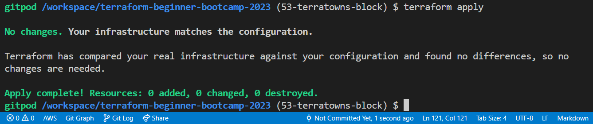

|Applying the configuration will produce an empty Terraform state|
|---:|
|This is actually a positive and desired outcome|


#### Good Stuff!
Version `2.2.0` of the TerraTown Provider saw improvements in the build script, custom provider configuration, debugging capabilities, and error resolution. 

We're also introducing the Terraform block for our new custom provider, ensuring its functionality. 

`2.3.0` is our final step and will involve a more in-depth exploration of Go and the coding of the actual resources for our provider.


# TerraTowns Resource Skeleton

In the previous setup `2.2.0`, we did not define any resources for our provider but layed the required to do so!

Now, let's begin with the creation of a `2.3.0` Resource Skeleton. <br>
We'll create a basic structure for a new resource and introduce some Go programming concepts along the way.
+ [Preparing and Energizing](#preparing-and-energizing)
+ [Writing Provider Configuration](#writing-provider-configuration)
+ [Setting Up a Resource](#setting-up-a-resource)
+ [Production Considerations](#production-considerations)
      
The next `2.4.0` is where we will actually go and fill those cruds as per our requirements in go.

### Preparing and Energizing
Take note of the extensions you'll need, such as Go and Golang tools.
1. Before all, uncomment the validator in your `main.go` code if you didn't remove it.

I did cause I want my code neat. <br>[Take a look.](https://github.com/yaya2devops/terraform-beginner-bootcamp-2023/blob/2.4.0/terraform-provider-terratowns/main.go) <br>
I coded it again.

2. Add 	`ValidateFunc: validateUUID`, to your schema uuid block.
3. Also re-enable logging.
```
import ("log")
```
4. Also, ensure that you are working within the Terraform tab,

We have set up debugging for this context.

#### Issue Processing master
5. build our provider to see, you may encounter errors. 
6.  Replace single quotes (`''`) with double quotes (`""`) for the func validator.
7.  Build again; if you encounter errors, include 'google' in the import statement for 'uuid' lib.
```
	github.com/google/uuid v1.3.0
```
8. Use `go get` to fetch dependencies from the specified GitHub URL<br>
```tf
/terraform-provider-terratowns (55-terratowns-cruds) 
$ go get github.com/google/uuid
go: upgraded github.com/google/uuid v1.3.0 => v1.3.1
```
> Make sure you are inside the correct directory.
9. Return to the our directory and build again or stay..
You may encounter more errors;
- If related to `append`, adjust the error handling to `errors`
- If related to missing returns, make sure to add them as needed.
In some cases, returning `true` may be necessary, but `return` alone can work effectively.<br>
Keep in mind that building providers in Go can be complex, and it's okay if you're just starting to get the hang of it.<br>
10. Go build again, and should work fine now.

11. Proceed with `terterraform init`. 
You should see logs indicating a successful initialization. <br>
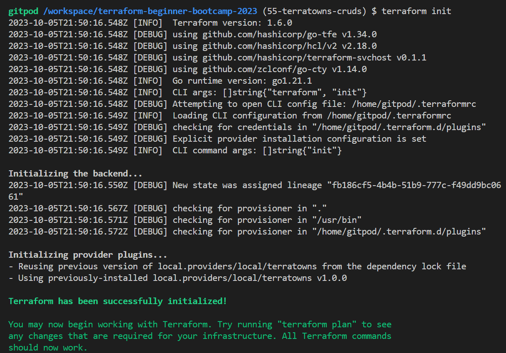
12. run `tf plan` and observe
- No errors found!
- No infrastructure changes!

```sh
2023-10-05T21:52:23.756Z [INFO]  backend/local: plan operation completed

No changes. Your infrastructure matches the configuration.

Terraform has compared your real infrastructure against your configuration and found no
differences, so no changes are needed.
```
This is expected at this stage aka **back to black!**


## Writing Provider Configuration

Create a `providerConfigure` function.<br> We will start by writing some initial code.


```go
func providerConfigure(p *schema.Provider) schema.ConfigureContextFunc {
}
```

1. Add the return func nested within;
```go
	return func(ctx context.Context, d *schema.ResourceData) (interface{}, diag.Diagnostics ) {
	}
```

2. Add the Config for `endpoint`, `token` and `uuid`;
```go
		config := Config{
			Endpoint: d.Get("endpoint").(string),
			Token: d.Get("token").(string),
			UserUuid: d.Get("user_uuid").(string),
		}
		return &config, nil
```
3. Fix two prints to help in the debug;
```go
    // Before Config
		log.Print("providerConfigure:start")
    // Before Return
		log.Print("providerConfigure:end")
```
4. Add or uncomment if the following line before returnig `p` in provider schema func;
```go
	p.ConfigureContextFunc = providerConfigure(p)
```
5. **Rebuild** the provider after adding the `providerConfigure` function.
you may encounter errors related to undefined elements.
6. To fix that, **Import More Dependencies**
    - Import `diag`, `context` packages.
    ```go
    	import (
        "context"
        "github.com/hashicorp/terraform-plugin-sdk/v2/diag")
    ```
7. For config, Define your own structure for the configuration after the `import`
```go
type Config struct {
  Endpoint string
  Token string
  UserUuid string
}
```

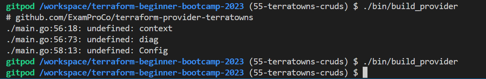

We are all set, lets setup our resource.

### Setting Up a Resource
Next, we'll set up a resource for the provider. We will define our Cruds and code these actions as separate functions.

While we could create separate files for this, we'll keep everything together for readability your ease of learn.

1. **Modify Provider Schema**
    - In the provider schema (provider.pro), add the resource name `terrtowns_home`.
```go
		ResourcesMap:  map[string]*schema.Resource{
      // added the following:
			"terratowns_home": Resource(),
		},
```

2. **Resource Functions**

Define the four basic CRUD actions for your resource block;
```go
func Resource() *schema.Resource {
	log.Print("Resource:start")
	resource := &schema.Resource{
		CreateContext: resourceHouseCreate,
		ReadContext: resourceHouseRead,
		UpdateContext: resourceHouseUpdate,
		DeleteContext: resourceHouseDelete,
	}
	log.Print("Resource:start")
	return resource
}
```
These actions are standard for every resource in a Terraform provider. 
We have to code a func  skeleton for each.

**Starting with the create;**

```go
func resourceHouseCreate(ctx context.Context, d *schema.ResourceData, m interface{}) diag.Diagnostics {
	var diags diag.Diagnostics
	return diags
}
```

**Proceed to the read;**
```go
func resourceHouseRead(ctx context.Context, d *schema.ResourceData, m interface{}) diag.Diagnostics {
	var diags diag.Diagnostics
	return diags
}
```

**Advance to the update;**
```go
func resourceHouseUpdate(ctx context.Context, d *schema.ResourceData, m interface{}) diag.Diagnostics {
	var diags diag.Diagnostics
	return diags
}
```

**Wrap the skeleton with delete;**
```go
func resourceHouseDelete(ctx context.Context, d *schema.ResourceData, m interface{}) diag.Diagnostics {
	var diags diag.Diagnostics
	return diags
}
```

- **Build Again**
    - Rebuild the provider after defining these functions.
```
./bin/build_provider
```
- **Fix Errors**

Address any issue encountered during this build process;
   
- Ensure that interface definitions are in `{}` and not `()`. and 
- Ensure there is no missing as missing commas.
- Ensure you return the resource in the main function for all actions.

- **Build Again**
    - Rebuild the provider one more time to ensure everything is working as expected.

```sh
$ ./bin/build_provider  
```
After these steps, you should have empty functions in place. This marks the completion of the skeleton setup.

> These are now coded, built again and pushed to the branch.

Everything later will come into a place in week-2-perfecting.

#### Production Considerations
In a real project, you wouldn't commit and create pull requests for these changes; <br>They would typically remain in a feature branch until the entire job is finished. 

In the next phase and last, we'll start filling in the resource and making the API calls.

|OpenAI plugins are great stuff|
|:---:|


# TerraTowns Home Resource
We welcome you in this last and intense `4/4` part of our custom terraform provider creation.

  * [Code the Terraform Resource](#code-the-terraform-resource)
  * [Building and Initializing](#building-and-initializing)
  * [Code Implementation](#code-implementation)
  * [Payload Processing in API Requests](#payload-processing-and-error-handling-in-api-requests)
* [Testing and State](#testing)


We will start by defining the schema for our resource.

I want to call it home resource. <br>But since its the only resource.. <br>We call it just resource.

Remember it is still our home 😊


### Compiling the Code
To check if everything compiles correctly first, run the following command:

```
bin/build_provider
```
## Code the Terraform Resource

1. Go to the `main.tf` file at the root level.
2. Add a new Terraform resource named `terrtown_home` and name it `home`. 
```tf
resource "terratown_home" "home" {}
```
3. Start with Including the `name`  attributes.
```tf
name = "Secrets are at the core of successful businesses"
```
> Where [I read that quote?](https://www.amazon.com/Zero-One-Notes-Startups-Future/dp/0804139296)
4. choose where you want to put your page e.g.; `gamers-groto` for `town`.
```hcl
town = "gamers-grotto"
```
5. Use the `<< >>` syntax to configure the description, similar to EOF.
```hcl
description = <<DESCRIPTION
Something so great and innovative.
Something Amazing.
As great as you.
DESCRIPTION
```
6. Retrieve the domain name from your other project (CloudFront URL) 
7. set the domain_name as an output.
```
domain_name = "very-random.cloudfront.net"
```
8. Specify the `content_version` starting with one;
```
content_version = 1
```
## Building and Initializing
Run the following commands to prepare your Terraform environment:

- Run `terraform init`


**ERROR:** `failed to query available provider packages` 

- review your Terraform configuration files include terraformrc.

Everything looks fine..<br>We didnt finish anything with the code.. <br>We still have empty resources in `main.go` it may be why..

Lets keep coding and see.

## Code Implementation
Next, we need to code the CRUD (Create, Read, Update, Delete) operations for our resource.

### Create Action
- Implement the HTTP request and endpoint for creating a resource.
```go
	req, err := http.NewRequest("POST", config.Endpoint+"/u/"+config.UserUuid+"/homes", bytes.NewBuffer(payloadBytes))
	if err != nil {
		return diag.FromErr(err)
	}
```
- Add authorization and your bearer token to the create request.
```go
	req.Header.Set("Authorization", "Bearer "+config.Token)
```
- Set headers for content type and accept.
```go
	req.Header.Set("Content-Type", "application/json")
	req.Header.Set("Accept", "application/json")
```
- Ensure that you handle any errors and parse the response.

```go
if err != nil {
   return diag.FromErr(err)
}
defer resp.Body.Close()

// parse response JSON
var responseData map[string]interface{}
if err := json.NewDecoder(resp.Body).Decode(&responseData);  err != nil {
   return diag.FromErr(err)
}

// StatusOK = 200 HTTP Response Code
if resp.StatusCode != http.StatusOK {
   return diag.FromErr(fmt.Errorf("failed to create home resource, status_code: %d, status: %s, body %s", resp.StatusCode, resp.Status, bytes.NewBuffer(responseData)))
}
```
- Return the `homeUUID` from the response and set it using `d.Set`.

```go
homeUUID := responseData["uuid"].(string)
d.SetId(homeUUID)
```

- Add print at the start for debugging purposes

```go
log.Print("resourceHouseCreate:start")
```
### Read Action
- Implement the HTTP GET request for reading a resource.

```go
req, err := http.NewRequest("GET", config.Endpoint+"/u/"+config.UserUuid+"/homes/"+homeUUID, nil)
if err != nil {
   return diag.FromErr(err)
}
```
- Pass the `homeUUID` in the URL.
- Set the headers for the read func
```go
req.Header.Set("Authorization", "Bearer "+config.Token)
req.Header.Set("Content-Type", "application/json")
req.Header.Set("Accept", "application/json")
```
- Parse the response data and return it.

```go
	client := http.Client{}
	resp, err := client.Do(req)
	if err != nil {
		return diag.FromErr(err)
	}
```
Consider the code to handle errors gracefully. <br>(Coming below)
### Update Action
- Implement the HTTP request for updating a resource.

```go
	req, err := http.NewRequest("PUT", config.Endpoint+"/u/"+config.UserUuid+"/homes/"+homeUUID, bytes.NewBuffer(payloadBytes))
	if err != nil {
		return diag.FromErr(error)
	}
```
- Set the header for the update

```go
	req.Header.Set("Authorization", "Bearer "+config.Token)
	req.Header.Set("Content-Type", "application/json")
	req.Header.Set("Accept", "application/json")
```
- Use the payload from the create action but exclude domain and town.
- Set the payload data in `d.Set` for name, description, and content version.

```go
	d.Set("name",payload["name"])
	d.Set("name",payload["description"])
	d.Set("content_version",payload["content_version"])
```

### Delete Action
- Implement the HTTP request for deleting a resource.

```GO
	req, err := http.NewRequest("DELETE", config.Endpoint+"/u/"+config.UserUuid+"/homes/"+homeUUID, nil)
	if err != nil {
		return diag.FromErr(err)
	}
```
- Set the ID if the operation is successful and a print.

```GO
	d.SetId("")
	log.Print("resourceHouseDelete:end")
```


|This repetition could potentially be refactored; try?|
|:---|
| try?|


Next, we need to conduct the client call following the header, both for the delete operation and similarly for the update, read, and create operations.


## Payload Processing and Error Handling in API Requests

The message body should contain all the details, here is a design for your reference.


1. **Pay Payload for a Post**
   - To begin, we need to pay a payload for a post in createfunc.
```go
	payloadBytes, err := json.Marshal(payload)
	if err != nil {
		return diag.FromErr(err)
	}
```

2. **Create Configuration**
   - Now, let's return to the creation process.
   - After configuring, we need to pass a payload block.
```go
	payload := map[string]interface{}
    { }
   ```
3. **Payload Formatting**
   - It's important to format the payload properly.
   - Consider using a JSON function to convert it into bytes and add it as an argument to the next step.
```
"name": d.Get("name").(string),
"description": d.Get("description").(string),
"domain_name": d.Get("domain_namae").(string),
"town": d.Get("town").(string),
"content_version": d.Get("content_version").(int64),
```
4. **Handling the Response**
   - After completing the payload and putting it in the body, we should receive a response.
   - We'll need to perform actions based on this response.
   - Parse the response data.
```go
var responseData map[string]interface{}
if err := json.NewDecoder(resp.Body).Decode(&responseData);  err != nil {
   return diag.FromErr(err)
}
```

5. **Closing the Response Body**
   - Don't forget to close the response body after you're done with it.
   - Use `resp.Body.Close()` to accomplish this.
```go
	defer resp.Body.Close()
```
6. **Error Handling in Create**
   - Obtain the code that will detect and handle errors from the server during the create process.
   - Check if `resp.StatusCode` is not equal to `http.StatusOK` to determine if an error occurred.
```go
	if resp.StatusCode != http.StatusOK {
		return diag.FromErr(fmt.Errorf("failed to create home resource, status_code: %d, status: %s, body %s", resp.StatusCode, resp.Status, bytes.NewBuffer(responseData)))
	}
```
7. **Handling Errors in Delete**
   - Similarly, for the delete operation, you'll need to implement error handling.
   - Check the response status code for errors.
```go
	if resp.StatusCode != http.StatusOK {
		return diag.FromErr(fmt.Errorf("failed to delete home resource, status_code: %d, status: %s, body %s", resp.StatusCode, resp.Status, responseData))
	}
```
8. **Setting the ID Value**
   - In Terraform, when working with resources, it's essential to return an ID.
   - In the create step, add the following:
     - `homeUUID := response uuid string`
     - Set `d` to this value and print for debug.

```go
	d.SetId("")

	log.Print("resourceHouseDelete:end")
```

###  Setting the ID Value
In Terraform, it's important to return an ID whenever you have a resource.
   - In the create step, add the following:
     - `homeUUID := response uuid string`
     - Set `d` to this value, e.g., `d.set(homeUUID)`.

### Reading Resource Data
Now, let's focus on the read operation.
   - We need the home ID for this.
```go
   config := m.(*Config)
	homeUUID := d.Id()
```
   - Revise the response status code to use an "if-else" structure.
     - If it's OK, return the data.

```go

	if resp.StatusCode == http.StatusOK {
		// parse response JSON
		if err := json.NewDecoder(resp.Body).Decode(&responseData);  err != nil {
			return diag.FromErr(err)
		}
       // d.set
	} else if resp.StatusCode != http.StatusNotFound {
		d.SetId("")
	} 
```
   - Use `d.Set` for all the content to be read, such as `name`, `content`, `desc`, `domain`, etc.
```GO
		d.Set("name",responseData["name"].(string))
		d.Set("description",responseData["description"].(string))
		d.Set("domain_name",responseData["domain_name"].(string))
		d.Set("content_version",responseData["content_version"].(int64))
```
   - Consider handling cases where the status is not available to avoid config drift.
```go
else if resp.StatusCode != http.StatusOK {
		return diag.FromErr(fmt.Errorf("failed to read home resource, status_code: %d, status: %s, body %s", resp.StatusCode, resp.Status, responseData))
	}
```

Good work!
### Updating Resources
For the update operation, you'll need to use the payload from the create operation.
   - Exclude the `domain` and `town` since these should not change.
   - Return the payload values for `name`, `desc`, `description`, and `content_ver`.
   - Use `d.Set` to update these values.

# Testing
After implementing these actions, you should test your provider.

1. Build and initialize Terraform.
```
./bin/build_provider
```
We have some issues and **syntax error.**
2. Replace `err != {` with `err != nil {` in your code to resolve the issue.

```go
// Before
if err != {
		return diag.FromErr(err)
	}

// After
if err != nil {
		return diag.FromErr(err)
	}
```
- Build again **baby.**
```
./bin/build_provider
```

Error. **HTTP error**

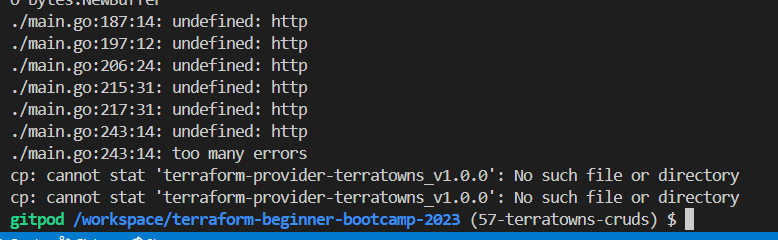

- import the necessary package, you can add the statement as follows:
```go
import ("net/http")
```

- Build again **one more**.
```
./bin/build_provider
```
Error. **We have an `undefined.FrontErr`.**

- Change this with correct the usage of the identifier with this;

```
FromErr
```

- **Building building**!

```
./bin/build_provider
```

Another cute error,  **the "bytes" library is required.**

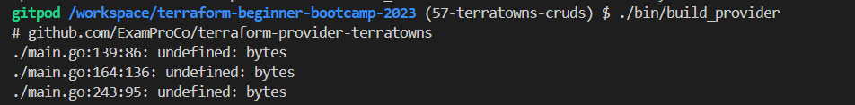

- You can add the import statement like this to resolve the issue in your main.go:
```go
import ( "bytes")
```


We have gone through multiple builds, and to avoid spamming you with more build errors, I will now list the errors we encountered and how we resolved them.

**The Next ERROR;**
- The variable `payloadBytes` is declared but not utilized on line 255 because we need to pass it instead of `nil`.
-  We should use `bytes.NewBuffer` to create the buffer since it's not reading. The same adjustment should be made for the `createAction` and `readOnly` functions.

**The Next ERROR +1;**
- We don't need `responseData` for the update operation. We are not interested in it. 
- Please remove `responseData` and only capture the response body.
- Take the `responseData` from the delete function as well.

8. Building the great build!

```
./bin/build_provider
```

We've successfully built it now!

|🤯|It's okay if it seems confusing at the moment;|
|:---:|:---|
|💯|Things will get easier|
|🧐|When we start examining the tfstate file|
|💪|Don't give up King or Queen. |


### Test The Magic

Does this actually now provision anything? 
Is it working as expected? 

This is communicating with our Sinatra server.

1. do `tf init` and let's see.

We encountered a failure while querying available provider packages.

- Please ensure consistency in naming.
- Use the resource name `terratowns_home` instead of `terratown_home`.

2. check your terraform providers locally.

```sh
$ terraform providers

Providers required by configuration:
.
├── provider[local.providers/local/terratowns] 1.0.0
└── provider[registry.terraform.io/hashicorp/terratown]
```

3. do it again after the update! Perfect.

```sh
Providers required by configuration:
.
└── provider[local.providers/local/terratowns] 1.0.0
```
This change is necessary because in the provider schema function of `main.go`, it is defined as `teratown_home`.


3. Double check `tf init` now. Works!
4. `terraform plan` and let's see.

We've got the resource! `A custom resource has been planned`!

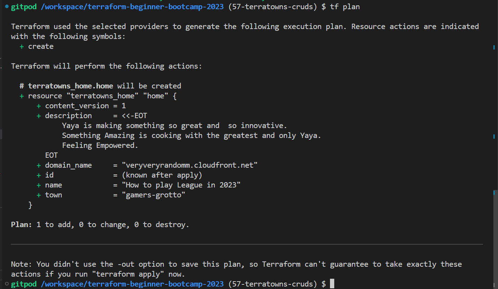

- The mock server is not a real server, 
- This won't behave exactly the same way as the actual server.

We can play a little bit around before targetting the terratown.

- Apply your changes with `terraform apply` for **too much errors to come ofc**.

| Step | Error Description                                     | Resolution                                               |
| ---- | ----------------------------------------------------- | -------------------------------------------------------- |
| 1    | Spelling mistake: `domain_namae` -> `name`           | Update the variable name to "name"                       |
| 2    | Build provider to delete files                        | Execute `./bin/build_provider`                            |
| 3    | Initialize and apply Terraform                        | Run `terraform init` and `terraform apply`                |
| 4    | Code block issue with `<`, related to JSON parsing   | Ensure the response is valid JSON and not HTML or other   |
| 5    | Invalid character `<`, looking for value start       | Validate the data from the API is valid JSON             |
| 6    | URL adjustment needed: hit "/api/home" instead       | Change the URL to "/api/home"                            |
| 7    | Issue with endpoint in create script (only "home")   | Modify the endpoint to include "/api" in `main.tf`       |
| 8    | Reattempt after endpoint correction                  | Rebuild, initialize, and apply                           |

<br> 

I've found a better way to present the errors I encountered in **these eight steps** above, allowing you to tackle and resolve each one systematically.

The last apply will get your custom resource to be provisioned. 

Great and cool!

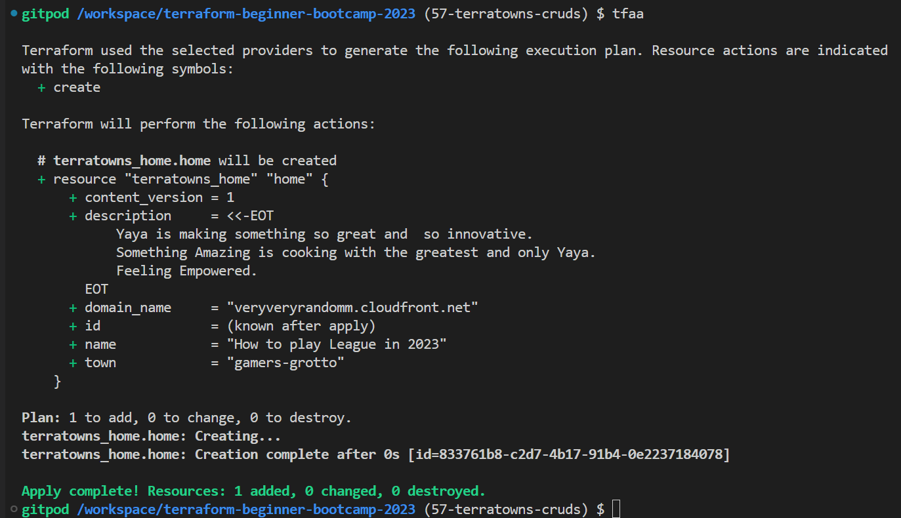

**NOTE:** I had to [deal with a 401](../assets/2.4.0/401-issue.png) before my last succefull apply. <br>I fixed with a simple replace of the current uuid with mine for the sinatra server.

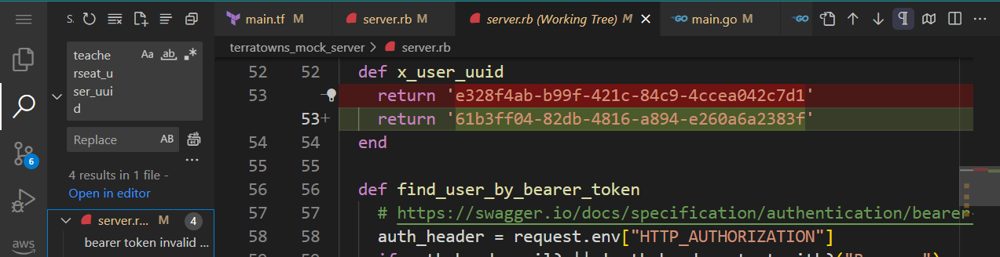


## State File Effects
It's retaining this state, so we should be able to continue mocking it.

The state file in Terraform keeps track of the resource's status, including the `homeUUID`. It's crucial for Terraform to maintain resource mapping.
```json
{
  "version": 4,
  "terraform_version": "1.6.0",
  "serial": 3,
  "lineage": "861def3e-f028-0a8f-c9bd-de51c87602fb",
  "outputs": {},
  "resources": [
    {
      "mode": "managed",
      "type": "terratowns_home",
      "name": "home",
      "provider": "provider[\"local.providers/local/terratowns\"]",
      "instances": [
        {
          "schema_version": 0,
          "attributes": {
            "content_version": 1,
            "description": "Yaya is making something so great and  so innovative.\nSomething Amazing is cooking with the greatest and only Yaya.\nFeeling Empowered.\n",
            "domain_name": "veryveryrandomm.cloudfront.net",
            "id": "833761b8-c2d7-4b17-91b4-0e2237184078",
            "name": "How to play League in 2023",
            "town": "gamers-grotto"
          },
          "sensitive_attributes": [],
          "private": "bnVsbA=="
        }
      ]
    }
  ],
  "check_results": null
}
```

Examine the state file to check for sensitive data (a valuable lesson to be learned).
- It does not store sensitive data here.
- We can view our schema for the resource and the provider we created.

The most important aspect is the ID, as the Terraform provider relies on it to maintain the mapping accurately.

## Correct and Make Changes
You can make changes to your resource properties and apply them. 

Terraform will detect and update the state accordingly.


#### Let's Make Changes

1. Change `name` to `resource name` in `main.tf` and we encounter an error.
   - We wanted "home," but it's "House," e.g., "HouseCreate."
2. Change `init` to `float64`.
   - Another error occurs because of the state file.
   - Error occurs because in one place it's `init`, and in another, it's `float64`.
3. Data type mapping:
   - Create: `int`
   - Read: `float64`
   - Update: `int`
   - This mapping is based on how the response is received.
4. Resolution Steps:
   - Build.
   - Delete state.
   - Stop Sinatra.
   - `tf init`.
   - `tf apply --auto-approve`.
   - These steps are taken to resolve the error.
5. It was created.
   - Go to Sinatra and verify.
   - Confirm that it's created.
6. Make a change, and then reapply.
   - It detects that the description has changed and prompts for confirmation.
   - Observe that the state now contains the updated information.
7. There's a double name in the update; change it to "description" and double-check.
   - Ensure that there is no duplication.
8. Make an update to the description or name.
   - Run `tf apply`.
   - Ensure Sinatra is running.
> Also, the apply do both update and show.
9. It updates our state, and the names align as desired.
   - Confirm that the state reflects the changes.

#### Cleanup

10. Destroy the state. All is perfect!

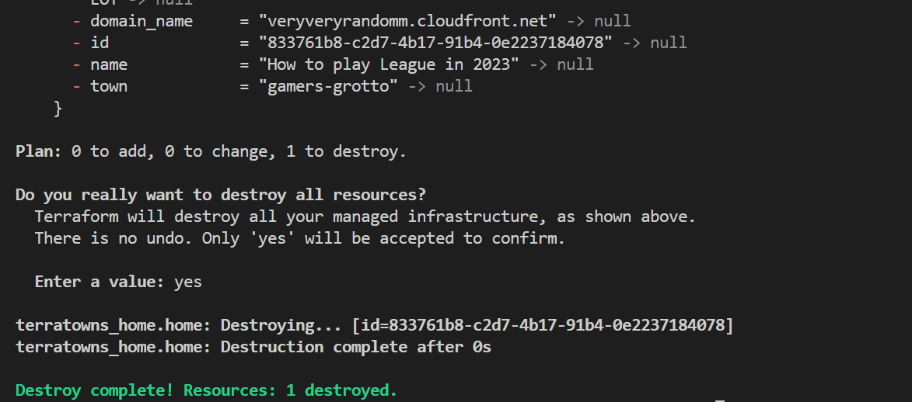

Destroying the state will remove it completely. I used to play [league of legends](https://en.wikipedia.org/wiki/League_of_Legends) from the age 16 to 20.

Up from that point, I live in the cloud.

### Considerations

- Are there any edge cases? (unknown)
- Are there any overlooked factors? (unknown)

Writing a robust Terraform provider can be a challenging task. <br>It's impressive to achieve this, and it's undeniably cool!


- The next step involves utilizing the provider with the actual Terratown endpoint.
- This will require setting up Terratown accounts and obtaining the necessary access.

We've reached a significant milestone with our progress. <br> 

|🛑|This is a hard good Stop! |
|:--:|:--|
|We |did good and a lot. :D|


# Target TerraTowns API

Welcome to `2.5.0` where we'll be testing our custom provider against real TerraTowns infrastructure. 

+ [Configuration Steps](#configuration-steps)
+ [Initial Terratowns Testing](#initial-terratowns-testing)
+ [Token Handling](#token-handling)
  + [Example for access token](#example-for-access-token)
  + [Bucket Name Randomization](#bucket-name-randomization)
+ [Testing Your First TerraTown](#testing-your-first-terratown)


We will be configuring access tokens, endpoints, and other necessary settings to ensure our custom provider works seamlessly with TerraTowns.

### Configuration Steps

We will get Terraformcloud back.


#### 1. Access Token Setup

To use TerraTown, follow these steps:

1. In your provider block, set the endpoint to `terratowns.cloud/api`.
2. Obtain your user UUID from your ExamPro account.
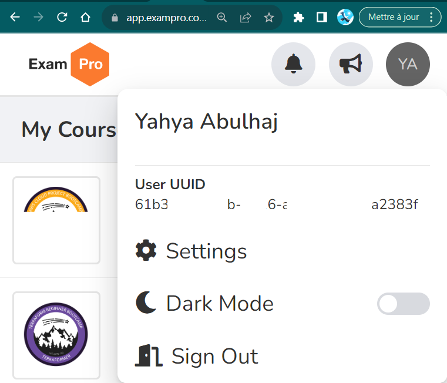 
3. Just there, click setting and
4. Click Vending machine from left pane.
5. Click on TerraTowns Access Code
6. Get the access token below in the page.

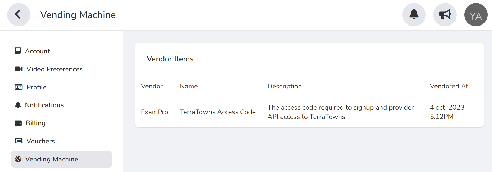 


### Initial Terratowns Testing
1. Go to your `main.tf` custom provider and fill in the uuid values.
```sh
  endpoint = "http://localhost:4567/api"
  user_uuid="" 
  token=""
```
**To**;
```sh
  endpoint = "http://terratowns.cloud/api"
  user_uuid="" 
  token=""
```
> ⚠️Don't commit your values. We will var them later.
2. Fill with missingo as our first town of choice in our one and only `terratowns_home` resource.
```tf
  town = "gamers-grotto"
```
This how we target where our page will be part of.
3. Try a random domain url for now.
The domain doesn't lead to any destination, but that's fine. Let it be, for now. For You
4. Execute the following command:
```
./bin/build_provider
```
5. Initialize and apply Terraform:
```
tf init
tf apply
```
After execution, you will receive valuable debugging information.
6. Confirm by clicking `Yes.`
You may have another 401 error, like we had earlier.
- Map the UUID again in server.rb with the one from ExamPro.
- Make sure you target terraform.cloud in your endpoint.
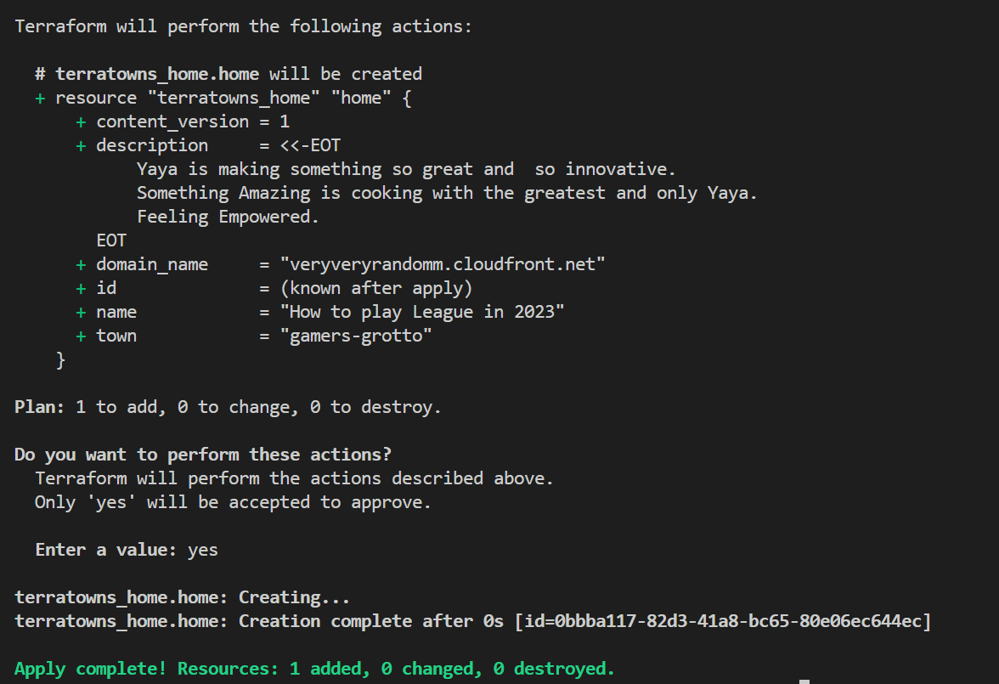
7. Make sure you apply your changes.
8. Navigate to terratowns.cloud/t/ur-town.

You will find your profile displayed as a rectangle. <br>
Clicking it will redirect you to the seemingly useless CloudFront.

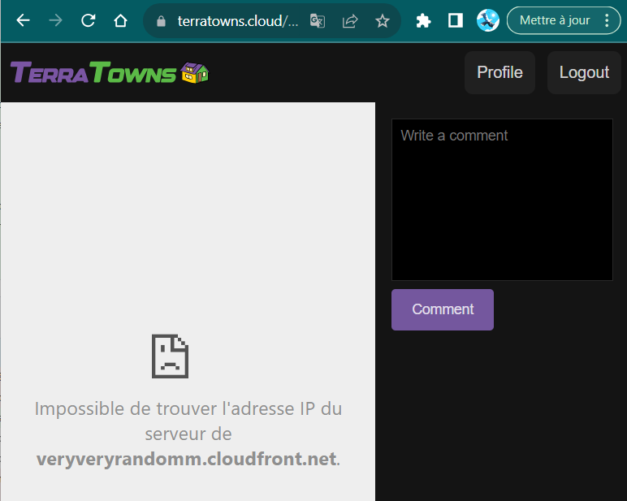

### CloudFront Mapping

Now, the question is whether the CloudFront real URL will take you to this location, or if we need to pass custom headers or headers through CloudFront to make it work. This will be determined.


**Btw;**
|Update not allowed If you change your domain name|
|:---|
|By design, You will need to perform a total teardown|

5. To proceed, execute the following command:
```
tf destroy
```
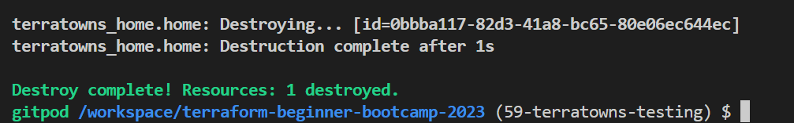

6. Update the url to map to your own cloudfront url.
7. Click on your post in [terratowns.cloud](https://terratowns.cloud/).

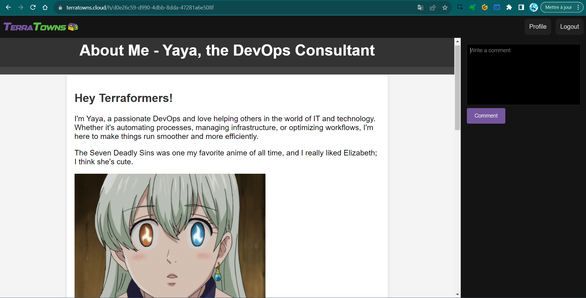

It is now directing to my page. It has anime in it with 

### Token Handling

To securely handle tokens, do the following:

- Avoid storing them directly in the `main.tf` file. 
- Use the `TF_VARS` environment variables for token management. 
#### Example for access token
```
export TF_VARS_terratowns_access_token="your_access_token_here"
gp env TF_VARS_terratowns_access_token="your_access_token_here"
```


This will allow you to reference the access token in your `main.tf` file using `var.terratowns_access_token`.


#### Endpoint and UUID Configuration
1. Set the TerraTowns endpoint in your `terraform.tfvars` file:
```
terratowns_endpoint = "https://terratowns.cloud/api"
```
If set wrong; verify `TF_VAR` and not `TF_VARS`.
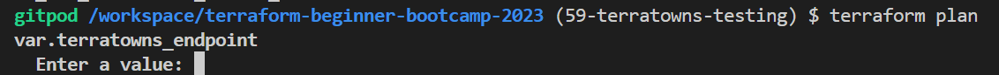<br>
You can access the endpoint in your code using `var.terratowns_endpoint`.
```sh
export TF_VAR_terratowns_endpoint="terratowns.cloud/api"
```
`user_uuid` already there we can call it just var.user_uuid. Let employ this..
2. Run the following commands in your gitpod and incldue your uuid;
```sh
export TF_VAR_teacherseat_user_uuid="pastehere"
gp env TF_VAR_teacherseat_user_uuid="pastehere"
```
3. Define those variables in your variables.tf, otherwise it wont work.

```hcl
variable "terratowns_endpoint" {
 type = string
}

variable "terratowns_access_token" {
 type = string
}

variable "teacherseat_user_uuid" {
 type = string
}
```

#### Second Sprint
4. remove the previous `uuid` assignement.
5. Add it to the commented terrahouse module (for last tag)
6. Employ the same for our access token.
```sh
export TF_VAR_terratowns_access_token=""
gp env TF_VAR_terratowns_access_token=""
```
7. Set your real Cloudfront URL and let's give trry
```sh
  domain_name = module.terrahouse_aws.cloudfront_url
```
8. uncomment your terrahouse module.
9. Update your `terraform.tfvars` from `terraform.tfvars.sample` just in case you have code inline.
10. Run `tf init` is success follow it by `tf apply`;

> [Error on the way.](https://chat.openai.com/share/78308298-de74-4021-a294-7c715c768707)

Is there another error in the code? <br>Haha, remember that trap from Week Zero?

I fixed this already. But allow me please to fix yours in the next section.

This can help `env | grep TF_VAR`

#### Master Resolve For You

After initializing and applying Terraform configurations, you may encounter errors. 

Ensure that the asset URL in `tfvars.sample` ends with a `/`. Also, add the `asset_path` parameter to the TerraHouse AWS module.

1. Append a `/` to the end of the asset URL in `tfvars.sample`.
2. Within the `terrrhouse_aws` module, specifically in the main Terraform root file main.tf, pass the value of `var.assets._path` as `asset_path`.
3. Feel free to run terraform apply which will end up a great success.

The sole distinctive aspect in this situation is related to the unique bucket name.

### Bucket Name Randomization

I believe we've successfully handled validation and using a random provider, now it's time to standardize the process for generating bucket names.

Let's generate a random bucket name just for the sake of it.


To make the bucket name random:
1. Obtain the bucket name from `tfvars` and the TerraHouse AWS module.
```hcl
module "terrahouse_aws" {
  source = "./modules/terrahouse_aws"
  user_uuid = var.teacherseat_user_uuid
  index_html_filepath = var.index_html_filepath
  error_html_filepath = var.error_html_filepath
  content_version = var.content_version
  assets_path = var.assets_path
}
```
2. Add comment for the bucket name setting in the CDN module and change as required;
```sh
  comment             = "Static website hosting for: ${var.bucket_name}"

  comment             = "Static website hosting for: ${aws_s3_bucket.website_bucket.bucket}"
```
3. Update variables and remove bucket validation in the CDN module. (I did in previous instruction)
4. Modify the CDN module to reference the update bucket output.
```hcl
  name   = "OAC ${aws_s3_bucket.website_bucket.bucket}"
  description  = "Origin Access Controls for Static Website Hosting ${aws_s3_bucket.website_bucket.bucket}"
```

- The terraform plan touchpoint will tell that the bucket name it provides afterward (know after apply)
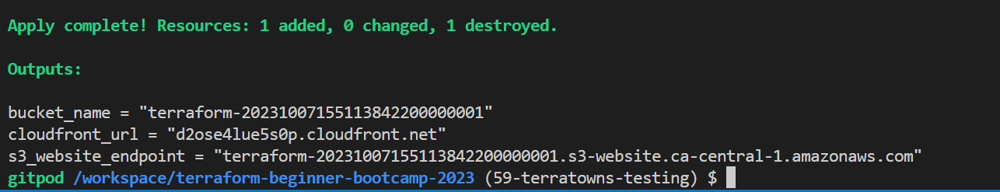

After applying Terraform configurations, the bucket name should be randomized.

The reason you observe the creation of **only a single resource** is because the apply becomes hang and it needed the AWS CLI to execute the invalidation process.

This was a preivously running workspace. I ran the aws cli  again using our script briefly and get the apply going.

### Testing Your First TerraHome

Now if you go you can find ur page there.
terraform.cloud/

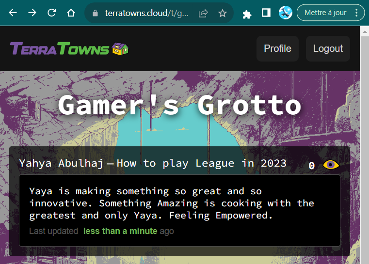

|[Check it out!](https://terratowns.cloud/t/gamers-grotto)|
|---|
|It is a mix of gaming and anime. Hope you like the creativity.|


Once you have configured TerraTown, we can:

- Access your TerraTown page.
- Configure multiple pages if needed.
- Test updates to ensure everything works as expected.
- Pushing our custom provider to the community.

|For further, consider integrating TerraTown..|
|:---:|
|with Terraform Cloud!|

<br>

We are currently in the final stages of completing version `2.5.0` and soon.. <br>Everything😔 

This specific provides a clear overview and step-by-step instructions for testing your custom provider against TerraTowns and pushing your post and your site to the town.

# Terraform Turbocharge Workflow

Welcome to the Terraform  `2.6.0` last official release with primary objective to integrate Terraform Cloud with our local development environments.
  * [Problematic 101](#problematic-101)
  * [Problematic 202](#problematic-202)
  * [Resovlver Pro Max](#resovlver-pro-max)
  * [Head over Terraform Cloud](#head-over-terraform-cloud)

The following comes after an experience with different ways to work with terraform and thus coming up with the best possible solution.

The multiple home feature was part of this and it now part of `2.7.0`.<br>
Learn more [about our methodology](https://github.com/yaya2devops/terraform-beginner-bootcamp-2023/issues/61).


## Problematic 101
We previously operated exclusively using local execution, which resulted in rapid infrastructure planning and implementation. 

|❌|We encountered a challenge|
|:---:|:---|
|❌|our infrastructure state was lost whenever we stopped our workspace|

## Problematic 202
We have now made a complete shift to using Terraform Cloud, and this transition has yielded positive outcomes for our state management. Our infrastructure state is secure and preserved, ensuring that it remains intact even when we pause our work.

|❌|When utilizing Terraform Cloud's compute resources|
|:---:|:---|
|❌|We have observed a decrease in execution speed|

## Resovlver Pro Max
These experiences bring us to the following solution.

**Ensuring safety and persistence and never lose your state;**

|⛑️|Preserve and manage our infrastructure state within Terraform Cloud |
|:---:|:---|
|✅|Use Terraform Cloud|

**Optimize for the speed of our operations;**

|🏎️| Conduct our computations and executions |
|:---:|:---|
|✅|using A local CDE infrastructure|

<br>

Welcome to this self-dedicated space for version `2.6.0`.


## Head over Terraform Cloud

I thought you may forget what is that. [Get the knowledge back.](https://developer.hashicorp.com/terraform/cloud-docs)

1. Access Terraform Cloud by following these steps:
   - Click "Try Terraform Cloud."
   - Select your "terra-house-1" project.

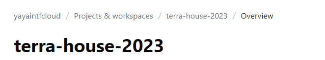

2. Configure Execution Mode:
   - Change the execution mode to "local" in Terraform Cloud. 
   - After you picked your project, click **settings** from the left pane<br>
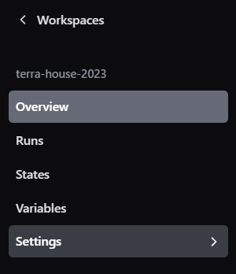

**The general pane will now popup.**
  - In the same page, swipe below and look for exec mode.<br>
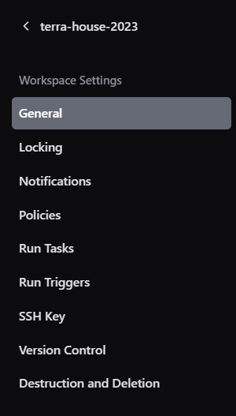

You will find that there is no option for local execution.

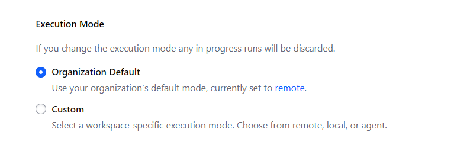

Also you see that your organization is set on the remote as shown in this asset.

  - Click set to **remote** direction.

This will take you to organization  general settings.
  - Look at your org setting and leave it as it is.

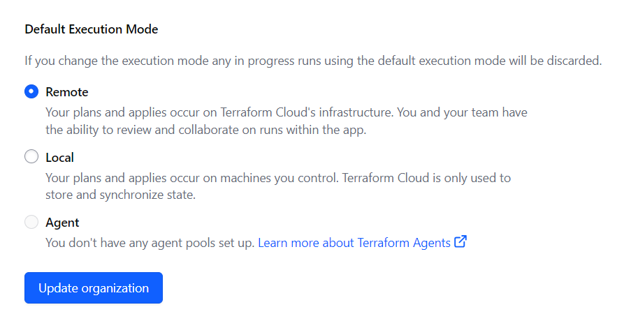

 - Go back to your project level.
 - Click on custom, pick a the local option and click update below.

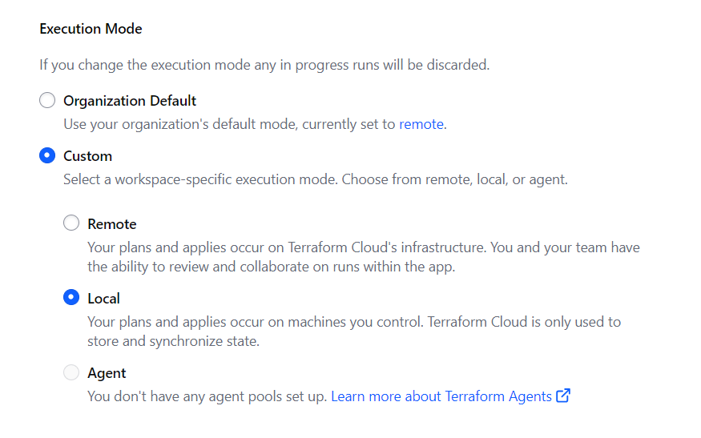

This is done to improve command execution speed as running commands directly in Terraform Cloud might be slower. 

Remmember again that it's essential to keep your state safe in the cloud.

**Note:** Make sure to update the project level settings, not the organization level.

- Return to GitPod:
   - In your GitPod environment, add the "cloud" section in your main.tf file e.g.

```hcl
cloud {
organization = "yayaintfcloud"

workspaces {
  name = "terra-house-2023"
}
}
```
   - Build the plugin provider and set it to auto in the Terraform section.

- Initialize and apply the Terraform configuration:
   - Run `terraform init` <br>
   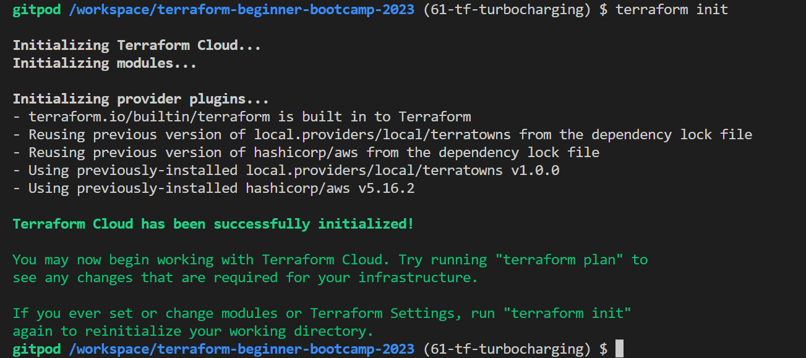
   
   - Followed by `terraform apply` to deploy your configuration to Terraform Cloud.

Observe the state is now in your terraform dotfile.

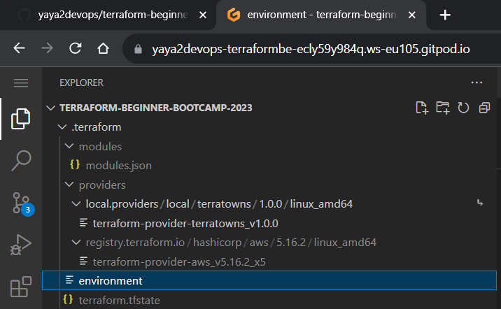

Have you also noticed? **It is damn fast as it used to.** But not only that..

- Monitor the Terraform Cloud dashboard and find your state and secure and downloadable anytime, anywhere.

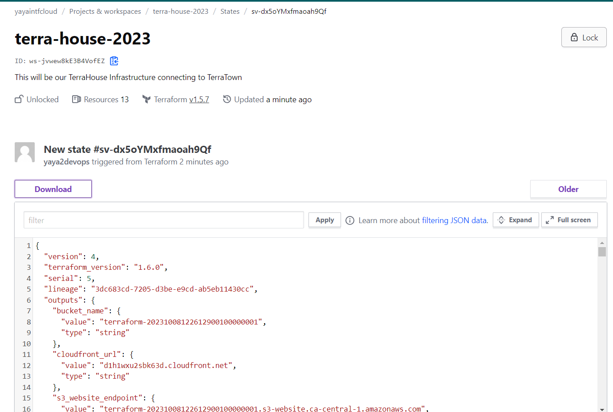

**State** is now managed by **Terraform Cloud** with your **local execution** to your development environment!

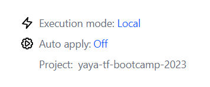

You can stop that and return to it later, **knowing that your state is stored in the cloud.**

The thing about Terraform Cloud that will not prompt for approvals but will display the current status of your operations. 


### Additional.

In order for me to do this. <br>I had to migrate to codespaces and did the entire process from the start to finish to name a few;
- Terraform Login
- AWS Credentials
- Configured terraformrc dot file.
- Explore the plugin path.
- Dealt with too many instant error/resolve.

Great, cool and easy now.<br> **Consider pushing the provider to the registry for future use.**

# TerraHomes to TerraTowns
This is setup in `2.7.0` will lay the foundation to enable you with the creation of multiple homes or houses within the platform as it now supports up to twelve homes or houses.

  * [The First Music Post](#the-first-music-post)
    + [Check out The Music Home](#check-out-the-music-home)
  * [Check Out The Tunisian Food Post](#check-out-the-tunisian-food-post)
    + [Check Out The list in TerraHome](#check-out-the-list-in-terrahome)
+ [Terraform State Management](#terraform-state-management)
+ [Troubleshooting and Finalization](#troubleshooting-and-finalization)
+ [Joyful conclusion](#joyful-conclusion)

To enable the deployment of multiple homes simultaneously on the Terratowns platform, follow these steps:

**Step 1: Create TerraHomes Folders**

Create separate folders within the "public" directory for each home and migrate all project files to them. 

1. Create a folder named "home1" and move your project files into it.
2. Create a second folder named "home2" and duplicate the files in the same format.
3. Make sure the structure is something like this;
```sh
📁 public
  |─ 🏠 home1
  |   └─ 📂 assets
  |       └─ 🖼️ great-stuff.png
  |   └─ 📄 index.html
  |   └─ 📄 error.html
  └─ 🏠 home2
      └─ 📂 assets
          └─ 🖼️ great-stuff.png
      └─ 📄 index.html
      └─ 📄 error.html
```


**Step 2: Rename Module**

Since we are loving it on homes rather than houses..

- Rename the module from "terrahouse_aws" to `terrahome_aws.`

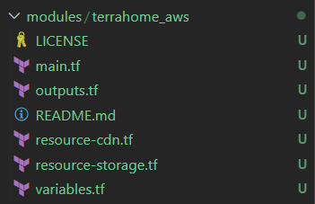

**Step 3: Update Configuration**

Make the following updates to accommodate the changes related to `terrahome_aws` variables and modules:
- Update the source to point to `./modules/terrahome_aws` instead of the old source to the `terrahouse`.
```hcl
  source = "./modules/terrahome_aws"
```
- Change the module name to match the theme, e.g.,
```hcl
module "home_tnrap_hosting" {}
```

- Modify `output.tf` to reference `home_yourhousename_hosting` instead of `terrahouse_aws.` for `bucket_name`

```hcl
  value = module.terrahouse_aws.bucket_name

  value = module.home_tnrap_hosting.bucket_name
  value = module.home_tnfood_hosting.bucket_name
```

- Do the same in for the output of `s3_website_endpoint`

```tf
  value = module.terrahouse_aws.website_endpoint

  value = module.home_tnrap_hosting.website_endpoint
  value = module.home_tnfood_hosting.website_endpoint
```

- Do the same for the `cloudfront_url` and change output to reference `domain_name` instead.

```tf
  value = module.terrahouse_aws.cloudfront_url
  value = module.home_tnrap_hosting.domain_name
```


**Step 4: Review and Update Variables in `terraform.tfvars`**

Review and update variables in the module configurations. If you need to set nested Terraform variables in the tfvars file, refer to Terraform documentation for guidance.

1. We asked GPT to help in this:
```
How do u set nested tf variables in tf vars file.
```

This is to make stuff look more damn neat.

- Remove previous `bucket_name`, `index_html_filepath`, `error_html_filepath` and `content_version` absolute path.

```sh
index_html_filepath="/workspace/terraform-beginner-bootcamp-2023/public/index.html"
error_html_filepath="/workspace/terraform-beginner-bootcamp-2023/public/error.html"
assets_path="/workspace/terraform-beginner-bootcamp-2023/public/assets/"
content_version=1
```

- Update your `terraform.tfvars` and `terraform.tfvars.sample` input for the public path and the content version in union like this;

```hcl
       house-name-1 = {
       public_path = "/workspace/terraform-beginner-bootcamp-2023/public/tnrap"
       content_version = 1
       }

       house-name-2 = {
       public_path = "/workspace/terraform-beginner-bootcamp-2023/public/tnfood"
       content_version = 1 
       }
```

**Step 5: Modify Index Variables**

- Remove previous `bucket_name`, `index_html_filepath`, `error_html_filepath` and `content_version` variables definition.

Those in tfvars will be red inlined unless you perform the following task.

- Modify the variables to include references to public paths for your homes in your `variables.tf` file instead as nested.


```
variable "home-1" {
  type = object({
    public_path = string
    content_version = number
  })
}
.
.
.
variable "home-n" {
  type = object({
    public_path = string
    content_version = number
  })
}
```


**Step 6: `main.tf` root Remove Index and Error HTML References**

Remove the "index_html_filepath" and "error_html_filepath" from your module block, and replace them with references to the "public_path" and "content_version" variables.

```hcl
module "home_tnrap_hosting" {
  source = "./modules/terrahome_aws"
  user_uuid = var.teacherseat_user_uuid

  public_path = var.arcanum.public_path
  content_version = var.arcanum.content_version
}
```


**Step 7: `main.tf` root Update Resource Configuration**

In the resource section, update the call with the new variables assigned to "cloudfront" and "content_version."

```
resource "terratowns_home" "home" {
  name = "How to play Arcanum in 2023!"
  description = <<DESCRIPTION


DESCRIPTION
  domain_name = module.home_arcanum_hosting.domain_name
  town = ""
  content_version = var.arcanum.content_version
}
```
**Step 8: Storage Module Vars Update**

1. Start with output.tf change the output `"cloudfront_url"` to `"domain_name"`

2. In `resource-storage.tf` change the `source` and `etag` path for `index_html`, `error_html` for `aws_s3_object` to map to our new vars.

```hcl
  source = var.index_html_filepath
  source = "${var.public_path}/index.html"

  etag = filemd5(var.index_html_filepath)
  etag = filemd5("${var.public_path}/index.html")


  source = var.error_html_filepath
  source = "${var.public_path}/error.html"

  etag = filemd5(var.error_html_filepath)
  etag = filemd5("${var.public_path}/error.html")
```

3. In the same file update source, etag but also the `for_each` for `upload_assets`.

```hcl
  for_each = fileset(var.assets_path,"*.{jpg,png,gif}")
  for_each = fileset("${var.public_path}/assets","*.{jpg,png,gif}")

  source = "${var.assets_path}/${each.key}"
  etag = filemd5("${var.assets_path}${each.key}")

  source = "${var.public_path}/assets/${each.key}"
  etag = filemd5("${var.public_path}/assets/${each.key}")
```

**Step 9: Module `variables.tf` Updates**
1. change our `index_html_filepath` variable to `public_path` instead.
```hcl
variable "public_path" {}
```
2. Remove its validation and rename its description.
```hcl
  description = "The file path for the public directory"
```

3. Leave it type string as it is.
```hcl
  type    = string
```

4. in the same file, terminate both `assets_path` and `error_html_filepath` and its validation.

**Step 10: Duplicate Step 5-6-7 for Another Home**

Duplicate the entire process for the module/resource to create a new home just below it.
```hcl
module "home_tnfood_hosting" {
  source = "./modules/terrahome_aws"
  user_uuid = var.teacherseat_user_uuid
  public_path = var.tnfood.public_path
  content_version = var.tnfood.content_version
}

resource "terratowns_home" "home_tnfood" {
  name = "Showing you our Tunisian Food"
  description = <<DESCRIPTION

Add yours here!

DESCRIPTION
  domain_name = module.home_tnfood_hosting.domain_name
  town = "missingo"
  content_version = var.tnfood.content_version
}
```

**Step 9: Build and Deploy**

To deploy your changes, follow these steps:

1. Ensure you are in the project directory, go to .gitpod.yml
2. add the following command with source below the copy command:
```bash
cp $PROJECT_ROOT/terraform.tfvars.example $PROJECT_ROOT/terraform.tfvars
source ./bin/build_provider
```
3. Run tf init to initialize your infra and new resources.
4. Run `tf plan`, observe and run `tf apply`. 


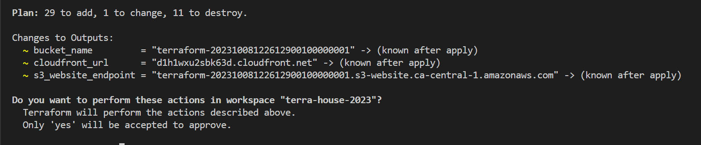

With these changes, you should be able to see both pages listed in your Terraform Cloud dashboard.


## The First Music Post 


### Check out The Music Home

→ [TerraTowns Independent Link](https://d2y3y5anu2c2ur.cloudfront.net/)

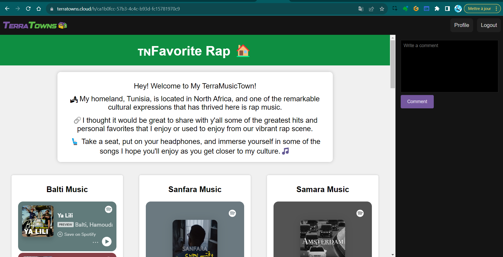


## Check Out The Tunisian Food Post


### Check Out The list in TerraHome

→ [TerraTowns Independent Link](https://d3opm9jrs6v4zx.cloudfront.net/)

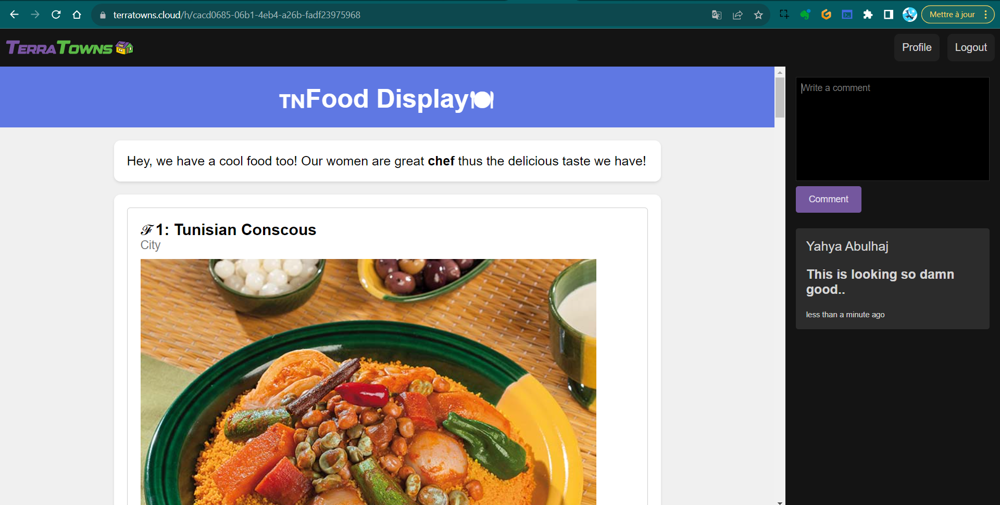


### Terraform State Management

1. Execute `tf state list` to view the resources in Terraform Cloud within Gitpod.
2. Perform `tf state pull` to get the latest from tfcloud.

### Troubleshooting and Finalization

1. Address any errors encountered during the plan and apply phases.
2. Resolve undefined index, etag path, or other issues. 
2. Update outputs to match changes made in the configuration.
3. Ensure the plan and apply phases complete successfully.
4. Confirm changes in the Terraform Cloud interface.
5. Delete the Terraform Cloud resources if necessary.


### Joyful conclusion

Version `2.7.0` originally `2.6.0` of the project focuses on integrating Terraform Cloud, enabling the creation of multiple homes or houses, and ensuring efficient configuration management.

**Show your creativity.**<br>
Make more homes! 


# TerraTowns Potential Unlocked

In the earlier release tagged as `2.7.0`, originally conceived as `2.6.0`, I decided to refine the curriculum for your benefit and your understanding.


- `2.6.0` — [Work with terraform cloud and local execution.](https://github.com/yaya2devops/terraform-beginner-bootcamp-2023/tree/2.6.0)
- `2.7.0` — [Create Two TerraHomes and adhrere to the House Theme.](https://github.com/yaya2devops/terraform-beginner-bootcamp-2023/tree/2.7.0)
- `2.7.1` — [Create Three More Homes and Target All TerraTowns.](#terrahome-coding-a-new-home)


Today, our aim is to address the remaining three endpoints, unlocking the full potential of Terratown.

We end up with a total of six projects nested within our `/public` repository.

- [TerraHomes Delivery](#terrahomes-delivery)
    
This Incl. 1 **Mixer** town for testing in Missingo.

```
📁./Terraformer
  |─ 🏠 favshow
  |   └─ 📂 assets
  |   |   └─ 🖼️ 26-july-2018-bb-ban.png
  |   |   └─ 🖼️ august-18-2018.jpeg
  |   |   └─ 🖼️ bb-26-july-2018.png
  |   |   └─ 🖼️ br-ba-logo.png
  |   └─ 📄 error.html
  |   └─ 📄 index.html
  |─ 🏠 lolplayz
  |   └─ 📂 assets
  |   |   └─ 🖼️ 2019-got-serious-to-college.jpeg
  |   |   └─ 🖼️ favi.png
  |   |   └─ 🖼️ gamer-ERR.png
  |   |   └─ 🖼️ gamer-proof.jpeg
  |   |   └─ 🖼️ gamer-webpage-somejs.png
  |   |   └─ 🖼️ gold-lol-18-aug-2018.jpeg
  |   |   └─ 🖼️ lol-chall.jpeg
  |   |   └─ 🖼️ old-time.jpeg
  |   └─ 📄 error.html
  |   └─ 📄 index.html
  |─ 🏠 mixer
  |   └─ 📂 assets
  |   |   └─ 🖼️ elizabeth-7-deadly-sins.png
  |   |   └─ 🖼️ goku.jpg
  |   └─ 📄 error.html
  |   └─ 📄 index.html
  |   └─ 📄 oldindex.html
  |─ 🏠 tnfood
  |   └─ 📂 assets
  |   |   └─ 🖼️ bambalouni.jpg
  |   |   └─ 🖼️ couscous.jpg
  |   |   └─ 🖼️ food-error-page.png
  |   |   └─ 🖼️ food-terrahome.png
  |   |   └─ 🖼️ lablebi.jpg
  |   |   └─ 🖼️ LA-MLOUKHIA.png
  |   |   └─ 🖼️ makroud.jpg
  |   |   └─ 🖼️ slata-mechouia.jpg
  |   |   └─ 🖼️ tunisian-food-masfouf.jpg
  |   └─ 📄 error.html
  |   └─ 📄 index.html
  |─ 🏠 tnrap
  |   └─ 📂 assets
  |   |   └─ 🖼️ loading-lazy.png
  |   |   └─ 🖼️ music-terratown.png
  |   |   └─ 🖼️ tn-music-errored.png
  |   └─ 📄 error.html
  |   └─ 📄 index.html
  └─ 🏠 travlz
      └─ 📂 assets
      |   └─ 🖼️ el-jem.jpg
      |   └─ 🖼️ medina.jpg
      |   └─ 🖼️ moss.jpg
      |   └─ 🖼️ musee-bardo.JPG
      |   └─ 🖼️ sidi.jpg
      |   └─ 🖼️ sousse-ribat.JPG
      |   └─ 🖼️ tn.png
      |   └─ 🖼️ travel-err.png
      |   └─ 🖼️ travel-page.png
      |   └─ 🖼️ tunis.jpg
      |   └─ 🖼️ zitounaaa.jpg
      └─ 📄 error.html
      └─ 📄 index.html
```

I ensured that these homes reflect my personality, allowing me to reveal more about who I am as a great person.

### TerraHome: Coding a New Home
In the following section, we will cover the steps necessary for you to add a new home.

Although we've already covered this process in the previous version 2.7.0, we will do it again to assure we know what we are doing.

| Instructions assume that you have configured your variables at the module level|
|:---:|
|[Here](https://github.com/yaya2devops/terraform-beginner-bootcamp-2023/tree/2.7.0)|

- Create a new **TerraHome** in the `public` directory.

I can't instruct you further what you are allowed to create inside. <br>I end up following the rules creating html files and assets. <br> Feel free to break them please.<br>Do more.


When your projects are in place. Follow this configuration as code.

- Create a module in your main.tf with the home name e.g.

```hcl
module "home_change-this_hosting" {}
```

- Go define your Home variables in `variables.tf` for the new home.

```tf
variable "change-this"

{
      type = object

      (
        {
            public_path = string

            content_version = number
        }          
      )
}
```

- Set the actual content of your new home variables in your `terraform.tfvars`

```tf
change-this = {

  public_path = "/workspace/terraform-beginner-bootcamp-2023/public/change-this"

  content_version = 1 
}
```

- Go back to your module in `main.tf` and configure your `public_path` and `content_version` with these variables.

```tf
module "home_change-this_hosting" {
  source = "./modules/terrahome_aws"
  user_uuid = var.teacherseat_user_uuid
  public_path = var.change-this.public_path
  content_version = var.change-this.content_version
}
```

- To make sure your new home variables are safe, copy the content from your `terraform.tfvars` to `terraform.tfvars.sample`

> Remmber we have a [cp command](https://github.com/yaya2devops/terraform-beginner-bootcamp-2023/blob/2.7.0/.gitpod.yml#L10C1-L10C1) to get that content.


That it with the configuration. 

More homes? [Read this](#terrahome-coding-a-new-home) again.


### TerraHomes Delivery

Terraform configured? Project Files correctly tested? Ready to launch.

1. Run the `build_provider` script to get the binairy.
2. Make sure you sinatra server is running, if not run
```
bundle install
bundle exec ruby server.rb 
```
3. Terraform init and make sure you are authenticated to terraform cloud, if not run and get that token.
```
terraform login
```

4. `terraform plan` to see the great stuff coming in.
5. `terraform apply -lock=false` in cases your state is locked in tf cloud.

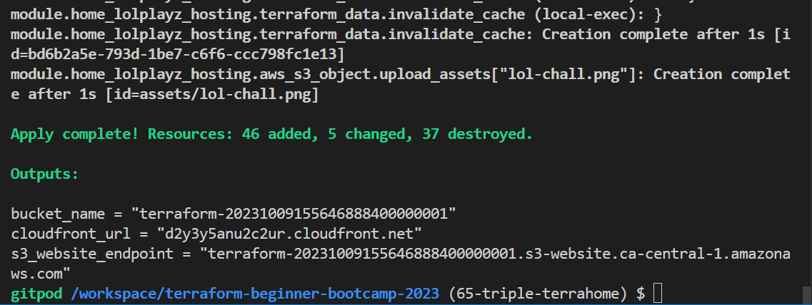

- The existing homes will be updated if any updates are available. 
- The new homes can be added with that single command.
- The hard part is always building the infra like a symphony.


## TerraTowns Deliverables

As I mentioned before, I designed TerraHomes for every town. This section serves as a showcase of the most recent three additions.


→ To [learn more about the methodology.](https://github.com/yaya2devops/terraform-beginner-bootcamp-2023/issues/65)


### Breaking Bad FanPage

This page is my way of expressing my admiration for the TV show. I've incorporated a quote generator and included assets that hold sentimental value from a dear friend.


The post Title and description specified;
```hcl
name = "The Best TV Show You'll Ever Watch"

description = <<DESCRIPTION
💥Join us as we unravel the gripping tale of high-stakes crime, morality, and transformation that has captured the hearts of millions worldwide.💥
DESCRIPTION
```


### TerraTown Post Show Up

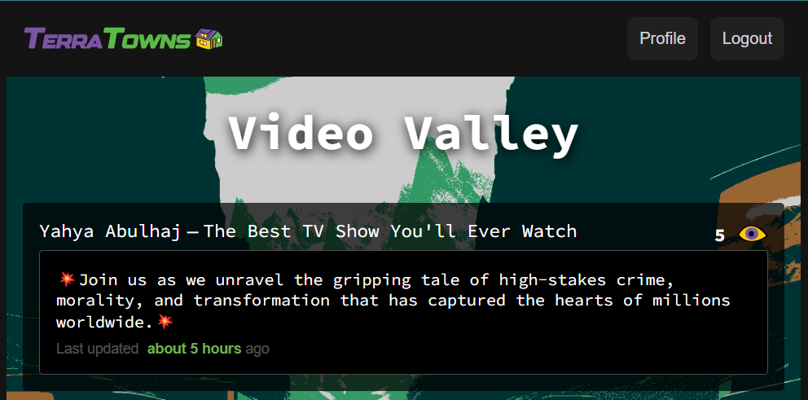

### The Project TerraHome

|[Internal URL](https://terratowns.cloud/h/48154dbb-6d35-42bf-a06a-3eeb775c9bb2)|
|---|
|[CloudFront URL](https://ds3mmnyp4l57k.cloudfront.net/)|

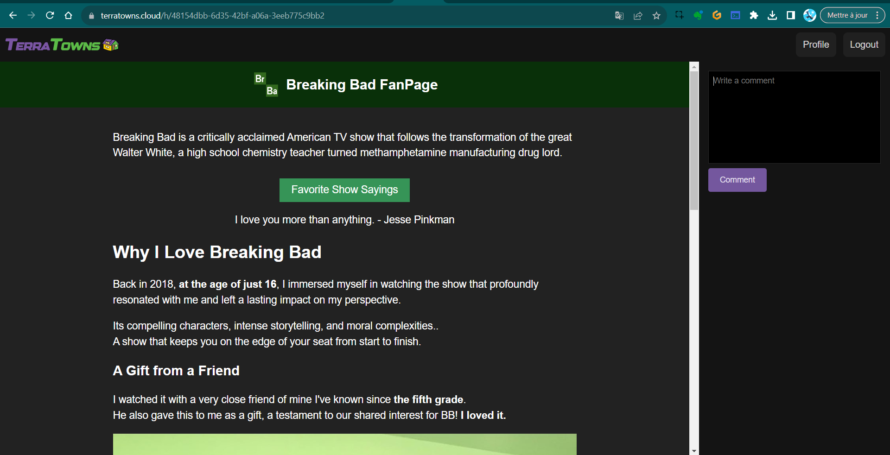


### Past Gaming Passion
This project is a highlight to what I used to play a lot in the past. It gives some insights to why I am good in english? And why I find mysef a master in the cloud?

The post Title and description specified;
```hcl
name = "What Yahya Used To play A lot?"

description = <<DESCRIPTION
Uncover Yahya's past gaming obsession and how his extensive involvement with League of Legends eventually severed that connection, enabling him to devote more time to other pursuits.
DESCRIPTION
```


### TerraTown Post Show Up

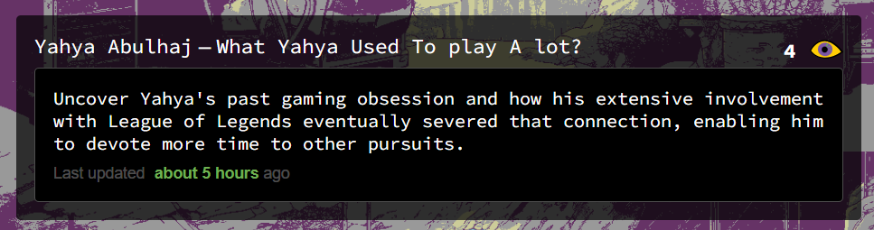


### The Project TerraHome

|[Internal URL](https://terratowns.cloud/h/15828552-3f2e-4ffa-82ff-40a719bac5ec)|[CloudFront URL](https://d3fozmkbn0u7h4.cloudfront.net/)|
|--|--|
|||

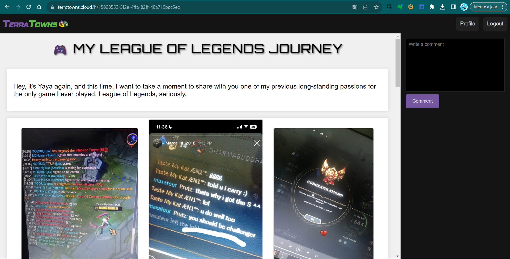


### Visit Tunisia
Our economy is a bit messed up but we have great places.

I think a smart person can visit have lots of fun with dead cheap money and go back happy.


The post Title and description specified;
```hcl
name = "The Best TV Show You'll Ever Watch"

description = <<DESCRIPTION
💥Join us as we unravel the gripping tale of high-stakes crime, morality, and transformation that has captured the hearts of millions worldwide.💥
DESCRIPTION
}
```


### TerraTown Post Show Up

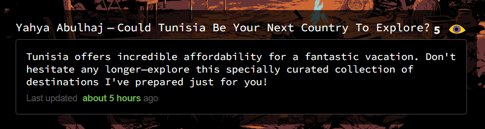


### The Project TerraHome

|[Internal URL](https://terratowns.cloud/h/db7565bc-33dc-4f65-8b45-8eca2c4c628a)|[CloudFront URL](https://d1z96397cxwgol.cloudfront.net/)|
|--|--|
|||


### Considerations

**Unsupported Image Format (JPEG):** <br>
Corrected the issue where JPEG images were not supported.<br>
**Image Format Conversion (JPEG to PNG):** <br>
Converted the existing JPEG images to PNG format to ensure compatibility with the project.<br>
**File Extension Renaming (JPG to jpg):** <br>
Modified file extensions from "JPG" to "jpg" for consistent and standardized naming.<br>
**User Interface and Slider Enhancements:** <br>
Made necessary fixes and improvements to the user interface and slider functionality to enhance the project's overall usability and appearance.


---

In case you weren't aware, all the strategies I used have been revealed<br>(Far surpassing those below).
<br>
My relentless pursuit is your advantage.

- [Chats Got TerraHomes Done](../assets/2.7.1/connect.md)
- [Tree and Beautify](public/yayauptree.md)
- [ExamProCo Snapshot](https://github.com/yaya2devops/terraform-beginner-bootcamp-2023/tree/3.1.0/assets/3.1.0)

> Creativity knows no bounds, and in the absence of drafts, the untamed mind finds its truest expression.

### Measured Finish

This is the bootcamp seen and constructed through the eyes of the author. <br>
Experiences and methods to reach the top varies.

The author has absolute confidence in the enormous potential of this journey for you and his commitment to your triumph remains unswerving and ever-expanding.


