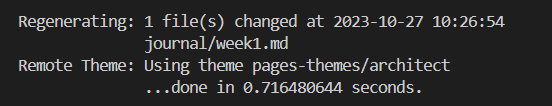

## How I Did This

Your system should have ruby.

If you are on gitpod, ruby is pre installed.

- Create a file in your project root and name it `_config.yml`
- Decide the theme and based on this fill the content of ur config file.

**Here is mine;**
```yml
remote_theme: pages-themes/architect@v0.2.0
plugins:
- jekyll-remote-theme # add this line to the plugins list if you already have one

title: "Cloud Express"
description: Your Perfect Starting Point To The Cloud with Yaya Legacy.
show_downloads: true
google_analytics:
theme: jekyll-theme-architect
```
- Create a Gemfile and add the following content
```
source "https://rubygems.org"
gem "webrick"
gem "github-pages", group: :jekyll_plugins
```
- run this to get the packages from ur gemfile installed
```
bundle install
```
- Run your jeykyll project using this

```
bundle exec jekyll serve
```

<br>
You will get a local URL where u can make and track changes in real time.

