# Week One Of the Bootcamp

- [Empower Your Terraform Modules](#design-your-terraform-modules)
    + [Crafting a Terraform Directory Layout](#terraform-directory-layout)
    + [Migrating from Terraform Cloud Back to Local State](#from-terraform-cloud-back-to-local-state)
    + [Local Migration Test Strategies](#local-migration-test)
    + [Mastering Terraform Variables](#terraform-variables-101)
    + [Flexible Variable Input via CLI and Files Flag](#--variable-input-via-cli-and-files-flag---)
    + [Utilizing Variable Files (.auto.tfvars and .auto.tfvars.json)](#--variable-files----autotfvars-and-autotfvarsjson-)
- [Navigating Terraform Config Drift](#terraform-config-drift)
  * [Recovering Lost Bucket State](#bucket-state-is-lost)
  * [Reintroducing the Random Element](#get-random-back)
  * [Managing Buckets the Regex Way](#bucket-the-regex-way)
    + [Thorough Drift Testing](#test-drifted-test)
- [Unleash the Power of the Terrahouse Module](#the-terrahouse-module)
    + [Exploring the Architecture of Modules](#modules-architecture)
    + [Smooth Initialization of Nested Modules](#nested-module-init)
    + [Elevating Your Root Module: A Refactoring Guide](#refactoring-the-root-module)
    + [Modules as Reliable Sources](#modules-are-sources)
    + [The Art of Module Testing](#start-testing-your-module)
      - [1.1. Handling Variables and Validators in Nested Modules](#11-handling-variables--validators-in-nested-modules)
      - [1.2. Resolving Vars at the Root/Module Level](#12-resolve-vars-root-mod)
      - [2.1. Mastering Outputs in Nested Modules](#21-outputs-in-nested-modules)
      - [2.2. Skillful Resolution of Outputs](#22-resolve-outputs)
+ [Terraform Refresh and Enveloping](#10-terraform-refresh-and-wrap)
- [Mastery of S3 Static Hosting](#master-s3-static-hosting)
  * [Background Insights](#background)
    + [Hosting Your First HTTP Server Like a Pro](#host-your-first-http-server)
    - [Why Use S3 for Hosting](#use-s3-for-that-instead)
    - [STEP 1: Creating an S3 Bucket for Static Website Hosting](#step-1---create-an-s3-bucket-for-static-website-hosting)
    - [Step 2: Uploading Your Static Website Files with Ease](#step-2--upload-your-static-website-files)
    - [Step 3: Configuring Your S3 Bucket for Static Website Hosting](#step-3--configure-your-s3-bucket-for-static-website-hosting)
    - [Step 4: Crafting an AWS CloudFront Distribution](#step-4--create-an-aws-cloudfront-distribution)
  * [Translating It into Terraform Code](#code-that-in-terraform)
    + [Journey Back to Home](#back-to-home)
    + [Verification Straight from AWS](#verify-from-aws)
    + [Discover Your Website Endpoint](#website-endpoint)
  * [Delving into Files Content Touchpoints](#files-content-touchpoint)
    + [Harnessing the Power of `aws_s3_object`](#using--aws-s3-object-)
    + [Creating and Managing Files with `path` Wisdom](#create-those-files-and-manage-with--path-)
      - [A: Navigating Your Real Path](#a--avoid-your-real-path)
      - [B: Detecting File Changes Like a Pro](#b--detect-file-changes)
    + [Embracing Terraform Vars Over `path.root`](#terraform-vars-instead-of--pathroot-)
      - [Capturing Bonus One](#bonus-one-captured)
      - [Capturing Bonus Two](#bonus-two-captured)
      - [Capturing Bonus Three](#bonus-three-captured)
- [Implementing CDN Like a Coding Maestro](#implementing-cdn-via-code)
    + [Embracing CloudFront as Code](#cloudfront-as-code)
      + [Fine-Tuning Origin Configuration](#origin-configuration)
    + [Hunting Down CloudFront in the Registry](#find-cloudfront-in-registry)
  * [Masterful Resource Structuring](#resource-structuring)
    + [Defining Required Variables in `resource-cdn.tf`](#specifying-required-variables--resource-cdntf-)
    + [Crafting Origin Access Control Configuration in `resource-cdn.tf`](#origin-access-control-config--resource-cdntf-)
    + [Adding the Bucket Policy Block with Finesse in `resource-storage.tf`](#adding-the-bucket-policy-block--resource-storagetf-)
      - [Navigating the Data Block](#data-block)
      - [Why Does URL Equal Download? Unveiled](#why-url-equals-download-)
    + [Efficiently Clearing CloudFront Cache](#clear-cloudfront-cache)
      - [Troubleshooting Like a Pro](#troubleshooting)
      - [Considerations for `1.5.0`](#-150--considerations)
- [Terraform Content Versioning Strategies](#terraform-content-versioning)
    + [In the Realm of Bootcampers](#bootcamper-context)
  * [Versioning Your Website Content](#versioning-your-website)
    + [Configuring Resource Lifecycle for Success](#configure-resource-lifecycle)
    + [Mastering Test 101](#test-101)
    + [Triggering the Changes Like a Pro](#--triggering-the-changes--)
    + [Test 202: The Sequel](#test-202)
    + [Test 303: The Trilogy](#test-303)
    + [Test 404: The Grand Finale](#test-404)
- [Commanding CloudFront Cache Invalidation](#invalidate-cloudfront-distribution)
      - [Unveiling GPT Insights](#gpt--mhh)
    + [Diving into Background and Context](#background-and-context)
      - [Harnessing Terraform Data Like a Pro](#terraform-data)
      - [Executing Locally with Null Resources](#local-execution-with-null-resources)
  * [Executing a Flawless Cache Invalidation](#implement-invalidation)
    + [Fine-Tuning Output Configuration](#output-configuration)
    + [Step 7: Performing a Cache Invalidation](#7-performing-cache-invalidation)
    + [Reverting Changes and Beyond](#reverting-changes-and-more)
  * [Terrahouse Asset Management Mastery](#terrahouse-asset-management)
    + [Elevating Your Skills](#improvisation)
    + [Getting Started with Assets](#getting-started-with-assets)
      - [Resolving the Thought Process](#resolved-thought)
      - [Navigating the Terraform Console](#terrafoorm-console)
      - [Harnessing `for_each` Configuration](#-for-each--configuration)
    + [Testing and Verification Like a Pro](#10-testing-and-verification)
    + [Unlocking the CamperBonus](#camperbonus)
- [Visual Delights with Git Graph](#visuals-with-git-graph)
    + [Exploring Available Extensions](#do-you-have-extensions-)

# Design Your Terraform Modules

Welcome to 1.0.0 of our week one of the bootcamp where we delve into structuring our Terraform root modules.

We've already begun with `main.tf`. we can accomplish everything within that single file. We can also call that a module.

We will go over making our own module to gain a deeper understanding of Terraform capabilities e.g;

- Organizing your Terraform configurations,
- Working with remote/local state,
- Managing Terraform variables in different ways.

Before starting, consider [learning more about the tf structure.](https://developer.hashicorp.com/terraform/language/modules/develop/structure)


The key is that when we adopt the correct approach to module design, our code will be understood at glance and we'll also promote its portability. 

Others can take that and adapt it to suit their specific requirements. <br>And this is beautiful!

### Terraform Directory Layout

1. Create the following strucutre in your project root.
```sh
🌳 Module Components:
├── 📄main.t: The Core Configuration
│   └── 📝 Contains the main configuration for your Terraform resources.
├── 📄variables.t: Input Variables
│   └── 📝 Stores definitions for input variables.
├── 📄terraform.tfvar: Variable Data
│   └── 📝 Holds data or variable values to load into your Terraform project.
├── 📄outputs.t: Storing Outputs
│   └── 📝 Defines the outputs of your Terraform module.
├── 📄 providers.tf: Provider Configuration
│   └── 📝 Contains provider configurations and settings.
└── 📄 README.md: Module Documentation
    └── 📝 Provides essential documentation and information about the module.
```

**Module Component Guidelines;**
- Recommended structure for organizing your Terraform root modules,
- Suggests moving provider blocks and outputs to dedicated files,
- Highlights the importance of README.md for clear documentation.

|💭|Differing opinions may arise regarding the placement of the `tf` block for providers|
|---|---|
|💡|Some advocating for its exclusive presence in the `main.tf` file.|
|💡💡|The choice depends on your team's preferences and conventions.|

2. Please proceed with migrating the `tf` block for providers to the `providers.tf` file.
3. Let's relocate the output configurations to the `output.tf` file.
4. Bring back the tags we [took out previously.]() 

We will use it back to create an additional custom variable.
```hcl
  tags = {
    Name        = "My bucket"
    Environment = "Dev"
  }
```

5. change `Name` to `UserUuid` ;
```
  tags = {
    UserUuid     = var.user_uuid
  }
```

Although we initially considered GPT's suggestion, we prefer to have it inline.


We added a variable block for the UUID, and within this block, we incorporated the validation process.


|❌| Using Terraform Cloud, we coudnt receive a prompt for the variable.|
|---|---|
|✅|To address this, let's transition to remote configuration.|


First, comment out the cloud block and initialize the configuration. <br>
However, it appears we need to revert this migration. <br>
Nevermind, please uncomment the block.


6. Let's manually provide the variable, which should trigger an error when executing and I'll tell you why
```
terraform plan -var user_uuid="testingod"
```
We included validation in the variable to ensure it conforms to a specific regex pattern.  

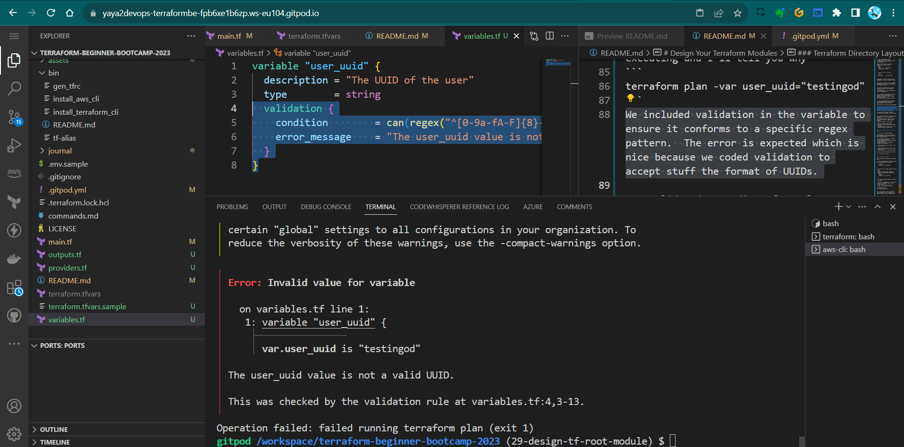


The error is expected which is nice because we coded validation to accept stuff the format of UUIDs.

> A solid understanding of regular expressions is essential in this context.


|🐌 |Terraform Cloud is noticeably slower compared to local state operations!|
|---|---|
|🏃🏻|When executing a plan on a local state, the process is significantly faster.|
|💡|Let's go back to local state.|

Potential reasons of this Incl;
- We can test what happen when we lose our state 
- Opening to imports (next ver `1.2.0` —[Here](https://github.com/yaya2devops/terraform-beginner-bootcamp-2023/tree/1.2.0#terraform-config-drift))
- Dig into ways to recover state


### From Terraform Cloud Back to Local State

1. try to run a terrform destroy.

Failed because we have to configure our aws credentials in terraform cloud. We didnt said that before.

2. Go Terraform Cloud, go To variables and then add New variable
> When asked choose Environment variable and not terraform
3. Add one by one your access key, private key and region.
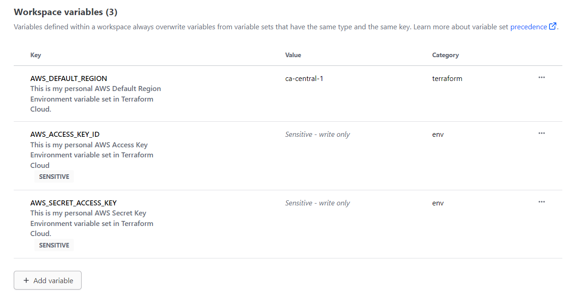

> Mark the first two as sensitive, the **region** is ok.

4. You can now go ahead and destroy your infrastructure.
5. Observe the runs in Terraform Cloud. 

You can check the process in real time.

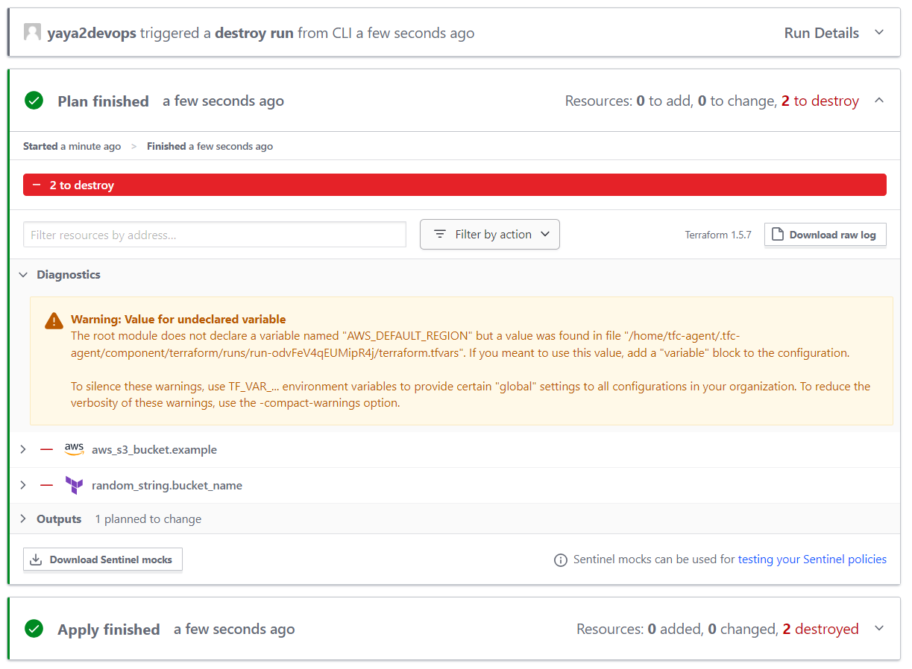


### Local Migration Test

We considered the migration is possible now.

1. Try re experimenting with tags and see what happens when you use them.
```
    tags = {
    UserUuid = var.user_uuid
  }
```

2. Add this to ur bucket resource to look like;
```hcl
resource "aws_s3_bucket" "example" {
  bucket = random_string.bucket_name.result
    tags = {
    UserUuid = var.user_uuid
  }
}
```
> We came here without passing a value to it locally.

3. Be sure to remove your `lockfile` and `dotfile` to terminate any tf cloud related processes.
4. run `tf init` then `tf plan`
5. give an actual uuid to the var;
```
terraform plan -var user_uuid="uuid-format" 
```

e.g.

```
terraform plan -var user_uuid="f6d4a521-8a07-4b3f-9d73-2e817a8dcb3d" 
```

If it still doesn't work, ensure that your validation block, along with its parent variable, are not commented out.
```hcl
variable "user_uuid" {
  description = "The UUID of the user"
  type        = string
  validation {
    condition        = can(regex("^[0-9a-fA-F]{8}-[0-9a-fA-F]{4}-[1-5][0-9a-fA-F]{3}-[89abAB][0-9a-fA-F]{3}-[0-9a-fA-F]{12}$", var.user_uuid))
    error_message    = "The user_uuid value is not a valid UUID."
  }
}
```

6. It should work perfectly.

Great and cool! Lets proceed more with our var manipulation skills.

7. Go to our terraform.tfvars file and include the variable there.
user_uuid="uuid-format" (looks like toml baby)
```sh
user_uuid="f6d4a521-8a07-4b3f-9d73-2e817a8dcb3d"
```
> Looks like TOML Baby! whats that? Eeeeh [long story.](https://github.com/yaya2devops/aws-cloud-project-bootcamp/tree/main/ddb#toms-obvious-minimal-language-files)

8. Run `tf plan` only and [it will pick](../assets/1.1.0/varplan.md) it up.

When doing TF Cloud, You must configure this manually as Terraform variables . ( And not the environment variable we previously used for AWS)


9. Create an fork file of the terraform.tfvars with `.sample`extension and add the content.
```
user_uuid="f6d4a521-8a07-4b3f-9d73-2e817a8dcb3d"
```

> terraform.tfvars is ignored. Good alternative to not waste this.

10. Delete your  and try this command to see if it does the job.
```yaml
cp $PROJECT_ROOT/terraform.tfvars.example $PROJECT_ROOT/terraform.tfvars
```

11. It does, now in `gitpod.yml` add the above to the terraform block to look like:
```yaml
  - name: terraform
    before: |
     source ./bin/install_terraform_cli
     source ./bin/generate_tfrc_credentials
     source ./bin/tf_alias
     cp $PROJECT_ROOT/terraform.tfvars.example $PROJECT_ROOT/terraform.tfvars
```

This automate the process of getting that example file to a real file on gitpod launch and we are well set!

## Terraform Variables 101

I considered adding this part to showcase the different ways you can deal with vars in `tf`. 

We have already showcased some of them.

### **Variable Input via CLI and Files Flag:**

1. Create a normal variable block wherever required;

```
variable "region" 
{
  type    = string
  default = "us-west-1"
}
```

2. You can override it using this command;

```
terraform apply -var="region=new_value"
```

3. Or you can create the following json (or HCL) file call it `variables.json` e.g;

```json
{
  "region": "us-east-2",
  "instance_type": "m5.large"
}
```

4. Overide it using that command but with passing the file flag.
```sh
tf apply -var-file=variables.json
```

Terraform will use the values specified in the variables.json file to override the defaults defined in your example.tf configuration. 

### **Variable Files** (.auto.tfvars and .auto.tfvars.json)

This is cool because it helps terraform knows where to go find vars first.

If you have a configuration named `yaya.tf`.
<br>Terraform will automatically look for;
- File named `yaya.auto.tfvars` 
- Or file named `yaya.auto.tfvars.json` 

This will start the  variable load values from there.

- `*.auto.tfvars`  is a plain text file where you can set variables like key-value pairs e.g.
```
example_var = "new_value"
```
- `*.auto.tfvars.json` is a JSON file where you can define variables and their values. For example:
```json
{
  "example_var": "new_value"
}
```

Also `*.auto.tfvars.json` and `terraform.tfvars.json` are almost the same. Just think about it as a way to design you infrastructure with namings.


#### Great and cool! My takeaways are;
- You can create as many TF files as needed; they will all be combined.
- To pass an environment variable, use tf var.
- For overrides or new variable settings, employ the var flag.
- In TF Cloud, you can configure both environment variables and TF variables.
- Demonstrates how to define and use custom variables.
- Promotes inline variable usage for improved readability.
- Shows how to include variable validation within var blocks and regex is cool to know.

Also since our plan worked, `tf apply` changes locally and lose your state to see if we are able to recover it next.

See you in  `1.2.0` the config drift.


# Terraform Config Drift

`1.2.0` started with the idea to answer the following questions.


- How to fix it when you delete your state file?  
- Is there anyway you can recover it?

|🐛 |The feasibility of this depends on the available resources.|
|---|:---|
|📦|Store your state in a file-like format because not all resources support direct importation.|

- [Bucket State Is Lost](#bucket-state-is-lost)
- [Get Random Back](#get-random-back)
- [Bucket The Regex Way](#bucket-the-regex-way)
- [Test Drifted Test](#test-drifted-test)

## Bucket State Is Lost
Our Terraform state no longer manages that bucket. 

To get state back, we need to search for the import within Terraform.<br>
[Learn more about the import.](https://developer.hashicorp.com/terraform/cli/import)

To get the import for the s3, follow this process.

1. Go to the Terraform Registry.
2. Navigate to `Providers` and select `AWS`.
3. In the search bar, type `s3` to find the AWS S3 related resources.
4. Look for `aws_s3_bucket` and click on it.
5. On the right-hand side of the page, you'll find a section labeled **ON THIS PAGE**.
6. Click on `import` to go directly to the import documentation.

It should provide you with the necessary import instructions.

```hcl
import {
  to = aws_s3_bucket.bucket
  id = "bucket-name"
} 
```
And the direct command;

```sh
terraform import aws_s3_bucket.bucket bucket-name
```
> The import [just in case.](https://registry.terraform.io/providers/hashicorp/aws/latest/docs/resources/s3_bucket#import)

Take the command to cli and see and change with our bucket named `example`.
```sh
terraform import aws_s3_bucket.example <random-from-ur-aws>
```

It will import a new state but;
- The import will exclude the randomly generated configuration,
- on tf plan, a prompt to delete the existing bucket and create a new one (`2+ 1-`)

Our next task is to retrieve the state in a randomized fashion.


## Get Random Back
The method I demonstrated for locating imports in S3 applies to nearly all scenarios. 

So, sharpen your direction-finding skills, and I'll emphasize it once more.

1. Go to your desired provider.
2. Expand the list of resources.
3. Locate the specific resource, such as `random_string`.
4. On the right-hand side, click on `import` and take it.
```
terraform import random_string.test test
```
We've named it "bucket_name," so it functions as follows:
```
terraform import random_string.bucket_name <paste-random-name-from-s3>
```
> The import [just in case.](https://registry.terraform.io/providers/hashicorp/random/latest/docs/resources/string#import)

Be aware that importing state may not include the random configuration. 

Terraform suggest deleting and recreating the resource along with a random component. 


|💡|Both are now in their original states.|
|---:|:---|
|💡💡|But in `tf plan` it seems to think it needs to be replaced.|
|💡💡💡|It's time to terminate  random. Was nice|


## Bucket The Regex Way
We will proceed by discontinuing the random generation and instead implement a validator.

Similar to the way we did with UUIDs, but this time tailored to meet [bucket rules](https://docs.aws.amazon.com/AmazonS3/latest/userguide/bucketnamingrules.html).

1. Go to the main.tf
2. Delete the Random Provider from `providers.tf`.
```hcl
    random = {
      source = "hashicorp/random"
      version = "3.5.1"
    }
```
3. Remove the Random resource from `main.tf`.
```hcl
resource "random_string" "bucket_name" {
  lower = true
  upper = false
  length   = 32
  special  = false
}
```
4. Remove the bucket configuration `bucket = random_string.bucket_name.result`
```hcl
bucket = random_string.bucket_name.result
```
5. Add `bucket = var.bucket_name` instead.
```hcl
bucket = var.bucket_name
```
6. In  bucket resource change its name from `example` to `website_bucket`.

```hcl
resource "aws_s3_bucket" "example" 

resource "aws_s3_bucket" "website_bucket" 
```

7. Update the ouptut to not use the random provider and to call our new bucket name.
```hcl
output "bucket_name" {
  value = aws_s3_bucket.website_bucket.bucket
```

8. add the bucket name to our `terraform.tfvars` and keep a copy in `terraform.tfvars.sample`

```hcl
bucket_name="from-aws"
```

9. Define that variable within the variables.tf file.


Ask GPT to generate a Terraform variable definition for the bucket name with validation logic to ensure it conforms to the requirements for a valid AWS bucket name.


- Start with the variable definition with a great description;

```hcl
variable "bucket_name" {
  description = "The name of the S3 bucket"
  type        = string
```
- Go ahead with the validation after considering [the following rules](https://docs.aws.amazon.com/AmazonS3/latest/userguide/bucketnamingrules.html).

```hcl
  validation {
    condition     = (
      length(var.bucket_name) >= 3 && length(var.bucket_name) <= 63 && 
      can(regex("^[a-z0-9][a-z0-9-.]*[a-z0-9]$", var.bucket_name))
    )
    error_message = "The bucket name must be between 3 and 63 characters, start and end with a lowercase letter or number, and can contain only lowercase letters, numbers, hyphens, and dots."
  }
```

- Together, fogether to look like this;
```hcl
variable "bucket_name" {
  description = "The name of the S3 bucket"
  type        = string

  validation {
    condition     = (
      length(var.bucket_name) >= 3 && length(var.bucket_name) <= 63 && 
      can(regex("^[a-z0-9][a-z0-9-.]*[a-z0-9]$", var.bucket_name))
    )
    error_message = "The bucket name must be between 3 and 63 characters, start and end with a lowercase letter or number, and can contain only lowercase letters, numbers, hyphens, and dots."
  }
}
```

### Test Drifted Test
Make sure you deleted previous S3s.
1. Try giving a bucket name that violates the rule e.g. Yaya2DevOps
2. Give a tf plan a try


3. Double assign it a correct naming.
4. Give a tf plan a try
5. Run tf apply


You should have your bucket in aws applied. 


That was our `1.2.0` configuration drift.


|Consider Regex for vars when validating inputs.|
|---|


# The Terrahouse Module 

We will walk through the process of creating a Terrafohouse Nested Module and migrate our S3 bucket. This includes experiencing output/vars calls.

To Recap Just For You we'll be;
- Creating our initial nested module 
- Transferring our S3 bucket from the root module to the module.
- Experiencing with output and variable calls working with nested modules.

We started by triple checking The terraform modules Structure [again](https://github.com/yaya2devops/terraform-beginner-bootcamp-2023/tree/29-design-tf-root-module#design-your-terraform-modules).

When you're ready, I'm sure you're excited to go. <br>
Let's take on this together!

### Modules Architecture

Let me explain to you how our infrastructure will be broken down further on the road.

```
🏡 terrahouse_aws
├── 🗄️ resource-storage.tf
└── 🌐 resource-cdn.tf
```
- We'll keep everything related to storage Incl. S3 configurations, in a separate folder file called `resource-storage.tf`.
- Components related to delivery, Incl. CloudFron,t will reside in another file called `resource-cdn.tf`.
- Both are withing our 🏡 `terrahouse_aws` module.

Our architectural approach involves isolating components to enhance modularity and maintainability.

## Nested Module Init

To begin, let's establish the directory structure for our Terrafohouse Module:

1. Create a new `modules` directory, following Terraform best practices.
2. Inside that, create `/terrahouse_aws` directory that will host the magic.
In this directory, we will have the following essential files and folders.
3. In `/terrahouse_aws` create `main.tf` that will contain the main configuration for the module.
4. In `/terrahouse_aws` create `outputs.tf`to define our module outputs.
5. In `/terrahouse_aws` create `variables.tf`for mod specific var definition.
6. In `/terrahouse_aws` create `README.md` to provide the `what` for the module.
7. In `/terrahouse_aws` never miss to create `LICENSE` to follow best practices in design.

|📜|We'll adopt the Apache License. |
|---:|:---|
|👨‍💻|Anton Babenko is known for creating many Terraform modules.|
|✔️| We can use an Apache License from his work.|

He also [likes to travel](https://twitter.com/antonbabenko/status/1208503560733896706). I mean yeah. Me too!

To continue remmember;
- Each module requires a specified provider. 
- If not, Terraform will raise an error.

###  Refactoring the Root Module
To keep our configuration clean and organized, we'll make some changes;
1. Move the provider configuration from the root directory to `main.tf` within the module.
2. Transfer the definition of the bucket resource to `main.tf` within the module.
3. Eliminate the root `providers.tf` configuration because we've incorporated it into the module and it got nothing in it we need.
4. Relocate variables and outputs to their respective places from root to the module.
5. Yes make sure to perform a cut operations. [I'll tell you why later](#11-handling-variables-validators-in-nested-modules).

##  Modules Are Sources

Now that we've moved our configuration to the module level.

The question you are asking is;
|❓|How to actually reference them in the root |
|---:|:---|
|💡|Modules can be imported within another module block|

Here is how;
```hcl
module "terrahouse_aws" {
  source = "./modules/terrahouse_aws"
}
```
- Input variables can be passed to the module block e.g. UUIDs and BuN
```hcl
module "terrahouse_aws" {
  user_uuid = var.user_uuid
  bucket_name = var.bucket_name
  }
```

> A powerful point to explore the [different sources](https://developer.hashicorp.com/terraform/language/modules/sources) from which we can reference modules. 

These can be local paths-our case, GitHub repos, or the Terraform Registry.. 

> Check it up. The link; I provided you.

## Start Testing Your Module
We linked our module and we can go ahead and give it a try.

To ensure everything is set up correctly

1. Use the `terraform init` command to It will validate our configuration.

It is telling that our AWS bloc is empty new stuff. <br>Not that deal-Just get rid of it if you want.

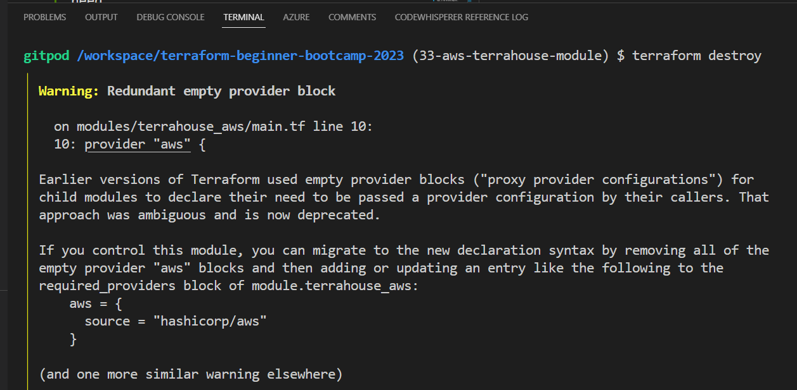

2. Run the `tf plan`, sometimes I miss out we have alias, to test your module configuration is correct.


The plan is an error as expetcted. And the truth will follow;

#### 1.1. Handling Variables, Validators In Nested Modules

When working with variables and validators, keep in mind:
- Variables need to be defined in both the module and the root.
- Validators, which are already integrated into the module, don't need to be included in the root. 
- Terraform will detect validators automatically.

#### 1.2. Resolve Vars Root/Mod

1. To resolve that, simply define the variables in the root and give it description.
```hcl
variable "user_uuid" 
{
 type = string
}
```
|Thats it💡| If the naming is accurate, it will gather more about the module|
|---:|:---|

2. Now that you know, do the same for the bucket.
```hcl
variable "bucket_name" 
{
 type = string
}
```
3. Let's run `terraform plan` to observe the plan without errors 

Now everything works smoothly.<br> But I see no outputs. 

I am sure I configured my module...

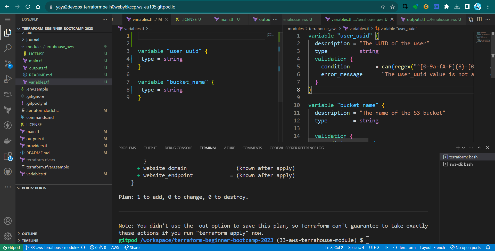

#### 2.1. Outputs In nested Modules

After applying the configuration, you might notice that outputs aren't visible. 

- Run `terraform output` to verify.
Nothing to see..Because we have it only in the module as well.

#### 2.2. Resolve Outputs
Outputs defined within a nested module allow us to access them at that level. 

To see outputs, they must also be added to the root output. The difference is now we will get it from the module.

1. You can access the nested module's output like this: `module.name-dir.bucket_name`.

2. Give it a great description;
```hcl
  description = "Bucket name for our static website hosting"
```

3. Combine code to be as follows;

```hcl
output "bucket_name" {
  description = "Bucket name for our static website hosting"

  value = module.terrahouse_aws.bucket_name
}
```
> Random; nested for a good reason, because its literally nested wihtin this project.

## 10. Terraform Refresh and Wrap

A good time to employ this command after updating our output code to refresh it baby. 

1. To dp so, run `terraform refresh` after the output has been updated.
```
tf refresh
```

2. Run tf output you'll be seeing the output;


This will synchronize the local state with the actual AWS resources.

3. run the tf `apply`

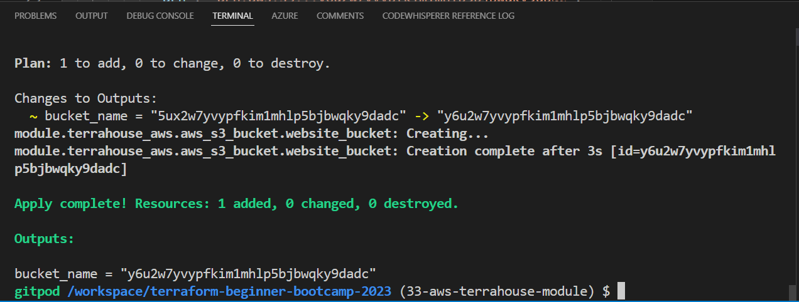

Here you'll have ur bucket again with the output!

You can also combine refresh with apply;

```sh
terraform apply -refresh-only -auto-approve
```

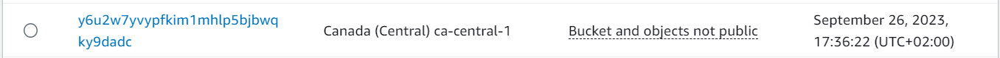

Great and cool! we've successfully did the following;
- created a Terrafohouse Module,
- organized our AWS infrastructure configurations,
- demonstrated effective module referencing and output management.

Future enhancements and additional modules can now be seamlessly integrated into your infrastructure.


# Master S3 Static Hosting

Welcome to this `1.4.0` where I'll elighten you on how to host a static website on S3 using your fingers and Terraform.

## Background
We previously performed the setup using the AWS Console.


### Host Your First HTTP Server
Let me get you going from your dev env.
1. Create `public` directory.
2. Add an `index.html`
3. add some content of your wish.
4. Install the `http-server` package globally on your system. 
```sh
$ npm install http-server -g
```
This will allow you to run a simple HTTP server to serve your web app's files.

5. cd to `/public`.
6. Start the HTTP server using the following command:
```
$ http-server
```

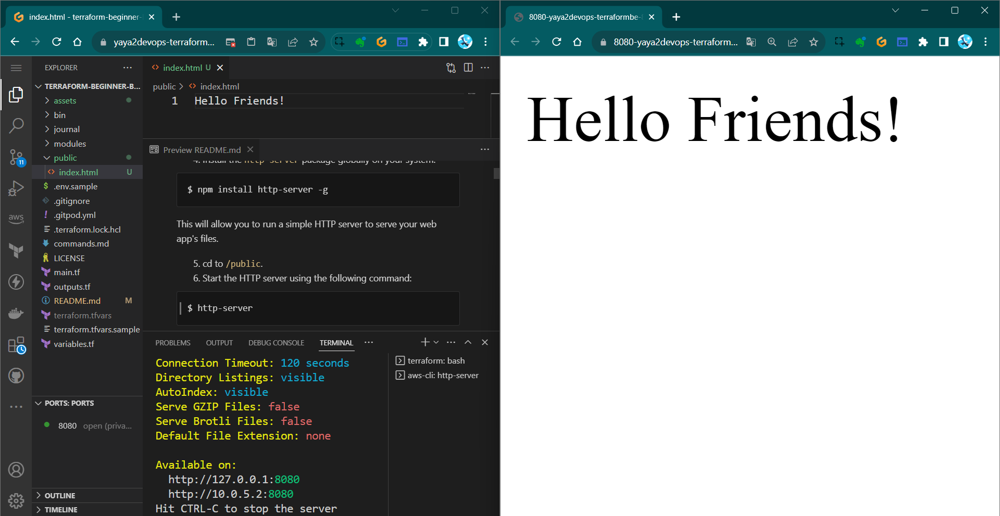

Now, we aim to take this to s3.

### Use S3 For That Instead

#### STEP 1 : Create an S3 Bucket for Static Website Hosting

1. Log in to your AWS Console.
2. Navigate to the S3 service.
3. Click on "Create bucket."
4. Choose a unique name for your bucket (e.g., "ya-ya") and select a region.
5. Leave the default settings for the rest of the options and click "Create bucket."

#### Step 2: Upload Your Static Website Files

1. In the S3 bucket you just created, navigate to the "Upload" button.
2. Select the "index.html" file from your local system and upload it to the S3 bucket.

I did it via the CLI.


I suggest you go do it too.

#### Step 3: Configure Your S3 Bucket for Static Website Hosting

1. In your S3 bucket, click on the "Properties" tab.
2. Scroll down to the "Static website hosting" card and click "Edit."
3. Select the option for "Use this bucket to host a website."
4. Specify "index.html" as the Index document.
5. Optionally, you can specify an error document (e.g., "error.html").
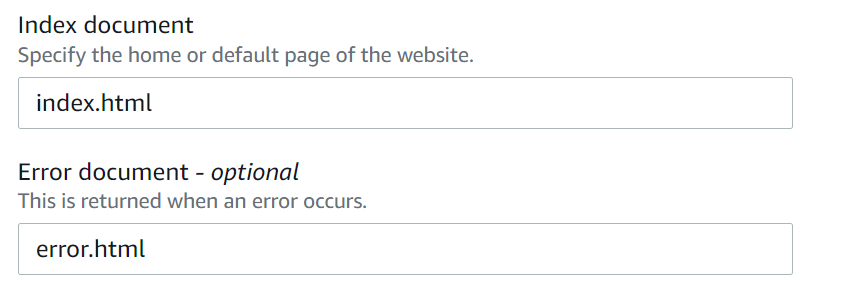
6. Click "Save changes."
7. Check your app on the web;

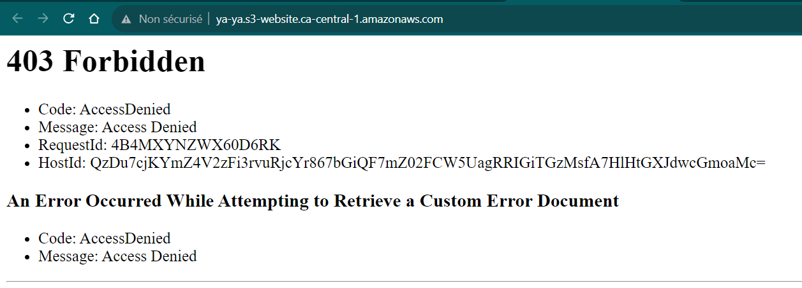

#### Step 4: Create an AWS CloudFront Distribution

We want to use AWS CloudFront as a Content CDN to distribute our website

1. Go to the AWS CloudFront service.
2. Click on `Create Distribution.`
3. Choose `Web` as the distribution type.
4. In the `Origin Settings,` select your S3 bucket as the origin.
5. Create the distribution.

**Note: To restrict access to your S3 bucket through CloudFront, you can must use an origin access identity and an S3 bucket policy like the one below:**

```json
{
    "Version": "2012-10-17",
    "Id": "PolicyForCloudFrontPrivateContent",
    "Statement": [
        {
            "Sid": "AllowCloudFrontServicePrincipal",
            "Effect": "Allow",
            "Principal": {
                "Service": "cloudfront.amazonaws.com"
            },
            "Action": "s3:GetObject",
            "Resource": "arn:aws:s3:::<bucket-name>/*",
            "Condition": {
                "StringEquals": {
                    "AWS:SourceArn": "arn:aws:cloudfront::<aws-id>:distribution/your-distribution-id"
                }
            }
        }
    ]
}
```

We needed to reconfigure the distribution process due to our failure to define a clear policy. 

6. Check your new distrubution url and see the site.


Some takeaways from this;
- Distru takes too long to create
- Distru takes too long to delete

We also noticed that we could configure that without taking too long<br>(Delete not required)..

I mean, guys, we all know that was planned. I just like it.


## Code That in Terraform

The configuration provided above will be completely transformed into Terraform code.
1. Ask GPT to write u a tf for static website hosting for an s3 bucket. <br>
I mean this looks like something.
2. In your `main.tf` module, grap something from that and add it as a resource.

See if it actally works. 
No it won't.
I'll tel you why.

3. Run `tf init`. Error.
4. Change the bucket from `bucket = "my-static-website-bucket"` to `aws_s3_bucket.website_bucket.bucket`.

5. Run `tf init` to initialize the Terraform configuration again which should work.
6. Execute `tf plan` to review and see if it can do it.

|⚠️|Argument is deprecated|
|---:|:---|
|❓ |why gpt gave is the wrong thing?|
|✅ |The aws provider for 5.0 doesnt exist in gpt.|

GPT is not doing it to nowdays. 

I personally don't find terraform changes a lot. <br>
But the provider change year in a year.

### Back to Home

**We can't rely on GPT** 
1. Go to TF Registry
2. AWS Provider
3. Click on AWS and see the list.
4. AWS_S3_Bucket_Website_Configuration
5. [Get it from there](https://registry.terraform.io/providers/hashicorp/aws/latest/docs/resources/s3_bucket_website_configuration) instead.

```hcl
resource "aws_s3_bucket_website_configuration" "example" {
  bucket = aws_s3_bucket.example.id

  index_document {
    suffix = "index.html"
  }

  error_document {
    key = "error.html"
  }

  routing_rule {
    condition {
      key_prefix_equals = "docs/"
    }
    redirect {
      replace_key_prefix_with = "documents/"
    }
  }
}
```
6. Change the example name to `website_configuration`
7. Reference to our bucket from the module;
```hcl
resource "aws_s3_bucket_website_configuration" "website_configuration" 

{
  bucket = aws_s3_bucket.website_bucket.bucket
}
```

8. Try planning and it should now work;
9. tf apply to have the website hosting.

> Many people mention GPT, but it's not the solution for everything, my friend.


### Verify From AWS

1. Go to S3.
2. Verify the bucket.
3. Navigate to the properties section.
4. Scroll down down down.
5. You'll find the url.

This is good. <br>But it wont work.


#### Website Endpoint
So the site is stuck because we have to provide the endpoint to terraform in advance.

1. Retrieve the website endpoint URL from AWS S3 properties.
2. Add output in Terraform using `website_endpoint`, you are pro now.
```hcl
output "website_endpoint" 
{
  value = aws_s3_bucket_website_configuration.website_configuration.website_endpoint
}
```

3. Add a description, it is nice.
```hcl
  description = "The endpoint URL for the AWS S3 bucket website"
```

We also learned that we have to call the output in top level as well.

4. Do the same for top level and reference our output.
```hcl
output "s3_website_endpoint" {
  description = "S3 Static Website hosting endpoint"
  value = module.terrahouse_aws.website_endpoint
}
```
5. in `terraform.tfvars` assign the actual url.
```
s3_website_endpoint="<here>"
```

Configuration doing good. 

But we have to upload the files.<br>
Because still it didnt work.


## Files Content Touchpoint

Our goal is to configure terraform so we can upload files as code.

We will create the index and error files and push them with a terraform function. 

But.

|✋|This is an action you should avoid with Terraform|
|---:|:---|
| ✔|Terraform is primarily designed for managing the state of infrastructure|
|❌|Not individual files|

Even though Terraform has the capability..

- Terraform discourages such actions. 
- If you have files, it's advisable to handle data management separately. 

We will use tf for all three but isnt the best case in production.

We will also discover the existence of provisioners, which allow you to execute commands either remotely or locally.


### Using `aws_s3_object`
1. Go to the AWS registry and take `aws_s3_object` (not `aws_s3_bucket_object`).
2. Specify the bucket, key, and source for your `index.html`.
```hcl
resource "aws_s3_object" "index_html" {
  bucket = aws_s3_bucket.website_bucket.bucket
  key    = "index.html"
  source = var.index_html_filepath

  # Ignore this for now
  #etag = filemd5(var.index_html_filepath)
}
```
3. Repeat for `error.html` configuration.
```hcl
resource "aws_s3_object" "error_html" {
  bucket = aws_s3_bucket.website_bucket.bucket
  key    = "error.html"
  source = var.error_html_filepath

  # Ignore this for now
  #etag = filemd5(var.index_html_filepath)}
```
### Create Those Files and Manage with `path`

Let's explore whether Terraform console can be utilized interactively for troubleshooting purposes.

1. Lets pre test path.root and see;
> In the best-case scenario, path.module should always make sense..
2. Create a directory and call it `public`.
3. Create `index.html` and add it to `public`
4. Create `error.html` and add it to `public`
5. Remove `etag` from the section for now (data management magic)
```
  #etag = filemd5(var.index_html_filepath)
```
6. You have to add these to your root main module block along the source in your module block.
```
  index_html_filepath = var.index_html_filepath
  error_html_filepath = var.error_html_filepath
```
It will never work otherwise.

7. Plan and apply your content.
8. Double check files in S3. 

Yes!

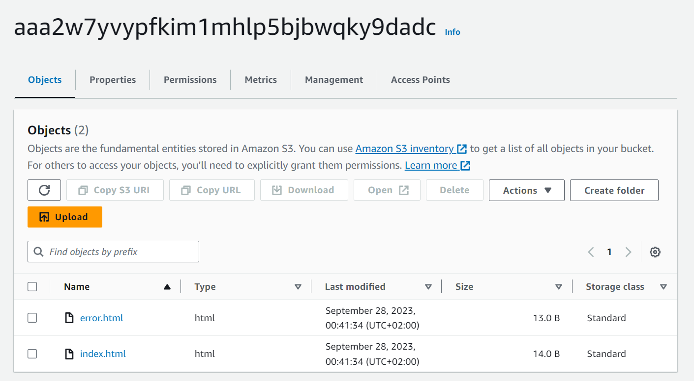

Two considerations come up.
- A: You dont want to hardcode your path values.
- B: If I make changes to the file does it work.
#### A: Avoid Your Real Path
⚠️ You should avoid hardcoding values like this to ensure the module's portability.

|💡|One approach we can employ involves the use of interpolation|
|---:|:---|


1. Instead of the actual path assign the path.root we spoke about for `index.html`
```
"${path.root}public/index.html"
```

2. Do the same for our `error.html` file.

```
"${path.root}public/error.html"
```

> Make sure you dont do it for `main.tf` (our mistake)

3. Plan it and apply it, it should now give a file!

#### B: Detect File Changes

So this is cool. With what we reached we can take files to the s3 but does it capture the data inside?

- Be aware that Terraform checks file paths but not their content.
- Use an `etag` to track content changes.
- Add an `etag` with `filemd5` for accurate content tracking.

1. Change the `index.html` file from what it was to something else.
2. Double change the `error.html`
3. Run `tf plan` and `tf apply` and go to the console.

|👀|No File Changes!|
|---:|:---|
|🤔|BUT WE CHANGED our files!!|
|🪄|The way this works is that it has a source but doesn't validate the data|


Meaning Terraform state examines the path's value but not the content of the file within that path.

You can identify file changes by referring to the mentioned `etag` we removed.
If the content changes, the `etag` will also change.

4. Add the required etag block with the 'filemd5' function. 

The function creates a hash based on the content. 

Good opportunity for you to start exploring about [tf functions.](https://developer.hashicorp.com/terraform/language/functions)

E.g. here is a built in terraform function to [check the existance](https://developer.hashicorp.com/terraform/language/functions/fileexists) of a file.
```tf
condition = fileexists(var.error_html_filepath)
```

5. Now, simply specify the path to the `etag` in the same way you did with the source
6. `tf plan` and `tf apply` and see.

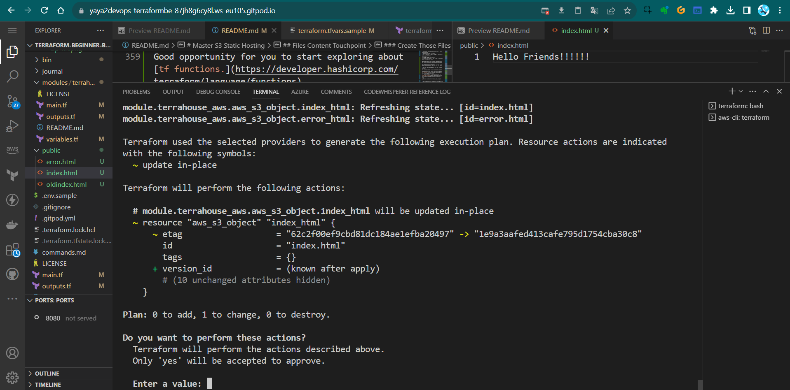

The file will be correctly recognized.


### Terraform Vars Instead of `path.root`

We have the `path.root` approach, but it's better to use a Terraform variable. 

This allows us to provide flexibility to the module, enabling anyone to change the address. e.g. if you want the `index.html` file to be stored elsewhere, you can do this effortlessly.

Let's set up a variable for that purpose.

1. Add the variables for index file at the module level within the `variables` block;
```hcl
variable "index_html_filepath" {
  description = "The file path for index.html"
  type        = string

  validation {
    condition     = fileexists(var.index_html_filepath)
    error_message = "The provided path for index.html does not exist."
  }
}
```
2. Add the `index_html_path="/Workspace/etc/public/index"` and the error source to `TFVARS` and `TFVARS SAMPLE`, along with the new UUID.<br>
(include the entire path; it's perfectly fine).
```sh
index_html_filepath="/workspace/terraform-beginner-bootcamp-2023/public/index.html"
```

3. Add the vars for the files to the root level 
```hcl
variable "index_html_filepath" {
  type = string
}
```

**Duplicate the resource block to accommodate the error source as well.**


1. Add the error var in the module level
```hcl
variable "error_html_filepath" {
  description = "The file path for error.html"
  type        = string

  validation {
    condition     = fileexists(var.error_html_filepath)
    error_message = "The provided path for error.html does not exist."
  }
}
```

2. Add the var defined in the root level;
```hcl
variable "error_html_filepath" {
  type = string
}
```

3. Add the error file path in `terraform.tfvars` and `terraform.tfvars.sample`;
```
error_html_filepath="/workspace/terraform-beginner-bootcamp-2023/public/error.html"
```


4. Run tf plan and  see.

We're encountering an error because we need to pass the variables to the root main.tf for both index and error.

5. Do nothing but Run tf plan and see again.

Now it works..after just reapplying. 


You should remain confident.<br>
It may give false signals due to potential latency issues or other factors very much unknown.


#### Bonus One Captured
We played more with tags briefly; I'll write that down for you.

1. To tag old stuff run; learn [where to get the sha](https://github.com/yaya2devops/aws-cloud-project-bootcamp/blob/main/journal/resources/tagging.md).
```
git tag <tag_name> <commit_sha>
```

2. To delete Local and Remote Tags e.g. 1.1.0

```
git push --delete origin 1.1.0
```

3. Correct your tag
```
git tag 1.1.0 <correct_commit_sha>
```
4. Push ur corrected tag
```
git push origin 1.1.0
```
#### Bonus Two Captured

Also we did this again so I must remember you;<br>
You can hold on your work go somewhere else (diff branch, tag) and get back.

1. To temporarily save changes that you're working on and return to a clean state, you can use Git stash.
```
git stash save "Your stash message"
```

2. When you back just apply your saved changes back
```
git stash apply
```

#### Bonus Three Captured

For more alias and fun stuff to write your CLI;

1. Include the following alias along `tf` for `terraform`;

```
alias tfa='terraform apply'
alias tfaa='terraform apply --auto-approve'
alias tfd='terraform destroy'
alias tfda='terraform destroy --auto-approve'
alias tfi='terraform init'
alias tfim='terraform import'
alias tfli='terraform login'
alias tflo='terraform logout'
alias tfo='terraform output'
alias tfp='terraform plan'
alias tfpr='terraform plan -refresh-only'
```

2. Take [my updated script](bin/tf-alias) and update yours🫵.

3. Test it, do a `tfp` instead of `terraform plan`

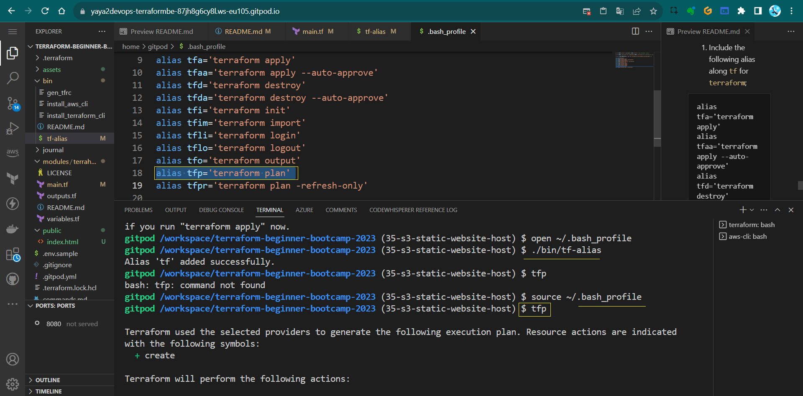


Some campers assets for the `1.4.0` period;
- [Visual on Common tf files](https://cdn.discordapp.com/attachments/1138488134003335199/1156340652829835284/Main.tf_2.png?ex=6515ef27&is=65149da7&hm=ccc1bbea386d9c88bf438dba5960147f5110f209e40052698465bf0ccf9cb4c0&)
- [tf cloud, workspace, project?](https://cdn.discordapp.com/attachments/1138488134003335199/1156451578010685530/terraform_cloud.png?ex=6515adb6&is=65145c36&hm=c04b78eacccec15d85349061f51db12e7fe3af1edca24fed78fa96eef8662c1e&)

#### Concluding
A brief conclusion and what to expect next;
We can see the content, it changes on apply we still cant access it;
- Discuss the need for a bucket policy.
- Explain the importance of unblocking from the internet.
The only way we want to access this is using CloudFront for safer S3 access.


# Implementing CDN Via Code

Hello Terraformers, Here we'll be implementing a CDN to our s3 bucket website hosting using CloudFront to enhance website performance, speed and security via Terraform.

This will be next hooked up to our Terratowns.

### CloudFront As Code

1. [Ask GPT](https://chat.openai.com/share/9aff3158-acfc-49a2-b880-4a9642ac58ca); 
```
Give me aws cloudfront serving static website hosting for an s3 bucket using terraform.
```
So it is giving us something with the bucket (we did that), <br>And the policy yep good stuff.

#### Origin Configuration
- For the origin config, it is giving us origin access identity.
- New way of doing it which is origin acces control.

GPT is not aware of this, as it was introduced only last year.
- it can  indeed write much terraform.
- But it may not be accurate but junk.


### Find CloudFront In Registry

1. Go to the Terraform Registry 
2. Go to providers and click AWS
3. top right click documentation
4. In search find the AWS CloudFront Distribution 
5. search the resource: `aws_cloudfront_distribution`.

We also see data block, we may [proceed to that]() later.

6. From the resource take [the block from there](https://registry.terraform.io/providers/hashicorp/aws/latest/docs/resources/cloudfront_distribution#example-usage) instead of GPT.

We have an example of an S3 origin configuration for CloudFront. <br>It looks to be well-structured. 


## Resource Structuring
We thought to start with the resources to ensure they are grouped together alphabetically for your cute eyes.

1. Create `resource-cdn.tf`.
2. Create `resource-storage.tf`.
3. Bring all storage components and paste them into `resources-storage.tf`.
```hcl
resource "aws_s3_bucket" "website_bucket" {
  # etc
}

resource "aws_s3_bucket_website_configuration" "website_configuration" {
    # etc
}

resource "aws_s3_object" "index_html" {
    # etc
}

resource "aws_s3_object" "error_html" {
    # etc
}

```
4. Grab the relevant code [from the registry](#find-cloudfront-in-registry) for `res-cdn.tf`, but not all of it.
5. Remove the alias for custom domain.
```hcl
  aliases = ["mysite.example.com", "yoursite.example.com"]
```
6. Exclude query string passing is ok
```
      query_string = false
```
7. Eliminate cookie passing.
```hcl
      cookies {
        forward = "none"
      }
    }
```
8. Retain the "allow all" policy.
```hcl
    viewer_protocol_policy = "allow-all"
    min_ttl                = 0
    default_ttl            = 3600
    max_ttl                = 86400
  }
```
9. Modify caching behavior to keep only the default settings.
```
  default_cache_behavior {
    allowed_methods  = ["DELETE", "GET", "HEAD", "OPTIONS", "PATCH", "POST", "PUT"]
    cached_methods   = ["GET", "HEAD"]
    target_origin_id = local.s3_origin_id }
```
Meaning, remove both `ordered_cache_behavior`.

10. Specify optional geographical restrictions - Change the type to "none" and remove.
```hcl
  restrictions {
    geo_restriction {
      restriction_type = "none"
      locations        = []
    }
  }
```
> We could specify for specific countries.
11. Tag resources with a UUID, as done previously.
```hcl
  tags = {
    UserUuid = var.user_uuid
  }
```
12. Specify HTTPS certification for free. 
```hcl
  viewer_certificate {
    cloudfront_default_certificate = true
  }
```
Note that this won't work alone because it expects configuration within the `origin{}` block.
```hcl
  origin {
    domain_name              = aws_s3_bucket.website_bucket.bucket_regional_domain_name
    origin_access_control_id = aws_cloudfront_origin_access_control.default.id
    origin_id                = local.s3_origin_id
  }
```

Lets do it.

### Specifying Required Variables `resource-cdn.tf`
We will now apply a use case for **locals.** The block serves as a method for passing local variables.

Note that these in the block from registry require definitions.  
```
access control id=origin_access_control 


origin id= local.
```
While we can pass variables as environment variables, this situation presents a good example of when to use locals.


- Define `origin_id` as "local" to pass local variables, add local block;
```hcl
local { }
```
- It is locals. just for your awarness.
```hcl
locals {
  s3_origin_id = "MyS3Origin"
}
```

### Origin Access Control Config `resource-cdn.tf`


1. Utilize the `aws_cloudfront_origin_access_control` block [from the registry](https://registry.terraform.io/providers/hashicorp/aws/latest/docs/resources/cloudfront_origin_access_control#example-usage).
```hcl
resource "aws_cloudfront_origin_access_control" "example" {
  name                              = "example"
  description                       = "Example Policy"
  origin_access_control_origin_type = "s3"
  signing_behavior                  = "always"
  signing_protocol                  = "sigv4"
}
```
2. Customize the resource name and use interpolation for the bucket name.
```hcl
  name   = "OAC ${var.bucket_name}"
```
3. Add a description.
```hcl
  description  = "Origin Access Controls for Static Website Hosting ${var.bucket_name}"
```
4. Leave network configurations they are correctly set.
```
  signing_behavior  = "always"
  signing_protocol  = "sigv4"
```
That should be set, whats left is bucket policy ony..

5. change the name of the block to `default`.

### Adding the Bucket Policy Block `resource-storage.tf`
I spent a considerable amount of time obtaining that policy.<br> Should I give it to you? 

Let's help you create it yourself.

1. Use the `aws_s3_bucket_policy` resource [from the registry](https://registry.terraform.io/providers/hashicorp/aws/latest/docs/resources/s3_bucket_policy#example-usage).

```hcl
resource "aws_s3_bucket_policy" "allow_access_from_another_account" {
  bucket = aws_s3_bucket.example.id
  policy = data.aws_iam_policy_document.allow_access_from_another_account.json
}
```
2. Customize the name to "bucket_policy".
```hcl
resource "aws_s3_bucket_policy" "bucket_policy"
```
3. Reference the S3 bucket using `website_bucket.bucket`.
```
  bucket = aws_s3_bucket.website_bucket.bucket
```
|👌|If we have only one of something, we can just name it default. |
|---:|:---|
|✅|We can [always revisit—step5](#origin-access-control-config-resource-cdntf) and make them all 'default' later|

Instead of this we will code our policy into it.
```
data.aws_iam_policy_document.allow_access_from_another_account.json
```
4. Define the policy as a JSON-encoded string.
```hcl
policy =jsonencode()
```
5. Go to the [cloudfront origin access control](https://aws.amazon.com/fr/blogs/networking-and-content-delivery/amazon-cloudfront-introduces-origin-access-control-oac/) and bring the policy to here:
```json
{
    "Version": "2012-10-17",
    "Statement": [
        {
            "Sid": "AllowCloudFrontServicePrincipalReadOnly",
            "Effect": "Allow",
            "Principal": {
                "Service": "cloudfront.amazonaws.com"
            },
            "Action": "s3:GetObject",
            "Resource": "arn:aws:s3:::DOC-EXAMPLE-BUCKET/*",
            "Condition": {
                "StringEquals": {
                    "AWS:SourceArn": "arn:aws:cloudfront::ACCOUNT_ID:distribution/DISTRIBUTION_ID"
                }
            }
        },
        {
            "Sid": "AllowLegacyOAIReadOnly",
            "Effect": "Allow",
            "Principal": {
                "AWS": "arn:aws:iam::cloudfront:user/CloudFront Origin Access Identity EH1HDMB1FH2TC"
            },
            "Action": "s3:GetObject",
            "Resource": "arn:aws:s3:::DOC-EXAMPLE-BUCKET/*"
        }
    ]
}
```

In order to include this we have to make some changes..
 
6. Change `:` to `=` for the lines of policy


Thats more of HCL; it serves as the foundational syntax underpinning Terraform, shaping Terraform into what it is.

7. We only require one statement; specifically, take the second block starting with 'sid'."
```hcl
        {
            "Sid" = "AllowLegacyOAIReadOnly",
            "Effect" = "Allow",
            "Principal" = {
                "AWS" = "arn:aws:iam::cloudfront:user/CloudFront Origin Access Identity EH1HDMB1FH2TC"
            },
            "Action" = "s3:GetObject",
            "Resource" = "arn:aws:s3:::DOC-EXAMPLE-BUCKET/*"
        }
    
```

In the initial statement, we are indeed interested in 'sid,' 'effect,' 'version,' 'principal,' and 'action'..

However, our target for modification is the bucket.
```
"Resource": "arn:aws:s3:::DOC-EXAMPLE-BUCKET/*"
```
8. Incorporate interpolations using `${aws_s3_bucket.website_bucket.id}`.

We have conditions that require us to narrow it down to either 'distru' or 'acc.' It's requesting an account ID.

This is an effective way to use data.

#### Data Block


1. When navigating to the AWS provider and exploring the registry, you will find a comprehensive list of data sources available.
2. In our case, we aim to utilize something for `aws_id` within the policy.
3. For this purpose, we can employ `aws_caller_identity.` 

We've previously used it to validate our account in the CLI. [Check it out](https://registry.terraform.io/providers/hashicorp/aws/latest/docs/data-sources/caller_identity#example-usage).
```hcl
data "aws_caller_identity" "current" {}

output "account_id" {
  value = data.aws_caller_identity.current.account_id
}

output "caller_arn" {
  value = data.aws_caller_identity.current.arn
}

output "caller_user" {
  value = data.aws_caller_identity.current.user_id
}
```
Consequently, we can easily retrieve the account ID.

4. Add the following to the main.tf in ur module.
```
data "aws_caller_identity" "current" {} 
```
Now, you can reference this data wherever you need it; that's all it takes.

5. We can access the value, which is `data.aws_caller_identity.account_id`.
6. In our data policy, incorporate `data.aws_caller_identity.account_id` into the interpolation.
```
"arn:aws:cloudfront::${data.aws_caller_identity.current.account_id}
```

7. Add the interpolation using ${}.
8. avigate to the CloudFront distribution registry link, find the reference, and identify the ID. 
9. Include the variable for the 'distrubution' in the interpolation as well.

```
:distribution/${aws_cloudfront_distribution.s3_distribution.id}"
```
We could have opted for using an ARN..This will do the exact job with less code..
```hcl
"AWS:SourceArn": data.aws_caller_identity.current.arn
```

But. Our preference was to utilize the data source! And learn.

10. Test `tf init` and `tfp`


**Error 1:** We mistakenly used `local` instead of `locals.`<br>
**Error 2:** The 'id' in the bucket policy resource was placed outside the curly braces, it should be inside like this: `{.id}`.


Both are corrected now in the instruction...

I am just saying. If not so, remake step 10.

11. go to Cloudfront and click the URL.


It worked we have an URL, but the site is not launching..<br> It is downloading us the `index.html` file.


#### Why URL equals Download?

The mystery lies in the fact that while we referenced the file, we didn't specify its file type to Terraform.


1. Navigate to the registry: `aws => s3_object` 
2. find the "content_type" argument reference on the right table of contents (TOC).
3. In the resource block for `"aws_s3_object" "index.html"`, include `content_type="text/html"`.
```hcl
resource "aws_s3_object" "index_html" {

  content_type = "text/html"
  }
```
4. Similarly, for `"aws_s3_object" "error.html"`, add `content_type="text/html"` as well.
```hcl
resource "aws_s3_object" "error_html" {

  content_type = "text/html"
}
```
5. tfp and tfa and check the link again.

|❓|Still downloading the file..Why|
|---:|:---|
|💡|It's a CDN, and It caches values|
|💡💡|To ensure it functions properly|
|💡💡💡|You need to clear the cache|

### Clear CloudFront Cache
We will clear the CDN cache in AWS CloudFront by creating an invalidation.
1. Go to CloudFront.
2. Click on your distribution.
3. In the Invalidations pane, select "Create Invalidation."
4. Add the following:
```
/*
```

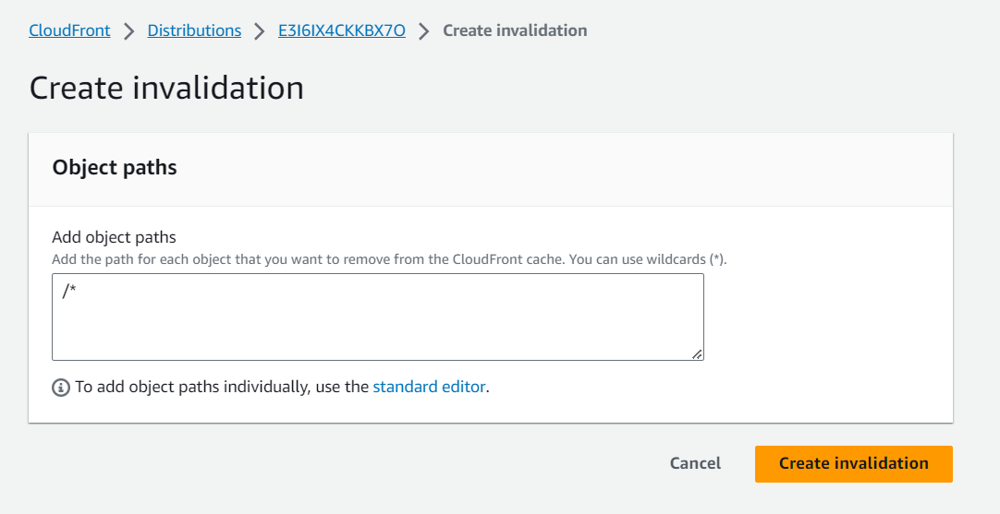

This will clear the cache of all items. <br>Alternatively, you can specify individual items one by one.


After it's done, double-check the URL. Still dowloading.... 


#### Troubleshooting

I have reservations about the bucket's reliability.
1. Let's remove it, as it might lead to configuration drift – that's perfectly acceptable.
2. Create a new index file and request an HTML file with a well-structured header and an appealing design from GPT.
3. Ensure that the HTML is improved and any errors are corrected.
4. Simply map out a plan and execute it to upload the files once more.
5. Now, we need to head over to CloudFront and perform another round of validation...

|🆗|It's time to streamline these processes and automate them|
|---:|:---|
|✨|Any modifications should trigger automatic updates. |
|✨✨|This is something we should explore soon|

**✅Quick update:** We tried it from bucket—It is working;

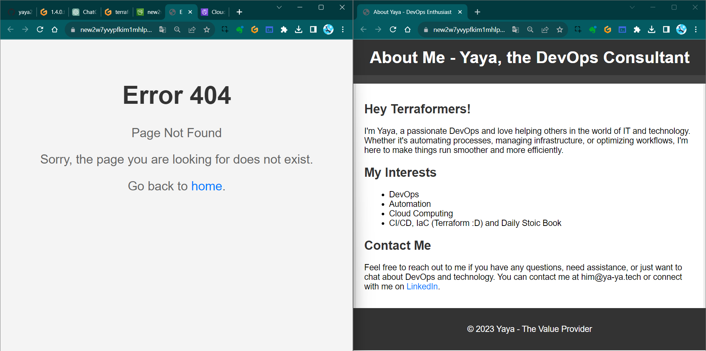


**✅Check the CloudFront URL**—It's working perfectly now! 

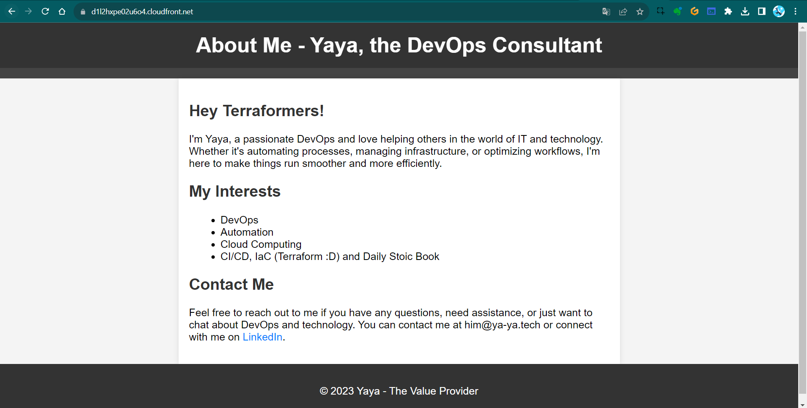

We've explored various effective strategies to overcome numerous challenges. 

If you've been following along, I must commend your excellent efforts!


#### `1.5.0` Considerations

CloudFront can be quite a headache and It truly demands significant time to spin up. 
- Consider using the `retain_on_delete` flag.
- We can reference a created policy in IAM instead.

We've addressed data sources, locals and now the next step is to explore further cache invalidation streamline.

# Terraform Content Versioning 

Hey Terraformer, I'll outline the process of implementing content versioning for our S3 bucket serving a website via CloudFront in this  1.6.0.

**Note:** This step should be done prior to cloudfront distribution caching.

### Bootcamper Context
Content versioning is essential for efficiently managing your files content and ensuring that changes to your site files only when necessary.

- We want to validate the cache when the file changes.
- We want to be more explicit about which version of the website we are serving.
- We don't want cache is cleared entirely when any file changes

The last is very expensive call rather only what specified.

Instead, implement content versioning to cache only when desired.
- This is version one of the site;
- This is version two of the site;

We want it to be that explicit.


## Versioning Your Website

We will clearly define different versions of the website (e.g., V1, V2..etc).


Starting with **defining Content Version in Terraform Variables**

1. Open the `terraform.tfvars` file and add `content_version=1` (or the desired version).
```hcl
content_version=1
```
2. Add `content_version` to your main Terraform module call under `source`.
```hcl
  content_version = var.content_version
```
3. Implement a Terraform variable for `content_version` that only accepts positive integers starting from one in your modules `variables.tf`.
```hcl
variable "content_version" {
  description = "The content version. Should be a positive integer starting at 1."
  type        = number

  validation {
    condition     = var.content_version > 0 && floor(var.content_version) == var.content_version
    error_message = "The content_version must be a positive integer starting at 1."
  }

}
```
4. Include that in the variable call in ``variables.tf`` in the module level.
```hcl
variable "content_version" {
  type        = number
}
```

### Configure Resource Lifecycle
We want to trigger thhose in particular cases using **Lifecycle**

It enables you to respond to various actions on a resource, such as its creation, deletion, and other relevant events.

1. Navigate to the `resource-storage.tf` file.
2. Look for the S3 resource lifecycle.
```hcl
 resource "azurerm_resource_group" "example" {
  # ...

  lifecycle {
    create_before_destroy = true
  }
}
```
3. Add a lifecycle configuration to the `index.html` and `error.html` resources in s3 bucket object.
```hcl
  lifecycle {
    ignore_changes = [etag]
  }
```
4. Exclude the `etag` field within the lifecycle.
```hcl
    ignore_changes = [etag]
```

Learn more about lifecycle in terraform [from here.](https://developer.hashicorp.com/terraform/language/meta-arguments/lifecycle)

### Test 101
Observe the behavior when changes are made:
1. Comment both the lifecycle configurations.
```hcl
  #lifecycle {
  #  ignore_changes = [etag]
  #}
```
2. Make changes to the files and observe Terraform plan and apply results.
3. Uncomment the lifecycle configurations and change file
4. run `tfp`
5. observe the behavior again.


This is ignoring the etag. <br>To make it so, we have to code the trigger.

### **Triggering the Changes**
Our approach involves closely associating it with the respective resource. To trigger changes based on the content version, we'll use Terraform's `terraform_data` resource.

Traditionally, you would associate a null resource and a provider.. in the way offered by HashiCorp.

1. Configure the `terraform_data` resource to manage content versions as if they were regular resources.
```hcl
resource "terraform_data" "content_version" {
  input = var.content_version
}
```
2. Connect the content version to the resource lifecycle to trigger updates when the content version changes.
```hcl
    replace_triggered_by = [terraform_data.content_version.output]
```

3. make sure its place for ur index.html lifecycle like this:
```hcl
  lifecycle {
    replace_triggered_by = [terraform_data.content_version.output]
    ignore_changes = [etag]
  }
```

When we modify our version, it will be treated and managed in a manner similar to a resource.

### Test 202

1. Run `terraform plan` and see if it actually decide to change it;

It does work because tf data never existed.<br>
But. It doesn't appear to be triggering the content as expected..."

2. run `tfaa` and do `tfp` to see no change.
3. Change some of the content and do `tfp`.

It also didn't incorporate the changes...


### Test 303
Because we hadn't altered the version.

1. let's update it to '2' in the tfvars file.
2. run tfp and observe now.
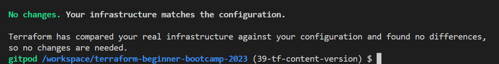

> It's still not producing any changes.
3. Do a `tpa` maybe tfp is lying to us.

Still...Terraformers...

### Test 404 
The issue arises because we changed the variable in the tfvars file but didn't reference it in the module block in the our `main.tf` at the root level.

1. Change content_version = 2 to e.g. var.content_version=3.
2. Run `tfp` again.
3. Observe that the change will now take effect.
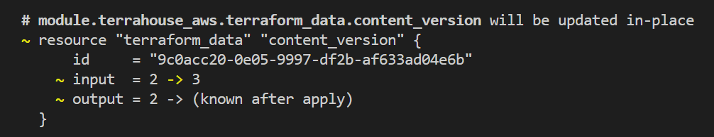


Notice that the updated version is correctly influencing the process.

[Check it out!](https://d2nrp0gajz6owu.cloudfront.net/)
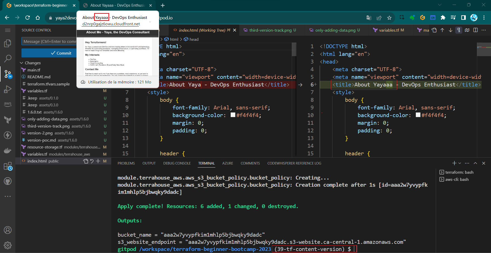

#### Conclusion
We can now manage and trigger changes to our website more efficiently. <br>Each content version will be handled like a resource,

This implementation won't trigger cache clearing in CloudFront. <br>This aspect will be addressed in version 1.7.0 of our project.

FYI again, Terraform is not be the optimal tool for this specific task but for the learning.

# Invalidate CloudFront Distribution

Welcome to the  process of invalidating cache using Terraform, with a focus on local execution. 

But wait, with the latest Terraform version, cache invalidation seems elusive, right? Fear not, for we're about to unveil the solution.

We will use Terraform data blocks and null resources to achieve this task.

#### GPT  Mhh

Lets get something out of GPT.
```
Hey invalidate cloudfront distrubution using Terraform 
```

This is using the null resource which is pretty good. <br>This is actually the way we do it.


|💫|Null resource served its purpose in the past|
|---:|:---|
|💡|But now,|
|🆕|The torch has been passed to data |


### Background and Context
Invalidate cache is a critical operation in managing our CDN. 

We aim to automate cache invalidation whenever our content changes, using a background CLI command if that make sense.

|🙃|Provisioners such as remote exec and local exec are discouraged |
|---:|:---|
|✅ |Other tools like Ansible are better suited for these tasks.|

Some companies are still engaged in this practice...


Terraform is primarily used for managing the state of code rather than configuration management.

We will be doing it anyway because we get to do more advanced concepts in terraform.

#### Terraform Data
Terraform data blocks are the preferred method for managing data resources in Terraform configurations. They don't require the installation of additional providers and are recommended over null resources for this purpose.


#### Local Execution with Null Resources
Local execution using null resources can be useful when you need to run commands on your local machine. In this case, we will use local execution to trigger cache invalidation.


## Implement Invalidation

We also want to activate a provisioner.<br>
The local exec command runs on the **local machine** where ur running tf.

If we use **Terraform Cloud**, the local machine should align with the computing resources provided by Terraform Cloud.

You can also use **remote exec**, which enables you to connect to a remote computer and perform **SSH** etc..

We will make it simple here with **local compute**..

1. go to `resource-cd.tf` and add the reosurce terraform_data and name it `invalidate_cache`.
```hcl
resource "terraform_data" "invalidate_cache" {}
```
2. Trigger the content versions replace:
```hcl
triggers_replace = terraform_data.content_version.output
```
3. Create provisioner block for our local exec inside the `terraform_data`.
```hcl
  provisioner "local-exec" {  }
```

4. Use a heredoc block like this to pass the command:
```hcl
provisioner "local-exec" {
command = <<EOF
# Your commands here
# E.g. our invalidate cache
EOF
}
```

You can also add whatever, the point is to end it with the same, let me clarify.

```hcl
provisioner "local-exec" {
command = <<command
# Your commands
command
}
```
5. Add inside it the required invalidation api command from aws sdk:
```sh
    command = <<COMMAND
aws cloudfront create-invalidation \
--distribution-id ${aws_cloudfront_distribution.s3_distribution.id} \
--paths '/*'
    COMMAND
```

6. Verify your provisioner block for `local_exec`;
```hcl
  provisioner "local-exec" {
    command = <<COMMAND
aws cloudfront create-invalidation \
--distribution-id ${aws_cloudfront_distribution.s3_distribution.id} \
--paths '/*'
    COMMAND  }
```
> Be aware that Provisioners are a pragmatic approach. They have the capability..


7. After coding `resrouce-cdn.tf`, run tfp

Now it's asking for the current version..? <br>Because the content_version=x wasn't configured.


To trigger cache invalidation, you must increment the content version. 

5. reset the value in your `terraform.tfvars` to `content_version=2`
6. run tfpaa this time.

Good and cool.


### Output Configuration
One thing I'm looking for here is the CloudFront distribution output.


To monitor the status of your cache invalidation.

1. add the CloudFront distribution output to your Terraform module.
```
output "cloudfront_url" {
  value = aws_cloudfront_distribution.s3_distribution.domain_name
}
```

2.  And add the definition in your root `variables.tf` root outputs.
```hcl
output "cloudfront_url" {
  description = "The CloudFront Distribution Domain Name"
  value = module.terrahouse_aws.cloudfront_url
}
```

### 7. Performing Cache Invalidation

Lets try to change something and see.

Perform the following steps to invalidate the cache:
1. Run `terraform plan` to verify your changes.
2. Run `terraform apply` to apply the changes and trigger the cache invalidation.
3. Check the output to verify the new version and CloudFront distribution information.


4. Start visiting your cloudfront distribution.


5. Visit your CloudFront invalidation and observe that you have one set as directed in the command.

[Verify The Accuracy](../assets/1.7.0/invalidation-evidence.png)
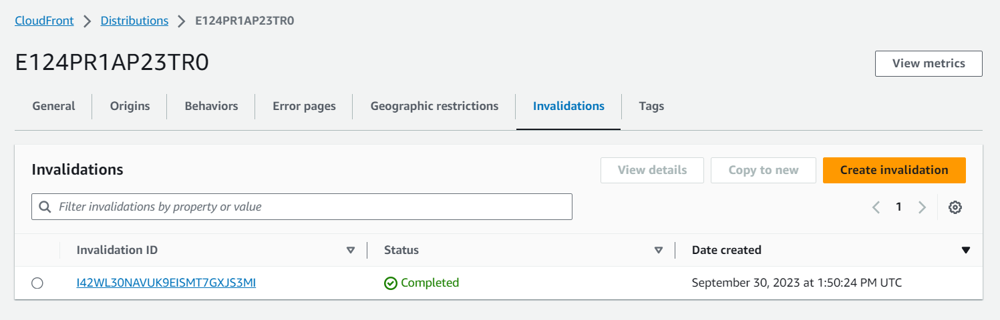

The cache is applied as required.

### Reverting Changes And More..

To back clean for our next version, revert the changes by running `terraform destroy` and setting the content version back to the previous value 1.

If you followed, your process is now automating the cache invalidation process using Terraform.. Making your content delivery more efficient and reliable!

Consult some good stuff [we've done here.](https://raw.githubusercontent.com/yaya2devops/terraform-beginner-bootcamp-2023/41-trigger-cdn-cache/../assets/1.7.0/good-stuff.png) <br>Also a [funny error I had.](https://raw.githubusercontent.com/yaya2devops/terraform-beginner-bootcamp-2023/41-trigger-cdn-cache/../assets/1.7.0/oops-command.png)


And that's what `1.7.0` is for. The bootcamp is indeed a beginner level.


## Terrahouse Asset Management

Hey Terraformer, wrapping up our first week (technically second because we started from zero), we'll work on asset management process for our website to include images, JavaScript, and stylesheets and moree to make Terrahouse look impressive in TerraTown!

We also aim to create a page that connects W1 and W2, possibly as a hub!

### Improvisation
Let me freestyle for you my experience and what I think about this.<br>
An asset is something that has the potential to add value to you, that is why it is called that.

Computer files especially those with more visual are considered assets because once throwed to the system, they'll get consumed and you can get a benefit out of it.

Videos are the highest form of asset over there.

### Getting started with assets
1. Create an `assets` folder in your "public" directory.
2. Drag images to the `public/assets` folder and integrate them into your HTML files.
3. Preview the site by utilizing an HTTP server.
> Learn more how [from here.](https://github.com/yaya2devops/terraform-beginner-bootcamp-2023/tree/35-s3-static-website-host#host-your-first-http-server)
4. Enhance your development experience by adding the command to your `gitpod.yml` for `before`.
```
      npm install --global http-server
```
5. add the the `http-server` in the command.

#### Resolved Thought
While Terraform is primarily used for infrastructure provisioning, it can also be used for managing assets, offering opportunities to explore more functionality for beginners like You.

The question you may ask are;
- We added resources for specific single files like 'index' and 'error' pages.
- What if we want to add many files in a given directory e.g. `/assets` ?

The answer is, to handle multiple files, use a `for_each` loop in terraform.

#### Terrafoorm Console

- Learn about Terraform functions and complex types.
- Explore collection types in Terraform.

In the Terraform Console, obtain a list of all files in the public/assets directory.
1. Run `terraform init` first.
2. Run `terraform console`.
3. Run the following to know where you stand exact;
```
path.root
```
> A dot means you are in the root itself.
4. Use the fileset function and explore more about it in the registry e.g. Lists all files
```
fileset("${path.root}/public/assets","*")  
```
5. Filter in the console specific file types
```
fileset("${path.root}/public/assets","*.{jpg,png,gif}")
```

6. Filter in the console only jpg files.
```
fileset("${path.root}/public/assets","*.{jpg}")  
```

7.  Filter in the console only png files.
```
fileset("${path.root}/public/assets","*.{png}")  

// returning..
toset([
  "elizabeth-7-deadly-sins.png",
])
```
8. You can use Terraform's output for further exploration in the Terraform Console.

In Terraform, you may find the need to cast things to other thing. <br>Calm, it's a common  Terraform development, you are not crazy.

Let's get started with our `for_each`.

### `for_each` Configuration

- if we are using a list => will use a key
- if its more complex e.g map => we need key and value

The asset paths should not be hardcoded. Avoid it to perform a best practice.

1. Navigate to `resource-storage.tf` in your terrahouse module.
2. Define a resource for uploading assets.
```hcl
resource "aws_s3_object" "upload_assets" {}
```
3. Add the `for_each` loop.
```hcl
  for_each = fileset(<the-call>)
```
4. Consider making it more flexible by using TF variables.
```hcl
var.assets_path,"*.{jpg,png,gif}"
```
Grab the usual for the resource: `bucket`, `key`, `source`, `content type`, `etag`.

5. assign the bucket the same way;
```hcl
  bucket = aws_s3_bucket.website_bucket.bucket
```
6. **Change** the `key` to go to the assets and do **interpolation** and **each.key**.
```hcl
  key    = "assets/${each.key}"
```
7. For `source` path **root** each dot **key**.
```hcl
  source = "${var.assets_path}/${each.key}"
```
8. `etag` is **same** as `source`.
```hcl
  etag = filemd5("${var.assets_path}${each.key}")
```
9. Add the lifecycle as we previously did;
```hcl
  lifecycle {
    replace_triggered_by = [terraform_data.content_version.output]
    ignore_changes = [etag]
  }
}
```

Also..exit out of console after **done** with the required configurations.

### 10. Testing and Verification
1. Plan and verify the Terraform configuration.
2. Ensure it properly handles assets. We can see it is doing the assets!
3. Execute the apply to observe the asset management process.

Perfect! But.. read CamperBonus.

### CamperBonus
We have to ensure that the asset paths are set as variables. <br>
We may not want them to be hardcoded..

1. Start by adding `vars.assets_path` in the asset configuration instead.
2. Define this variable in `module/variables.tf`.
```hcl
variable "assets_path" {
  description = "Path to assets folder"
  type = string
}
```
3. Add the variable to your module block in the root `main.tf`.
```hcl
  assets_path = var.assets_path  # Add this line
```
4. Define it at the root level in `variables.tf`.
```hcl
variable "assets_path" {
  description = "Path to assets folder"
  type = string
}
```

5. Try terraform plan here; 

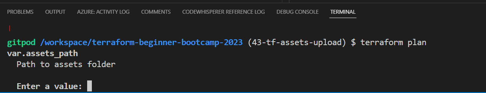

6. Add the actual variable to `terraform.tfvars`.
```hcl
assets_path="/workspace/terraform-beginner-bootcamp-2023/public/assets"
```
7. Include it in `terraform.tfvars.sample` for use in your workspace.
```hcl
assets_path="/workspace/terraform-beginner-bootcamp-2023/public/assets"
```
8. Run tfp and observe the output.


9. Check out your website with the assets;

[🌐Check It All!](https://dk9ry91vcfk4o.cloudfront.net/)


Great and cool!

#### Concluding;
Some assets from our great classmates;
- [Terraform Beginner Bootcamp Visual](https://cdn.discordapp.com/attachments/1138488134003335199/1157355946679468145/Terratown_Architecture_empty_lot.png?ex=6519a0b8&is=65184f38&hm=a648bc05a07e90c99a534bafceb6bad711289d271a7f66e3b16240e0da8619c3&)
- [Terraform Workflow Visual](https://cdn.discordapp.com/attachments/1138488134003335199/1157649422398791730/37667b3c-712a-4a15-a86e-6354fc57ac6c.png?ex=6519608a&is=65180f0a&hm=ac74f18110c979a381c33fc85baadf229c5a4c0eb8f804fbbac514e709b5afa9&)

TerraTown is the challenge for week 2, along with our custom provider!

But before we will have to present how you can work with git graphs.

> See you soon!

# Visuals with Git Graph
Terraformer! This is a great bonus for you to make sure you have git graph setup so you can observe everything you do with git, visualize history and address issues better.

**NOTICE:** This is primary deliverd as a two tags;
- `1.8.1` : Installing and Adding **git-log--graph** Extension to Gitpod
- `1.8.2` : Installing and Adding **mhutchie.git-graph** Extension to Gitpod

|I am merging that in `1.8.3` to maintain consistency in my project across tags, branches, and commits.|
|:---:|

I will split the changes into separate commits specific to this branch, allowing your clear differentiation.

### Do You have Extensions?
Extensions are stuff that empower you do better in your IDE.<br>
To Search for Installed Extensions, do the following;
1. Go to the Extensions section in Visual Studio Code.
2. Use the `@installed` search filter.


## `1.8.1` Git Graph [Extension¹](https://marketplace.visualstudio.com/items?itemName=phil294.git-log--graph)
The objective is to address the Git graph issue by adding the Git Graph extension.

In this process, you have to search for and install **Git-Log-Graph Extension:**
1. Search The required extension is "git-log--graph" in your IDE.
2. Ensure that it's installed.
3. Abstract the extension ID from here.


4. Add the copied line to your `gitpod.yml` configuration file.
```
phil294.git-log--graph
```
5. Verify extension existence.

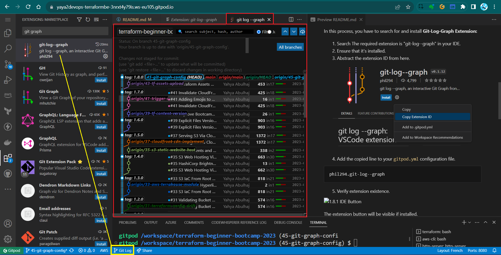

The extension button will be visible if installed.

**`1.8.1`:**<br>
The tag is converted as a branch commit as explained above.<br>
**Related Commit:** [Install and Add git-log--graph to Gitpod task file.](https://github.com/yaya2devops/terraform-beginner-bootcamp-2023/commit/d67e1ef044b650dd16550bd98db15230b2f09f86)

## `1.8.2` Git Graph [Extension²](https://marketplace.visualstudio.com/items?itemName=mhutchie.git-graph)

We will Add the Git Graph (mhutchie.git-graph) extension to Gitpod to address the Git graph issue to enhance our experience.

The extension "mhutchie.git-graph" provides an alternative Git graph visualization.

Search for and install **Git Graph Extension:**
1. To be specific, you can search "mhutchie.git-graph" in your IDE.
2. Ensure that it's installed.
3. Abstract the extension ID from here.


4. Add the line copied to your `gitpod.yml` configuration file.
```
mhutchie.git-graph
```
5. Verify extension existence.


The extension button will be visible if installed.


This workflow differs from the usual stuff I do with Git X for local development, things change man.

`1.8.2` Commit: [Install and Add mhutchie.git-graph to Gitpod task file](https://github.com/yaya2devops/terraform-beginner-bootcamp-2023/commit/09f3ba52821f8d348a3454e836a0f45fd0d3d622).

**`1.8.1` and `1.8.2` Relationship:**<br>
- Both are part of the same branch **git-graph-config**.
- Both are merged to single tag `1.8.3`

I used [small numbers](https://www.piliapp.com/symbol/subscript-superscript/)..Also, I made this from notes using;
- [The notes itself](../assets/1.8.3/1.8.3.txt)
- [A language prediction model](https://chat.openai.com/share/0f24f5d8-fa45-438a-95c1-99e6b733c03d)

You can use [my issue template](../assets/1.8.3/issue-enabler.md) for your own.

> PS: GitLens is another good extension..