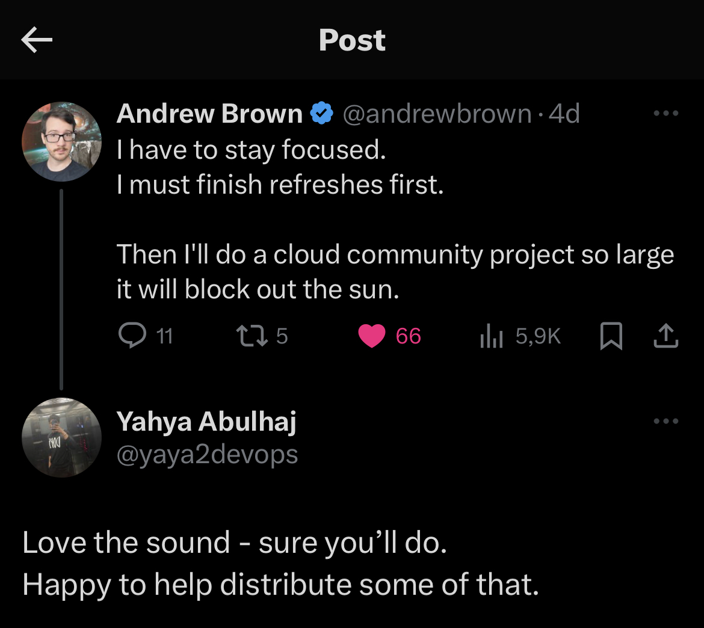
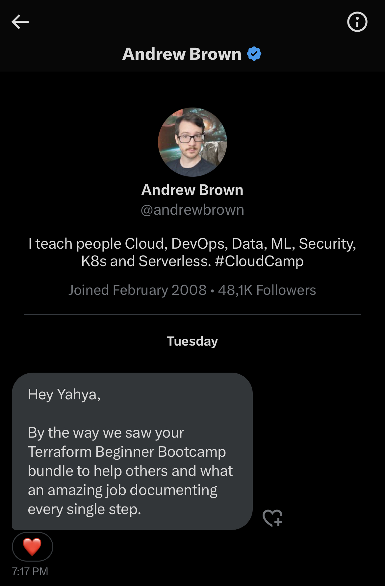

# Collab Of Power
### Post bootcamp, walking in 𝕏—formerly known as Twitter. 

While doing so, I came accross Andrew post.

**I liked.** 
**I participated.**

> This aligns closely with my project review.

### Always love his stuff and the big value he shares with the community.

For all you leaders out there,
The last is someone who guides by example—Demonstrating how to perform rather than merely issuing orders for others to do it for them.

He is literally **A real one** by *Definition*.

Anyway.  
Good luck being1️⃣!
 
## Let's get back.

## He saw my comment to his tweet and Instantly acted.

- He may thought about my valuable performance and contribution to the cloud community as well.
- Seconds later, I got a DM that came **from that way**.

## Now you know where that **by the way** came from.

> Get [Back To Work](https://github.com/yaya2devops/terraform-beginner-bootcamp-2023/issues/51).